## 1. 整体介绍

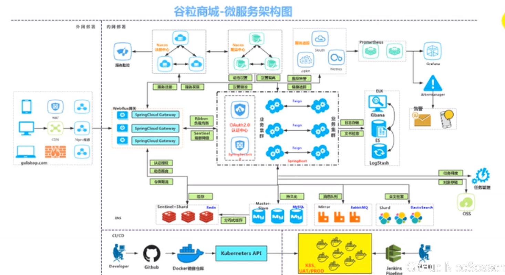


### 1）安装vagrant

### 2）安装Centos7

```shell
$ vagrant init centos/7
A `Vagrantfile` has been placed in this directory. You are now
ready to `vagrant up` your first virtual environment! Please read
the comments in the Vagrantfile as well as documentation on
`vagrantup.com` for more information on using Vagrant.
```

执行完上面的命令后，会在用户的家目录下生成Vagrantfile文件。

```shell
$ vagrant up
Bringing machine 'default' up with 'virtualbox' provider...
==> default: Box 'centos/7' could not be found. Attempting to find and install...
    default: Box Provider: virtualbox
    default: Box Version: >= 0
==> default: Loading metadata for box 'centos/7'
    default: URL: https://vagrantcloud.com/centos/7
==> default: Adding box 'centos/7' (v1905.1) for provider: virtualbox
    default: Downloading: https://vagrantcloud.com/centos/boxes/7/versions/1905.1/providers/virtualbox.box
    default: Download redirected to host: cloud.centos.org
    default: Progress: 0% (Rate: 6717/s, Estimated time remaining: 7:33:42)
```

下载镜像过程比较漫长，也可以采用先用下载工具下载到本地后，然后使用“ vagrant box add ”添加，再“vagrant up”即可

```shell
#将下载的镜像添加到virtualBox中
$ vagrant box add centos/7 E:\迅雷下载\CentOS-7-x86_64-Vagrant-1905_01.VirtualBox.box
==> box: Box file was not detected as metadata. Adding it directly...
==> box: Adding box 'centos/7' (v0) for provider:
    box: Unpacking necessary files from: file:///E:/%D1%B8%C0%D7%CF%C2%D4%D8/CentOS-7-x86_64-Vagrant-1905_01.VirtualBox.box
    box:
==> box: Successfully added box 'centos/7' (v0) for 'virtualbox'!

#启动
$ vagrant up
Bringing machine 'default' up with 'virtualbox' provider...
==> default: Importing base box 'centos/7'...
==> default: Matching MAC address for NAT networking...
==> default: Setting the name of the VM: Administrator_default_1588497928070_24634
==> default: Clearing any previously set network interfaces...
==> default: Preparing network interfaces based on configuration...
    default: Adapter 1: nat
    default: Adapter 2: hostonly
==> default: Forwarding ports...
    default: 22 (guest) => 2222 (host) (adapter 1)
==> default: Booting VM...
==> default: Waiting for machine to boot. This may take a few minutes...
    default: SSH address: 127.0.0.1:2222
    default: SSH username: vagrant
    default: SSH auth method: private key
    default:
    default: Vagrant insecure key detected. Vagrant will automatically replace
    default: this with a newly generated keypair for better security.
    default:
    default: Inserting generated public key within guest...
    default: Removing insecure key from the guest if it's present...
    default: Key inserted! Disconnecting and reconnecting using new SSH key...
==> default: Machine booted and ready!
==> default: Checking for guest additions in VM...
    default: No guest additions were detected on the base box for this VM! Guest
    default: additions are required for forwarded ports, shared folders, host only
    default: networking, and more. If SSH fails on this machine, please install
    default: the guest additions and repackage the box to continue.
    default:
    default: This is not an error message; everything may continue to work properly,
    default: in which case you may ignore this message.
==> default: Configuring and enabling network interfaces...
==> default: Rsyncing folder: /cygdrive/c/Users/Administrator/ => /vagrant


```


vagrant ssh 开启SSH，并登陆到centos7

```shell
$ vagrant ssh
[vagrant@localhost ~]$ ip addr
1: lo: <LOOPBACK,UP,LOWER_UP> mtu 65536 qdisc noqueue state UNKNOWN group default qlen 1000
    link/loopback 00:00:00:00:00:00 brd 00:00:00:00:00:00
    inet 127.0.0.1/8 scope host lo
       valid_lft forever preferred_lft forever
    inet6 ::1/128 scope host
       valid_lft forever preferred_lft forever
2: eth0: <BROADCAST,MULTICAST,UP,LOWER_UP> mtu 1500 qdisc pfifo_fast state UP group default qlen 1000
    link/ether 52:54:00:8a:fe:e6 brd ff:ff:ff:ff:ff:ff
    inet 10.0.2.15/24 brd 10.0.2.255 scope global noprefixroute dynamic eth0
       valid_lft 86091sec preferred_lft 86091sec
    inet6 fe80::5054:ff:fe8a:fee6/64 scope link
       valid_lft forever preferred_lft forever
3: eth1: <BROADCAST,MULTICAST,UP,LOWER_UP> mtu 1500 qdisc pfifo_fast state UP group default qlen 1000
    link/ether 08:00:27:d1:76:f6 brd ff:ff:ff:ff:ff:ff
    inet 192.168.56.102/24 brd 192.168.56.255 scope global noprefixroute dynamic eth1
       valid_lft 892sec preferred_lft 892sec
    inet6 fe80::8c94:1942:ba09:2458/64 scope link noprefixroute
       valid_lft forever preferred_lft forever
[vagrant@localhost ~]$
```


```shell
C:\Users\Administrator>ipconfig

Windows IP 配置

以太网适配器 VirtualBox Host-Only Network:

   连接特定的 DNS 后缀 . . . . . . . :
   本地链接 IPv6 地址. . . . . . . . : fe80::a00c:1ffa:a39a:c8c2%16
   IPv4 地址 . . . . . . . . . . . . : 192.168.56.1
   子网掩码  . . . . . . . . . . . . : 255.255.255.0
   默认网关. . . . . . . . . . . . . :
```


配置网络信息，打开"Vagrantfile"文件：

```
config.vm.network "private_network", ip: "192.168.56.10"
```


修改完成后，重启启动vagrant

```
vagrant reload
```

检查宿主机和virtualBox之间的通信是否正常

```
[vagrant@localhost ~]$ ping 192.168.43.43                                                                                                         PING 192.168.43.43 (192.168.43.43) 56(84) bytes of data.
64 bytes from 192.168.43.43: icmp_seq=1 ttl=127 time=0.533 ms
64 bytes from 192.168.43.43: icmp_seq=2 ttl=127 time=0.659 ms

--- 192.168.43.43 ping statistics ---
2 packets transmitted, 2 received, 0% packet loss, time 999ms
rtt min/avg/max/mdev = 0.533/0.596/0.659/0.063 ms
[vagrant@localhost ~]$
[vagrant@localhost ~]$
[vagrant@localhost ~]$ ping www.baidu.com
PING www.a.shifen.com (112.80.248.76) 56(84) bytes of data.
64 bytes from 112.80.248.76 (112.80.248.76): icmp_seq=1 ttl=53 time=56.1 ms
64 bytes from 112.80.248.76 (112.80.248.76): icmp_seq=2 ttl=53 time=58.5 ms
64 bytes from 112.80.248.76 (112.80.248.76): icmp_seq=3 ttl=53 time=53.4 ms

```

开启远程登陆，修改“/etc/ssh/sshd_config”

```shell
PermitRootLogin yes 
PasswordAuthentication yes
```

然后重启SSHD

```shell
systemctl restart sshd
```

使用Xshell或SecureCRT进行远程连接。

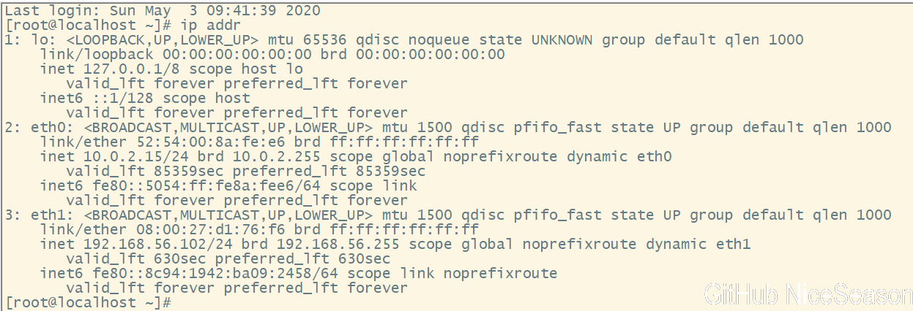


## 2. docker中安装mysql

```shell 
[root@hadoop-104 module]# docker pull mysql:5.7
5.7: Pulling from library/mysql
123275d6e508: Already exists 
27cddf5c7140: Pull complete 
c17d442e14c9: Pull complete 
2eb72ffed068: Pull complete 
d4aa125eb616: Pull complete 
52560afb169c: Pull complete 
68190f37a1d2: Pull complete 
3fd1dc6e2990: Pull complete 
85a79b83df29: Pull complete 
35e0b437fe88: Pull complete 
992f6a10268c: Pull complete 
Digest: sha256:82b72085b2fcff073a6616b84c7c3bcbb36e2d13af838cec11a9ed1d0b183f5e
Status: Downloaded newer image for mysql:5.7
docker.io/library/mysql:5.7
```

查看镜像

```
[root@hadoop-104 module]# docker images
REPOSITORY  TAG    IMAGE ID     CREATED       SIZE
mysql       5.7    f5829c0eee9e 2 hours ago   455MB
[root@hadoop-104 module]# 
```

启动mysql

```shell
sudo docker run -p 3306:3306 --name mysql \
-v /mydata/mysql/log:/var/log/mysql \
-v /mydata/mysql/data:/var/lib/mysql \
-v /mydata/mysql/conf:/etc/mysql \
-e MYSQL_ROOT_PASSWORD=root \
-d mysql:5.7
```

修改配置

```properties
[root@hadoop-104 conf]# pwd
/mydata/mysql/conf


[root@hadoop-104 conf]# cat my.cnf
[client]
default-character-set=utf8
[mysql]
default-character-set=utf8
[mysqld]
init_connect='SET collation_connection = utf8_unicode_ci'
init_connect='SET NAMES utf8'
character-set-server=utf8
collation-server=utf8_unicode_ci
skip-character-set-client-handshake
skip-name-resolve
[root@hadoop-104 conf]# 

[root@hadoop-104 conf]# docker restart mysql
mysql
[root@hadoop-104 conf]# 

```


进入容器查看配置：

```shell
[root@hadoop-104 conf]# docker exec -it mysql /bin/bash
root@b3a74e031bd7:/# whereis mysql
mysql: /usr/bin/mysql /usr/lib/mysql /etc/mysql /usr/share/mysql

root@b3a74e031bd7:/# ls /etc/mysql 
my.cnf
root@b3a74e031bd7:/# cat /etc/mysql/my.cnf 
[client]
default-character-set=utf8
[mysql]
default-character-set=utf8
[mysqld]
init_connect='SET collation_connection = utf8_unicode_ci'
init_connect='SET NAMES utf8'
character-set-server=utf8
collation-server=utf8_unicode_ci
skip-character-set-client-handshake
skip-name-resolve
root@b3a74e031bd7:/# 
```


设置启动docker时，即运行mysql

```
[root@hadoop-104 ~]# docker update mysql --restart=always
mysql
[root@hadoop-104 ~]# 
```


## 3. docker中安装redis

下载docker

```shell
[root@hadoop-104 ~]# docker pull redis
Using default tag: latest
latest: Pulling from library/redis
123275d6e508: Already exists 
f2edbd6a658e: Pull complete 
66960bede47c: Pull complete 
79dc0b596c90: Pull complete 
de36df38e0b6: Pull complete 
602cd484ff92: Pull complete 
Digest: sha256:1d0b903e3770c2c3c79961b73a53e963f4fd4b2674c2c4911472e8a054cb5728
Status: Downloaded newer image for redis:latest
docker.io/library/redis:latest
```


启动docker

```shell
[root@hadoop-104 ~]# mkdir -p /mydata/redis/conf
[root@hadoop-104 ~]# touch /mydata/redis/conf/redis.conf
[root@hadoop-104 ~]# echo "appendonly yes"  >> /mydata/redis/conf/redis.conf
[root@hadoop-104 ~]# docker run -p 6379:6379 --name redis -v /mydata/redis/data:/data \
> -v /mydata/redis/conf/redis.conf:/etc/redis/redis.conf \
> -d redis redis-server /etc/redis/redis.conf
ce7ae709711986e3f90c9278b284fe6f51f1c1102ba05f3692f0e934ceca1565
[root@hadoop-104 ~]# 
```

 连接到docker的redis

```shell
[root@hadoop-104 ~]# docker exec -it redis redis-cli
127.0.0.1:6379> set key1 v1
OK
127.0.0.1:6379> get key1
"v1"
127.0.0.1:6379> 
```

设置redis容器在docker启动的时候启动

```shell
[root@hadoop-104 ~]# docker update redis --restart=always
redis
[root@hadoop-104 ~]# 
```


## 4. 创建maven工程


## 5. 执行sql脚本

gulimall_oms.sql
gulimall_pms.sql
gulimall_sms.sql
gulimall_ums.sql
gulimall_wms.sql
pms_catelog.sql
sys_menus.sql

## 6. clone 人人开源

<https://gitee.com/renrenio>


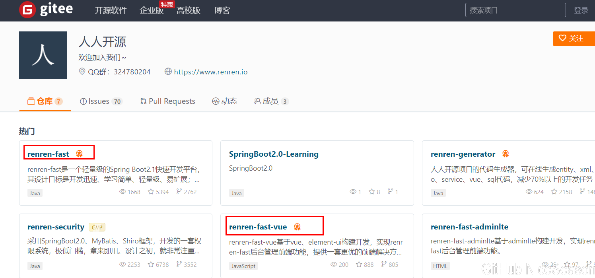

克隆到本地：

```shell
git clone https://gitee.com/renrenio/renren-fast-vue.git

git clone https://gitee.com/renrenio/renren-fast.git
```


将拷贝下来的“renren-fast”删除“.git”后，拷贝到“gulimall”工程根目录下，然后将它作为gulimall的一个module


创建“gulimall_admin”的数据库，然后执行“renren-fast/db/mysql.sql”中的SQl脚本

修改“application-dev.yml”文件，默认为dev环境，修改连接mysql的url和用户名密码

```yaml
spring:
    datasource:
        type: com.alibaba.druid.pool.DruidDataSource
        druid:
            driver-class-name: com.mysql.cj.jdbc.Driver
            url: jdbc:mysql://192.168.137.14:3306/gulimall_admin?useUnicode=true&characterEncoding=UTF-8&serverTimezone=Asia/Shanghai
            username: root
            password: root
```


启动“gulimall_admin”，然后访问“<http://localhost:8080/renren-fast/>”

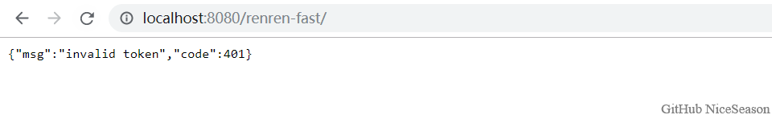


安装node.js，并且安装仓库

```
npm config set registry http://registry.npm.taobao.org/
```


```shell
PS D:\tmp\renren-fast-vue> npm config set registry http://registry.npm.taobao.org/
PS D:\tmp\renren-fast-vue> npm install
npm WARN ajv-keywords@1.5.1 requires a peer of ajv@>=4.10.0 but none is installed. You must install peer dependencies yourself.
npm WARN sass-loader@6.0.6 requires a peer of node-sass@^4.0.0 but none is installed. You must install peer dependencies yourself.
npm WARN optional SKIPPING OPTIONAL DEPENDENCY: fsevents@1.2.9 (node_modules\fsevents):
npm WARN notsup SKIPPING OPTIONAL DEPENDENCY: Unsupported platform for fsevents@1.2.9: wanted {"os":"darwin","arch":"any"} (current: {"os":"win32","arch":"x64"})

up to date in 17.227s
PS D:\tmp\renren-fast-vue> 
```


```shell
PS D:\tmp\renren-fast-vue> npm run dev

> renren-fast-vue@1.2.2 dev D:\tmp\renren-fast-vue
> webpack-dev-server --inline --progress --config build/webpack.dev.conf.js

 10% building modules 5/10 modules 5 active ...-0!D:\tmp\renren-fast-vue\src\main.js(node:19864) Warning: Accessing non-existent property 'cat' of module exports inside circular dependency
(Use `node --trace-warnings ...` to show where the warning was created)
(node:19864) Warning: Accessing non-existent property 'cd' of module exports inside circular dependency
(node:19864) Warning: Accessing non-existent property 'chmod' of module exports inside circular dependency
(node:19864) Warning: Accessing non-existent property 'cp' of module exports inside circular dependency
(node:19864) Warning: Accessing non-existent property 'dirs' of module exports inside circular dependency
(node:19864) Warning: Accessing non-existent property 'pushd' of module exports inside circular dependency
(node:19864) Warning: Accessing non-existent property 'popd' of module exports inside circular dependency
(node:19864) Warning: Accessing non-existent property 'echo' of module exports inside circular dependency
(node:19864) Warning: Accessing non-existent property 'tempdir' of module exports inside circular dependency
(node:19864) Warning: Accessing non-existent property 'pwd' of module exports inside circular dependency
```


常见问题1：“Module build failed: Error: Cannot find module 'node-sass”

运行过程中，出现“Module build failed: Error: Cannot find module 'node-sass'报错问题”，解决方法

>
>
>用npm install -g cnpm --registry=https://registry.npm.taobao.org ，从淘宝镜像那下载，然后cnpm下载成功。
>
>最后输入cnpm install node-sass --save。npm run dev终于能跑起来了！！！
>————————————————
>版权声明：本文为CSDN博主「夕阳下美了剪影」的原创文章，遵循CC 4.0 BY-SA版权协议，转载请附上原文出处链接及本声明。
>原文链接：https://blog.csdn.net/qq_38401285/article/details/86483278


常见问题2：cnpm - 解决 " cnpm : 无法加载文件 C:\Users\93457\AppData\Roaming\npm\cnpm.ps1，因为在此系统上禁止运行脚本。有关详细信息 。。。 "

<https://www.cnblogs.com/500m/p/11634969.html>


所有问题的根源都在“node_modules”，npm install之前，应该将这个文件夹删除，然后再进行安装和运行。

再次运行npm run dev恢复正常：

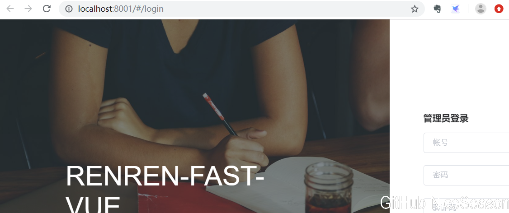


## 7. clone renren-generator

### clone

https://gitee.com/renrenio/renren-generator.git

然后将该项目放置到“gulimall”的跟路径下，然后添加该Module，并且提交到github上

### 修改配置

renren-generator/src/main/resources/generator.properties

```properties
#代码生成器，配置信息

mainPath=com.bigdata
#包名
package=com.bigdata.gulimall
moduleName=product
#作者
author=cosmoswong
#Email
email=cosmoswong@sina.com
#表前缀(类名不会包含表前缀)
tablePrefix=pms_
```

### 运行“renren-generator”

访问：<http://localhost:80/

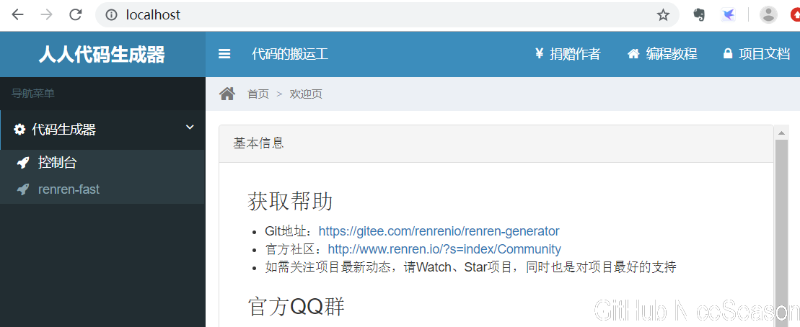

点击“renren-fast”，能够看到它将“renren-fast”的所有表都列举了出来：

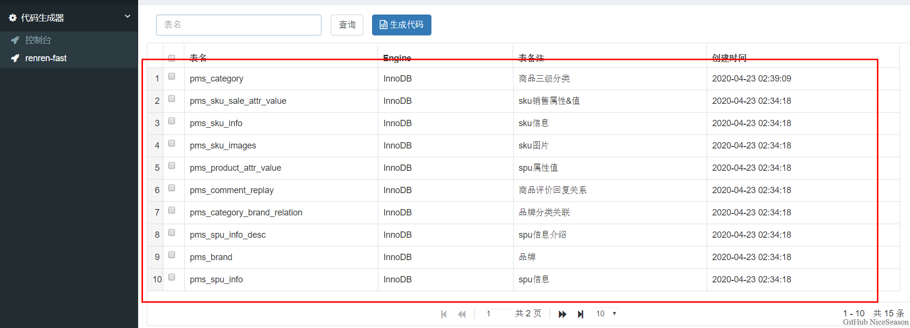

选择所有的表，然后点击“生成代码”，将下载的“renren.zip”，解压后取出main文件夹，放置到“gulimall-product”项目的main目录中。

下面的几个module，也采用同样的方式来操作。

但是针对于“undo_log”，存在一个问题

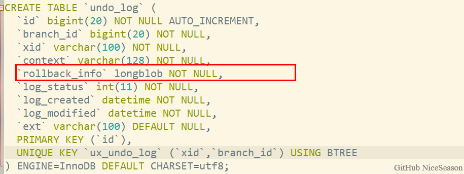

它的数据类型是“longblob”类型，逆向工程后，对应的数据类型未知：


这个问题该要怎么解决？


## 8. 微服务注册中心

要注意nacos集群所在的server，一定要关闭防火墙，否则容易出现各种问题。

搭建nacos集群，然后分别启动各个微服务，将它们注册到Nacos中。

```yaml
  application:
    name: gulimall-coupon
  cloud:
    nacos:
      discovery:
        server-addr: 192.168.137.14
```


查看注册情况：

<http://192.168.137.14:8848/nacos/#/serviceManagement?dataId=&group=&appName=&namespace=>

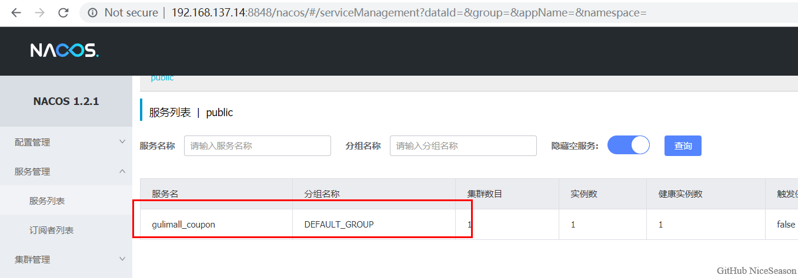


## 9. 使用openfen

 

1)、引入open-feign

```xml
        <dependency>
            <groupId>org.springframework.cloud</groupId>
            <artifactId>spring-cloud-starter-openfeign</artifactId>
        </dependency>
```


2)、编写一个接口，告诉SpringCLoud这个接口需要调用远程服务

修改“com.bigdata.gulimall.coupon.controller.CouponController”，添加以下controller方法：

```java
    @RequestMapping("/member/list")
    public R memberCoupons(){
        CouponEntity couponEntity = new CouponEntity();
        couponEntity.setCouponName("discount 20%");
        return R.ok().put("coupons",Arrays.asList(couponEntity));
    }
```


新建“com.bigdata.gulimall.member.feign.CouponFeignService”接口

```java
@FeignClient("gulimall_coupon")
public interface CouponFeignService {
    @RequestMapping("/coupon/coupon/member/list")
    public R memberCoupons();
}
```


修改“com.bigdata.gulimall.member.GulimallMemberApplication”类，添加上"@EnableFeignClients"：

```java
@SpringBootApplication
@EnableDiscoveryClient
@EnableFeignClients(basePackages = "com.bigdata.gulimall.member.feign")
public class GulimallMemberApplication {

    public static void main(String[] args) {
        SpringApplication.run(GulimallMemberApplication.class, args);
    }
}
```


​	声明接口的每一个方法都是调用哪个远程服务的那个请求

3)、开启远程调用功能

com.bigdata.gulimall.member.controller.MemberController

```java
    @RequestMapping("/coupons")
    public R test(){
        MemberEntity memberEntity=new MemberEntity();
        memberEntity.setNickname("zhangsan");
        R memberCoupons = couponFeignService.memberCoupons();

        return memberCoupons.put("member",memberEntity).put("coupons",memberCoupons.get("coupons"));
    }

```


(4)、访问<http://localhost:8000/member/member/coupons>

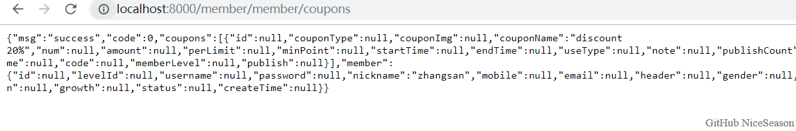

停止“gulimall-coupon”服务，能够看到注册中心显示该服务的健康值为0：

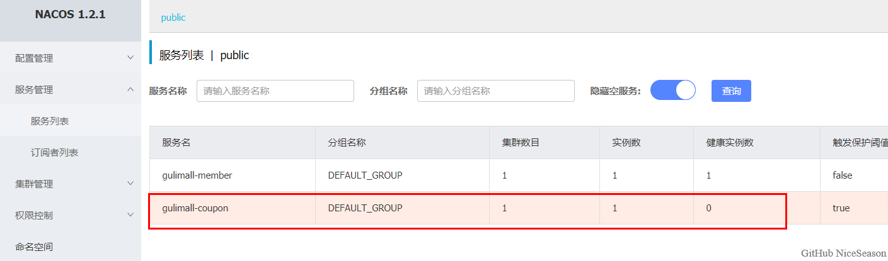

再次访问：http://localhost:8000/member/member/coupons

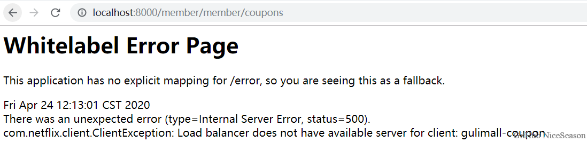

启动“gulimall-coupon”服务，再次访问，又恢复了正常。


## 10. 配置中心

### 1）修改“gulimall-coupon”模块

添加pom依赖：

```xml
<dependency>
    <groupId>com.alibaba.cloud</groupId>
    <artifactId>spring-cloud-starter-alibaba-nacos-config</artifactId>
</dependency>
```


创建bootstrap.properties文件，该配置文件会优先于“application.yml”加载。

```properties
spring.application.name=gulimall-coupon
spring.cloud.nacos.config.server-addr=192.168.137.14:8848
```


### 2）传统方式

为了详细说明config的使用方法，先来看原始的方式

创建“application.properties”配置文件，添加如下配置内容：

```properties
coupon.user.name="zhangsan"
coupon.user.age=30
```

修改“com.bigdata.gulimall.coupon.controller.CouponController”文件，添加如下内容：

```java
    @Value("${coupon.user.name}")
    private String name;
    @Value("${coupon.user.age}")
    private Integer age;

    @RequestMapping("/test")
    public R getConfigInfo(){
       return R.ok().put("name",name).put("age",age);
    }
```


启动“gulimall-coupon”服务：


访问：http://localhost:7000/coupon/coupon/test>

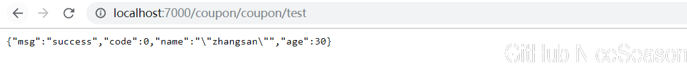

这样做存在的一个问题，如果频繁的修改application.properties，在需要频繁重新打包部署。下面我们将采用Nacos的配置中心来解决这个问题。

### 3）nacos config

1、在Nacos注册中心中，点击“配置列表”，添加配置规则：

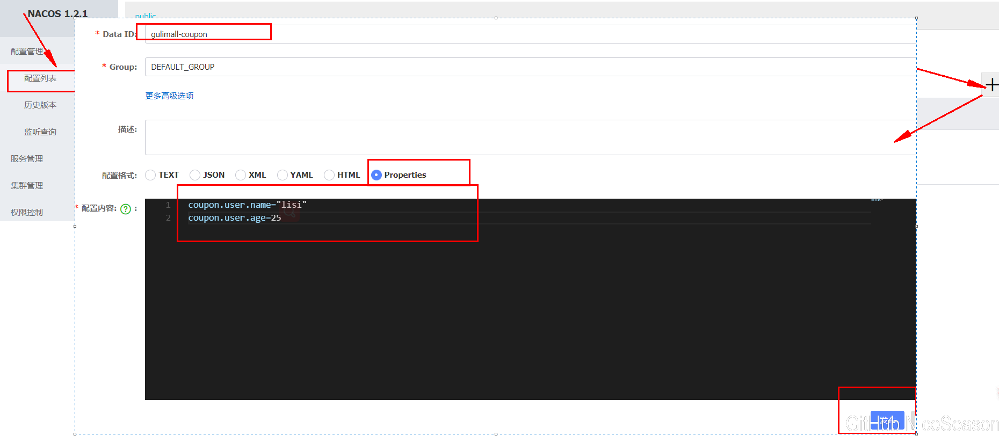

DataID：gulimall-coupon

配置格式：properties


文件的命名规则为：${spring.application.name}-${spring.profiles.active}.${spring.cloud.nacos.config.file-extension}

${spring.application.name}：为微服务名

${spring.profiles.active}：指明是哪种环境下的配置，如dev、test或info

${spring.cloud.nacos.config.file-extension}：配置文件的扩展名，可以为properties、yml等


2、查看配置：

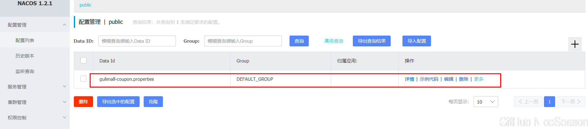


3、修改“com.bigdata.gulimall.coupon.controller.CouponController”类，添加“@RefreshScope”注解

```java
@RestController
@RequestMapping("coupon/coupon")
@RefreshScope
public class CouponController {
```

这样都会动态的从配置中心读取配置.

4、访问：<http://localhost:7000/coupon/coupon/test>


能够看到读取到了nacos 中的最新的配置信息，并且在指明了相同的配置信息时，配置中心中设置的值优先于本地配置。


### 4）Nacos支持三种配置加载方方案

Nacos支持“Namespace+group+data ID”的配置解决方案。

详情见：<https://github.com/alibaba/spring-cloud-alibaba/blob/master/spring-cloud-alibaba-docs/src/main/asciidoc-zh/nacos-config.adoc>


##### Namespace方案

通过命名空间实现环境区分

下面是配置实例：

1、创建命名空间：

“命名空间”—>“创建命名空间”：

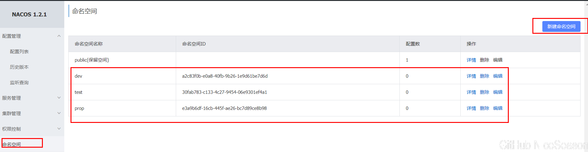

 创建三个命名空间，分别为dev，test和prop

2、回到配置列表中，能够看到所创建的三个命名空间

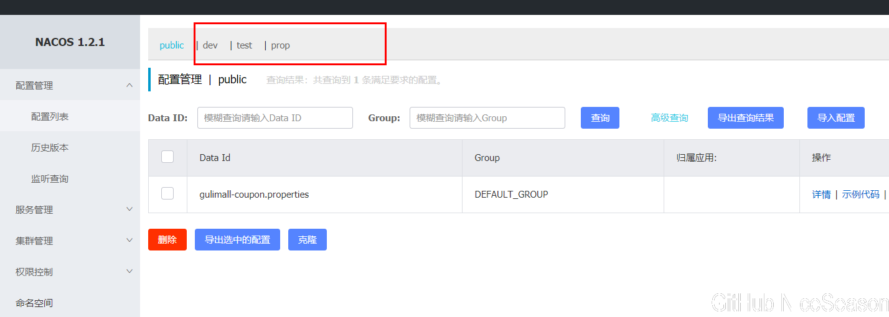

下面我们需要在dev命名空间下，创建“gulimall-coupon.properties”配置规则：

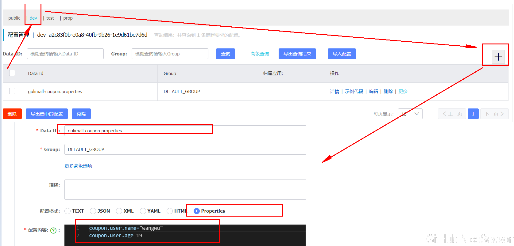


3、访问：<http://localhost:7000/coupon/coupon/test>

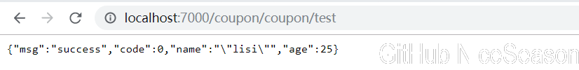


并没有使用我们在dev命名空间下所配置的规则，而是使用的是public命名空间下所配置的规则，这是怎么回事呢？

查看“gulimall-coupon”服务的启动日志：

```verilog
2020-04-24 16:37:24.158  WARN 32792 --- [           main] c.a.c.n.c.NacosPropertySourceBuilder     : Ignore the empty nacos configuration and get it based on dataId[gulimall-coupon] & group[DEFAULT_GROUP]
2020-04-24 16:37:24.163  INFO 32792 --- [           main] c.a.nacos.client.config.utils.JVMUtil    : isMultiInstance:false
2020-04-24 16:37:24.169  INFO 32792 --- [           main] b.c.PropertySourceBootstrapConfiguration : Located property source: [BootstrapPropertySource {name='bootstrapProperties-gulimall-coupon.properties,DEFAULT_GROUP'}, BootstrapPropertySource {name='bootstrapProperties-gulimall-coupon,DEFAULT_GROUP'}]

```

**"gulimall-coupon.properties"**，默认就是public命名空间中的内容中所配置的规则。

4、指定命名空间

如果想要使得我们自定义的命名空间生效，需要在“bootstrap.properties”文件中，指定使用哪个命名空间：

```properties
spring.cloud.nacos.config.namespace=a2c83f0b-e0a8-40fb-9b26-1e9d61be7d6d
```

这个命名空间ID来源于我们在第一步所创建的命名空间


5、重启“gulimall-coupon”，再次访问：http://localhost:7000/coupon/coupon/test


但是这种命名空间的粒度还是不够细化，对此我们可以为项目的每个微服务module创建一个命名空间。

6、为所有微服务创建命名空间

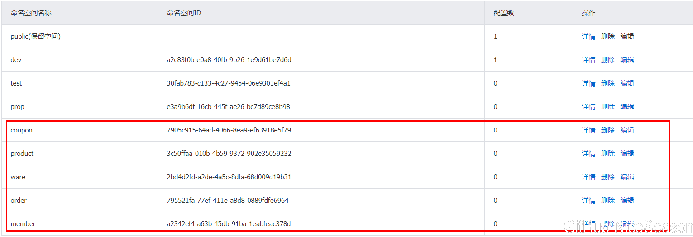


7、回到配置列表选项卡，克隆pulic的配置规则到coupon命名空间下

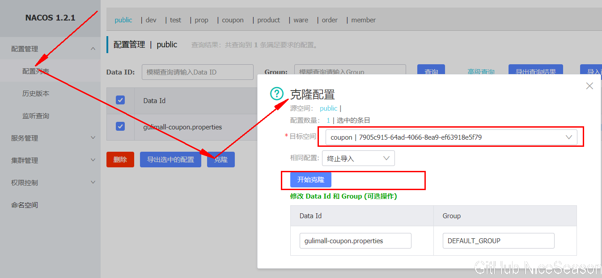

切换到coupon命名空间下，查看所克隆的规则：


8、修改“gulimall-coupon”下的bootstrap.properties文件，添加如下配置信息

```properties
spring.cloud.nacos.config.namespace=7905c915-64ad-4066-8ea9-ef63918e5f79
```

这里指明的是，读取时使用coupon命名空间下的配置。

9、重启“gulimall-coupon”，访问：<http://localhost:7000/coupon/coupon/test>


##### DataID方案

通过指定spring.profile.active和配置文件的DataID，来使不同环境下读取不同的配置，读取配置时，使用的是默认命名空间public，默认分组（default_group）下的DataID。

默认情况，Namespace=public，Group=DEFAULT GROUP，默认Cluster是DEFAULT


##### Group方案

通过Group实现环境区分

实例：通过使用不同的组，来读取不同的配置，还是以上面的gulimall-coupon微服务为例

1、新建“gulimall-coupon.properties”，将它置于“tmp”组下

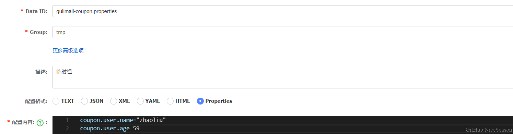

2、修改“bootstrap.properties”配置，添加如下的配置

```properties
spring.cloud.nacos.config.group=tmp
```

3、重启“gulimall-coupon”，访问：<http://localhost:7000/coupon/coupon/test>


### 5）同时加载多个配置集

当微服务数量很庞大时，将所有配置都书写到一个配置文件中，显然不是太合适。对此我们可以将配置按照功能的不同，拆分为不同的配置文件。

如下面的配置文件：

```yaml
server:
  port: 7000

spring:
  datasource:
    #MySQL配置
    driverClassName: com.mysql.cj.jdbc.Driver
    url: jdbc:mysql://192.168.137.14:3306/gulimall_sms?useUnicode=true&characterEncoding=UTF-8&useSSL=false
    username: root
    password: root

  application:
    name: gulimall-coupon
  cloud:
    nacos:
      discovery:
        server-addr: 192.168.137.14:8848


mybatis-plus:
  global-config:
    db-config:
      id-type: auto
  mapper-locations: classpath:/mapper/**/*.xml


```


我们可以将，

数据源有关的配置写到一个配置文件中：

```yaml
spring:
  datasource:
    #MySQL配置
    driverClassName: com.mysql.cj.jdbc.Driver
    url: jdbc:mysql://192.168.137.14:3306/gulimall_sms?useUnicode=true&characterEncoding=UTF-8&useSSL=false
    username: root
    password: root
```

和框架有关的写到另外一个配置文件中：

```yaml
mybatis-plus:
  global-config:
    db-config:
      id-type: auto
  mapper-locations: classpath:/mapper/**/*.xml
```


也可以将上面的这些配置交给nacos来进行管理。

实例：将“gulimall-coupon”的“application.yml”文件拆分为多个配置，并放置到nacos配置中心

1、创建“datasource.yml”，用于存储和数据源有关的配置

```yml
spring:
  datasource:
    #MySQL配置
    driverClassName: com.mysql.cj.jdbc.Driver
    url: jdbc:mysql://192.168.137.14:3306/gulimall_sms?useUnicode=true&characterEncoding=UTF-8&useSSL=false
    username: root
    password: root
```

在coupon命名空间中，创建“datasource.yml”配置

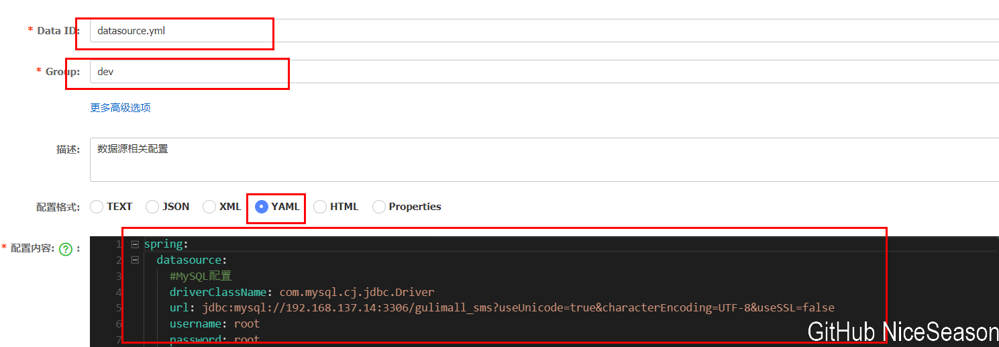


2、将和mybatis相关的配置，放置到“mybatis.yml”中

```yaml
mybatis-plus:
  global-config:
    db-config:
      id-type: auto
  mapper-locations: classpath:/mapper/**/*.xml
```


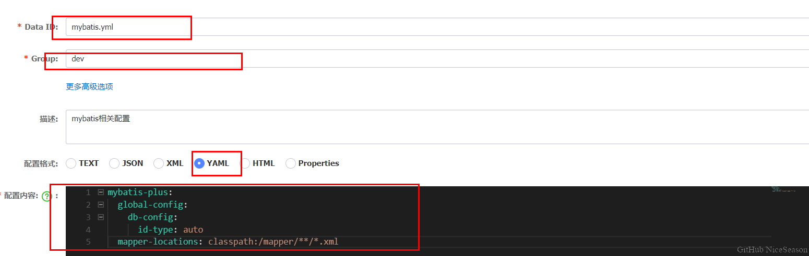


3、创建“other.yml”配置，保存其他的配置信息

```yaml
server:
  port: 7000

spring:
  application:
    name: gulimall-coupon
  cloud:
    nacos:
      discovery:
        server-addr: 192.168.137.14:8848
```


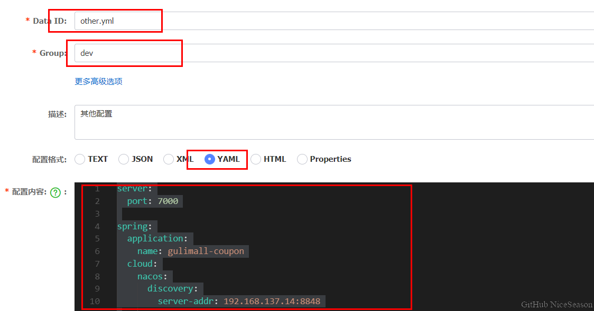


现在“mybatis.yml”、“datasource.yml”和“other.yml”共同构成了微服务的配置。

4、修改“gulimall-coupon”的“bootstrap.properties”文件，加载“mybatis.yml”、“datasource.yml”和“other.yml”配置

```properties
spring.cloud.nacos.config.extension-configs[0].data-id=mybatis.yml
spring.cloud.nacos.config.extension-configs[0].group=dev
spring.cloud.nacos.config.extension-configs[0].refresh=true

spring.cloud.nacos.config.extension-configs[1].data-id=datasource.yml
spring.cloud.nacos.config.extension-configs[1].group=dev
spring.cloud.nacos.config.extension-configs[1].refresh=true


spring.cloud.nacos.config.extension-configs[2].data-id=other.yml
spring.cloud.nacos.config.extension-configs[2].group=dev
spring.cloud.nacos.config.extension-configs[2].refresh=true
```

"spring.cloud.nacos.config.ext-config"已经被废弃，建议使用“spring.cloud.nacos.config.extension-configs”

5、注释“application.yml”文件中的所有配置

6、重启“gulimall-coupon”服务，然后访问：<http://localhost:7000/coupon/coupon/test>

 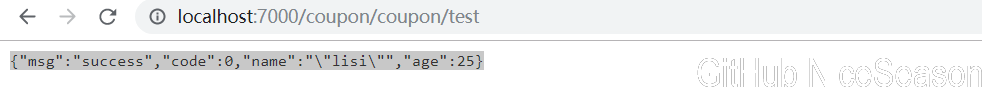

7、访问：<http://localhost:7000/coupon/coupon/list>，查看是否能够正常的访问数据库

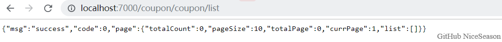


小结：

1)、微服务任何配置信息，任何配置文件都可以放在配置中心；

2)、只需要在bootstrap.properties中，说明加载配置中心的哪些配置文件即可；

3)、@Value, @ConfigurationProperties。都可以用来获取配置中心中所配置的信息；

4)、配置中心有的优先使用配置中心中的，没有则使用本地的配置。

## 11. 网关

### 1、注册“gulimall-gateway”到Nacos

#### 1）创建“gulimall-gateway”

SpringCloud gateway

#### 2）添加“gulimall-common”依赖和“spring-cloud-starter-gateway”依赖

```xml
        <dependency>
            <groupId>com.bigdata.gulimall</groupId>
            <artifactId>gulimall-common</artifactId>
            <version>1.0-SNAPSHOT</version>
        </dependency>
        <dependency>
            <groupId>org.springframework.cloud</groupId>
            <artifactId>spring-cloud-starter-gateway</artifactId>
        </dependency>
```

#### 3）“com.bigdata.gulimall.gulimallgateway.GulimallGatewayApplication”类上加上“@EnableDiscoveryClient”注解


#### 4）在Nacos中创建“gateway”命名空间，同时在该命名空间中创建“gulimall-gateway.yml”

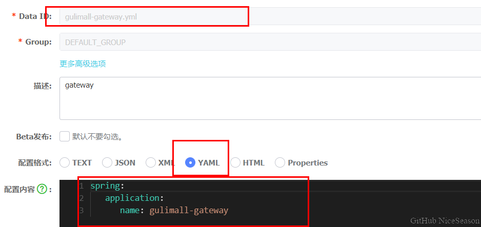

#### 5）创建“bootstrap.properties”文件，添加如下配置，指明配置中心地址和所属命名空间

```properties
spring.application.name=gulimall-gateway
spring.cloud.nacos.config.server-addr=192.168.137.14:8848
spring.cloud.nacos.config.namespace=1c82552e-1af0-4ced-9a48-26f19c2d315f
```


#### 6）创建“application.properties”文件，指定服务名和注册中心地址

```properties
spring.application.name=gulimall-gateway
spring.cloud.nacos.discovery.server-addr=192.168.137.14:8848
server.port=88
```

#### 7）启动“gulimall-gateway”

启动报错：

```verilog
Description:

Failed to configure a DataSource: 'url' attribute is not specified and no embedded datasource could be configured.

Reason: Failed to determine a suitable driver class
```

解决方法：在“com.bigdata.gulimall.gulimallgateway.GulimallGatewayApplication”中排除和数据源相关的配置

``` java
@SpringBootApplication(exclude = {DataSourceAutoConfiguration.class})
```

重新启动

访问：<http://192.168.137.14:8848/nacos/#>，查看到该服务已经注册到了Nacos中

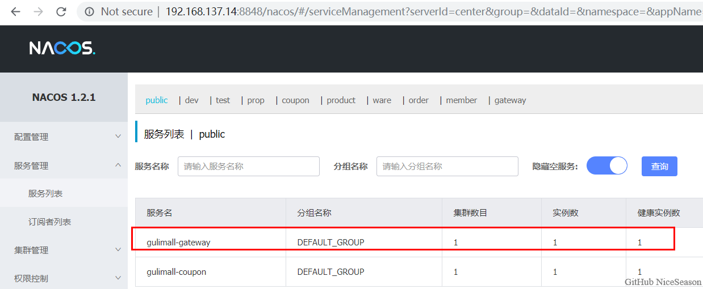


### 2、案例

现在想要实现针对于“http://localhost:88/hello?url=baidu”，转发到“https://www.baidu.com”，针对于“http://localhost:88/hello?url=qq”的请求，转发到“https://www.qq.com/”

#### 1）创建“application.yml”

```yaml
spring:
  cloud:
    gateway:
      routes:
        - id: baidu_route
          uri: https://www.baidu.com
          predicates:
            - Query=url, baidu
        - id: qq_route
          uri: https://www.qq.com/
          predicates:
            - Query=url, qq
```

#### 2）启动“gulimall-gateway”

#### 3）测试

访问：<http://localhost:88/hello?url=baidu>

访问：<http://localhost:88/hello?url=qq>


##  12. Vue

安装vue

```
# 最新稳定版
$ npm install vue
```

###   1、vue声明式渲染

```javascript

        let vm = new Vue({
            el: "#app",//绑定元素
            data: {  //封装数据
                name: "张三",
                num: 1
            },
            methods:{  //封装方法
                cancle(){
                    this.num -- ;
                },
                hello(){
                    return "1"
                }
            }
        });

```


### 2、双向绑定,模型变化，视图变化。反之亦然

双向绑定使用v-model

```html
 <input type="text" v-model="num">
```


```javascript
<h1> {{name}} ,非常帅，有{{num}}个人为他点赞{{hello()}}</h1>
```

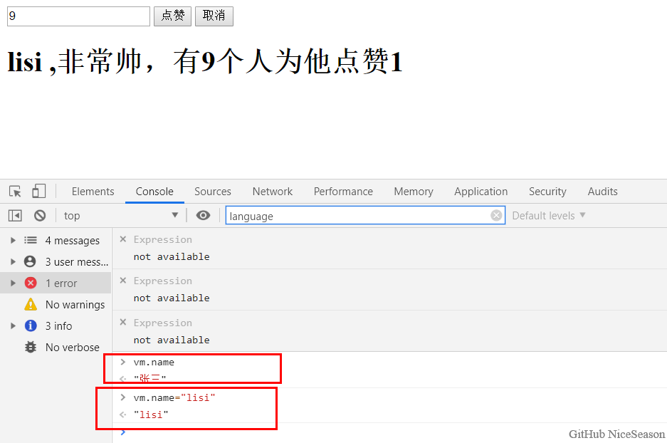

### 3、事件处理

v-xx：指令
1、创建vue实例，关联页面的模板，将自己的数据（data）渲染到关联的模板，响应式的
2、指令来简化对dom的一些操作。
3、声明方法来做更复杂的操作。methods里面可以封装方法。


v-on是按钮的单击事件：

```
 <button v-on:click="num++">点赞</button>
```


在VUE中el,data和vue的作用:

- el：用来绑定数据；
- data:用来封装数据；
- methods：用来封装方法，并且能够封装多个方法，如何上面封装了cancell和hello方法。


安装“Vue 2 Snippets”，用来做代码提示

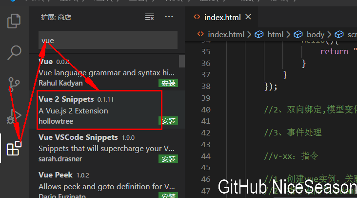


为了方便的在浏览器上调试VUE程序，需要安装“[vue-devtools](https://github.com/vuejs/vue-devtools)”，编译后安装到chrome中即可。

详细的使用方法见：[Vue调试神器vue-devtools安装](https://www.jianshu.com/p/63f09651724c)


“v-html”不会对于HTML标签进行转义，而是直接在浏览器上显示data所设置的内容;而“ v-text”会对html标签进行转义

```javascript
     <div id="app">
        {{msg}}  {{1+1}}  {{hello()}}<br/>
        <span v-html="msg"></span>
        <br/>
        <span v-text="msg"></span>
    </div>
   
    <script src="../node_modules/vue/dist/vue.js"></script>

    <script>
        new Vue({
            el:"#app",
            data:{
                msg:"<h1>Hello</h1>",
                link:"http://www.baidu.com"
            },
            methods:{
                hello(){
                    return "World"
                }
            }
        })
    </script>
```

运行结果：

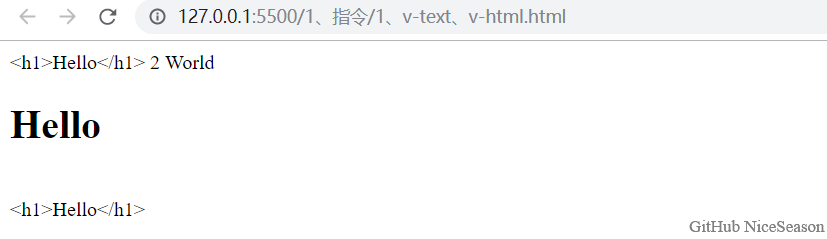


  {{msg}}  :称为差值表达式，它必须要写在Html表达式，可以完成数学运算和方法调用


### 4、v-bind :单向绑定

给html标签的属性绑定

```javascript
 <!-- 给html标签的属性绑定 -->
    <div id="app"> 

        <a v-bind:href="link">gogogo</a>

        <!-- class,style  {class名：加上？}-->
        <span v-bind:class="{active:isActive,'text-danger':hasError}"
          :style="{color: color1,fontSize: size}">你好</span>

    </div>

    <script src="../node_modules/vue/dist/vue.js"></script>

    <script>
        let vm = new Vue({
            el:"#app",
            data:{
                link: "http://www.baidu.com",
                isActive:true,
                hasError:true,
                color1:'red',
                size:'36px'
            }
        })
    </script>
```

上面所完成的任务就是给a标签绑定一个超链接。并且当“isActive”和“hasError”都是true的时候，将属性动态的绑定到，则绑定该“active”和 "text-danger"class。这样可以动态的调整属性的存在。

而且如果想要实现修改vm的"color1"和“size”， span元素的style也能够随之变化，则可以写作v-bind:style，也可以省略v-bind。

### 5、v-model双向绑定

```html
<!DOCTYPE html>
<html lang="en">
<head>
    <meta charset="UTF-8">
    <meta name="viewport" content="width=device-width, initial-scale=1.0">
    <meta http-equiv="X-UA-Compatible" content="ie=edge">
    <title>Document</title>
</head>
<body>


    <!-- 表单项，自定义组件 -->
    <div id="app">

        精通的语言：
            <input type="checkbox" v-model="language" value="Java"> java<br/>
            <input type="checkbox" v-model="language" value="PHP"> PHP<br/>
            <input type="checkbox" v-model="language" value="Python"> Python<br/>
        选中了 {{language.join(",")}}
    </div>
    
    <script src="../node_modules/vue/dist/vue.js"></script>

    <script>
        let vm = new Vue({
            el:"#app",
            data:{
                language: []
            }
        })
    </script>

</body>
</html>
```

上面完成的功能就是通过“v-model”为输入框绑定多个值，能够实现选中的值，在data的language也在不断的发生着变化，

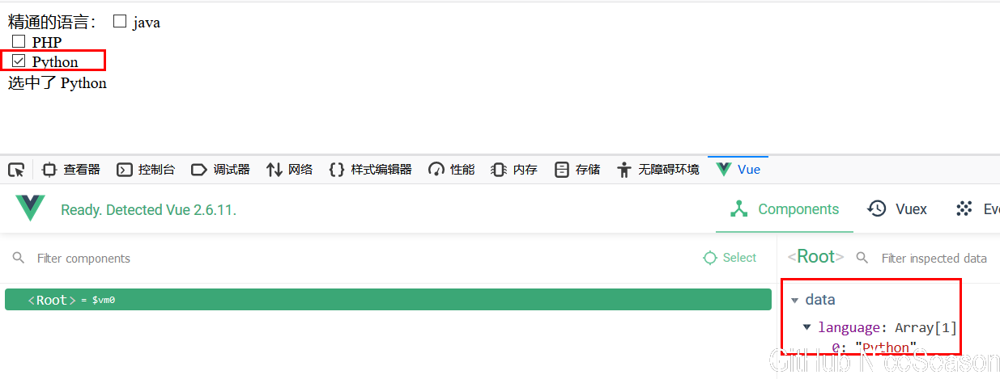

如果在控制台上指定vm.language=["Java","PHP"]，则data值也会跟着变化。

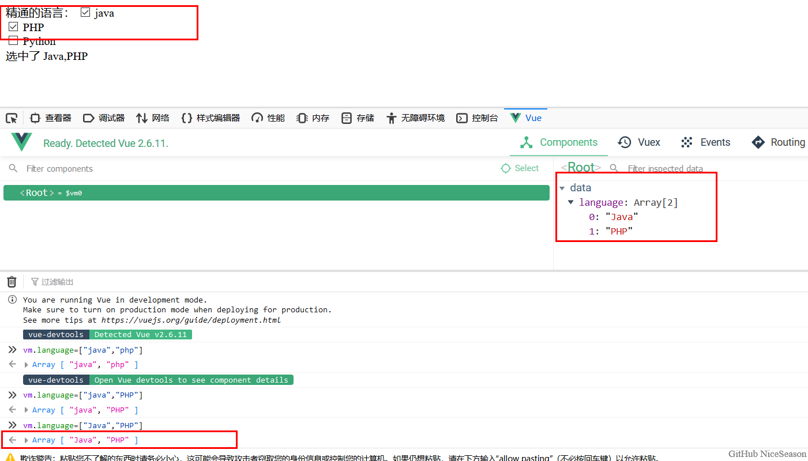

通过“v-model”实现了页面发生了变化，则数据也发生变化，数据发生变化，则页面也发生变化，这样就实现了双向绑定。


数组的连接操作： 选中了 {{language.join(",")}}

### 6、v-on为按钮绑定事件

```javascript
        <!--事件中直接写js片段-->
        <button v-on:click="num++">点赞</button>
        <!--事件指定一个回调函数，必须是Vue实例中定义的函数-->
        <button @click="cancle">取消</button>
```

上面是为两个按钮绑定了单击事件，其中一个对于num进行自增，另外一个自减。

v-on:click也可以写作@click


事件的冒泡：

```html
        <!-- 事件修饰符 -->
        <div style="border: 1px solid red;padding: 20px;" v-on:click="hello">
            大div
            <div style="border: 1px solid blue;padding: 20px;" @click="hello">
                小div <br />
                <a href="http://www.baidu.com" @click.prevent="hello">去百度</a>
            </div>
        </div>
```

上面的这两个嵌套div中，如果点击了内层的div，则外层的div也会被触发；这种问题可以事件修饰符来完成：

```html
        <!-- 事件修饰符 -->
        <div style="border: 1px solid red;padding: 20px;" v-on:click.once="hello">
            大div
            <div style="border: 1px solid blue;padding: 20px;" @click.stop="hello">
                小div <br />
                <a href="http://www.baidu.com" @click.prevent.stop="hello">去百度</a>
                <!--这里禁止了超链接的点击跳转操作，并且只会触发当前对象的操作-->
            </div>
        </div>
```

关于事件修饰符：

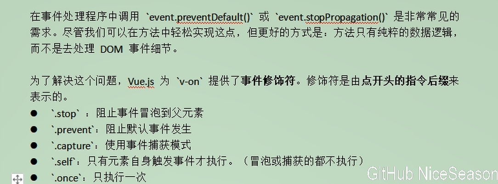


按键修饰符：

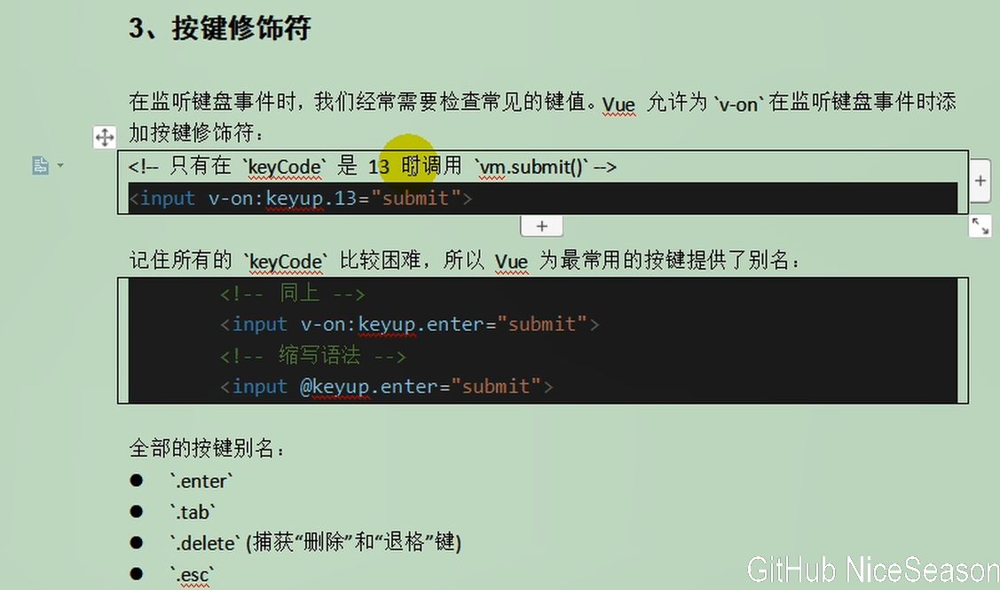


### 7、v-for遍历循环

```html
<!DOCTYPE html>
<html lang="en">

<head>
    <meta charset="UTF-8">
    <meta name="viewport" content="width=device-width, initial-scale=1.0">
    <meta http-equiv="X-UA-Compatible" content="ie=edge">
    <title>Document</title>
</head>

<body>

    <div id="app">
        <ul>
            <li v-for="(user,index) in users" :key="user.name" v-if="user.gender == '女'">
                <!-- 1、显示user信息：v-for="item in items" -->
               当前索引：{{index}} ==> {{user.name}}  ==>   {{user.gender}} ==>{{user.age}} <br>
                <!-- 2、获取数组下标：v-for="(item,index) in items" -->
                <!-- 3、遍历对象：
                        v-for="value in object"
                        v-for="(value,key) in object"
                        v-for="(value,key,index) in object" 
                -->
                对象信息：
                <span v-for="(v,k,i) in user">{{k}}=={{v}}=={{i}}；</span>
                <!-- 4、遍历的时候都加上:key来区分不同数据，提高vue渲染效率 -->
            </li>

            
        </ul>

        <ul>
            <li v-for="(num,index) in nums" :key="index"></li>
        </ul>
    </div>
    <script src="../node_modules/vue/dist/vue.js"></script>
    <script>         
        let app = new Vue({
            el: "#app",
            data: {
                users: [{ name: '柳岩', gender: '女', age: 21 },
                { name: '张三', gender: '男', age: 18 },
                { name: '范冰冰', gender: '女', age: 24 },
                { name: '刘亦菲', gender: '女', age: 18 },
                { name: '古力娜扎', gender: '女', age: 25 }],
                nums: [1,2,3,4,4]
            },
        })
    </script>
</body>

</html>
```

4、遍历的时候都加上:key来区分不同数据，提高vue渲染效率


### 过滤器

```html
<!DOCTYPE html>
<html lang="en">

<head>
    <meta charset="UTF-8">
    <meta name="viewport" content="width=device-width, initial-scale=1.0">
    <meta http-equiv="X-UA-Compatible" content="ie=edge">
    <title>Document</title>
</head>

<body>
    <!-- 过滤器常用来处理文本格式化的操作。过滤器可以用在两个地方：双花括号插值和 v-bind 表达式 -->
    <div id="app">
        <ul>
            <li v-for="user in userList">
                {{user.id}} ==> {{user.name}} ==> {{user.gender == 1?"男":"女"}} ==>
                {{user.gender | genderFilter}} ==> {{user.gender | gFilter}}
                <!-- 这里的"|"表示的管道，将user.gender的值交给genderFilter -->
            </li>
        </ul>
    </div>
    <script src="../node_modules/vue/dist/vue.js"></script>

    <script>
        // 全局过滤器 
        Vue.filter("gFilter", function (val) {
            if (val == 1) {
                return "男~~~";
            } else {
                return "女~~~";
            }
        })

        let vm = new Vue({
            el: "#app",
            data: {
                userList: [
                    { id: 1, name: 'jacky', gender: 1 },
                    { id: 2, name: 'peter', gender: 0 }
                ]
            },
            filters: {
                //// filters 定义局部过滤器，只可以在当前vue实例中使用
                genderFilter(val) {
                    if (val == 1) {
                        return "男";
                    } else {
                        return "女";
                    }
                }
            }
        })
    </script>
</body>

</html>
```


### 组件化

```html
<!DOCTYPE html>
<html lang="en">

<head>
    <meta charset="UTF-8">
    <meta name="viewport" content="width=device-width, initial-scale=1.0">
    <meta http-equiv="X-UA-Compatible" content="ie=edge">
    <title>Document</title>
</head>

<body>

    <div id="app">
        <button v-on:click="count++">我被点击了 {{count}} 次</button>

        <counter></counter>
        <counter></counter>
        <counter></counter>
        <counter></counter>
        <counter></counter>
        <!-- 使用所定义的组件button-counter -->
        <button-counter></button-counter>
    </div>
    <script src="../node_modules/vue/dist/vue.js"></script>


    <script>
        //1、全局声明注册一个组件
        Vue.component("counter", {
            template: `<button v-on:click="count++">我被点击了 {{count}} 次</button>`,
            data() {
                return {
                    count: 1
                }
            }
        });

        //2、局部声明一个组件
        const buttonCounter = {
            template: `<button v-on:click="count++">我被点击了 {{count}} 次~~~</button>`,
            data() {
                return {
                    count: 1
                }
            }
        };

        new Vue({
            el: "#app",
            data: {
                count: 1
            },
            components: {
                //声明所定义的局部组件
                'button-counter': buttonCounter
            }
        })
    </script>
</body>

</html>
```


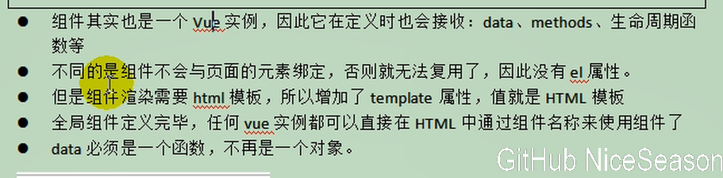


### 生命周期钩子函数

```html
<!DOCTYPE html>
<html lang="en">

<head>
    <meta charset="UTF-8">
    <meta name="viewport" content="width=device-width, initial-scale=1.0">
    <meta http-equiv="X-UA-Compatible" content="ie=edge">
    <title>Document</title>
</head>

<body>
    <div id="app">
        <span id="num">{{num}}</span>
        <button @click="num++">赞！</button>
        <h2>{{name}}，有{{num}}个人点赞</h2>
    </div>

    <script src="../node_modules/vue/dist/vue.js"></script>
    
    <script>
        let app = new Vue({
            el: "#app",
            data: {
                name: "张三",
                num: 100
            },
            methods: {
                show() {
                    return this.name;
                },
                add() {
                    this.num++;
                }
            },
            beforeCreate() {
                console.log("=========beforeCreate=============");
                console.log("数据模型未加载：" + this.name, this.num);
                console.log("方法未加载：" + this.show());
                console.log("html模板未加载：" + document.getElementById("num"));
            },
            created: function () {
                console.log("=========created=============");
                console.log("数据模型已加载：" + this.name, this.num);
                console.log("方法已加载：" + this.show());
                console.log("html模板已加载：" + document.getElementById("num"));
                console.log("html模板未渲染：" + document.getElementById("num").innerText);
            },
            beforeMount() {
                console.log("=========beforeMount=============");
                console.log("html模板未渲染：" + document.getElementById("num").innerText);
            },
            mounted() {
                console.log("=========mounted=============");
                console.log("html模板已渲染：" + document.getElementById("num").innerText);
            },
            beforeUpdate() {
                console.log("=========beforeUpdate=============");
                console.log("数据模型已更新：" + this.num);
                console.log("html模板未更新：" + document.getElementById("num").innerText);
            },
            updated() {
                console.log("=========updated=============");
                console.log("数据模型已更新：" + this.num);
                console.log("html模板已更新：" + document.getElementById("num").innerText);
            }
        });
    </script>
</body>

</html>
```


## 13. element ui

官网： https://element.eleme.cn/#/zh-CN/component/installation 

安装

```shell
npm i element-ui -S
```

###   

 在 main.js 中写入以下内容： 

```
import ElementUI  from 'element-ui'
import 'element-ui/lib/theme-chalk/index.css';

Vue.use(ElementUI);
```


## 14. 递归树形结构获取数据

在注册中心中“product”命名空间中，创建“gulimall-product.yml”配置文件：

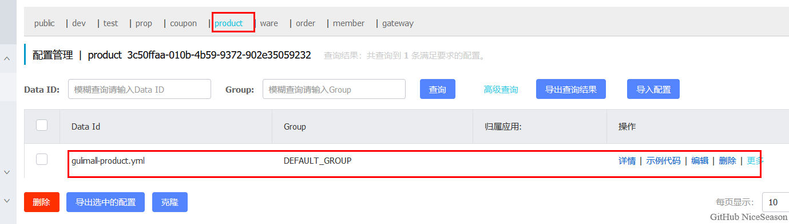

将“application.yml”内容拷贝到该配置文件中

```yaml
server:
  port: 10000

spring:
  datasource:
    #MySQL配置
    driverClassName: com.mysql.cj.jdbc.Driver
    url: jdbc:mysql://192.168.137.14:3306/gulimall_pms?useUnicode=true&characterEncoding=UTF-8&useSSL=false
    username: root
    password: root
  application:
    name: gulimall-product
  cloud:
    nacos:
      discovery:
        server-addr: 192.168.137.14:8848


mybatis-plus:
  global-config:
    db-config:
      id-type: auto
  mapper-locations: classpath:/mapper/**/*.xml


```

在本地创建“bootstrap.properties”文件，指明配置中心的位置和使用到的配置文件：

```properties
spring.application.name=gulimall-product
spring.cloud.nacos.config.server-addr=192.168.137.14:8848
spring.cloud.nacos.config.namespace=3c50ffaa-010b-4b59-9372-902e35059232
spring.cloud.nacos.config.extension-configs[0].data-id=gulimall-product.yml
spring.cloud.nacos.config.extension-configs[0].group=DEFAULT_GROUP
spring.cloud.nacos.config.extension-configs[0].refresh=true
```

然后启动gulimall-product，查看到该服务已经出现在了nacos的注册中心中了

修改“com.bigdata.gulimall.product.service.CategoryService”类，添加如下代码：

```java
    /**
     * 列表
     */
    @RequestMapping("/list/tree")
    public List<CategoryEntity> list(){
        List<CategoryEntity> categoryEntities = categoryService.listWithTree();

        return categoryEntities;
    }
```

测试：http://localhost:10000/product/category/list/tree

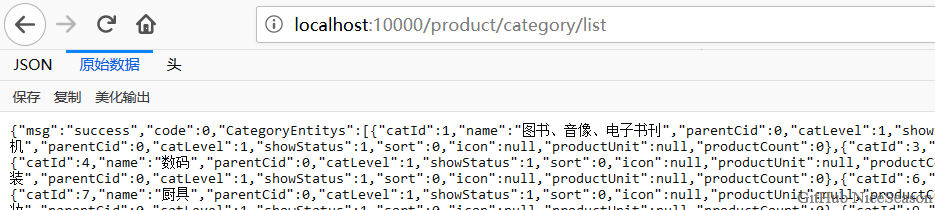


如何区别是哪种分类级别？

答：可以通过分类的parent_cid来进行判断，如果是一级分类，其值为0.

```java
     /**
     * 列表
     */
    @RequestMapping("/list/tree")
    public List<CategoryEntity> list(){
        List<CategoryEntity> categoryEntities = categoryService.listWithTree();
        //找到所有的一级分类
        List<CategoryEntity> level1Menus = categoryEntities.stream()
                .filter(item -> item.getParentCid() == 0)
                .map(menu->{
                    menu.setChildCategoryEntity(getChildrens(menu,categoryEntities));
                    return menu;
                })
                .sorted((menu1, menu2) -> {

                  return (menu1.getSort() ==null ? 0:menu1.getSort())- (menu2.getSort()==null?0:menu2.getSort());

                })
                .collect(Collectors.toList());


        return level1Menus;
    }

    public List<CategoryEntity> getChildrens(CategoryEntity root,List<CategoryEntity> all){

        List<CategoryEntity> childrens = all.stream().filter(item -> {
            return item.getParentCid() == root.getCatId();
        }).map(item -> {
            item.setChildCategoryEntity(getChildrens(item, all));
            return item;
        }).sorted((menu1, menu2) -> {
            return (menu1.getSort() ==null ? 0:menu1.getSort())- (menu2.getSort()==null?0:menu2.getSort());
        }).collect(Collectors.toList());

        return childrens;
    }

```


下面是得到的部分JSON数据

```json
[
  {
    "catId": 1,
    "name": "图书、音像、电子书刊",
    "parentCid": 0,
    "catLevel": 1,
    "showStatus": 1,
    "sort": 0,
    "icon": null,
    "productUnit": null,
    "productCount": 0,
    "childCategoryEntity": [
      {
        "catId": 22,
        "name": "电子书刊",
        "parentCid": 1,
        "catLevel": 2,
        "showStatus": 1,
        "sort": 0,
        "icon": null,
        "productUnit": null,
        "productCount": 0,
        "childCategoryEntity": [
          {
            "catId": 165,
            "name": "电子书",
            "parentCid": 22,
            "catLevel": 3,
            "showStatus": 1,
            "sort": 0,
            "icon": null,
            "productUnit": null,
            "productCount": 0,
            "childCategoryEntity": []
          },
          {
            "catId": 166,
            "name": "网络原创",
            "parentCid": 22,
            "catLevel": 3,
            "showStatus": 1,
            "sort": 0,
            "icon": null,
            "productUnit": null,
            "productCount": 0,
            "childCategoryEntity": []
          },
          {
            "catId": 167,
            "name": "数字杂志",
            "parentCid": 22,
            "catLevel": 3,
            "showStatus": 1,
            "sort": 0,
            "icon": null,
            "productUnit": null,
            "productCount": 0,
            "childCategoryEntity": []
          },
          {
            "catId": 168,
            "name": "多媒体图书",
            "parentCid": 22,
            "catLevel": 3,
            "showStatus": 1,
            "sort": 0,
            "icon": null,
            "productUnit": null,
            "productCount": 0,
            "childCategoryEntity": []
          }
        ]
      },
      {
        "catId": 23,
        "name": "音像",
        "parentCid": 1,
        "catLevel": 2,
        "showStatus": 1,
        "sort": 0,
        "icon": null,
        "productUnit": null,
        "productCount": 0,
        "childCategoryEntity": [
          {
            "catId": 169,
            "name": "音乐",
            "parentCid": 23,
            "catLevel": 3,
            "showStatus": 1,
            "sort": 0,
            "icon": null,
            "productUnit": null,
            "productCount": 0,
            "childCategoryEntity": []
          },
          {
            "catId": 170,
            "name": "影视",
            "parentCid": 23,
            "catLevel": 3,
            "showStatus": 1,
            "sort": 0,
            "icon": null,
            "productUnit": null,
            "productCount": 0,
            "childCategoryEntity": []
          },
          {
            "catId": 171,
            "name": "教育音像",
            "parentCid": 23,
            "catLevel": 3,
            "showStatus": 1,
            "sort": 0,
            "icon": null,
            "productUnit": null,
            "productCount": 0,
            "childCategoryEntity": []
          }
        ]
      },
      {
```


启动后端项目renren-fast

启动前端项目renren-fast-vue：

```
npm run dev
```


访问： http://localhost:8001/#/login 

创建一级菜单：

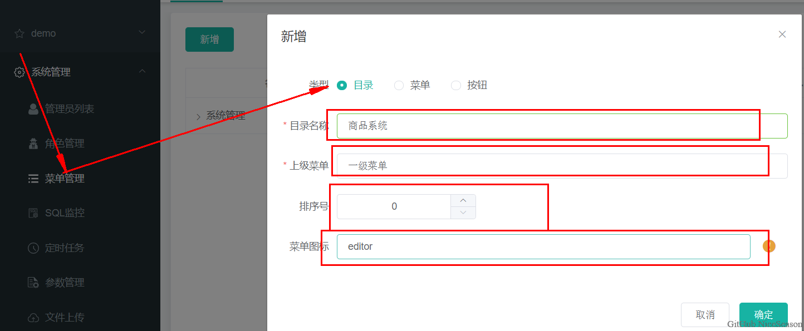

创建完成后，在后台的管理系统中会创建一条记录：

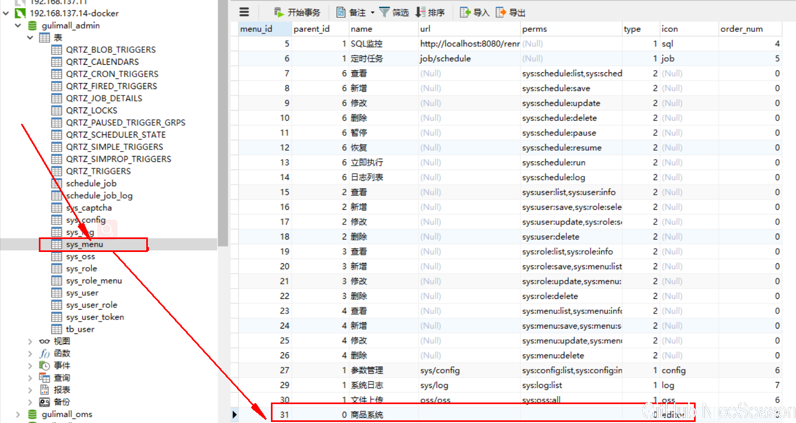

然后创建子菜单：

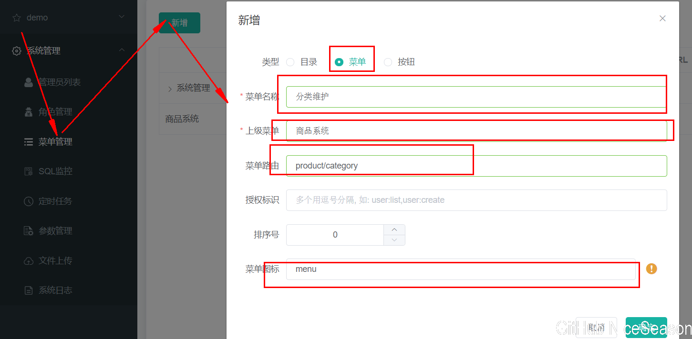


创建renren-fast-vue\src\views\modules\product目录，子所以是这样来创建，是因为product/category，对应于product-category

在该目录下，新建“category.vue”文件：

```

```

刷新页面出现404异常，查看请求发现，请求的是“http://localhost:8080/renren-fast/product/category/list/tree”

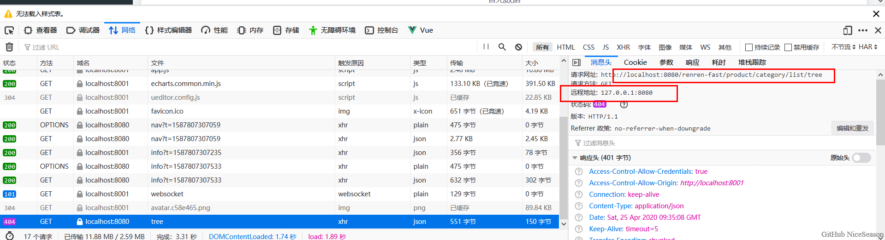

这个请求是不正确的，正确的请求是：http://localhost:10000/product/category/list/tree，

修正这个问题：

替换“static\config\index.js”文件中的“window.SITE_CONFIG['baseUrl']”

替换前：

```
window.SITE_CONFIG['baseUrl'] = 'http://localhost:8080/renren-fast';
```

替换后：

```
 window.SITE_CONFIG['baseUrl'] = 'http://localhost:88/api';
```

http://localhost:88，这个地址是我们网关微服务的接口。


这里我们需要通过网关来完成路径的映射，因此将renren-fast注册到nacos注册中心中，并添加配置中心

```yaml
application:
    name: renren-fast
  cloud:
    nacos:
      discovery:
        server-addr: 192.168.137.14:8848

      config:
        name: renren-fast
        server-addr: 192.168.137.8848
        namespace: ee409c3f-3206-4a3b-ba65-7376922a886d
```


配置网关路由，前台的所有请求都是经由“http://localhost:88/api”来转发的，在“gulimall-gateway”中添加路由规则：

```yaml
        - id: admin_route
          uri: lb://renren-fast
          predicates:
            - Path=/api/**
```


但是这样做也引入了另外的一个问题，再次访问：http://localhost:8001/#/login，发现验证码不再显示：

分析原因：

1. 现在的验证码请求路径为，http://localhost:88/api/captcha.jpg?uuid=69c79f02-d15b-478a-8465-a07fd09001e6
2. 原始的验证码请求路径：http://localhost:8001/renren-fast/captcha.jpg?uuid=69c79f02-d15b-478a-8465-a07fd09001e6

在admin_route的路由规则下，在访问路径中包含了“api”，因此它会将它转发到renren-fast，网关在转发的时候，会使用网关的前缀信息，为了能够正常的取得验证码，我们需要对请求路径进行重写


关于请求路径重写：

[6.16. The `RewritePath` `GatewayFilter` Factory](https://cloud.spring.io/spring-cloud-static/spring-cloud-gateway/2.2.2.RELEASE/reference/html/#the-rewritepath-gatewayfilter-factory)

The `RewritePath` `GatewayFilter` factory takes a path `regexp` parameter and a `replacement` parameter. This uses Java regular expressions for a flexible way to rewrite the request path. The following listing configures a `RewritePath` `GatewayFilter`:

Example 41. application.yml

```yaml
spring:
  cloud:
    gateway:
      routes:
      - id: rewritepath_route
        uri: https://example.org
        predicates:
        - Path=/foo/**
        filters:
        - RewritePath=/red(?<segment>/?.*), $\{segment}
```

For a request path of `/red/blue`, this sets the path to `/blue` before making the downstream request. Note that the `$` should be replaced with `$\` because of the YAML specification.


修改“admin_route”路由规则：

```yaml
        - id: admin_route
          uri: lb://renren-fast
          predicates:
            - Path=/api/**
          filters:
            - RewritePath=/api/(?<segment>/?.*), /renren-fast/$\{segment}
```


再次访问：http://localhost:8001/#/login，验证码能够正常的加载了。

但是很不幸新的问题又产生了，访问被拒绝了

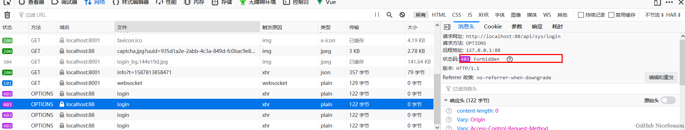


 问题描述：已拦截跨源请求：同源策略禁止读取位于 http://localhost:88/api/sys/login 的远程资源。（原因：CORS 头缺少 'Access-Control-Allow-Origin'）。 

问题分析：这是一种跨域问题。访问的域名和端口和原来的请求不同，请求就会被限制

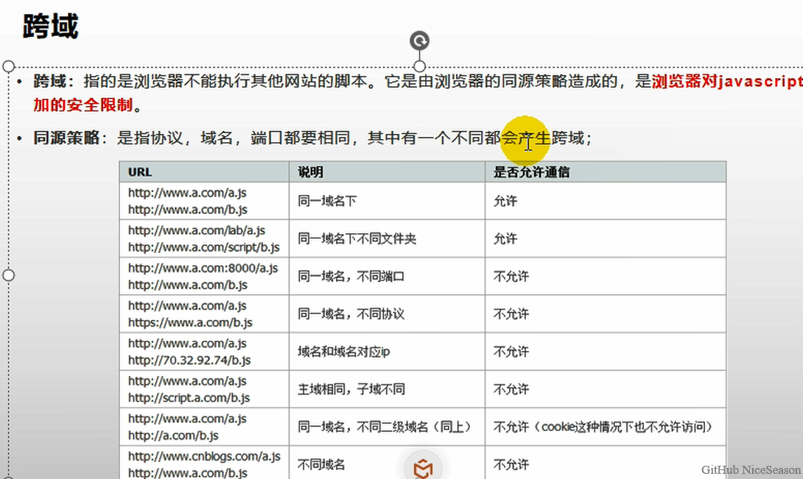

跨域流程：

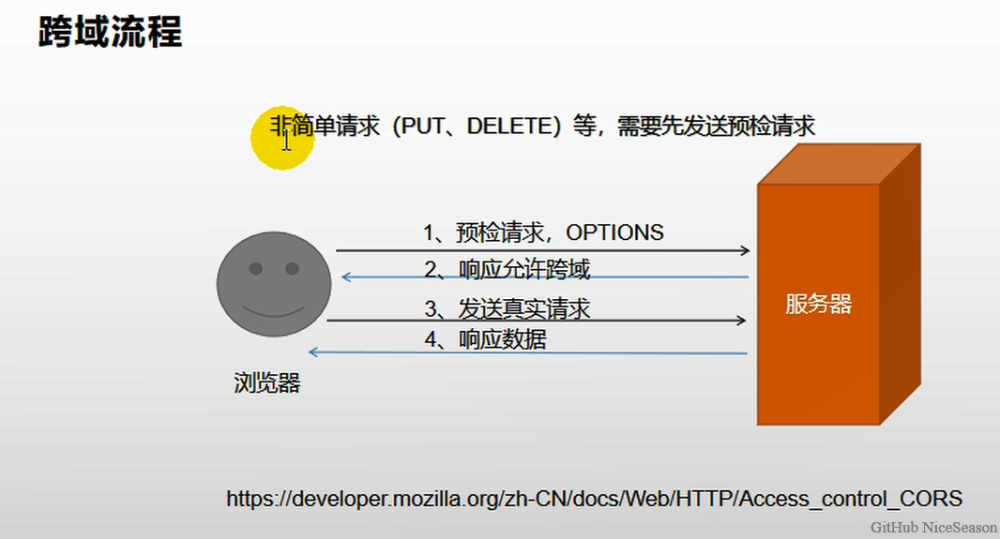

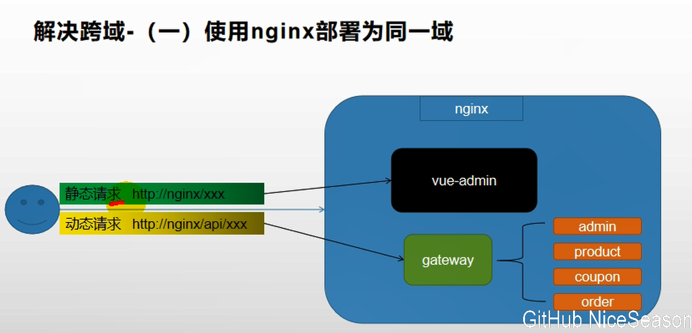

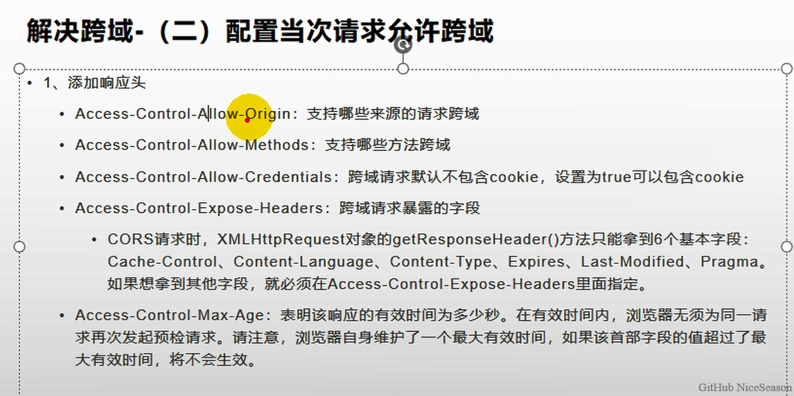

解决方法：在网关中定义“GulimallCorsConfiguration”类，该类用来做过滤，允许所有的请求跨域。

```java
@Configuration
public class GulimallCorsConfiguration {

    @Bean
    public CorsWebFilter corsWebFilter(){
        UrlBasedCorsConfigurationSource source=new UrlBasedCorsConfigurationSource();
        CorsConfiguration corsConfiguration = new CorsConfiguration();
        corsConfiguration.addAllowedHeader("*");
        corsConfiguration.addAllowedMethod("*");
        corsConfiguration.addAllowedOrigin("*");
        corsConfiguration.setAllowCredentials(true);
        
        source.registerCorsConfiguration("/**",corsConfiguration);
        return new CorsWebFilter(source);
    }
}
```


再次访问：http://localhost:8001/#/login

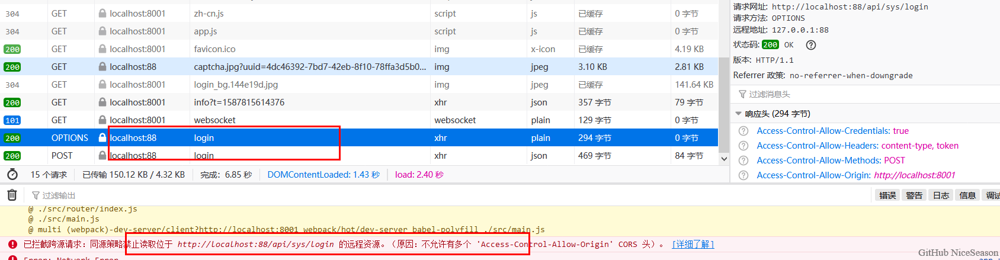

http://localhost:8001/renre已拦截跨源请求：同源策略禁止读取位于 http://localhost:88/api/sys/login 的远程资源。（原因：不允许有多个 'Access-Control-Allow-Origin' CORS 头）n-fast/captcha.jpg?uuid=69c79f02-d15b-478a-8465-a07fd09001e6

出现了多个请求，并且也存在多个跨源请求。

为了解决这个问题，需要修改renren-fast项目，注释掉“io.renren.config.CorsConfig”类。然后再次进行访问。


在显示分类信息的时候，出现了404异常，请求的http://localhost:88/api/product/category/list/tree不存在

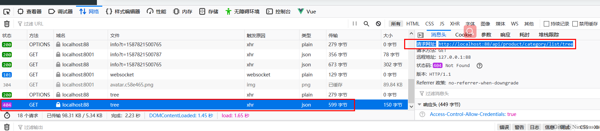

这是因为网关上所做的路径映射不正确，映射后的路径为http://localhost:8001/renren-fast/product/category/list/tree

但是只有通过http://localhost:10000/product/category/list/tree路径才能够正常访问，所以会报404异常。

解决方法就是定义一个product路由规则，进行路径重写：

```yaml
        - id: product_route
          uri: lb://gulimall-product
          predicates:
            - Path=/api/product/**
          filters:
            - RewritePath=/api/(?<segment>/?.*),/$\{segment}
```

在路由规则的顺序上，将精确的路由规则放置到模糊的路由规则的前面，否则的话，精确的路由规则将不会被匹配到，类似于异常体系中try catch子句中异常的处理顺序。


## 15. 删除数据

添加delete和append标识，并且增加复选框

```vue
 <el-tree
    :data="menus"
    show-checkbox  //显示复选框
    :props="defaultProps"  
    :expand-on-click-node="false" //设置节点点击时不展开
    node-key="catId"   
  >
    <span class="custom-tree-node" slot-scope="{ node, data }">
      <span>{{ node.label }}</span>
      <span>
        <el-button v-if="node.level <= 2" type="text" size="mini" @click="() => append(data)">Append</el-button>
        <el-button
          v-if="node.childNodes.length == 0"
          type="text"
          size="mini"
          @click="() => remove(node, data)"
        >Delete</el-button>
      </span>
    </span>
  </el-tree>
```


测试删除数据，打开postman输入“ http://localhost:88/api/product/category/delete ”，请求方式设置为POST，为了比对效果，可以在删除之前查询数据库的pms_category表：


由于delete请求接收的是一个数组，所以这里使用JSON方式，传入了一个数组：


再次查询数据库能够看到cat_id为1000的数据已经被删除了。


修改“com.bigdata.gulimall.product.controller.CategoryController”类，添加如下代码：

```java
 @RequestMapping("/delete")
    public R delete(@RequestBody Long[] catIds){
        //删除之前需要判断待删除的菜单那是否被别的地方所引用。
//		categoryService.removeByIds(Arrays.asList(catIds));

        categoryService.removeMenuByIds(Arrays.asList(catIds));
        return R.ok();
    }
```


com.bigdata.gulimall.product.service.impl.CategoryServiceImpl

```java
    @Override
    public   void removeMenuByIds(List<Long> asList) {
        //TODO 检查当前的菜单是否被别的地方所引用
        categoryDao.deleteBatchIds(asList);
    }
```


然而多数时候，我们并不希望删除数据，而是标记它被删除了，这就是逻辑删除；

可以设置show_status为0，标记它已经被删除。

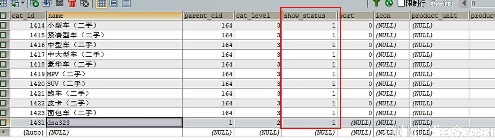

mybatis-plus的逻辑删除：

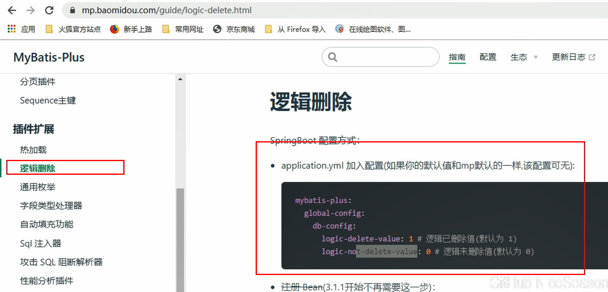

配置全局的逻辑删除规则，在“src/main/resources/application.yml”文件中添加如下内容：

```yaml
mybatis-plus:
  global-config:
    db-config:
      id-type: auto
      logic-delete-value: 1
      logic-not-delete-value: 0
```

修改“com.bigdata.gulimall.product.entity.CategoryEntity”类，添加上@TableLogic，表明使用逻辑删除：

```java
	/**
	 * 是否显示[0-不显示，1显示]
	 */
	@TableLogic(value = "1",delval = "0")
	private Integer showStatus;
```

然后在POSTMan中测试一下是否能够满足需要。另外在“src/main/resources/application.yml”文件中，设置日志级别，打印出SQL语句：

```yaml
logging:
  level:
    com.bigdata.gulimall.product: debug
```

打印的日志：

```verilog
 ==>  Preparing: UPDATE pms_category SET show_status=0 WHERE cat_id IN ( ? ) AND show_status=1 
 ==> Parameters: 1431(Long)
 <==    Updates: 1
 get changedGroupKeys:[]
```


## 16. 菜单拖动

|                                  |      |
| -------------------------------- | ---- |
| 同一个菜单内拖动                 | 正常 |
| 拖动到父菜单的前面或后面         | 正常 |
| 拖动到父菜单同级的另外一个菜单中 | 正常 |
|                                  |      |


关注的焦点在于，拖动到目标节点中，使得目标节点的catlevel+deep小于3即可。拖动到目标节点前后的条件是，使得


###    拖动菜单时需要修改顺序和级别         

需要考虑两种类型节点的catLevel

一种关系是：如果是同一个节点下的子节点的前后移动，则不需要修改其catLevel

如果是拖动到另外一个节点内或父节点中，则要考虑修改其catLevel

如果拖动到与父节点平级的节点关系中，则要将该拖动的节点的catLevel，设置为兄弟节点的Level，


先考虑parentCid还是先考虑catLevel?

两种关系在耦合

另外还有一种是前后拖动的情况

哪个范围最大？


肯定是拖动类型关系最大，


如果是前后拖动，则拖动后需要看待拖动节点的层级和设置待拖动节点的parentId，

​       如果待拖动节点和目标节点的层级相同，则认为是同级拖动，只需要修改节点的先后顺序即可；

​       否则认为是跨级拖动，则需要修改层级和重新设置parentID

​              如果

​      以拖动类型来分，并不合适，比较合适的是跨级拖动和同级拖动


如何判断是跨级拖动还是同级拖动，根据拖动的层级来看，如果是同一级的拖动，只需要修改先后顺序即可，但是这样也会存在一个问题，就是当拖动到另外一个分组下的同级目录中，显然也需要修改parentID，究竟什么样的模型最好呢？


  另外也可以判断在跨级移动时，跨级后的parentID是否相同，如果不相同，则认为是在不同目录下的跨级移动需要修改parentID。


顺序、catLevel和parentID

同级移动：

（1）首先判断待移动节点和目标节点的catLevel是否相同，

 （2）相同则认为是同级移动，

​          如果此时移动后目标节点的parentID和待移动节点的相同，但是移动类型是前后移动，只需要调整顺序即可，此时移动类型是inner，则需要修改catLevel和parentId和顺序

​         如果此时移动后目标节点的parentID和待移动节点的不相同，但是移动类型是前后移动，则需要调整顺序和parentId，此时移动类型是inner，则需要修改catLevel和parentId和顺序

通过这两步的操作能看到一些共性，如果抽取移动类型作为大的分类，则在这种分类下，

如果是前后移动，则分为下面几种情况：

​    同级别下的前后移动：界定标准为catLevel相同，但是又可以分为parentID相同和parentID不同，parent相同时，只需要修改顺序即可；parentID不同时，需要修改parentID和顺序

​    不同级别下的前后移动：界定标准为catLevel不同，此时无论如何都要修改parentID，顺序和catLevel

如果是inner类型移动，则分为一下的几种情况。

​     此时不论是同级inner，还是跨级innner，都需要修改parentID，顺序和catLevel

 

哪种情况需要更新子节点呢？

那就要看要拖拽的节点是否含有子节点，如果有子节点，则需要更新子节点的catLevel，不需要更新它之间的顺序和parentId，只需要更新catLevel即可。这种更新子节点的Level应该归类，目前的目标是只要有子节点就更新它的catLevel，


（2）如果待移动节点和目标节点的catLevel不同，则认为是跨级移动。如果是移动到父节点中，则需要设置catLevel，parentID和顺序。此时需要分两种情况来考虑，如果是移动到父节点中，则需要设置catLevel，parentID和顺序，如果是移动到兄弟节点中，则需要设置

包含移动到父节点同级目录，兄弟节点中。


### 设置菜单拖动开关

```vue
 <el-switch v-model="draggable" active-text="开启拖拽" inactive-text="关闭拖拽"></el-switch>
```


但是现在存在的一个问题是每次拖拽的时候，都会发送请求，更新数据库这样频繁的与数据库交互，现在想要实现一个拖拽过程中不更新数据库，拖拽完成后，统一提交拖拽后的数据。


现在还存在一个问题，如果是将一个菜单连续的拖拽，最终还放到了原来的位置，但是updateNode中却出现了很多节点更新信息，这样显然也是一个问题。

### 批量删除

```vue
  <el-button type="danger" plain size="small" @click="batchDelete">批量删除</el-button>
```


```javascript
 //批量删除
    batchDelete() {
      let checkNodes = this.$refs.menuTree.getCheckedNodes();

      //  console.log("被选中的节点：",checkNodes);

      let catIds = [];
      for (let i = 0; i < checkNodes.length; i++) {
        catIds.push(checkNodes[i].catId);
      }

      this.$confirm(`确定要删除?`, "提示", {
        confirmButtonText: "确定",
        cancelButtonText: "取消",
        type: "warning"
      })
        .then(() => {
          this.$http({
            url: this.$http.adornUrl("/product/category/delete"),
            method: "post",
            data: this.$http.adornData(catIds, false)
          }).then(({ data }) => {
            this.$message({
              message: "菜单批量删除成功",
              type: "success"
            });

            //重新刷新页面
            this.getMeus();
          });


        })
        .catch(() => {
          //取消删除
        });
    },
```


## 17. 品牌管理菜单

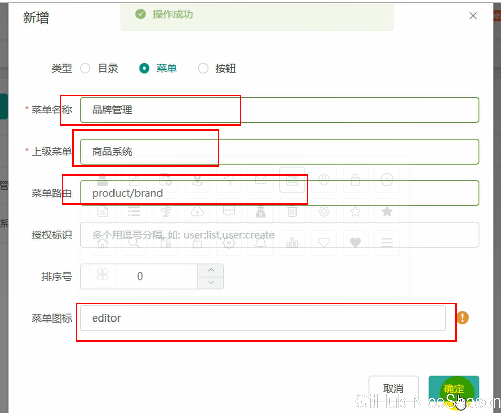


（2）将“”逆向工程得到的resources\src\views\modules\product文件拷贝到gulimall/renren-fast-vue/src/views/modules/product目录下，也就是下面的两个文件

brand.vue  brand-add-or-update.vue

但是显示的页面没有新增和删除功能，这是因为权限控制的原因，

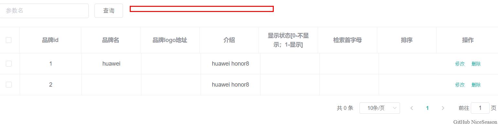

```vue
<el-button v-if="isAuth('product:brand:save')" type="primary" @click="addOrUpdateHandle()">新增</el-button>
<el-button v-if="isAuth('product:brand:delete')" type="danger" @click="deleteHandle()" :disabled="dataListSelections.length <= 0">批量删除</el-button>
      
```

查看“isAuth”的定义位置：

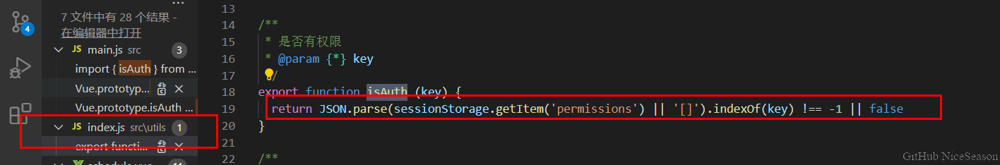

它是在“index.js”中定义，现在将它设置为返回值为true，即可显示添加和删除功能。

再次刷新页面能够看到，按钮已经出现了：

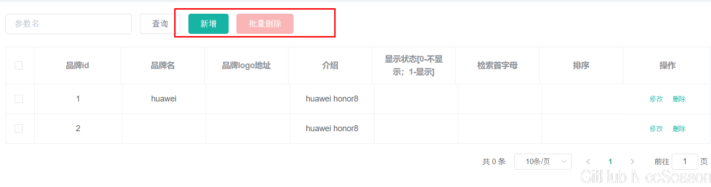


### 添加“显示状态按钮”

brand.vue

```vue
<template slot-scope="scope">
  <el-switch
    v-model="scope.row.showStatus"
    active-color="#13ce66"
    inactive-color="#ff4949"
    @change="updateBrandStatus(scope.row)"
    :active-value = "1"
    :inactive-value	= "0"
  ></el-switch>
</template>
```

brand-add-or-update.vue

```vue
 <el-form-item label="显示状态" prop="showStatus">
    <el-switch v-model="dataForm.showStatus" active-color="#13ce66" inactive-color="#ff4949"></el-switch>
 </el-form-item>
```

```javascript
//更新开关的状态
    updateBrandStatus(data) {
      console.log("最新状态", data);
      let {brandId,showStatus} = data;
      this.$http({
        url: this.$http.adornUrl("/product/brand/update"),
        method: "post",
        data: this.$http.adornData({brandId,showStatus}, false)
      }).then(({ data }) => {

        this.$message({
          message: "状态更新成功",
          type: "success"
        });

      });
    },
```


### 添加上传

和传统的单体应用不同，这里我们选择将数据上传到分布式文件服务器上。

这里我们选择将图片放置到阿里云上，使用对象存储。

阿里云上使使用对象存储方式：

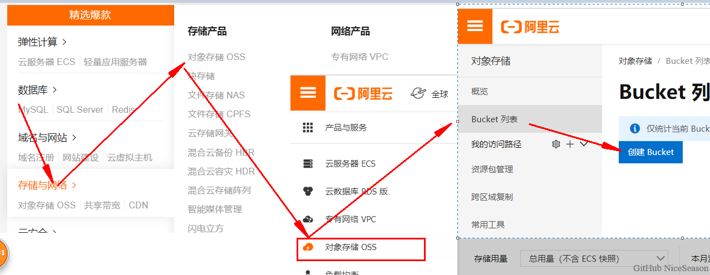


创建Bucket

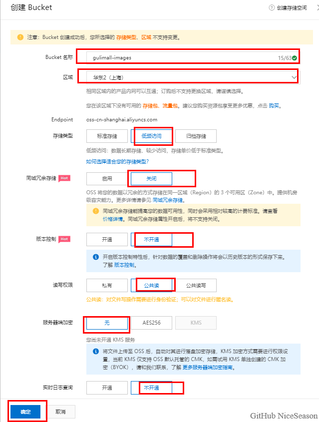

 

上传文件：

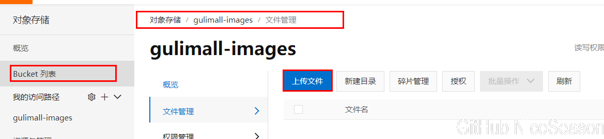

上传成功后，取得图片的URL

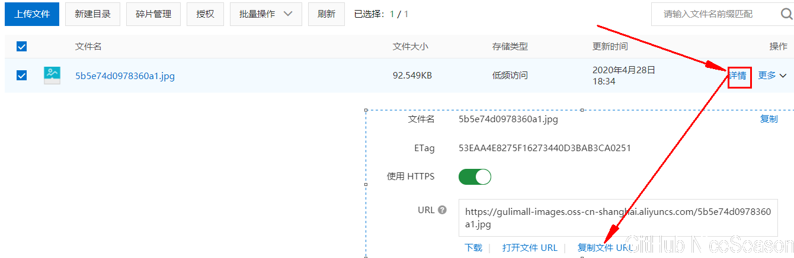

这种方式是手动上传图片，实际上我们可以在程序中设置自动上传图片到阿里云对象存储。

上传模型：

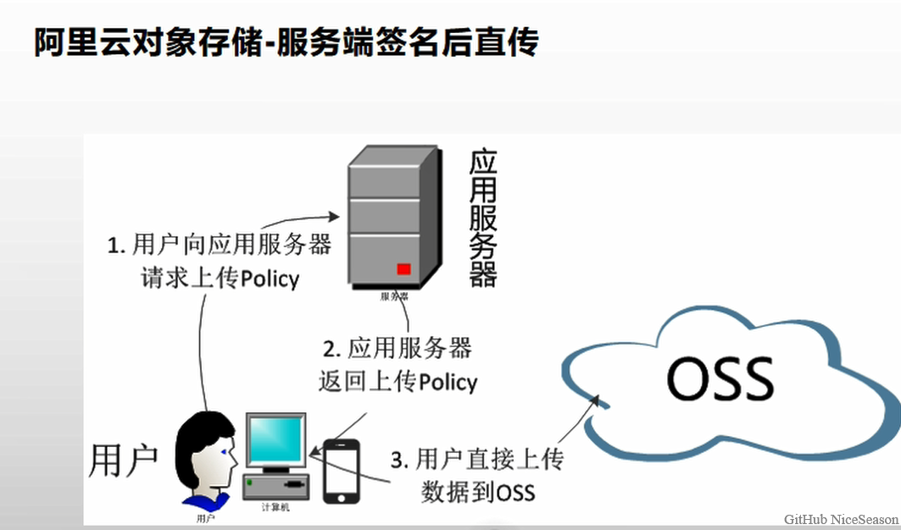


查看阿里云关于文件上传的帮助： https://help.aliyun.com/document_detail/32009.html?spm=a2c4g.11186623.6.768.549d59aaWuZMGJ 

#### 1）添加依赖包

在Maven项目中加入依赖项（推荐方式）

在 Maven 工程中使用 OSS Java SDK，只需在 pom.xml 中加入相应依赖即可。以 3.8.0 版本为例，在 <dependencies> 内加入如下内容：

```xml
<dependency>
    <groupId>com.aliyun.oss</groupId>
    <artifactId>aliyun-sdk-oss</artifactId>
    <version>3.8.0</version>
</dependency>
```

#### 2）上传文件流

以下代码用于上传文件流：

```java
// Endpoint以杭州为例，其它Region请按实际情况填写。
String endpoint = "http://oss-cn-hangzhou.aliyuncs.com";
// 云账号AccessKey有所有API访问权限，建议遵循阿里云安全最佳实践，创建并使用RAM子账号进行API访问或日常运维，请登录 https://ram.console.aliyun.com 创建。
String accessKeyId = "<yourAccessKeyId>";
String accessKeySecret = "<yourAccessKeySecret>";

// 创建OSSClient实例。
OSS ossClient = new OSSClientBuilder().build(endpoint, accessKeyId, accessKeySecret);

// 上传文件流。
InputStream inputStream = new FileInputStream("<yourlocalFile>");
ossClient.putObject("<yourBucketName>", "<yourObjectName>", inputStream);

// 关闭OSSClient。
ossClient.shutdown();
```

endpoint的取值：

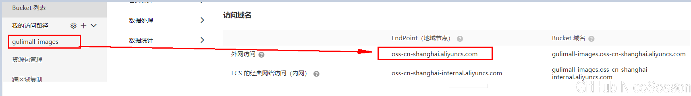


accessKeyId和accessKeySecret需要创建一个RAM账号：

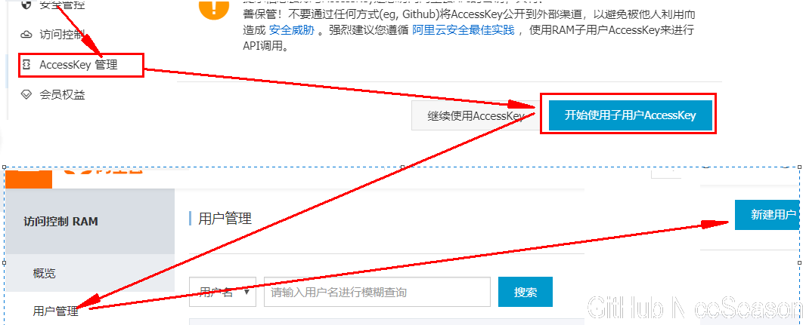

创建用户完毕后，会得到一个“AccessKey ID”和“AccessKeySecret”，然后复制这两个值到代码的“AccessKey ID”和“AccessKeySecret”。

另外还需要添加访问控制权限：

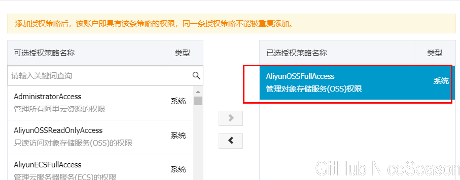


```java
@Test
    public void testUpload() throws FileNotFoundException {
        // Endpoint以杭州为例，其它Region请按实际情况填写。
        String endpoint = "oss-cn-shanghai.aliyuncs.com";
        // 云账号AccessKey有所有API访问权限，建议遵循阿里云安全最佳实践，创建并使用RAM子账号进行API访问或日常运维，请登录 https://ram.console.aliyun.com 创建。
        String accessKeyId = "LTAI4G4W1RA4JXz2QhoDwHhi";
        String accessKeySecret = "R99lmDOJumF2x43ZBKT259Qpe70Oxw";

        // 创建OSSClient实例。
        OSS ossClient = new OSSClientBuilder().build(endpoint, accessKeyId, accessKeySecret);

        // 上传文件流。
        InputStream inputStream = new FileInputStream("C:\\Users\\Administrator\\Pictures\\timg.jpg");
        ossClient.putObject("gulimall-images", "time.jpg", inputStream);

        // 关闭OSSClient。
        ossClient.shutdown();
        System.out.println("上传成功.");
    }
```


更为简单的使用方式，是使用SpringCloud Alibaba


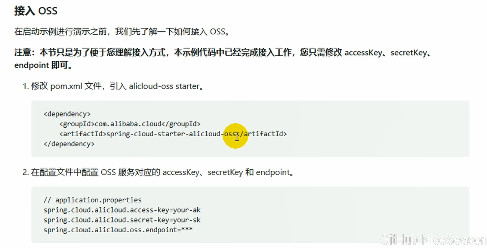

详细使用方法，见： https://help.aliyun.com/knowledge_detail/108650.html  

（1）添加依赖

```xml
        <dependency>
            <groupId>com.alibaba.cloud</groupId>
            <artifactId>spring-cloud-starter-alicloud-oss</artifactId>
            <version>2.2.0.RELEASE</version>
        </dependency>
```

（2）创建“AccessKey ID”和“AccessKeySecret”


（3）配置key，secret和endpoint相关信息

```yaml
      access-key: LTAI4G4W1RA4JXz2QhoDwHhi
      secret-key: R99lmDOJumF2x43ZBKT259Qpe70Oxw
      oss:
        endpoint: oss-cn-shanghai.aliyuncs.com
```


（4）注入OSSClient并进行文件上传下载等操作

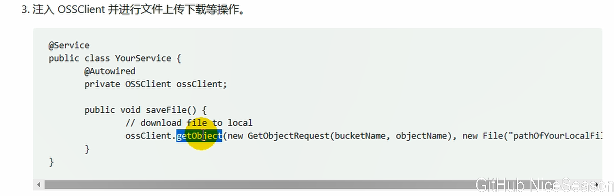


但是这样来做还是比较麻烦，如果以后的上传任务都交给gulimall-product来完成，显然耦合度高。最好单独新建一个Module来完成文件上传任务。

### 其他方式


#### 1）新建gulimall-third-party

#### 2）添加依赖，将原来gulimall-common中的“spring-cloud-starter-alicloud-oss”依赖移动到该项目中

```xml
        <dependency>
            <groupId>com.alibaba.cloud</groupId>
            <artifactId>spring-cloud-starter-alicloud-oss</artifactId>
            <version>2.2.0.RELEASE</version>
        </dependency>

        <dependency>
            <groupId>com.bigdata.gulimall</groupId>
            <artifactId>gulimall-common</artifactId>
            <version>1.0-SNAPSHOT</version>
            <exclusions>
                <exclusion>
                    <groupId>com.baomidou</groupId>
                    <artifactId>mybatis-plus-boot-starter</artifactId>
                </exclusion>
            </exclusions>
        </dependency>
```

 另外也需要在“pom.xml”文件中，添加如下的依赖管理

```xml
<dependencyManagement>

        <dependencies>
            <dependency>
                <groupId>org.springframework.cloud</groupId>
                <artifactId>spring-cloud-dependencies</artifactId>
                <version>${spring-cloud.version}</version>
                <type>pom</type>
                <scope>import</scope>
            </dependency>
            <dependency>
                <groupId>com.alibaba.cloud</groupId>
                <artifactId>spring-cloud-alibaba-dependencies</artifactId>
                <version>2.2.1.RELEASE</version>
                <type>pom</type>
                <scope>import</scope>
            </dependency>
        </dependencies>
    </dependencyManagement>
```

#### 3）在主启动类中开启服务的注册和发现

```java
@EnableDiscoveryClient
```


#### 4）在nacos中注册

（1）创建命名空间“ gulimall-third-party ”

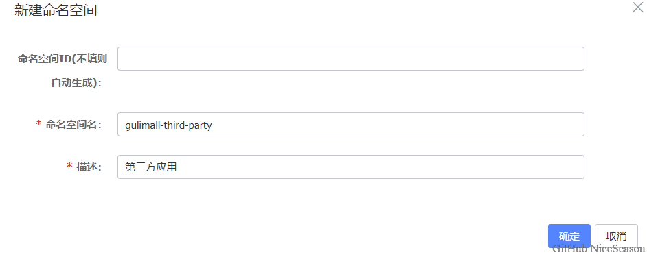

（2）在“ gulimall-third-party”命名空间中，创建“ gulimall-third-party.yml”文件

```yaml
spring:
  cloud:
    alicloud:
      access-key: LTAI4G4W1RA4JXz2QhoDwHhi
      secret-key: R99lmDOJumF2x43ZBKT259Qpe70Oxw
      oss:
        endpoint: oss-cn-shanghai.aliyuncs.com
```


#### 5）编写配置文件

application.yml

```yaml
server:
  port: 30000

spring:
  application:
    name: gulimall-third-party
  cloud:
    nacos:
      discovery:
        server-addr: 192.168.137.14:8848

logging:
  level:
    com.bigdata.gulimall.product: debug

```


bootstrap.properties

```properties
spring.cloud.nacos.config.name=gulimall-third-party
spring.cloud.nacos.config.server-addr=192.168.137.14:8848
spring.cloud.nacos.config.namespace=f995d8ee-c53a-4d29-8316-a1ef54775e00
spring.cloud.nacos.config.extension-configs[0].data-id=gulimall-third-party.yml
spring.cloud.nacos.config.extension-configs[0].group=DEFAULT_GROUP
spring.cloud.nacos.config.extension-configs[0].refresh=true
```


#### 6） 编写测试类

```java
package com.bigdata.gulimall.thirdparty;

import com.aliyun.oss.OSS;
import com.aliyun.oss.OSSClient;
import com.aliyun.oss.OSSClientBuilder;
import org.junit.jupiter.api.Test;
import org.springframework.beans.factory.annotation.Autowired;
import org.springframework.boot.test.context.SpringBootTest;

import java.io.FileInputStream;
import java.io.FileNotFoundException;
import java.io.InputStream;

@SpringBootTest
class GulimallThirdPartyApplicationTests {


    @Autowired
    OSSClient ossClient;

    @Test
    public void testUpload() throws FileNotFoundException {
        // Endpoint以杭州为例，其它Region请按实际情况填写。
        String endpoint = "oss-cn-shanghai.aliyuncs.com";
        // 云账号AccessKey有所有API访问权限，建议遵循阿里云安全最佳实践，创建并使用RAM子账号进行API访问或日常运维，请登录 https://ram.console.aliyun.com 创建。
        String accessKeyId = "LTAI4G4W1RA4JXz2QhoDwHhi";
        String accessKeySecret = "R99lmDOJumF2x43ZBKT259Qpe70Oxw";

        // 创建OSSClient实例。
        OSS ossClient = new OSSClientBuilder().build(endpoint, accessKeyId, accessKeySecret);

         //上传文件流。
        InputStream inputStream = new FileInputStream("C:\\Users\\Administrator\\Pictures\\timg.jpg");
        ossClient.putObject("gulimall-images", "time3.jpg", inputStream);

        // 关闭OSSClient。
        ossClient.shutdown();
        System.out.println("上传成功.");
    }

}

```


 https://help.aliyun.com/document_detail/31926.html?spm=a2c4g.11186623.6.1527.228d74b8V6IZuT 

**背景**

采用JavaScript客户端直接签名（参见[JavaScript客户端签名直传](https://help.aliyun.com/document_detail/31925.html#concept-frd-4gy-5db)）时，AccessKeyID和AcessKeySecret会暴露在前端页面，因此存在严重的安全隐患。因此，OSS提供了服务端签名后直传的方案。

**原理介绍**

[](http://static-aliyun-doc.oss-cn-hangzhou.aliyuncs.com/assets/img/6875011751/p1472.png)

服务端签名后直传的原理如下：

1. 用户发送上传Policy请求到应用服务器。
2. 应用服务器返回上传Policy和签名给用户。
3. 用户直接上传数据到OSS。

编写“com.bigdata.gulimall.thirdparty.controller.OssController”类：

```java
package com.bigdata.gulimall.thirdparty.controller;

import com.aliyun.oss.OSS;
import com.aliyun.oss.common.utils.BinaryUtil;
import com.aliyun.oss.model.MatchMode;
import com.aliyun.oss.model.PolicyConditions;
import org.springframework.beans.factory.annotation.Autowired;
import org.springframework.beans.factory.annotation.Value;
import org.springframework.web.bind.annotation.RequestMapping;
import org.springframework.web.bind.annotation.RestController;

import java.text.SimpleDateFormat;
import java.util.Date;
import java.util.LinkedHashMap;
import java.util.Map;

@RestController
public class OssController {

    @Autowired
    OSS ossClient;
    @Value ("${spring.cloud.alicloud.oss.endpoint}")
    String endpoint ;

    @Value("${spring.cloud.alicloud.oss.bucket}")
    String bucket ;

    @Value("${spring.cloud.alicloud.access-key}")
    String accessId ;
    @Value("${spring.cloud.alicloud.secret-key}")
    String accessKey ;
    @RequestMapping("/oss/policy")
    public Map<String, String> policy(){

        String host = "https://" + bucket + "." + endpoint; // host的格式为 bucketname.endpoint

        String format = new SimpleDateFormat("yyyy-MM-dd").format(new Date());
        String dir = format; // 用户上传文件时指定的前缀。

        Map<String, String> respMap=null;
        try {
            long expireTime = 30;
            long expireEndTime = System.currentTimeMillis() + expireTime * 1000;
            Date expiration = new Date(expireEndTime);
            PolicyConditions policyConds = new PolicyConditions();
            policyConds.addConditionItem(PolicyConditions.COND_CONTENT_LENGTH_RANGE, 0, 1048576000);
            policyConds.addConditionItem(MatchMode.StartWith, PolicyConditions.COND_KEY, dir);

            String postPolicy = ossClient.generatePostPolicy(expiration, policyConds);
            byte[] binaryData = postPolicy.getBytes("utf-8");
            String encodedPolicy = BinaryUtil.toBase64String(binaryData);
            String postSignature = ossClient.calculatePostSignature(postPolicy);

            respMap= new LinkedHashMap<String, String>();
            respMap.put("accessid", accessId);
            respMap.put("policy", encodedPolicy);
            respMap.put("signature", postSignature);
            respMap.put("dir", dir);
            respMap.put("host", host);
            respMap.put("expire", String.valueOf(expireEndTime / 1000));

        } catch (Exception e) {
            // Assert.fail(e.getMessage());
            System.out.println(e.getMessage());
        } finally {
            ossClient.shutdown();
        }
        return respMap;
    }
}
```


测试： http://localhost:30000/oss/policy 

```
{"accessid":"LTAI4G4W1RA4JXz2QhoDwHhi","policy":"eyJleHBpcmF0aW9uIjoiMjAyMC0wNC0yOVQwMjo1ODowNy41NzhaIiwiY29uZGl0aW9ucyI6W1siY29udGVudC1sZW5ndGgtcmFuZ2UiLDAsMTA0ODU3NjAwMF0sWyJzdGFydHMtd2l0aCIsIiRrZXkiLCIyMDIwLTA0LTI5LyJdXX0=","signature":"s42iRxtxGFmHyG40StM3d9vOfFk=","dir":"2020-04-29/","host":"https://gulimall-images.oss-cn-shanghai.aliyuncs.com","expire":"1588129087"}
```


以后在上传文件时的访问路径为“ http://localhost:88/api/thirdparty/oss/policy”，

在“gulimall-gateway”中配置路由规则：

```yaml
        - id: third_party_route
          uri: lb://gulimall-gateway
          predicates:
            - Path=/api/thirdparty/**
          filters:
            - RewritePath=/api/thirdparty/(?<segment>/?.*),/$\{segment}
```


测试是否能够正常跳转： http://localhost:88/api/thirdparty/oss/policy 

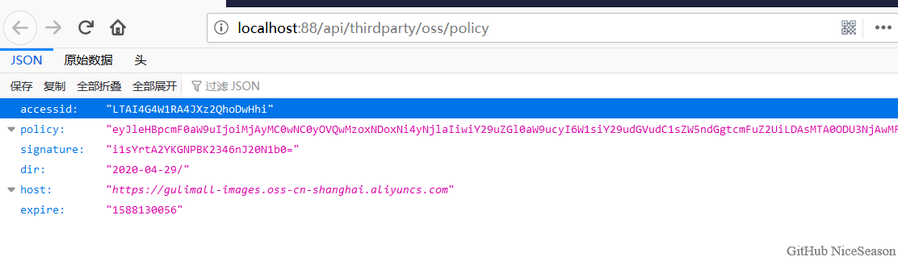


### 上传组件

放置项目提供的upload文件夹到components目录下，一个是单文件上传，另外一个是多文件上传

```shell
PS D:\Project\gulimall\renren-fast-vue\src\components\upload> ls


    目录: D:\Project\gulimall\renren-fast-vue\src\components\upload


Mode                LastWriteTime         Length Name
----                -------------         ------ ----
-a----  2020/4/29 星期三     12:0           3122 multiUpload.vue
                                2
-a----  2019/11/11 星期一     21:            343 policy.js
                               20
-a----  2020/4/29 星期三     12:0           3053 singleUpload.vue
                                1


PS D:\Project\gulimall\renren-fast-vue\src\components\upload>
```


修改这两个文件的配置后

开始执行上传，但是在上传过程中，出现了如下的问题：

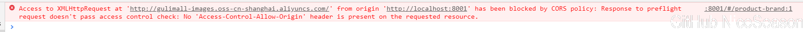

```
Access to XMLHttpRequest at 'http://gulimall-images.oss-cn-shanghai.aliyuncs.com/' from origin 'http://localhost:8001' has been blocked by CORS policy: Response to preflight request doesn't pass access control check: No 'Access-Control-Allow-Origin' header is present on the requested resource.
```

这又是一个跨域的问题，解决方法就是在阿里云上开启跨域访问：

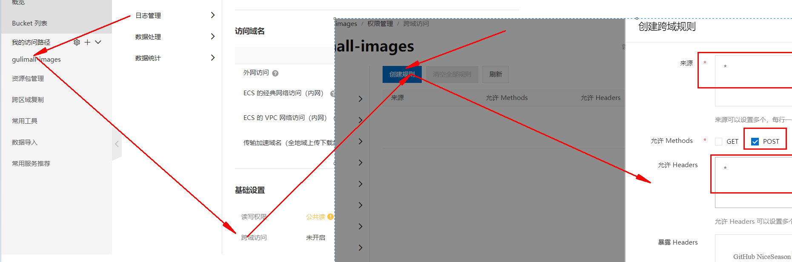

再次执行文件上传。

## 18. JSR303校验

### 步骤1：使用校验注解

在Java中提供了一系列的校验方式，它这些校验方式在“javax.validation.constraints”包中，提供了如@Email，@NotNull等注解。

在非空处理方式上提供了@NotNull，@Blank和@

（1）@NotNull

The annotated element must not be null. Accepts any type.
注解元素禁止为null，能够接收任何类型


（2）@NotEmpty

the annotated element must not be null nor empty.

该注解修饰的字段不能为null或""

Supported types are:

支持以下几种类型

CharSequence (length of character sequence is evaluated)

字符序列（字符序列长度的计算）

Collection (collection size is evaluated)
集合长度的计算

Map (map size is evaluated)
map长度的计算

Array (array length is evaluated)
数组长度的计算

（3）@NotBlank

The annotated element must not be null and must contain at least one non-whitespace character. Accepts CharSequence.
该注解不能为null，并且至少包含一个非空白字符。接收字符序列。


### 步骤2：在请求方法种，使用校验注解@Valid，开启校验，

```java
    @RequestMapping("/save")
    public R save(@Valid @RequestBody BrandEntity brand){
		brandService.save(brand);

        return R.ok();
    }
```


测试： http://localhost:88/api/product/brand/save 

在postman种发送上面的请求

```json
{
    "timestamp": "2020-04-29T09:20:46.383+0000",
    "status": 400,
    "error": "Bad Request",
    "errors": [
        {
            "codes": [
                "NotBlank.brandEntity.name",
                "NotBlank.name",
                "NotBlank.java.lang.String",
                "NotBlank"
            ],
            "arguments": [
                {
                    "codes": [
                        "brandEntity.name",
                        "name"
                    ],
                    "arguments": null,
                    "defaultMessage": "name",
                    "code": "name"
                }
            ],
            "defaultMessage": "不能为空",
            "objectName": "brandEntity",
            "field": "name",
            "rejectedValue": "",
            "bindingFailure": false,
            "code": "NotBlank"
        }
    ],
    "message": "Validation failed for object='brandEntity'. Error count: 1",
    "path": "/product/brand/save"
}
```

能够看到"defaultMessage": "不能为空"，这些错误消息定义在“hibernate-validator”的“\org\hibernate\validator\ValidationMessages_zh_CN.properties”文件中。在该文件中定义了很多的错误规则：

```properties
javax.validation.constraints.AssertFalse.message     = 只能为false
javax.validation.constraints.AssertTrue.message      = 只能为true
javax.validation.constraints.DecimalMax.message      = 必须小于或等于{value}
javax.validation.constraints.DecimalMin.message      = 必须大于或等于{value}
javax.validation.constraints.Digits.message          = 数字的值超出了允许范围(只允许在{integer}位整数和{fraction}位小数范围内)
javax.validation.constraints.Email.message           = 不是一个合法的电子邮件地址
javax.validation.constraints.Future.message          = 需要是一个将来的时间
javax.validation.constraints.FutureOrPresent.message = 需要是一个将来或现在的时间
javax.validation.constraints.Max.message             = 最大不能超过{value}
javax.validation.constraints.Min.message             = 最小不能小于{value}
javax.validation.constraints.Negative.message        = 必须是负数
javax.validation.constraints.NegativeOrZero.message  = 必须是负数或零
javax.validation.constraints.NotBlank.message        = 不能为空
javax.validation.constraints.NotEmpty.message        = 不能为空
javax.validation.constraints.NotNull.message         = 不能为null
javax.validation.constraints.Null.message            = 必须为null
javax.validation.constraints.Past.message            = 需要是一个过去的时间
javax.validation.constraints.PastOrPresent.message   = 需要是一个过去或现在的时间
javax.validation.constraints.Pattern.message         = 需要匹配正则表达式"{regexp}"
javax.validation.constraints.Positive.message        = 必须是正数
javax.validation.constraints.PositiveOrZero.message  = 必须是正数或零
javax.validation.constraints.Size.message            = 个数必须在{min}和{max}之间

org.hibernate.validator.constraints.CreditCardNumber.message        = 不合法的信用卡号码
org.hibernate.validator.constraints.Currency.message                = 不合法的货币 (必须是{value}其中之一)
org.hibernate.validator.constraints.EAN.message                     = 不合法的{type}条形码
org.hibernate.validator.constraints.Email.message                   = 不是一个合法的电子邮件地址
org.hibernate.validator.constraints.Length.message                  = 长度需要在{min}和{max}之间
org.hibernate.validator.constraints.CodePointLength.message         = 长度需要在{min}和{max}之间
org.hibernate.validator.constraints.LuhnCheck.message               = ${validatedValue}的校验码不合法, Luhn模10校验和不匹配
org.hibernate.validator.constraints.Mod10Check.message              = ${validatedValue}的校验码不合法, 模10校验和不匹配
org.hibernate.validator.constraints.Mod11Check.message              = ${validatedValue}的校验码不合法, 模11校验和不匹配
org.hibernate.validator.constraints.ModCheck.message                = ${validatedValue}的校验码不合法, ${modType}校验和不匹配
org.hibernate.validator.constraints.NotBlank.message                = 不能为空
org.hibernate.validator.constraints.NotEmpty.message                = 不能为空
org.hibernate.validator.constraints.ParametersScriptAssert.message  = 执行脚本表达式"{script}"没有返回期望结果
org.hibernate.validator.constraints.Range.message                   = 需要在{min}和{max}之间
org.hibernate.validator.constraints.SafeHtml.message                = 可能有不安全的HTML内容
org.hibernate.validator.constraints.ScriptAssert.message            = 执行脚本表达式"{script}"没有返回期望结果
org.hibernate.validator.constraints.URL.message                     = 需要是一个合法的URL

org.hibernate.validator.constraints.time.DurationMax.message        = 必须小于${inclusive == true ? '或等于' : ''}${days == 0 ? '' : days += '天'}${hours == 0 ? '' : hours += '小时'}${minutes == 0 ? '' : minutes += '分钟'}${seconds == 0 ? '' : seconds += '秒'}${millis == 0 ? '' : millis += '毫秒'}${nanos == 0 ? '' : nanos += '纳秒'}
org.hibernate.validator.constraints.time.DurationMin.message        = 必须大于${inclusive == true ? '或等于' : ''}${days == 0 ? '' : days += '天'}${hours == 0 ? '' : hours += '小时'}${minutes == 0 ? '' : minutes += '分钟'}${seconds == 0 ? '' : seconds += '秒'}${millis == 0 ? '' : millis += '毫秒'}${nanos == 0 ? '' : nanos += '纳秒'}

```

 


想要自定义错误消息，可以覆盖默认的错误提示信息，如@NotBlank的默认message是

```java
public @interface NotBlank {

	String message() default "{javax.validation.constraints.NotBlank.message}";
```

可以在添加注解的时候，修改message：

```java
	@NotBlank(message = "品牌名必须非空")
	private String name;
```

当再次发送请求时，得到的错误提示信息：

```json
{
    "timestamp": "2020-04-29T09:36:04.125+0000",
    "status": 400,
    "error": "Bad Request",
    "errors": [
        {
            "codes": [
                "NotBlank.brandEntity.name",
                "NotBlank.name",
                "NotBlank.java.lang.String",
                "NotBlank"
            ],
            "arguments": [
                {
                    "codes": [
                        "brandEntity.name",
                        "name"
                    ],
                    "arguments": null,
                    "defaultMessage": "name",
                    "code": "name"
                }
            ],
            "defaultMessage": "品牌名必须非空",
            "objectName": "brandEntity",
            "field": "name",
            "rejectedValue": "",
            "bindingFailure": false,
            "code": "NotBlank"
        }
    ],
    "message": "Validation failed for object='brandEntity'. Error count: 1",
    "path": "/product/brand/save"
}
```


但是这种返回的错误结果并不符合我们的业务需要。

### 步骤3：给校验的Bean后，紧跟一个BindResult，就可以获取到校验的结果。拿到校验的结果，就可以自定义的封装。

```java
 @RequestMapping("/save")
    public R save(@Valid @RequestBody BrandEntity brand, BindingResult result){
        if( result.hasErrors()){
            Map<String,String> map=new HashMap<>();
            //1.获取错误的校验结果
            result.getFieldErrors().forEach((item)->{
                //获取发生错误时的message
                String message = item.getDefaultMessage();
                //获取发生错误的字段
                String field = item.getField();
                map.put(field,message);
            });
            return R.error(400,"提交的数据不合法").put("data",map);
        }else {

        }
		brandService.save(brand);

        return R.ok();
    }

```

这种是针对于该请求设置了一个内容校验，如果针对于每个请求都单独进行配置，显然不是太合适，实际上可以统一的对于异常进行处理。

### 步骤4：统一异常处理

可以使用SpringMvc所提供的@ControllerAdvice，通过“basePackages”能够说明处理哪些路径下的异常。

（1）抽取一个异常处理类

```java
package com.bigdata.gulimall.product.exception;

import com.bigdata.common.utils.R;
import lombok.extern.slf4j.Slf4j;
import org.springframework.validation.BindingResult;
import org.springframework.web.bind.MethodArgumentNotValidException;
import org.springframework.web.bind.annotation.ControllerAdvice;
import org.springframework.web.bind.annotation.ExceptionHandler;
import org.springframework.web.bind.annotation.ResponseBody;
import org.springframework.web.bind.annotation.RestControllerAdvice;

import java.util.HashMap;
import java.util.Map;

/**
 * 集中处理所有异常
 */
@Slf4j
@RestControllerAdvice(basePackages = "com.bigdata.gulimall.product.controller")
public class GulimallExceptionAdvice {


    @ExceptionHandler(value = Exception.class)
    public R handleValidException(MethodArgumentNotValidException exception){
        Map<String,String> map=new HashMap<>();
        BindingResult bindingResult = exception.getBindingResult();
        bindingResult.getFieldErrors().forEach(fieldError -> {
            String message = fieldError.getDefaultMessage();
            String field = fieldError.getField();
            map.put(field,message);
        });

        log.error("数据校验出现问题{},异常类型{}",exception.getMessage(),exception.getClass());
        return R.error(400,"数据校验出现问题").put("data",map);
    }

}

```

（2）测试： http://localhost:88/api/product/brand/save 

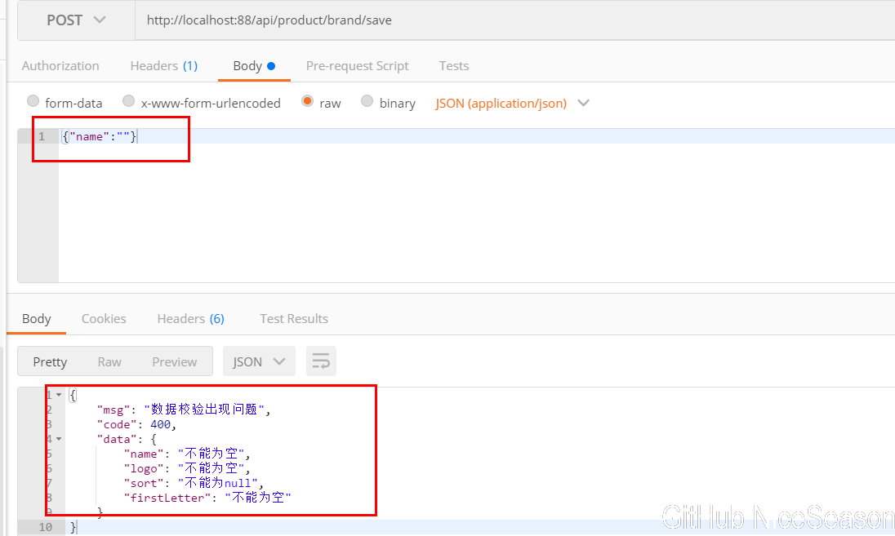


（3）默认异常处理

```java
   @ExceptionHandler(value = Throwable.class)
    public R handleException(Throwable throwable){
        log.error("未知异常{},异常类型{}",throwable.getMessage(),throwable.getClass());
        return R.error(BizCodeEnum.UNKNOW_EXEPTION.getCode(),BizCodeEnum.UNKNOW_EXEPTION.getMsg());
    }
```

（4）错误状态码

上面代码中，针对于错误状态码，是我们进行随意定义的，然而正规开发过程中，错误状态码有着严格的定义规则，如该在项目中我们的错误状态码定义

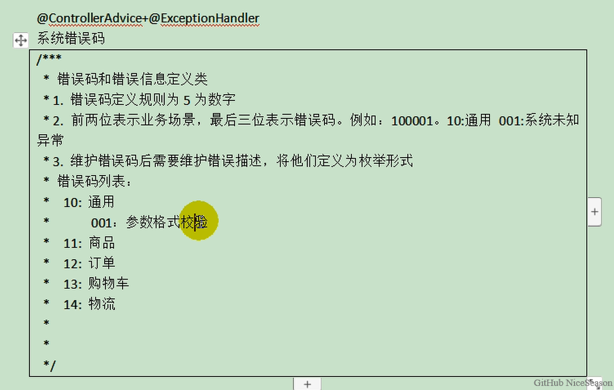


为了定义这些错误状态码，我们可以单独定义一个常量类，用来存储这些错误状态码

```java
package com.bigdata.common.exception;

/***
 * 错误码和错误信息定义类
 * 1. 错误码定义规则为5为数字
 * 2. 前两位表示业务场景，最后三位表示错误码。例如：100001。10:通用 001:系统未知异常
 * 3. 维护错误码后需要维护错误描述，将他们定义为枚举形式
 * 错误码列表：
 *  10: 通用
 *      001：参数格式校验
 *  11: 商品
 *  12: 订单
 *  13: 购物车
 *  14: 物流
 */
public enum BizCodeEnum {

    UNKNOW_EXEPTION(10000,"系统未知异常"),

    VALID_EXCEPTION( 10001,"参数格式校验失败");

    private int code;
    private String msg;

    BizCodeEnum(int code, String msg) {
        this.code = code;
        this.msg = msg;
    }

    public int getCode() {
        return code;
    }

    public String getMsg() {
        return msg;
    }
}

```

（5）测试： http://localhost:88/api/product/brand/save 

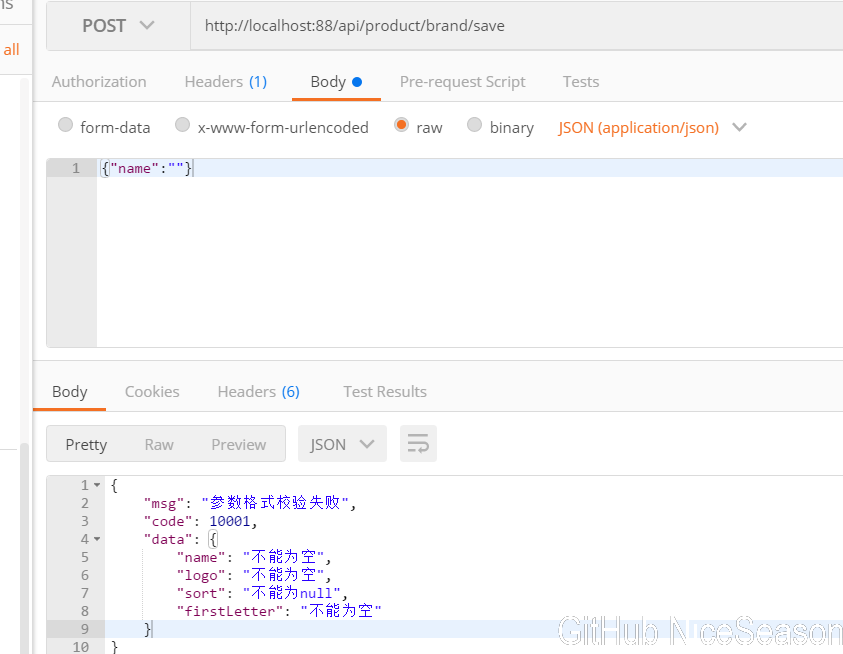

## 19. 分组校验功能（完成多场景的复杂校验）

### 1、给校验注解，标注上groups，指定什么情况下才需要进行校验

如：指定在更新和添加的时候，都需要进行校验

```java
	@NotEmpty
	@NotBlank(message = "品牌名必须非空",groups = {UpdateGroup.class,AddGroup.class})
	private String name;
```

在这种情况下，没有指定分组的校验注解，默认是不起作用的。想要起作用就必须要加groups。

### 2、业务方法参数上使用@Validated注解

@Validated的value方法：

Specify one or more validation groups to apply to the validation step kicked off by this annotation.
 指定一个或多个验证组以应用于此注释启动的验证步骤。 

JSR-303 defines validation groups as custom annotations which an application declares for the sole purpose of using 
them as type-safe group arguments, as implemented in SpringValidatorAdapter.

 JSR-303 将验证组定义为自定义注释，应用程序声明的唯一目的是将它们用作类型安全组参数，如 SpringValidatorAdapter 中实现的那样。 

Other SmartValidator implementations may support class arguments in other ways as well.

 其他SmartValidator 实现也可以以其他方式支持类参数。 

### 3、默认情况下，在分组校验情况下，没有指定指定分组的校验注解，将不会生效，它只会在不分组的情况下生效。


## 20. 自定义校验功能

### 1、编写一个自定义的校验注解

```java

@Documented
@Constraint(validatedBy = { ListValueConstraintValidator.class})
@Target({ METHOD, FIELD, ANNOTATION_TYPE, CONSTRUCTOR, PARAMETER, TYPE_USE })
@Retention(RUNTIME)
public @interface ListValue {
    String message() default "{com.bigdata.common.valid.ListValue.message}";

    Class<?>[] groups() default { };

    Class<? extends Payload>[] payload() default { };

    int[] value() default {};
}
```


### 2、编写一个自定义的校验器

```java

public class ListValueConstraintValidator implements ConstraintValidator<ListValue,Integer> {
    private Set<Integer> set=new HashSet<>();
    @Override
    public void initialize(ListValue constraintAnnotation) {
        int[] value = constraintAnnotation.value();
        for (int i : value) {
            set.add(i);
        }

    }

    @Override
    public boolean isValid(Integer value, ConstraintValidatorContext context) {


        return  set.contains(value);
    }
}

```


### 3、关联自定义的校验器和自定义的校验注解

```java
@Constraint(validatedBy = { ListValueConstraintValidator.class})
```

### 4、使用实例

```java
	/**
	 * 显示状态[0-不显示；1-显示]
	 */
	@ListValue(value = {0,1},groups ={AddGroup.class})
	private Integer showStatus;
```

 

## 21. 商品SPU和SKU管理

重新执行“sys_menus.sql”


## 22. 点击子组件，父组件触发事件

现在想要实现点击菜单的左边，能够实现在右边展示数据

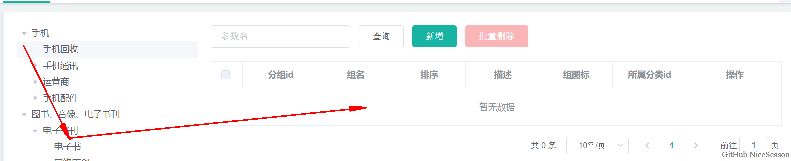

父子组件传递数据：

1）子组件给父组件传递数据，事件机制；

在category中绑定node-click事件，

```vue
  <el-tree :data="menus" :props="defaultProps" node-key="catId" ref="menuTree" @node-click="nodeClick"	></el-tree>
```

2）子组件给父组件发送一个事件，携带上数据；

```javascript
    nodeClick(data,Node,component){
       console.log("子组件",data,Node,component);
       this.$emit("tree-node-click",data,Node,component);
    }, 
```

this.$emit(事件名,"携带的数据");

3）父组件中的获取发送的事件

```vue
<category @tree-node-click="treeNodeClick"></category>
```

```javascript
    //获取发送的事件数据
    treeNodeClick(data,Node,component){
     console.log("attgroup感知到的category的节点被点击",data,Node,component);
     console.log("刚才被点击的菜单ID",data.catId);
    },
```


## 23. 规格参数新增与VO

规格参数新增时，请求的URL：Request URL: 

http://localhost:88/api/product/attr/base/list/0?t=1588731762158&page=1&limit=10&key=

当有新增字段时，我们往往会在entity实体类中新建一个字段，并标注数据库中不存在该字段，然而这种方式并不规范

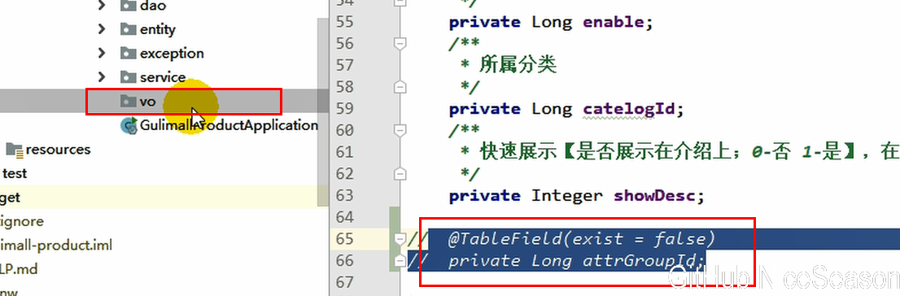

比较规范的做法是，新建一个vo文件夹，将每种不同的对象，按照它的功能进行了划分。在java中，涉及到了这几种类型

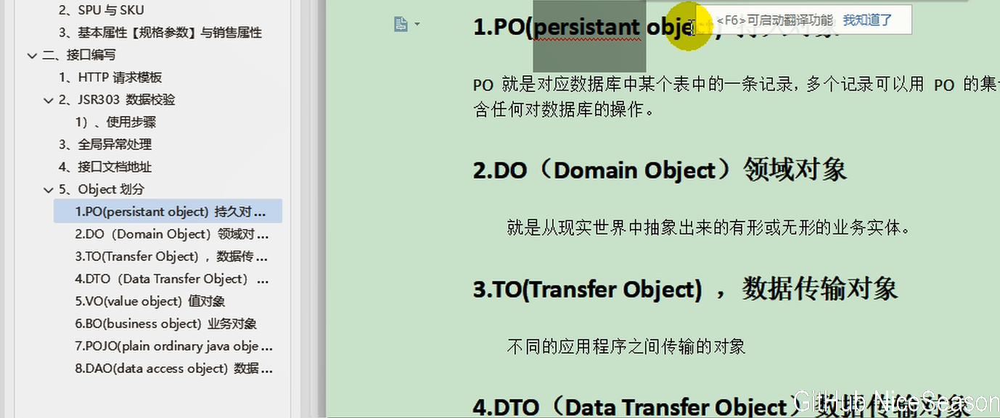


Request URL: http://localhost:88/api/product/attr/save，现在的情况是，它在保存的时候，只是保存了attr，并没有保存attrgroup，为了解决这个问题，我们新建了一个vo/AttrVo，在原AttrEntity基础上增加了attrGroupId字段，使得保存新增数据的时候，也保存了它们之间的关系。

通过" BeanUtils.copyProperties(attr,attrEntity);"能够实现在两个Bean之间拷贝数据，但是两个Bean的字段要相同

```java 
   @Override
    public void saveAttr(AttrVo attr) {
        AttrEntity attrEntity = new AttrEntity();
        BeanUtils.copyProperties(attr,attrEntity);
        this.save(attrEntity);
    }
```

问题：现在有两个查询，一个是查询部分，另外一个是查询全部，但是又必须这样来做吗？还是有必要的，但是可以在后台进行设计，两种查询是根据catId是否为零进行区分的。


## 24. 查询分组关联属性和删除关联

获取属性分组的关联的所有属性

API：<https://easydoc.xyz/doc/75716633/ZUqEdvA4/LnjzZHPj>

发送请求：/product/attrgroup/{attrgroupId}/attr/relation


获取当前属性分组所关联的属性

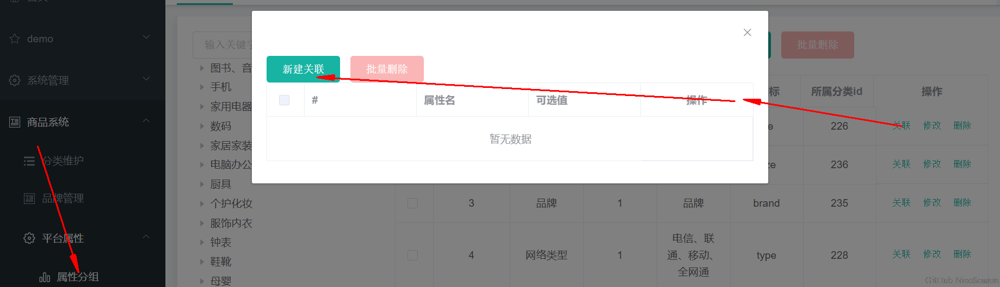


如何查找：既然给出了attr_group_id，那么到中间表中查询出来所关联的attr_id，然后得到最终的所有属性即可。

可能出现null值的问题

## 25. 查询分组未关联的属性

/product/attrgroup/{attrgroupId}/noattr/relation

API：<https://easydoc.xyz/doc/75716633/ZUqEdvA4/d3EezLdO>

获取属性分组里面还没有关联的本分类里面的其他基本属性，方便添加新的关联


Request URL: http://localhost:88/api/product/attrgroup/1/noattr/relation?t=1588780783441&page=1&limit=10&key=

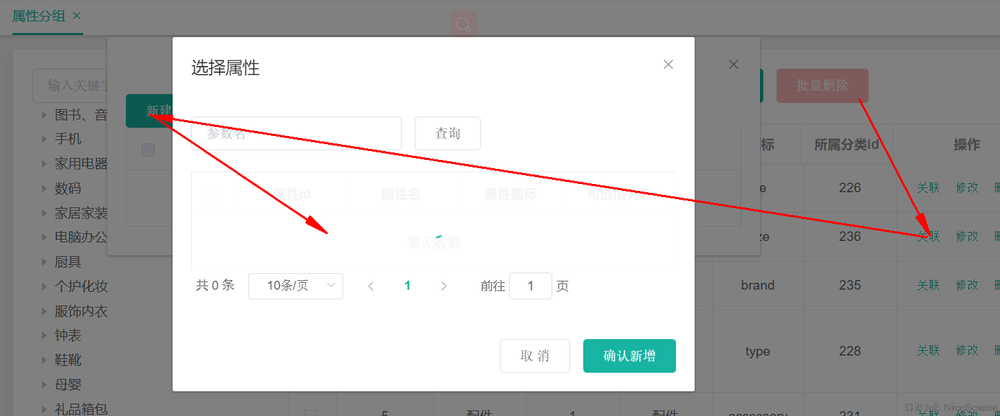


属性分组，对应于“pms_attr_group”表，每个分组下，需要查看到关联了哪些属性信息，销售属性不需要和分组进行关联，但是规格参数要和属性分组进行关联。

规格参数：对应于`pms_attr`表，attr_type=1，需要显示分组信息

销售属性：对应于pms_attr`表，attr_type=0，不需要显示分组信息


分组ID为9的分组：Request URL: http://localhost:88/api/product/attrgroup/9/noattr/relation?t=1588822258669&page=1&limit=10&key=

对应的数据库字段

attr_group_id  attr_group_name    sort  descript                icon    catelog_id  
-------------  ---------------  ------  ----------------------  ------  ------------
            9  主体                    1  型号 平台                   wu               454
           10  显卡                    1  显存容量                    wu               454
           11  输入设备                  1  鼠标 键盘                   wu               454
           12  主板                    1  显卡类型 芯片组                wu               454
           13  规格                    1  尺寸                      wu               454


查询attrgroupId=9的属性分组：

``` java
AttrGroupEntity attrGroupEntity = attrGroupDao.selectById(attrgroupId);
```

获取到分类信息：

```
 Long catelogId = attrGroupEntity.getCatelogId();
```


目标：获取属性分组没有关联的其他属性

也就是获取attrgroupId=9的属性分组中，关联的分类catelog_id =454 （台式机），其他基本属性

在该属性分组中，现在已经关联的属性：

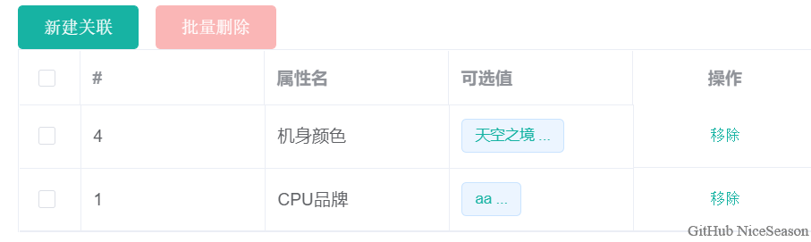

本分类下，存在哪些基本属性？

没有关联的其他属性

已经关联的属性，这些属性是如何关联上的？

答：在创建规格参数的时候，已经设置了需要关联哪些属性分组。

想要知道还没有关联哪些，先查看关联了哪些，如何排除掉这些就是未关联的

在中间表中显示了属性和属性分组之间的关联关系，在属性表中显示了所有的属性，

先查询中间表，得到所有已经关联的属性的id，然后再次查询属性表，排除掉已经建立关联的属性ID，将剩下的属性ID和属性建立起关联关系


## 26. 添加属性和分组的关联关系

请求类型：Request URL: http://localhost:88/api/product/attrgroup/attr/relation

请求方式：POST

请求数据：[{"attrId":10,"attrGroupId":9}]

API：<https://easydoc.xyz/doc/75716633/ZUqEdvA4/VhgnaedC>

响应数据：

```json
{
	"msg": "success",
	"code": 0
}
```


本质就是在中间表pms_attr_attrgroup_relation中，添加一条记录的过程


## 27. 发布商品

获取所有会员等级：/member/memberlevel/list

API：<https://easydoc.xyz/doc/75716633/ZUqEdvA4/jCFganpf>


在“gulimall-gateway”中修改“”文件，添加对于member的路由

```yaml
        - id: gulimall-member
          uri: lb://gulimall-member
          predicates:
            - Path=/api/member/**
          filters:
            - RewritePath=/api/(?<segment>/?.*),/$\{segment}
```


在“gulimall-member”中，创建“bootstrap.properties”文件，内容如下：

```properties
spring.cloud.nacos.config.name=gulimall-member
spring.cloud.nacos.config.server-addr=192.168.137.14:8848
spring.cloud.nacos.config.namespace=795521fa-77ef-411e-a8d8-0889fdfe6964
spring.cloud.nacos.config.extension-configs[0].data-id=gulimall-member.yml
spring.cloud.nacos.config.extension-configs[0].group=DEFAULT_GROUP
spring.cloud.nacos.config.extension-configs[0].refresh=true
```


获取分类关联的品牌：/product/categorybrandrelation/brands/list

API：<https://easydoc.xyz/doc/75716633/ZUqEdvA4/HgVjlzWV>


遇到PubSub问题

1. 首先安装pubsub-js

```
`npm install --save pubsub-js`
```

2. 订阅方组件

```
`import PubSub from 'pubsub-js'`
```

该this.PubSub为PubSub。


获取分类下所有分组&关联属性

请求类型：/product/attrgroup/{catelogId}/withattr

请求方式：GET

请求URL：http://localhost:88/api/product/attrgroup/225/withattr?t=1588864569478


mysql默认的隔离级别为读已提交，为了能够在调试过程中，获取到数据库中的数据信息，可以调整隔离级别为读未提交：

```sql
SET SESSION TRANSACTION ISOLATION LEVEL READ UNCOMMITTED;
```

但是它对于当前的事务窗口生效，如果想要设置全局的，需要加上global字段。

## 28. 商品管理

当新建时：

```
t: 1588983621569
status: 0
key: 
brandId: 0
catelogId: 0
page: 1
limit: 10
```

当上架时：

```
t: 1588983754030
status: 1
key: 
brandId: 0
catelogId: 0
page: 1
limit: 10
```

当下架时：

```
t: 1588983789089
status: 2
key: 
brandId: 0
catelogId: 0
page: 1
limit: 10
```


在SPU中，写出的日期数据都不符合规则：
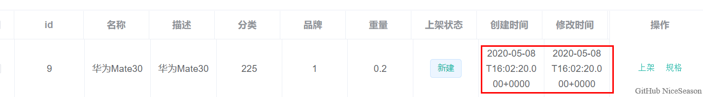

想要符合规则，可以设置写出数据的规则：

spring.jackson

```yaml
  jackson:
    date-format: yyyy-MM-dd HH:mm:ss
```


SKU检索：

Request URL: http://localhost:88/api/product/skuinfo/list?t=1588989437944&page=1&limit=10&key=&catelogId=0&brandId=0&min=0&max=0

请求体：

```
t: 1588989437944
page: 1
limit: 10
key: 
catelogId: 0
brandId: 0
min: 0
max: 0
```

API： https://easydoc.xyz/doc/75716633/ZUqEdvA4/ucirLq1D 


## 29. 仓库管理

 库存信息表：wms_ware_info

【1】仓库列表功能： 

【2】查询商品库存：

【3】查询采购需求：

【4】 合并采购需求：

合并整单选中parcharseID：Request URL: http://localhost:88/api/ware/purchase/merge

请求数据：

```json
{purchaseId: 1, items: [1, 2]}
items: [1, 2]
```


合并整单未选择parcharseID :Request URL: http://localhost:88/api/ware/purchase/merge


```
items: [1, 2]
```


涉及到两张表：wms_purchase_detail，wms_purchase

现在采购单中填写数据，然后关联用户，关联用户后，

总的含义，就是根据采购单中的信息，更新采购需求，在采购单中填写采购人员，采购单号，采购的时候，更新采购细节表中的采购人员ID和采购状态。

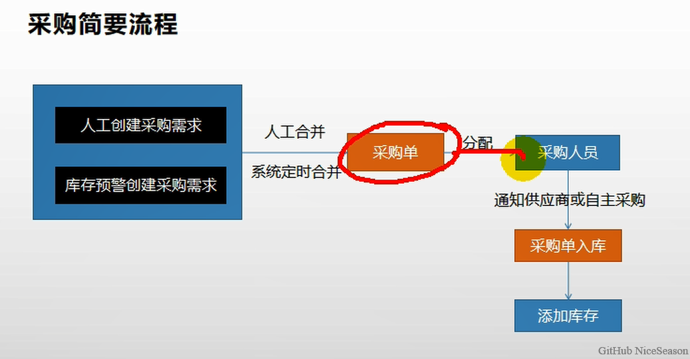


领取采购单

http://localhost:88/api/ware/purchase/received

（1）某个人领取了采购单后，先看采购单是否处于未分配状态，只有采购单是新建或以领取状态时，才更新采购单的状态

（2）


【1】仓库列表功能： https://easydoc.xyz/doc/75716633/ZUqEdvA4/mZgdqOWe 

【2】查询商品库存： https://easydoc.xyz/doc/75716633/ZUqEdvA4/hwXrEXBZ 

【3】查询采购需求： https://easydoc.xyz/doc/75716633/ZUqEdvA4/Ss4zsV7R 

【4】 合并采购需求：https://easydoc.xyz/doc/75716633/ZUqEdvA4/cUlv9QvK 

【5】查询未领取的采购单： https://easydoc.xyz/doc/75716633/ZUqEdvA4/hI12DNrH 

【6】领取采购单： https://easydoc.xyz/doc/75716633/ZUqEdvA4/vXMBBgw1 


完成采购，在完成采购过程中，需要涉及到设置SKU的name信息到仓库中，这是通过远程调用“gulimall-product”来实现根据sku_id查询得到sku_name的，如果这个过程发生了异常，事务不想要回滚，目前采用的方式是通过捕获异常的方式，防止事务回滚，是否还有其他的方式呢？这个问题留待以后解决。

```java
 @Override
    public void addStock(Long skuId, Long wareId, Integer skuNum) {

        List<WareSkuEntity> wareSkuEntities = wareSkuDao.selectList(new QueryWrapper<WareSkuEntity>().eq("sku_id", skuId).eq("ware_id", wareId));

        if(wareSkuEntities == null || wareSkuEntities.size() ==0 ){
             //新增
            WareSkuEntity wareSkuEntity = new WareSkuEntity();
            wareSkuEntity.setSkuId(skuId);
            wareSkuEntity.setWareId(wareId);
            wareSkuEntity.setStock(skuNum);
            wareSkuEntity.setStockLocked(0);

            //远程查询SKU的name，若失败无需回滚
            try {
                R info = productFeignService.info(skuId);
                if(info.getCode() == 0){
                    Map<String,Object> data=(Map<String,Object>)info.get("skuInfo");
                    wareSkuEntity.setSkuName((String) data.get("skuName"));
                }
            } catch (Exception e) {

            }

            wareSkuDao.insert(wareSkuEntity);
        }else{
            //插入
            wareSkuDao.addStock(skuId,wareId,skuNum);
        }

    }
```


## 30. 获取spu规格

在SPU管理页面，获取商品规格的时候，出现400异常，浏览器显示跳转不了

问题现象：


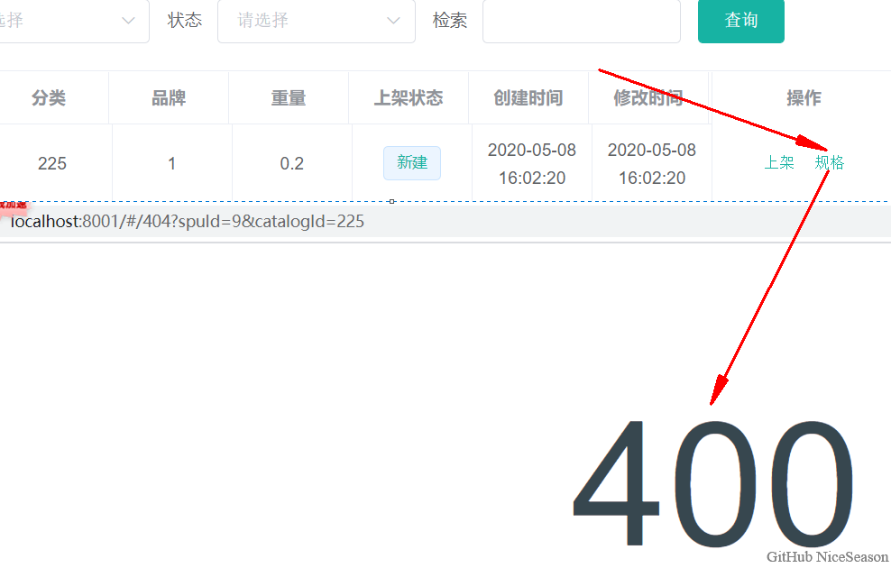

出现问题的代码：

```javascript
    attrUpdateShow(row) {
      console.log(row);
      this.$router.push({
        path: "/product-attrupdate",
        query: { spuId: row.id, catalogId: row.catalogId }
      });
    },
```


暂时不知道如何解决问题。只能留待以后解决。

经过测试发现，问题和上面的代码没有关系，问题出现在“attrupdate.vue”上，该vue页面无法通过浏览器访问，当输入访问URL（ http://localhost:8001/#/product-attrupdate ）的时候，就会出现404，而其他的请求则不会出现这种情况，不知为何。

通过POSTMAN进行请求的时候，能够请求到数据。


经过分析发现，是因为在数据库中没有该页面的导航所导致的，为了修正这个问题，可以在“sys-menu”表中添加一行，内容位：

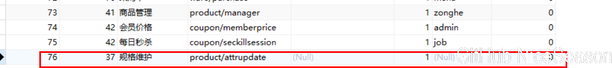

这样当再次访问的时候，在“平台属性”下，会出现“规格维护”菜单，

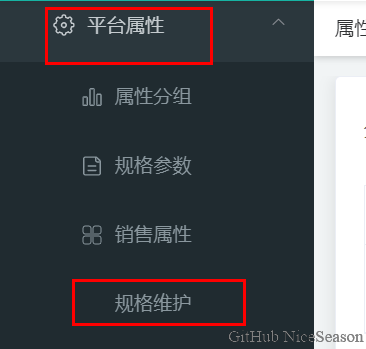

当再次点击“规格”的时候，显示出菜单

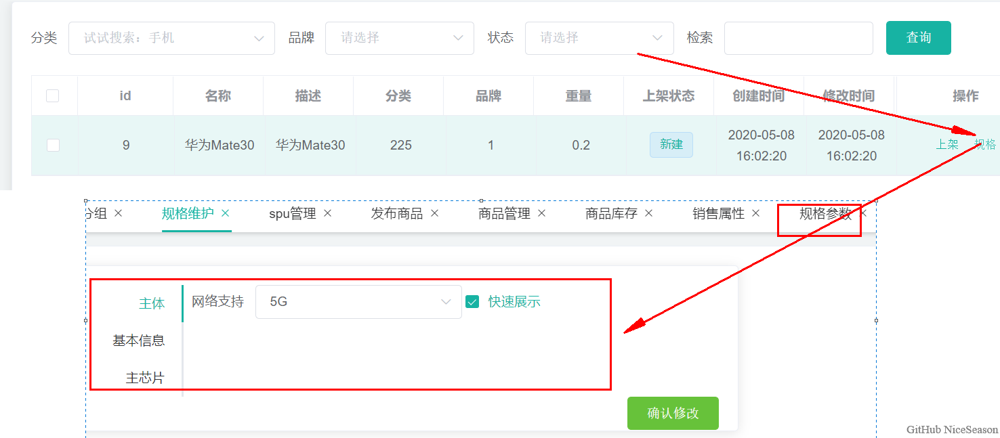

不过这种菜单并不符合我们的需要，我们需要让它以弹出框的形式出现。


## 31. 修改商品规格

API： https://easydoc.xyz/doc/75716633/ZUqEdvA4/GhnJ0L85 

URL：/product/attr/update/{spuId}


## 小结：

### 1.  在open fen中会将调用的数据转换为JSON，接收方接收后，将JSON转换为对象，此时调用方和被调用方的处理JSON的对象不一定都是同一个类，只要它们的字段类型吻合即可。

调用方：

```java
@FeignClient(value = "gulimall-coupon")
public interface CouponFenService {

    @PostMapping("/coupon/spubounds/save")
    R saveSpuBounds(@RequestBody SpuBoundTo spuBoundTo);

    @PostMapping("/coupon/skufullreduction/saveInfo")
    R saveSkuReduction(@RequestBody SkuReductionTo skuReductionTo);
}
```

被调用方：

```java
    @PostMapping("/save")
    public R save(@RequestBody SpuBoundsEntity spuBounds){
		spuBoundsService.save(spuBounds);

        return R.ok();
    }

    @PostMapping("/saveInfo")
    public R saveInfo(@RequestBody SkuReductionTo skuReductionTo){
        skuFullReductionService.saveSkuReduction(skuReductionTo);
        return R.ok();
    }
```


调用方JSON化时的对象SpuBoundTo：

```
@Data
public class SpuBoundTo {
    private Long spuId;
    private BigDecimal buyBounds;
    private BigDecimal growBounds;
}
```

被调用方JSON数据对象化时的对象SpuBoundsEntity：

```java
/**
 * 商品spu积分设置
 * 
 * @author cosmoswong
 * @email cosmoswong@sina.com
 * @date 2020-04-23 23:38:48
 */
@Data
@TableName("sms_spu_bounds")
public class SpuBoundsEntity implements Serializable {
	private static final long serialVersionUID = 1L;

	/**
	 * id
	 */
	@TableId
	private Long id;
	/**
	 * 
	 */
	private Long spuId;
	/**
	 * 成长积分
	 */
	private BigDecimal growBounds;
	/**
	 * 购物积分
	 */
	private BigDecimal buyBounds;
	/**
	 * 优惠生效情况[1111（四个状态位，从右到左）;0 - 无优惠，成长积分是否赠送;1 - 无优惠，购物积分是否赠送;2 - 有优惠，成长积分是否赠送;3 - 有优惠，购物积分是否赠送【状态位0：不赠送，1：赠送】]
	 */
	private Integer work;

}
```


### 2. 事务究竟要如何加上？

存在Batch操作的时候，才需要加上事务，单个操作无需添加事务控制。


SpringBoot中的是事务

批量操作的时候，才需要事务


一个事务标注的方法上，方法内存在这些操作：

（1）批量更新一个表中字段

（2）更新多张表中的操作

实际上不论是哪种类型，方法中所有对于数据库的写操作，都会被整体当做一个事务，在这个事务过程中，如果某个操作出现了异常，则整体都不会被提交。这就是对于SpringBoot中的@Transactional的理解。


@EnableTransactionManagement和@Transactional的区别？


 https://blog.csdn.net/abysscarry/article/details/80189232 
 https://blog.csdn.net/Driver_tu/article/details/99679145 

 https://www.cnblogs.com/leaveast/p/11765503.html 

## 其他

### 1. 文档参考地址

 [http://www.jayh.club/#/02.PassJava%E6%9E%B6%E6%9E%84%E7%AF%87/01.%E5%88%9B%E5%BB%BA%E9%A1%B9%E7%9B%AE%E5%92%8C%E6%B7%BB%E5%8A%A0%E6%A8%A1%E5%9D%97](http://www.jayh.club/#/02.PassJava架构篇/01.创建项目和添加模块) 


 https://blog.csdn.net/ok_wolf/article/details/105400748 

<https://www.cnblogs.com/javalbb/p/12690862.html>

 https://blog.csdn.net/ok_wolf/article/details/105456170 

 https://easydoc.xyz/doc/75716633/ZUqEdvA4/jCFganpf 

### 2. 开机启动docker

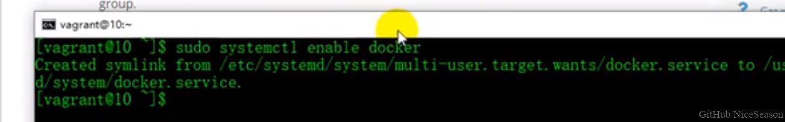


在Docker中设置开机启动容器


```shell
#查看防火墙状态
[root@hadoop-104 module]# systemctl status firewalld
  firewalld.service - firewalld - dynamic firewall daemon
   Loaded: loaded (/usr/lib/systemd/system/firewalld.service; enabled; vendor preset: enabled)
   Active: active (running) since Wed 2020-04-22 21:26:23 EDT; 10min ago
     Docs: man:firewalld(1)
 Main PID: 5947 (firewalld)
   CGroup: /system.slice/firewalld.service
           └─5947 /usr/bin/python -Es /usr/sbin/firewalld --nofork --nopid

Apr 22 21:26:20 hadoop-104 systemd[1]: Starting firewalld - dynamic firewall daemon...
Apr 22 21:26:23 hadoop-104 systemd[1]: Started firewalld - dynamic firewall daemon.
#查看防火墙是否是开机启动
[root@hadoop-104 module]# systemctl list-unit-files|grep firewalld
firewalld.service                             enabled 
#关闭开机启动防火墙
[root@hadoop-104 module]# systemctl disable firewalld             
Removed symlink /etc/systemd/system/multi-user.target.wants/firewalld.service.
Removed symlink /etc/systemd/system/dbus-org.fedoraproject.FirewallD1.service.
#停止防火墙
[root@hadoop-104 module]# systemctl stop firewalld         
#再次查看防火墙
[root@hadoop-104 module]# systemctl list-unit-files|grep firewalld
firewalld.service                             disabled
[root@hadoop-104 module]# 
```


### 3. 查看命令的安装位置

whereis mysql：查看mysql的安装位置

### 4. vscode中生成代码片段

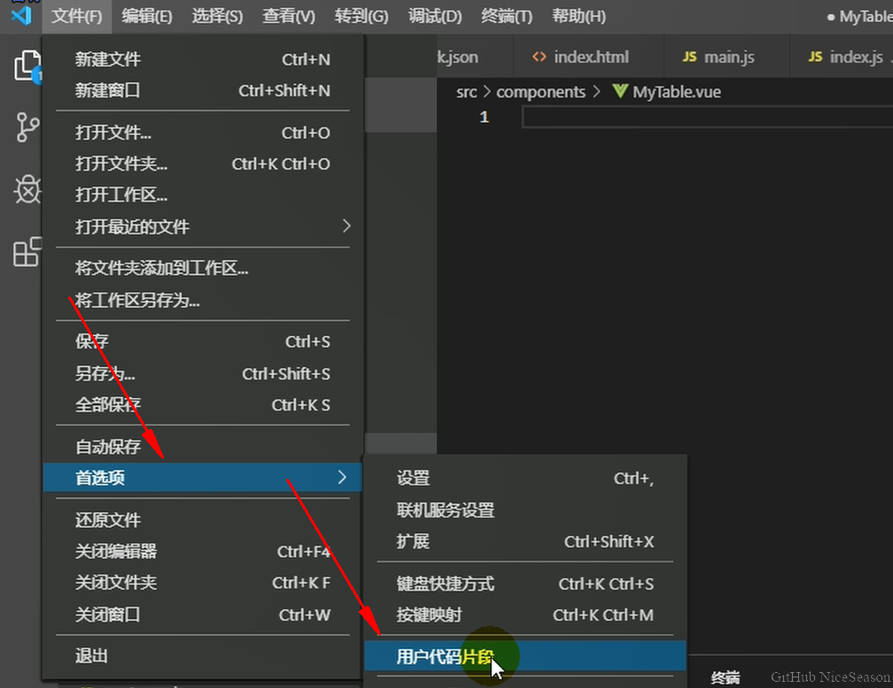

新建一个全局的代码片段，名字为vue，然后回车：

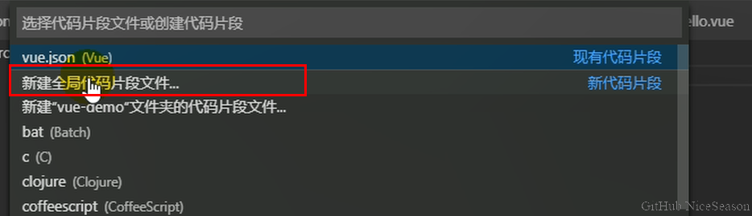

将下面的代码片段粘贴到“vue.code-snippets”


```json
{
    // Place your 全局 snippets here. Each snippet is defined under a snippet name and has a scope, prefix, body and 
    // description. Add comma separated ids of the languages where the snippet is applicable in the scope field. If scope 
    // is left empty or omitted, the snippet gets applied to all languages. The prefix is what is 
    // used to trigger the snippet and the body will be expanded and inserted. Possible variables are: 
    // $1, $2 for tab stops, $0 for the final cursor position, and ${1:label}, ${2:another} for placeholders. 
    // Placeholders with the same ids are connected.
    // Example:
    // "Print to console": {
    // 	"scope": "javascript,typescript",
    // 	"prefix": "log",
    // 	"body": [
    // 		"console.log('$1');",
    // 		"$2"
    // 	],
    // 	"description": "Log output to console"
    // }
    "生成vue模板": {
        "prefix": "vue",
        "body": [
            "<!-- $1 -->",
            "<template>",
            "<div class='$2'>$5</div>",
            "</template>",
            "",
            "<script>",
            "//这里可以导入其他文件（比如：组件，工具js，第三方插件js，json文件，图片文件等等）",
            "//例如：import 《组件名称》 from '《组件路径》';",
            "",
            "export default {",
            "//import引入的组件需要注入到对象中才能使用",
            "components: {},",
            "data() {",
            "//这里存放数据",
            "return {",
            "",
            "};",
            "},",
            "//监听属性 类似于data概念",
            "computed: {},",
            "//监控data中的数据变化",
            "watch: {},",
            "//方法集合",
            "methods: {",
            "",
            "},",
            "//生命周期 - 创建完成（可以访问当前this实例）",
            "created() {",
            "",
            "},",
            "//生命周期 - 挂载完成（可以访问DOM元素）",
            "mounted() {",
            "",
            "},",
            "beforeCreate() {}, //生命周期 - 创建之前",
            "beforeMount() {}, //生命周期 - 挂载之前",
            "beforeUpdate() {}, //生命周期 - 更新之前",
            "updated() {}, //生命周期 - 更新之后",
            "beforeDestroy() {}, //生命周期 - 销毁之前",
            "destroyed() {}, //生命周期 - 销毁完成",
            "activated() {}, //如果页面有keep-alive缓存功能，这个函数会触发",
            "}",
            "</script>",
            "<style lang='scss' scoped>",
            "//@import url($3); 引入公共css类",
            "$4",
            "</style>"
        ],
        "description": "生成VUE模板"
    },
    "http-get请求": {
        "prefix": "httpget",
        "body": [
            "this.\\$http({",
            "url: this.\\$http.adornUrl(''),",
            "method: 'get',",
            "params: this.\\$http.adornParams({})",
            "}).then(({ data }) => {",
            "})"
        ],
        "description": "httpGET请求"
    },
    "http-post请求": {
        "prefix": "httppost",
        "body": [
            "this.\\$http({",
            "url: this.\\$http.adornUrl(''),",
            "method: 'post',",
            "data: this.\\$http.adornData(data, false)",
            "}).then(({ data }) => { });"
        ],
        "description": "httpPOST请求"
    }
}
```

更多详细说明见： https://blog.csdn.net/z772330927/article/details/105730430/ 

### 5. vscode快捷键

ctrl+shift+f 全局搜索

alt+shift+f 格式化代码

### 6.  关闭eslint的语法检查

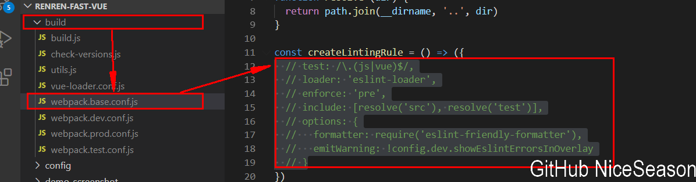


```json

```


### 7. 安装mybatisx插件

在Marketplace中搜索“mybatisx”，安装后重启IDEA，使用时会自动在@Mapper标注的接口上，产生小图标，然后alt+enter，generate statement，就会自动的在xml文件中生成SQL。

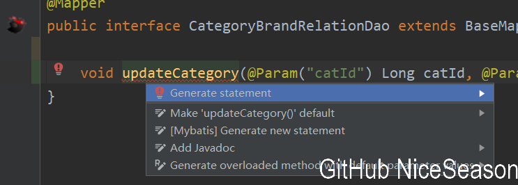


### 8. mysql的批量删除

```sql
DELETE FROM  `pms_attr_attrgroup_relation` WHERE (attr_id= ? AND attr_group_id ) OR (attr_id= ? AND attr_group_id )
```


### 9. String.join

```java
java.lang.String @NotNull 
public static String join(@NotNull CharSequence delimiter,
                          @NotNull Iterable<? extends CharSequence> elements)
```

Returns a new String composed of copies of the CharSequence elements joined together with a copy of the specified delimiter.

 返回一个由CharSequence元素的副本和指定分隔符的副本组成的新字符串。 

For example,

     List<String> strings = new LinkedList<>();
     strings.add("Java");strings.add("is");
     strings.add("cool");
     String message = String.join(" ", strings);
     //message returned is: "Java is cool"
    
     Set<String> strings = new LinkedHashSet<>();
     strings.add("Java"); strings.add("is");
     strings.add("very"); strings.add("cool");
     String message = String.join("-", strings);
     //message returned is: "Java-is-very-cool"

Note that if an individual element is null, then "null" is added.

 注意，如果单个元素为null，则添加“null”。 

Params:
delimiter – a sequence of characters that is used to separate each of the elements in the resulting String
               用于分隔结果字符串中的每个元素的字符序列 

elements – an Iterable that will have its elements joined together.
                  将其元素连接在一起的可迭代的。 

Returns:
a new String that is composed from the elements argument
 由elements参数组成的新字符串 


Throws:
NullPointerException – If delimiter or elements is null


```java
    public static String join(CharSequence delimiter,
            Iterable<? extends CharSequence> elements) {
        Objects.requireNonNull(delimiter);
        Objects.requireNonNull(elements);
        StringJoiner joiner = new StringJoiner(delimiter);
        for (CharSequence cs: elements) {
            joiner.add(cs);
        }
        return joiner.toString();
    }
```

能够看到实际上它就是通过创建StringJoiner，然后遍历elements，加入每个元素来完成的。


StringJoiner

```java
java.util public final class StringJoiner
extends Object
```

StringJoiner is used to construct a sequence of characters separated by a delimiter and optionally starting with a supplied prefix and ending with a supplied suffix.
 tringJoiner用于构造由分隔符分隔的字符序列，可以选择以提供的前缀开始，以提供的后缀结束。 

Prior to adding something to the StringJoiner, its sj.toString() method will, by default, return prefix + suffix. However, if the setEmptyValue method is called, the emptyValue supplied will be returned instead. This can be used, for example, when creating a string using set notation to indicate an empty set, i.e. "{}", where the prefix is "{", the suffix is "}" and nothing has been added to the StringJoiner.
 在向StringJoiner添加内容之前，它的sj.toString()方法在默认情况下会返回前缀+后缀。但是，如果调用setEmptyValue方法，则返回所提供的emptyValue。例如，当使用set符号创建一个字符串来表示一个空集时，可以使用这种方法。“{}”，其中前缀是“{”，后缀是“}”，没有向StringJoiner添加任何内容。 


apiNote:
The String "[George:Sally:Fred]" may be constructed as follows:

```java
 StringJoiner sj = new StringJoiner(":", "[", "]");
 sj.add("George").add("Sally").add("Fred");
 String desiredString = sj.toString();
```

A StringJoiner may be employed to create formatted output from a java.util.stream.Stream using java.util.stream.Collectors.joining(CharSequence). For example:
 使用StringJoiner从java.util.stream创建格式化输出流，使用java.util.stream.Collectors.joining (CharSequence进行)。例如: 

```
 List<Integer> numbers = Arrays.asList(1, 2, 3, 4);
 String commaSeparatedNumbers = numbers.stream()
     .map(i -> i.toString())
     .collect(Collectors.joining(", "));
```


通过分析源码发现，在“”内部维护了一个StringBuilder，所有加入到它内部的元素都会先拼接上分割符，然后再拼接上加入的元素

```java
 public StringJoiner add(CharSequence newElement) {
        prepareBuilder().append(newElement);
        return this;
 }
```


```java
   private StringBuilder prepareBuilder() {
        if (value != null) {
            value.append(delimiter);
        } else {
            value = new StringBuilder().append(prefix);
        }
        return value;
    }
```


### 10. 在Service中微服务比较多的时候，可以配置将一些微服务放置到compound中，组成一个小组


以后再运行时，直接选择这个compound即可很方便的运行或停止一组微服务：

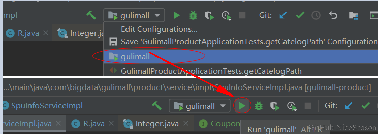

另外可以单独为每个微服务，设置需要的运行时最大堆内存大小：

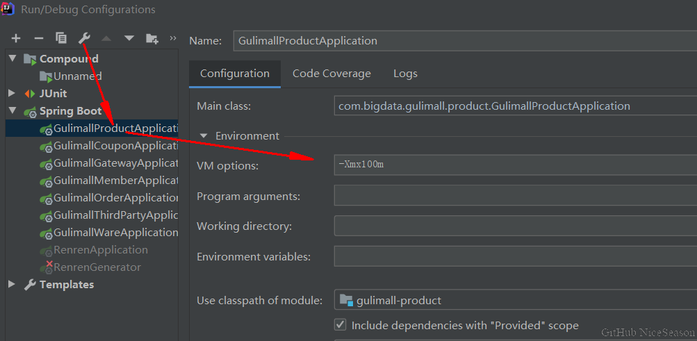


### 11. mysql的dateTime和timestamp的区别？

[MySQL中datetime和timestamp的区别及使用](https://www.cnblogs.com/mxwz/p/7520309.html)

**TIMESTAMP和DATETIME的相同点：**

1> 两者都可用来表示YYYY-MM-DD HH:MM:SS[.fraction]类型的日期。

 

**TIMESTAMP和DATETIME的不同点：**

1> 两者的存储方式不一样

对于TIMESTAMP，它把客户端插入的时间从当前时区转化为UTC（世界标准时间）进行存储。查询时，将其又转化为客户端当前时区进行返回。

而对于DATETIME，不做任何改变，基本上是原样输入和输出。

2> 两者所能存储的时间范围不一样

timestamp所能存储的时间范围为：'1970-01-01 00:00:01.000000' 到 '2038-01-19 03:14:07.999999'。

datetime所能存储的时间范围为：'1000-01-01 00:00:00.000000' 到 '9999-12-31 23:59:59.999999'。

总结：TIMESTAMP和DATETIME除了存储范围和存储方式不一样，没有太大区别。当然，对于跨时区的业务，TIMESTAMP更为合适。


 https://www.cnblogs.com/Jashinck/p/10472398.html 


### 12. SpringBoot中的事务

 https://blog.csdn.net/Z__Sheng/article/details/89489053 

### 13. IDEA RESTFUll clinet

[IntelliJ IDEA 使用 rest client](https://blog.csdn.net/qq_37502106/article/details/103183492)


### 


## FAQ

### 1. TypeError: _vm.previewHandle is not a function


