## 1. ELASTICSEARCH

### 1、安装elastic search

 dokcer中安装elastic search

（1）下载ealastic search和kibana

```shell
docker pull elasticsearch:7.6.2
docker pull kibana:7.6.2
```

（2）配置

```shell
mkdir -p /mydata/elasticsearch/config
mkdir -p /mydata/elasticsearch/data
echo "http.host: 0.0.0.0" >/mydata/elasticsearch/config/elasticsearch.yml
chmod -R 777 /mydata/elasticsearch/
```


（3）启动Elastic search

```shell
docker run --name elasticsearch -p 9200:9200 -p 9300:9300 \
-e  "discovery.type=single-node" \
-e ES_JAVA_OPTS="-Xms64m -Xmx512m" \
-v /mydata/elasticsearch/config/elasticsearch.yml:/usr/share/elasticsearch/config/elasticsearch.yml \
-v /mydata/elasticsearch/data:/usr/share/elasticsearch/data \
-v  /mydata/elasticsearch/plugins:/usr/share/elasticsearch/plugins \
-d elasticsearch:7.6.2 
```

设置开机启动elasticsearch

```shell
docker update elasticsearch --restart=always
```


（4）启动kibana：

```shell
docker run --name kibana -e ELASTICSEARCH_HOSTS=http://172.17.0.3:9200 -p 5601:5601 -d kibana:7.6.2
```

设置开机启动kibana

```shell
docker update kibana  --restart=always
```


（5）测试

查看elasticsearch版本信息： http://#:9200/ 

```json
{
    "name": "0adeb7852e00",
    "cluster_name": "elasticsearch",
    "cluster_uuid": "9gglpP0HTfyOTRAaSe2rIg",
    "version": {
        "number": "7.6.2",
        "build_flavor": "default",
        "build_type": "docker",
        "build_hash": "ef48eb35cf30adf4db14086e8aabd07ef6fb113f",
        "build_date": "2020-03-26T06:34:37.794943Z",
        "build_snapshot": false,
        "lucene_version": "8.4.0",
        "minimum_wire_compatibility_version": "6.8.0",
        "minimum_index_compatibility_version": "6.0.0-beta1"
    },
    "tagline": "You Know, for Search"
}
```


显示elasticsearch 节点信息http://#:9200/_cat/nodes ，

```json
127.0.0.1 76 95 1 0.26 1.40 1.22 dilm * 0adeb7852e00
```


访问Kibana： http://#:5601/app/kibana 

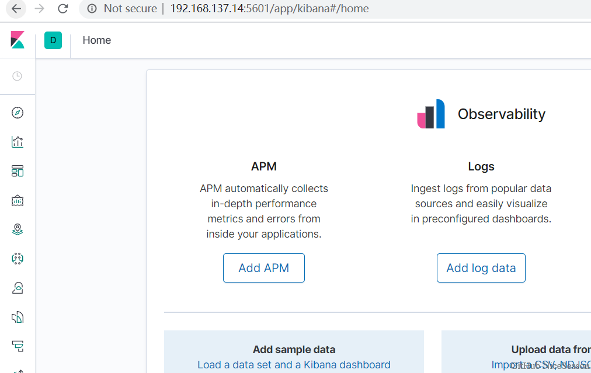


### 2、初步检索

#### 1）_CAT

（1）GET/_cat/nodes：查看所有节点_

 如：http://#:9200/_cat/nodes :

```
127.0.0.1 61 91 11 0.08 0.49 0.87 dilm * 0adeb7852e00
```

注：*表示集群中的主节点

（2）GET/_cat/health：查看es健康状况_

如： http://#:9200/_cat/health 

```
1588332616 11:30:16 elasticsearch green 1 1 3 3 0 0 0 0 - 100.0%
```

注：green表示健康值正常

（3）GET/_cat/master：查看主节点_

如： http://#:9200/_cat/master 

```
vfpgxbusTC6-W3C2Np31EQ 127.0.0.1 127.0.0.1 0adeb7852e00
```

（4）GET/_cat/indicies：查看所有索引 ，等价于mysql数据库的show databases;

如： http://#:9200/_cat/indices 

```json
green open .kibana_task_manager_1   KWLtjcKRRuaV9so_v15WYg 1 0 2 0 39.8kb 39.8kb
green open .apm-agent-configuration cuwCpJ5ER0OYsSgAJ7bVYA 1 0 0 0   283b   283b
green open .kibana_1                PqK_LdUYRpWMy4fK0tMSPw 1 0 7 0 31.2kb 31.2kb
```

####  2）索引一个文档

保存一个数据，保存在哪个索引的哪个类型下，指定用那个唯一标识
PUT customer/external/1;在customer索引下的external类型下保存1号数据为

```
PUT customer/external/1
```


```json
{
 "name":"John Doe"
}
```
PUT和POST都可以
POST新增。如果不指定id，会自动生成id。指定id就会修改这个数据，并新增版本号；
PUT可以新增也可以修改。PUT必须指定id；由于PUT需要指定id，我们一般用来做修改操作，不指定id会报错。


下面是在postman中的测试数据：
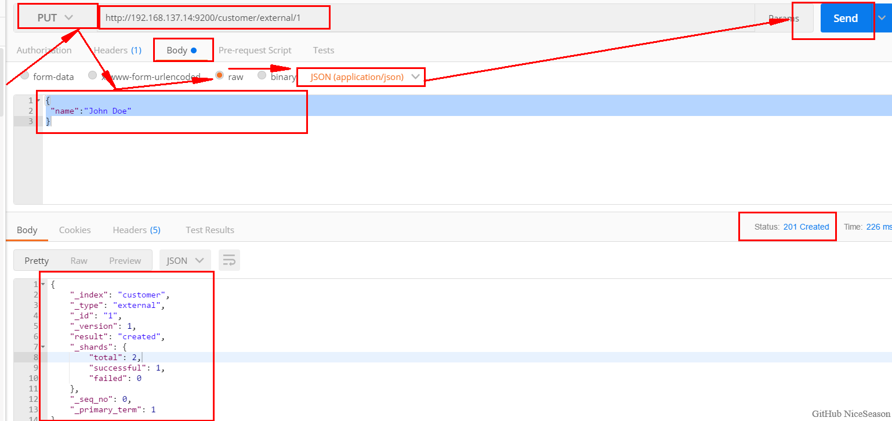

创建数据成功后，显示201 created表示插入记录成功。

```json
{
    "_index": "customer",
    "_type": "external",
    "_id": "1",
    "_version": 1,
    "result": "created",
    "_shards": {
        "total": 2,
        "successful": 1,
        "failed": 0
    },
    "_seq_no": 0,
    "_primary_term": 1
}
```

这些返回的JSON串的含义；这些带有下划线开头的，称为元数据，反映了当前的基本信息。

"_index": "customer" 表明该数据在哪个数据库下；

"_type": "external"     表明该数据在哪个类型下；

"_id": "1"                    表明被保存数据的id；

 "_version": 1,            被保存数据的版本

"result": "created"      这里是创建了一条数据，如果重新put一条数据，则该状态会变为updated，并且版本号也会发生变化。


下面选用POST方式：

添加数据的时候，不指定ID，会自动的生成id，并且类型是新增：


再次使用POST插入数据，仍然是新增的：

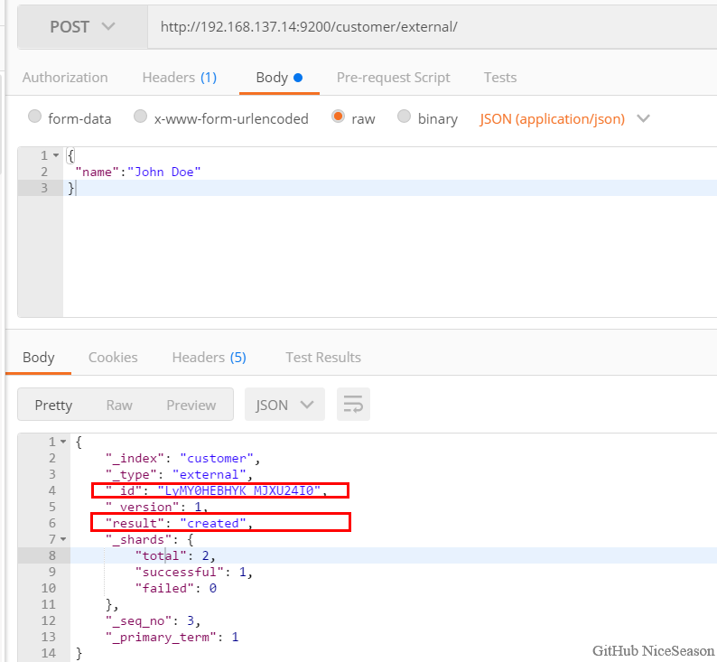


添加数据的时候，指定ID，会使用该id，并且类型是新增：

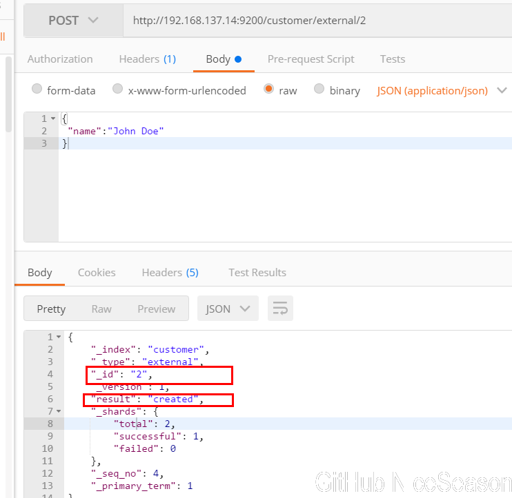

再次使用POST插入数据，类型为updated

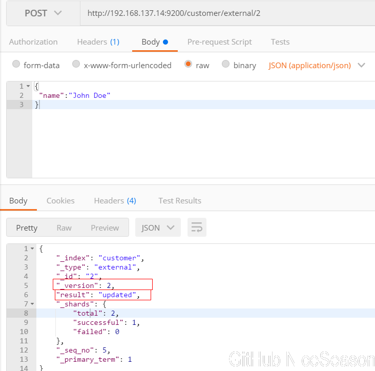


#### 3）查看文档

GET /customer/external/1

 http://#:9200/customer/external/1 

```json
{
    "_index": "customer",//在哪个索引
    "_type": "external",//在哪个类型
    "_id": "1",//记录id
    "_version": 3,//版本号
    "_seq_no": 6,//并发控制字段，每次更新都会+1，用来做乐观锁
    "_primary_term": 1,//同上，主分片重新分配，如重启，就会变化
    "found": true,
    "_source": {
        "name": "John Doe"
    }
}
```

 


通过“if_seq_no=1&if_primary_term=1 ”，当序列号匹配的时候，才进行修改，否则不修改。

实例：将id=1的数据更新为name=1，然后再次更新为name=2，起始_seq_no=6，_primary_term=1

（1）将name更新为1

 http://#:9200/customer/external/1?if_seq_no=6&if_primary_term=1 

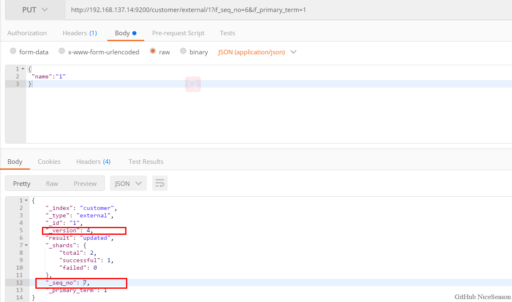

 （2）将name更新为2，更新过程中使用seq_no=6

http://#:9200/customer/external/1?if_seq_no=6&if_primary_term=1 

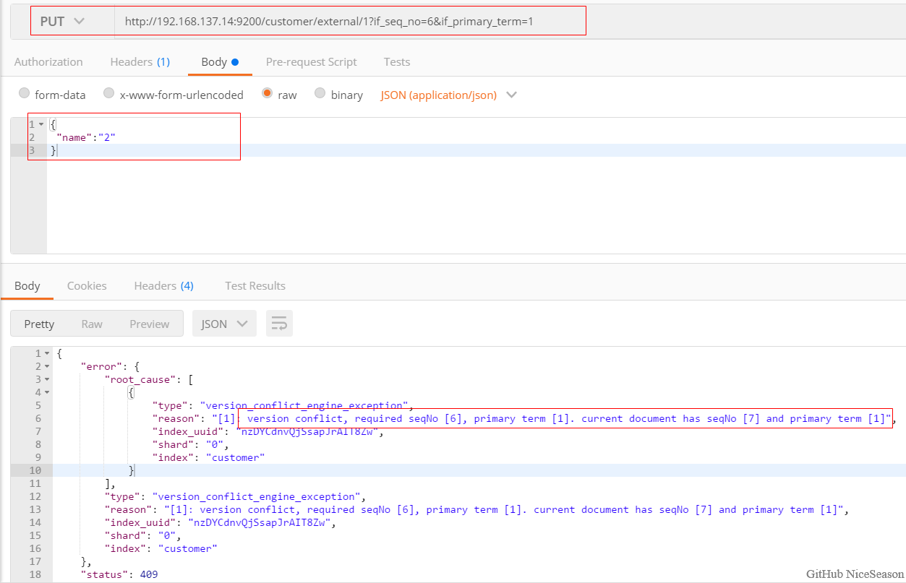

出现更新错误。


（3）查询新的数据

 http://#:9200/customer/external/1 

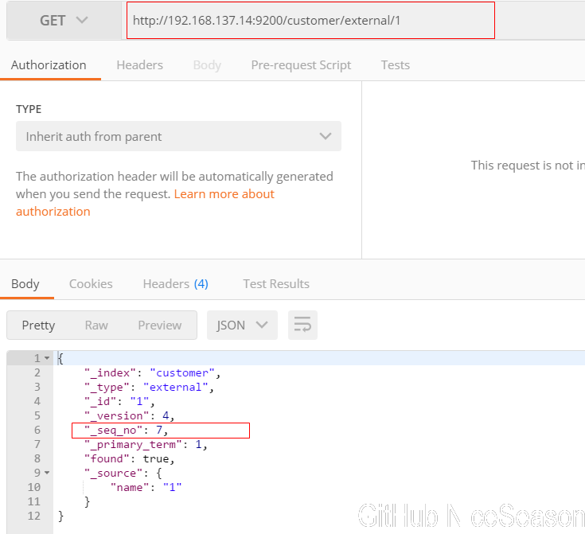

能够看到_seq_no变为7。

（4）再次更新，更新成功

 http://#:9200/customer/external/1?if_seq_no=7&if_primary_term=1 

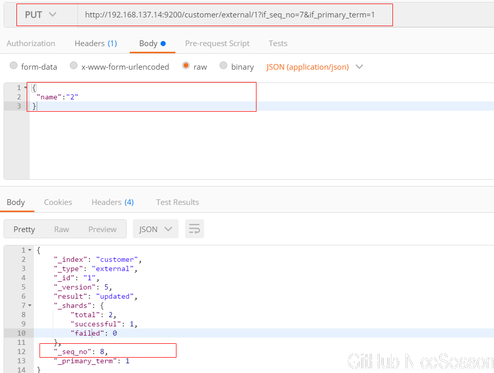

#### 4）更新文档


 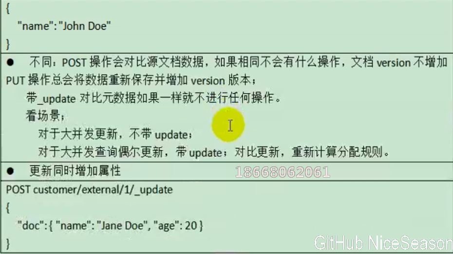

（1）POST更新文档，带有_update

http://#:9200/customer/external/1/_update 

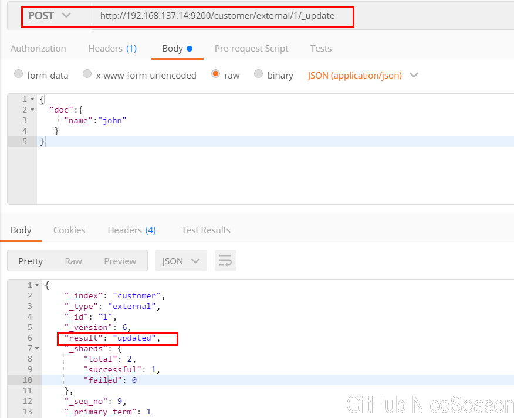

如果再次执行更新，则不执行任何操作，序列号也不发生变化

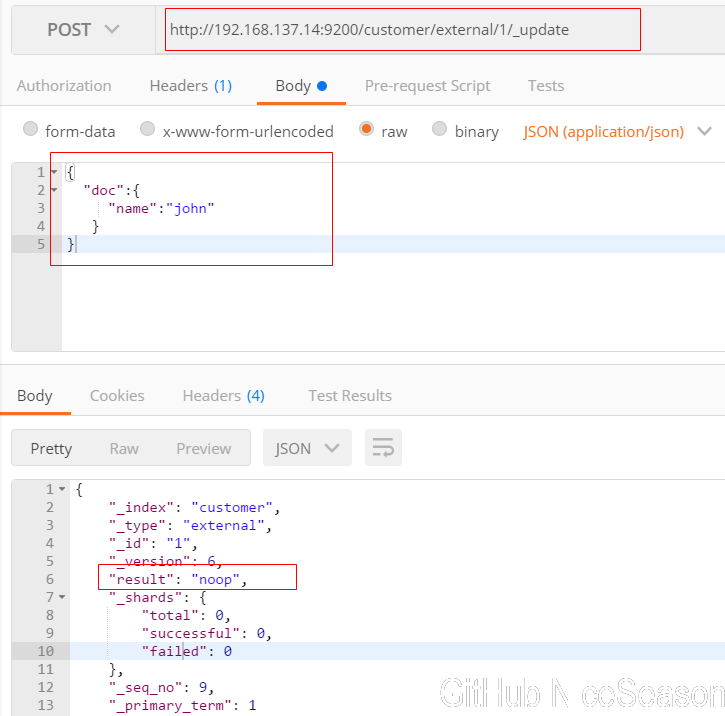

POST更新方式，会对比原来的数据，和原来的相同，则不执行任何操作（version和_seq_no）都不变。

 （2）POST更新文档，不带_update

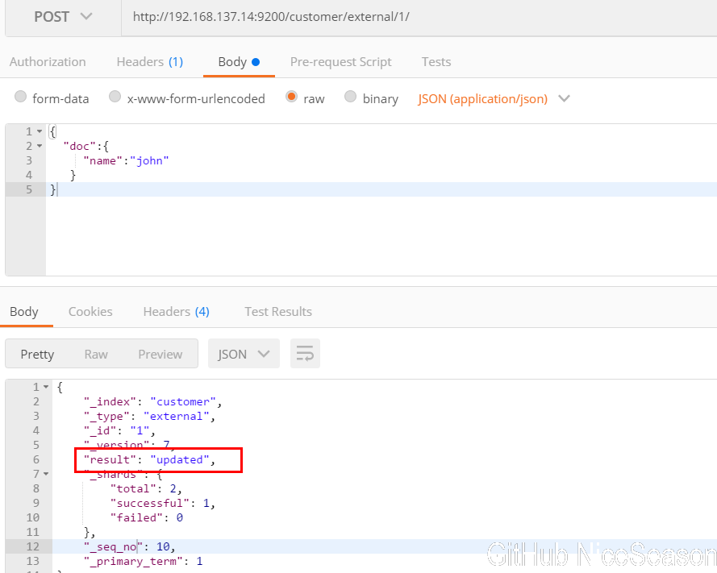

在更新过程中，重复执行更新操作，数据也能够更新成功，不会和原来的数据进行对比。

#### 5）删除文档或索引

```
DELETE customer/external/1
DELETE customer
```

注：elasticsearch并没有提供删除类型的操作，只提供了删除索引和文档的操作。


实例：删除id=1的数据，删除后继续查询


实例：删除整个costomer索引数据

删除前，所有的索引

```
green  open .kibana_task_manager_1   KWLtjcKRRuaV9so_v15WYg 1 0 2 0 39.8kb 39.8kb
green  open .apm-agent-configuration cuwCpJ5ER0OYsSgAJ7bVYA 1 0 0 0   283b   283b
green  open .kibana_1                PqK_LdUYRpWMy4fK0tMSPw 1 0 7 0 31.2kb 31.2kb
yellow open customer                 nzDYCdnvQjSsapJrAIT8Zw 1 1 4 0  4.4kb  4.4kb
```

删除“ customer ”索引

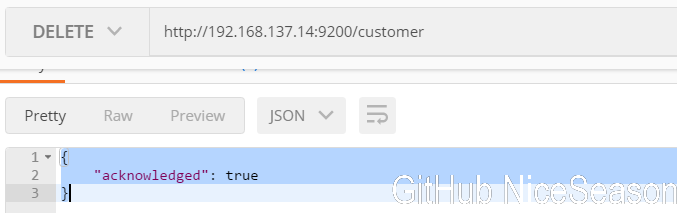

删除后，所有的索引

```
green  open .kibana_task_manager_1   KWLtjcKRRuaV9so_v15WYg 1 0 2 0 39.8kb 39.8kb
green  open .apm-agent-configuration cuwCpJ5ER0OYsSgAJ7bVYA 1 0 0 0   283b   283b
green  open .kibana_1                PqK_LdUYRpWMy4fK0tMSPw 1 0 7 0 31.2kb 31.2kb
```


#### 6）eleasticsearch的批量操作——bulk
语法格式：

```json
{action:{metadata}}\n
{request body  }\n

{action:{metadata}}\n
{request body  }\n
```

这里的批量操作，当发生某一条执行发生失败时，其他的数据仍然能够接着执行，也就是说彼此之间是独立的。

bulk api以此按顺序执行所有的action（动作）。如果一个单个的动作因任何原因失败，它将继续处理它后面剩余的动作。当bulk api返回时，它将提供每个动作的状态（与发送的顺序相同），所以您可以检查是否一个指定的动作是否失败了。

实例1: 执行多条数据


```json
POST customer/external/_bulk
{"index":{"_id":"1"}}
{"name":"John Doe"}
{"index":{"_id":"2"}}
{"name":"John Doe"}
```

执行结果

```json
#! Deprecation: [types removal] Specifying types in bulk requests is deprecated.
{
  "took" : 491,
  "errors" : false,
  "items" : [
    {
      "index" : {
        "_index" : "customer",
        "_type" : "external",
        "_id" : "1",
        "_version" : 1,
        "result" : "created",
        "_shards" : {
          "total" : 2,
          "successful" : 1,
          "failed" : 0
        },
        "_seq_no" : 0,
        "_primary_term" : 1,
        "status" : 201
      }
    },
    {
      "index" : {
        "_index" : "customer",
        "_type" : "external",
        "_id" : "2",
        "_version" : 1,
        "result" : "created",
        "_shards" : {
          "total" : 2,
          "successful" : 1,
          "failed" : 0
        },
        "_seq_no" : 1,
        "_primary_term" : 1,
        "status" : 201
      }
    }
  ]
}

```


实例2：对于整个索引执行批量操作

```json
POST /_bulk
{"delete":{"_index":"website","_type":"blog","_id":"123"}}
{"create":{"_index":"website","_type":"blog","_id":"123"}}
{"title":"my first blog post"}
{"index":{"_index":"website","_type":"blog"}}
{"title":"my second blog post"}
{"update":{"_index":"website","_type":"blog","_id":"123"}}
{"doc":{"title":"my updated blog post"}}
```

运行结果：

```json
#! Deprecation: [types removal] Specifying types in bulk requests is deprecated.
{
  "took" : 608,
  "errors" : false,
  "items" : [
    {
      "delete" : {
        "_index" : "website",
        "_type" : "blog",
        "_id" : "123",
        "_version" : 1,
        "result" : "not_found",
        "_shards" : {
          "total" : 2,
          "successful" : 1,
          "failed" : 0
        },
        "_seq_no" : 0,
        "_primary_term" : 1,
        "status" : 404
      }
    },
    {
      "create" : {
        "_index" : "website",
        "_type" : "blog",
        "_id" : "123",
        "_version" : 2,
        "result" : "created",
        "_shards" : {
          "total" : 2,
          "successful" : 1,
          "failed" : 0
        },
        "_seq_no" : 1,
        "_primary_term" : 1,
        "status" : 201
      }
    },
    {
      "index" : {
        "_index" : "website",
        "_type" : "blog",
        "_id" : "MCOs0HEBHYK_MJXUyYIz",
        "_version" : 1,
        "result" : "created",
        "_shards" : {
          "total" : 2,
          "successful" : 1,
          "failed" : 0
        },
        "_seq_no" : 2,
        "_primary_term" : 1,
        "status" : 201
      }
    },
    {
      "update" : {
        "_index" : "website",
        "_type" : "blog",
        "_id" : "123",
        "_version" : 3,
        "result" : "updated",
        "_shards" : {
          "total" : 2,
          "successful" : 1,
          "failed" : 0
        },
        "_seq_no" : 3,
        "_primary_term" : 1,
        "status" : 200
      }
    }
  ]
}

```


#### 7）样本测试数据

准备了一份顾客银行账户信息的虚构的JSON文档样本。每个文档都有下列的schema（模式）。

```json
{
	"account_number": 1,
	"balance": 39225,
	"firstname": "Amber",
	"lastname": "Duke",
	"age": 32,
	"gender": "M",
	"address": "880 Holmes Lane",
	"employer": "Pyrami",
	"email": "amberduke@pyrami.com",
	"city": "Brogan",
	"state": "IL"
}
```

 https://github.com/elastic/elasticsearch/blob/master/docs/src/test/resources/accounts.json ，导入测试数据，

POST bank/account/_bulk


### 3、检索

#### 1）search Api

ES支持两种基本方式检索；

* 通过REST request uri 发送搜索参数 （uri +检索参数）；
* 通过REST request body 来发送它们（uri+请求体）；

信息检索

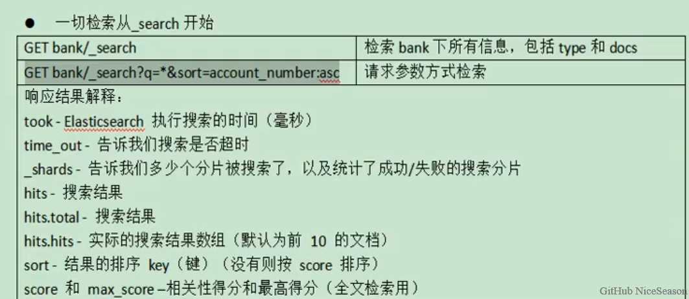

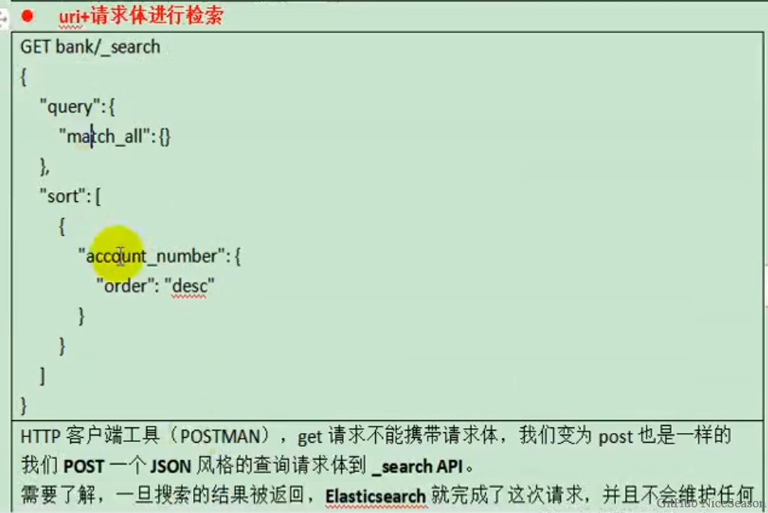


uri+请求体进行检索

```json
GET /bank/_search
{
  "query": { "match_all": {} },
  "sort": [
    { "account_number": "asc" },
    {"balance":"desc"}
  ]
}

```


HTTP客户端工具（），get请求不能够携带请求体，


```
GET bank/_search?q=*&sort=account_number:asc
```

返回结果：

```json
{
  "took" : 235,
  "timed_out" : false,
  "_shards" : {
    "total" : 1,
    "successful" : 1,
    "skipped" : 0,
    "failed" : 0
  },
  "hits" : {
    "total" : {
      "value" : 1000,
      "relation" : "eq"
    },
    "max_score" : null,
    "hits" : [
      {
        "_index" : "bank",
        "_type" : "account",
        "_id" : "0",
        "_score" : null,
        "_source" : {
          "account_number" : 0,
          "balance" : 16623,
          "firstname" : "Bradshaw",
          "lastname" : "Mckenzie",
          "age" : 29,
          "gender" : "F",
          "address" : "244 Columbus Place",
          "employer" : "Euron",
          "email" : "bradshawmckenzie@euron.com",
          "city" : "Hobucken",
          "state" : "CO"
        },
        "sort" : [
          0
        ]
      },
      {
        "_index" : "bank",
        "_type" : "account",
        "_id" : "1",
        "_score" : null,
        "_source" : {
          "account_number" : 1,
          "balance" : 39225,
          "firstname" : "Amber",
          "lastname" : "Duke",
          "age" : 32,
          "gender" : "M",
          "address" : "880 Holmes Lane",
          "employer" : "Pyrami",
          "email" : "amberduke@pyrami.com",
          "city" : "Brogan",
          "state" : "IL"
        },
        "sort" : [
          1
        ]
      },
      {
        "_index" : "bank",
        "_type" : "account",
        "_id" : "2",
        "_score" : null,
        "_source" : {
          "account_number" : 2,
          "balance" : 28838,
          "firstname" : "Roberta",
          "lastname" : "Bender",
          "age" : 22,
          "gender" : "F",
          "address" : "560 Kingsway Place",
          "employer" : "Chillium",
          "email" : "robertabender@chillium.com",
          "city" : "Bennett",
          "state" : "LA"
        },
        "sort" : [
          2
        ]
      },
      {
        "_index" : "bank",
        "_type" : "account",
        "_id" : "3",
        "_score" : null,
        "_source" : {
          "account_number" : 3,
          "balance" : 44947,
          "firstname" : "Levine",
          "lastname" : "Burks",
          "age" : 26,
          "gender" : "F",
          "address" : "328 Wilson Avenue",
          "employer" : "Amtap",
          "email" : "levineburks@amtap.com",
          "city" : "Cochranville",
          "state" : "HI"
        },
        "sort" : [
          3
        ]
      },
      {
        "_index" : "bank",
        "_type" : "account",
        "_id" : "4",
        "_score" : null,
        "_source" : {
          "account_number" : 4,
          "balance" : 27658,
          "firstname" : "Rodriquez",
          "lastname" : "Flores",
          "age" : 31,
          "gender" : "F",
          "address" : "986 Wyckoff Avenue",
          "employer" : "Tourmania",
          "email" : "rodriquezflores@tourmania.com",
          "city" : "Eastvale",
          "state" : "HI"
        },
        "sort" : [
          4
        ]
      },
      {
        "_index" : "bank",
        "_type" : "account",
        "_id" : "5",
        "_score" : null,
        "_source" : {
          "account_number" : 5,
          "balance" : 29342,
          "firstname" : "Leola",
          "lastname" : "Stewart",
          "age" : 30,
          "gender" : "F",
          "address" : "311 Elm Place",
          "employer" : "Diginetic",
          "email" : "leolastewart@diginetic.com",
          "city" : "Fairview",
          "state" : "NJ"
        },
        "sort" : [
          5
        ]
      },
      {
        "_index" : "bank",
        "_type" : "account",
        "_id" : "6",
        "_score" : null,
        "_source" : {
          "account_number" : 6,
          "balance" : 5686,
          "firstname" : "Hattie",
          "lastname" : "Bond",
          "age" : 36,
          "gender" : "M",
          "address" : "671 Bristol Street",
          "employer" : "Netagy",
          "email" : "hattiebond@netagy.com",
          "city" : "Dante",
          "state" : "TN"
        },
        "sort" : [
          6
        ]
      },
      {
        "_index" : "bank",
        "_type" : "account",
        "_id" : "7",
        "_score" : null,
        "_source" : {
          "account_number" : 7,
          "balance" : 39121,
          "firstname" : "Levy",
          "lastname" : "Richard",
          "age" : 22,
          "gender" : "M",
          "address" : "820 Logan Street",
          "employer" : "Teraprene",
          "email" : "levyrichard@teraprene.com",
          "city" : "Shrewsbury",
          "state" : "MO"
        },
        "sort" : [
          7
        ]
      },
      {
        "_index" : "bank",
        "_type" : "account",
        "_id" : "8",
        "_score" : null,
        "_source" : {
          "account_number" : 8,
          "balance" : 48868,
          "firstname" : "Jan",
          "lastname" : "Burns",
          "age" : 35,
          "gender" : "M",
          "address" : "699 Visitation Place",
          "employer" : "Glasstep",
          "email" : "janburns@glasstep.com",
          "city" : "Wakulla",
          "state" : "AZ"
        },
        "sort" : [
          8
        ]
      },
      {
        "_index" : "bank",
        "_type" : "account",
        "_id" : "9",
        "_score" : null,
        "_source" : {
          "account_number" : 9,
          "balance" : 24776,
          "firstname" : "Opal",
          "lastname" : "Meadows",
          "age" : 39,
          "gender" : "M",
          "address" : "963 Neptune Avenue",
          "employer" : "Cedward",
          "email" : "opalmeadows@cedward.com",
          "city" : "Olney",
          "state" : "OH"
        },
        "sort" : [
          9
        ]
      }
    ]
  }
}

```


（1）只有6条数据，这是因为存在分页查询；

使用`from`和`size`可以指定查询

```http
GET /bank/_search
{
  "query": { "match_all": {} },
  "sort": [
    { "account_number": "asc" },
    {"balance":"desc"}
  ],
  "from": 20,
  "size": 10
}
```


（2）详细的字段信息，参照： https://www.elastic.co/guide/en/elasticsearch/reference/current/getting-started-search.html 

>
>
>The response also provides the following information about the search request:
>
>- `took` – how long it took Elasticsearch to run the query, in milliseconds
>- `timed_out` – whether or not the search request timed out
>- `_shards` – how many shards were searched and a breakdown of how many shards succeeded, failed, or were skipped.
>- `max_score` – the score of the most relevant document found
>- `hits.total.value` - how many matching documents were found
>- `hits.sort` - the document’s sort position (when not sorting by relevance score)
>- `hits._score` - the document’s relevance score (not applicable when using `match_all`)


#### 2）Query DSL

##### （1）基本语法格式

Elasticsearch提供了一个可以执行查询的Json风格的DSL。这个被称为Query DSL，该查询语言非常全面。

一个查询语句的典型结构

```json
QUERY_NAME:{
   ARGUMENT:VALUE,
   ARGUMENT:VALUE,...
}
```


如果针对于某个字段，那么它的结构如下：

```json
{
  QUERY_NAME:{
     FIELD_NAME:{
       ARGUMENT:VALUE,
       ARGUMENT:VALUE,...
      }   
   }
}
```


```json
GET bank/_search
{
  "query": {
    "match_all": {}
  },
  "from": 0,
  "size": 5,
  "sort": [
    {
      "account_number": {
        "order": "desc"
      }
    }
  ]
}
```


query定义如何查询；

- match_all查询类型【代表查询所有的所有】，es中可以在query中组合非常多的查询类型完成复杂查询；
- 除了query参数之外，我们可也传递其他的参数以改变查询结果，如sort，size；
- from+size限定，完成分页功能；
- sort排序，多字段排序，会在前序字段相等时后续字段内部排序，否则以前序为准；


##### （2）返回部分字段

```json
GET bank/_search
{
  "query": {
    "match_all": {}
  },
  "from": 0,
  "size": 5,
  "sort": [
    {
      "account_number": {
        "order": "desc"
      }
    }
  ],
  "_source": ["balance","firstname"]
  
}

```

查询结果：

```json
{
  "took" : 18,
  "timed_out" : false,
  "_shards" : {
    "total" : 1,
    "successful" : 1,
    "skipped" : 0,
    "failed" : 0
  },
  "hits" : {
    "total" : {
      "value" : 1000,
      "relation" : "eq"
    },
    "max_score" : null,
    "hits" : [
      {
        "_index" : "bank",
        "_type" : "account",
        "_id" : "999",
        "_score" : null,
        "_source" : {
          "firstname" : "Dorothy",
          "balance" : 6087
        },
        "sort" : [
          999
        ]
      },
      {
        "_index" : "bank",
        "_type" : "account",
        "_id" : "998",
        "_score" : null,
        "_source" : {
          "firstname" : "Letha",
          "balance" : 16869
        },
        "sort" : [
          998
        ]
      },
      {
        "_index" : "bank",
        "_type" : "account",
        "_id" : "997",
        "_score" : null,
        "_source" : {
          "firstname" : "Combs",
          "balance" : 25311
        },
        "sort" : [
          997
        ]
      },
      {
        "_index" : "bank",
        "_type" : "account",
        "_id" : "996",
        "_score" : null,
        "_source" : {
          "firstname" : "Andrews",
          "balance" : 17541
        },
        "sort" : [
          996
        ]
      },
      {
        "_index" : "bank",
        "_type" : "account",
        "_id" : "995",
        "_score" : null,
        "_source" : {
          "firstname" : "Phelps",
          "balance" : 21153
        },
        "sort" : [
          995
        ]
      }
    ]
  }
}

```


##### （3）match匹配查询

* 基本类型（非字符串），精确控制

```json
GET bank/_search
{
  "query": {
    "match": {
      "account_number": "20"
    }
  }
}

```

match返回account_number=20的数据。

查询结果：

```json
{
  "took" : 1,
  "timed_out" : false,
  "_shards" : {
    "total" : 1,
    "successful" : 1,
    "skipped" : 0,
    "failed" : 0
  },
  "hits" : {
    "total" : {
      "value" : 1,
      "relation" : "eq"
    },
    "max_score" : 1.0,
    "hits" : [
      {
        "_index" : "bank",
        "_type" : "account",
        "_id" : "20",
        "_score" : 1.0,
        "_source" : {
          "account_number" : 20,
          "balance" : 16418,
          "firstname" : "Elinor",
          "lastname" : "Ratliff",
          "age" : 36,
          "gender" : "M",
          "address" : "282 Kings Place",
          "employer" : "Scentric",
          "email" : "elinorratliff@scentric.com",
          "city" : "Ribera",
          "state" : "WA"
        }
      }
    ]
  }
}

```


* 字符串，全文检索

```json
GET bank/_search
{
  "query": {
    "match": {
      "address": "kings"
    }
  }
}
```

全文检索，最终会按照评分进行排序，会对检索条件进行分词匹配。

查询结果：

```json
{
  "took" : 30,
  "timed_out" : false,
  "_shards" : {
    "total" : 1,
    "successful" : 1,
    "skipped" : 0,
    "failed" : 0
  },
  "hits" : {
    "total" : {
      "value" : 2,
      "relation" : "eq"
    },
    "max_score" : 5.990829,
    "hits" : [
      {
        "_index" : "bank",
        "_type" : "account",
        "_id" : "20",
        "_score" : 5.990829,
        "_source" : {
          "account_number" : 20,
          "balance" : 16418,
          "firstname" : "Elinor",
          "lastname" : "Ratliff",
          "age" : 36,
          "gender" : "M",
          "address" : "282 Kings Place",
          "employer" : "Scentric",
          "email" : "elinorratliff@scentric.com",
          "city" : "Ribera",
          "state" : "WA"
        }
      },
      {
        "_index" : "bank",
        "_type" : "account",
        "_id" : "722",
        "_score" : 5.990829,
        "_source" : {
          "account_number" : 722,
          "balance" : 27256,
          "firstname" : "Roberts",
          "lastname" : "Beasley",
          "age" : 34,
          "gender" : "F",
          "address" : "305 Kings Hwy",
          "employer" : "Quintity",
          "email" : "robertsbeasley@quintity.com",
          "city" : "Hayden",
          "state" : "PA"
        }
      }
    ]
  }
}

```


##### （4） match_phrase [短句匹配] 

将需要匹配的值当成一整个单词（不分词）进行检索

```json
GET bank/_search
{
  "query": {
    "match_phrase": {
      "address": "mill road"
    }
  }
}
```
查处address中包含mill_road的所有记录，并给出相关性得分

查看结果：

```json
{
  "took" : 32,
  "timed_out" : false,
  "_shards" : {
    "total" : 1,
    "successful" : 1,
    "skipped" : 0,
    "failed" : 0
  },
  "hits" : {
    "total" : {
      "value" : 1,
      "relation" : "eq"
    },
    "max_score" : 8.926605,
    "hits" : [
      {
        "_index" : "bank",
        "_type" : "account",
        "_id" : "970",
        "_score" : 8.926605,
        "_source" : {
          "account_number" : 970,
          "balance" : 19648,
          "firstname" : "Forbes",
          "lastname" : "Wallace",
          "age" : 28,
          "gender" : "M",
          "address" : "990 Mill Road",
          "employer" : "Pheast",
          "email" : "forbeswallace@pheast.com",
          "city" : "Lopezo",
          "state" : "AK"
        }
      }
    ]
  }
}

```


match_phrase和Match的区别，观察如下实例：

```json
GET bank/_search
{
  "query": {
    "match_phrase": {
      "address": "990 Mill"
    }
  }
}
```

查询结果：

```json
{
  "took" : 0,
  "timed_out" : false,
  "_shards" : {
    "total" : 1,
    "successful" : 1,
    "skipped" : 0,
    "failed" : 0
  },
  "hits" : {
    "total" : {
      "value" : 1,
      "relation" : "eq"
    },
    "max_score" : 10.806405,
    "hits" : [
      {
        "_index" : "bank",
        "_type" : "account",
        "_id" : "970",
        "_score" : 10.806405,
        "_source" : {
          "account_number" : 970,
          "balance" : 19648,
          "firstname" : "Forbes",
          "lastname" : "Wallace",
          "age" : 28,
          "gender" : "M",
          "address" : "990 Mill Road",
          "employer" : "Pheast",
          "email" : "forbeswallace@pheast.com",
          "city" : "Lopezo",
          "state" : "AK"
        }
      }
    ]
  }
}

```


使用match的keyword

```json
GET bank/_search
{
  "query": {
    "match": {
      "address.keyword": "990 Mill"
    }
  }
}
```

查询结果，一条也未匹配到

```json
{
  "took" : 0,
  "timed_out" : false,
  "_shards" : {
    "total" : 1,
    "successful" : 1,
    "skipped" : 0,
    "failed" : 0
  },
  "hits" : {
    "total" : {
      "value" : 0,
      "relation" : "eq"
    },
    "max_score" : null,
    "hits" : [ ]
  }
}

```


修改匹配条件为“990 Mill Road”

```json
GET bank/_search
{
  "query": {
    "match": {
      "address.keyword": "990 Mill Road"
    }
  }
}
```

查询出一条数据

```json
{
  "took" : 1,
  "timed_out" : false,
  "_shards" : {
    "total" : 1,
    "successful" : 1,
    "skipped" : 0,
    "failed" : 0
  },
  "hits" : {
    "total" : {
      "value" : 1,
      "relation" : "eq"
    },
    "max_score" : 6.5032897,
    "hits" : [
      {
        "_index" : "bank",
        "_type" : "account",
        "_id" : "970",
        "_score" : 6.5032897,
        "_source" : {
          "account_number" : 970,
          "balance" : 19648,
          "firstname" : "Forbes",
          "lastname" : "Wallace",
          "age" : 28,
          "gender" : "M",
          "address" : "990 Mill Road",
          "employer" : "Pheast",
          "email" : "forbeswallace@pheast.com",
          "city" : "Lopezo",
          "state" : "AK"
        }
      }
    ]
  }
}

```


文本字段的匹配，使用keyword，匹配的条件就是要显示字段的全部值，要进行精确匹配的。

match_phrase是做短语匹配，只要文本中包含匹配条件，就能匹配到。


##### （5）multi_math【多字段匹配】

```json
GET bank/_search
{
  "query": {
    "multi_match": {
      "query": "mill",
      "fields": [
        "state",
        "address"
      ]
    }
  }
}
```
state或者address中包含mill，并且在查询过程中，会对于查询条件进行分词。

查询结果：

```json
{
  "took" : 28,
  "timed_out" : false,
  "_shards" : {
    "total" : 1,
    "successful" : 1,
    "skipped" : 0,
    "failed" : 0
  },
  "hits" : {
    "total" : {
      "value" : 4,
      "relation" : "eq"
    },
    "max_score" : 5.4032025,
    "hits" : [
      {
        "_index" : "bank",
        "_type" : "account",
        "_id" : "970",
        "_score" : 5.4032025,
        "_source" : {
          "account_number" : 970,
          "balance" : 19648,
          "firstname" : "Forbes",
          "lastname" : "Wallace",
          "age" : 28,
          "gender" : "M",
          "address" : "990 Mill Road",
          "employer" : "Pheast",
          "email" : "forbeswallace@pheast.com",
          "city" : "Lopezo",
          "state" : "AK"
        }
      },
      {
        "_index" : "bank",
        "_type" : "account",
        "_id" : "136",
        "_score" : 5.4032025,
        "_source" : {
          "account_number" : 136,
          "balance" : 45801,
          "firstname" : "Winnie",
          "lastname" : "Holland",
          "age" : 38,
          "gender" : "M",
          "address" : "198 Mill Lane",
          "employer" : "Neteria",
          "email" : "winnieholland@neteria.com",
          "city" : "Urie",
          "state" : "IL"
        }
      },
      {
        "_index" : "bank",
        "_type" : "account",
        "_id" : "345",
        "_score" : 5.4032025,
        "_source" : {
          "account_number" : 345,
          "balance" : 9812,
          "firstname" : "Parker",
          "lastname" : "Hines",
          "age" : 38,
          "gender" : "M",
          "address" : "715 Mill Avenue",
          "employer" : "Baluba",
          "email" : "parkerhines@baluba.com",
          "city" : "Blackgum",
          "state" : "KY"
        }
      },
      {
        "_index" : "bank",
        "_type" : "account",
        "_id" : "472",
        "_score" : 5.4032025,
        "_source" : {
          "account_number" : 472,
          "balance" : 25571,
          "firstname" : "Lee",
          "lastname" : "Long",
          "age" : 32,
          "gender" : "F",
          "address" : "288 Mill Street",
          "employer" : "Comverges",
          "email" : "leelong@comverges.com",
          "city" : "Movico",
          "state" : "MT"
        }
      }
    ]
  }
}

```


##### （6）bool用来做复合查询

复合语句可以合并，任何其他查询语句，包括符合语句。这也就意味着，复合语句之间
可以互相嵌套，可以表达非常复杂的逻辑。

must：必须达到must所列举的所有条件

```json
GET bank/_search
{
   "query":{
        "bool":{
             "must":[
              {"match":{"address":"mill"}},
              {"match":{"gender":"M"}}
             ]
         }
    }
}
```

must_not，必须不匹配must_not所列举的所有条件。

should，应该满足should所列举的条件。


实例：查询gender=m，并且address=mill的数据

```json
GET bank/_search
{
  "query": {
    "bool": {
      "must": [
        {
          "match": {
            "gender": "M"
          }
        },
        {
          "match": {
            "address": "mill"
          }
        }
      ]
    }
  }
}
```

查询结果：

```json
{
  "took" : 1,
  "timed_out" : false,
  "_shards" : {
    "total" : 1,
    "successful" : 1,
    "skipped" : 0,
    "failed" : 0
  },
  "hits" : {
    "total" : {
      "value" : 3,
      "relation" : "eq"
    },
    "max_score" : 6.0824604,
    "hits" : [
      {
        "_index" : "bank",
        "_type" : "account",
        "_id" : "970",
        "_score" : 6.0824604,
        "_source" : {
          "account_number" : 970,
          "balance" : 19648,
          "firstname" : "Forbes",
          "lastname" : "Wallace",
          "age" : 28,
          "gender" : "M",
          "address" : "990 Mill Road",
          "employer" : "Pheast",
          "email" : "forbeswallace@pheast.com",
          "city" : "Lopezo",
          "state" : "AK"
        }
      },
      {
        "_index" : "bank",
        "_type" : "account",
        "_id" : "136",
        "_score" : 6.0824604,
        "_source" : {
          "account_number" : 136,
          "balance" : 45801,
          "firstname" : "Winnie",
          "lastname" : "Holland",
          "age" : 38,
          "gender" : "M",
          "address" : "198 Mill Lane",
          "employer" : "Neteria",
          "email" : "winnieholland@neteria.com",
          "city" : "Urie",
          "state" : "IL"
        }
      },
      {
        "_index" : "bank",
        "_type" : "account",
        "_id" : "345",
        "_score" : 6.0824604,
        "_source" : {
          "account_number" : 345,
          "balance" : 9812,
          "firstname" : "Parker",
          "lastname" : "Hines",
          "age" : 38,
          "gender" : "M",
          "address" : "715 Mill Avenue",
          "employer" : "Baluba",
          "email" : "parkerhines@baluba.com",
          "city" : "Blackgum",
          "state" : "KY"
        }
      }
    ]
  }
}

```


**must_not：必须不是指定的情况**

实例：查询gender=m，并且address=mill的数据，但是age不等于38的

```json

GET bank/_search
{
  "query": {
    "bool": {
      "must": [
        {
          "match": {
            "gender": "M"
          }
        },
        {
          "match": {
            "address": "mill"
          }
        }
      ],
      "must_not": [
        {
          "match": {
            "age": "38"
          }
        }
      ]
    }
  }

```

查询结果：

```json
{
  "took" : 4,
  "timed_out" : false,
  "_shards" : {
    "total" : 1,
    "successful" : 1,
    "skipped" : 0,
    "failed" : 0
  },
  "hits" : {
    "total" : {
      "value" : 1,
      "relation" : "eq"
    },
    "max_score" : 6.0824604,
    "hits" : [
      {
        "_index" : "bank",
        "_type" : "account",
        "_id" : "970",
        "_score" : 6.0824604,
        "_source" : {
          "account_number" : 970,
          "balance" : 19648,
          "firstname" : "Forbes",
          "lastname" : "Wallace",
          "age" : 28,
          "gender" : "M",
          "address" : "990 Mill Road",
          "employer" : "Pheast",
          "email" : "forbeswallace@pheast.com",
          "city" : "Lopezo",
          "state" : "AK"
        }
      }
    ]
  }
}

```


**should：应该达到should列举的条件，如果到达会增加相关文档的评分，并不会改变查询的结果。如果query中只有should且只有一种匹配规则，那么should的条件就会被作为默认匹配条件二区改变查询结果。**

实例：匹配lastName应该等于Wallace的数据

```json
GET bank/_search
{
  "query": {
    "bool": {
      "must": [
        {
          "match": {
            "gender": "M"
          }
        },
        {
          "match": {
            "address": "mill"
          }
        }
      ],
      "must_not": [
        {
          "match": {
            "age": "18"
          }
        }
      ],
      "should": [
        {
          "match": {
            "lastname": "Wallace"
          }
        }
      ]
    }
  }
}
```


查询结果：

```json
{
  "took" : 5,
  "timed_out" : false,
  "_shards" : {
    "total" : 1,
    "successful" : 1,
    "skipped" : 0,
    "failed" : 0
  },
  "hits" : {
    "total" : {
      "value" : 3,
      "relation" : "eq"
    },
    "max_score" : 12.585751,
    "hits" : [
      {
        "_index" : "bank",
        "_type" : "account",
        "_id" : "970",
        "_score" : 12.585751,
        "_source" : {
          "account_number" : 970,
          "balance" : 19648,
          "firstname" : "Forbes",
          "lastname" : "Wallace",
          "age" : 28,
          "gender" : "M",
          "address" : "990 Mill Road",
          "employer" : "Pheast",
          "email" : "forbeswallace@pheast.com",
          "city" : "Lopezo",
          "state" : "AK"
        }
      },
      {
        "_index" : "bank",
        "_type" : "account",
        "_id" : "136",
        "_score" : 6.0824604,
        "_source" : {
          "account_number" : 136,
          "balance" : 45801,
          "firstname" : "Winnie",
          "lastname" : "Holland",
          "age" : 38,
          "gender" : "M",
          "address" : "198 Mill Lane",
          "employer" : "Neteria",
          "email" : "winnieholland@neteria.com",
          "city" : "Urie",
          "state" : "IL"
        }
      },
      {
        "_index" : "bank",
        "_type" : "account",
        "_id" : "345",
        "_score" : 6.0824604,
        "_source" : {
          "account_number" : 345,
          "balance" : 9812,
          "firstname" : "Parker",
          "lastname" : "Hines",
          "age" : 38,
          "gender" : "M",
          "address" : "715 Mill Avenue",
          "employer" : "Baluba",
          "email" : "parkerhines@baluba.com",
          "city" : "Blackgum",
          "state" : "KY"
        }
      }
    ]
  }
}

```

能够看到相关度越高，得分也越高。

##### （7）Filter【结果过滤】

并不是所有的查询都需要产生分数，特别是哪些仅用于filtering过滤的文档。为了不计算分数，elasticsearch会自动检查场景并且优化查询的执行。

```json
GET bank/_search
{
  "query": {
    "bool": {
      "must": [
        {
          "match": {
            "address": "mill"
          }
        }
      ],
      "filter": {
        "range": {
          "balance": {
            "gte": "10000",
            "lte": "20000"
          }
        }
      }
    }
  }
}

```

这里先是查询所有匹配address=mill的文档，然后再根据10000<=balance<=20000进行过滤查询结果

查询结果：

```json
{
  "took" : 2,
  "timed_out" : false,
  "_shards" : {
    "total" : 1,
    "successful" : 1,
    "skipped" : 0,
    "failed" : 0
  },
  "hits" : {
    "total" : {
      "value" : 1,
      "relation" : "eq"
    },
    "max_score" : 5.4032025,
    "hits" : [
      {
        "_index" : "bank",
        "_type" : "account",
        "_id" : "970",
        "_score" : 5.4032025,
        "_source" : {
          "account_number" : 970,
          "balance" : 19648,
          "firstname" : "Forbes",
          "lastname" : "Wallace",
          "age" : 28,
          "gender" : "M",
          "address" : "990 Mill Road",
          "employer" : "Pheast",
          "email" : "forbeswallace@pheast.com",
          "city" : "Lopezo",
          "state" : "AK"
        }
      }
    ]
  }
}

```


Each `must`, `should`, and `must_not` element in a Boolean query is referred to as a query clause. How well a document meets the criteria in each `must` or `should` clause contributes to the document’s *relevance score*. The higher the score, the better the document matches your search criteria. By default, Elasticsearch returns documents ranked by these relevance scores.

 在boolean查询中，`must`, `should` 和`must_not` 元素都被称为查询子句 。 文档是否符合每个“must”或“should”子句中的标准，决定了文档的“相关性得分”。  得分越高，文档越符合您的搜索条件。  默认情况下，Elasticsearch返回根据这些相关性得分排序的文档。 

The criteria in a `must_not` clause is treated as a *filter*. It affects whether or not the document is included in the results, but does not contribute to how documents are scored. You can also explicitly specify arbitrary filters to include or exclude documents based on structured data.

`“must_not”子句中的条件被视为“过滤器”。` 它影响文档是否包含在结果中，  但不影响文档的评分方式。  还可以显式地指定任意过滤器来包含或排除基于结构化数据的文档。 


filter在使用过程中，并不会计算相关性得分：

```json
GET bank/_search
{
  "query": {
    "bool": {
      "must": [
        {
          "match": {
            "address": "mill"
          }
        }
      ],
      "filter": {
        "range": {
          "balance": {
            "gte": "10000",
            "lte": "20000"
          }
        }
      }
    }
  }
}
```

查询结果：

```json
{
  "took" : 1,
  "timed_out" : false,
  "_shards" : {
    "total" : 1,
    "successful" : 1,
    "skipped" : 0,
    "failed" : 0
  },
  "hits" : {
    "total" : {
      "value" : 213,
      "relation" : "eq"
    },
    "max_score" : 0.0,
    "hits" : [
      {
        "_index" : "bank",
        "_type" : "account",
        "_id" : "20",
        "_score" : 0.0,
        "_source" : {
          "account_number" : 20,
          "balance" : 16418,
          "firstname" : "Elinor",
          "lastname" : "Ratliff",
          "age" : 36,
          "gender" : "M",
          "address" : "282 Kings Place",
          "employer" : "Scentric",
          "email" : "elinorratliff@scentric.com",
          "city" : "Ribera",
          "state" : "WA"
        }
      },
      {
        "_index" : "bank",
        "_type" : "account",
        "_id" : "37",
        "_score" : 0.0,
        "_source" : {
          "account_number" : 37,
          "balance" : 18612,
          "firstname" : "Mcgee",
          "lastname" : "Mooney",
          "age" : 39,
          "gender" : "M",
          "address" : "826 Fillmore Place",
          "employer" : "Reversus",
          "email" : "mcgeemooney@reversus.com",
          "city" : "Tooleville",
          "state" : "OK"
        }
      },
      {
        "_index" : "bank",
        "_type" : "account",
        "_id" : "51",
        "_score" : 0.0,
        "_source" : {
          "account_number" : 51,
          "balance" : 14097,
          "firstname" : "Burton",
          "lastname" : "Meyers",
          "age" : 31,
          "gender" : "F",
          "address" : "334 River Street",
          "employer" : "Bezal",
          "email" : "burtonmeyers@bezal.com",
          "city" : "Jacksonburg",
          "state" : "MO"
        }
      },
      {
        "_index" : "bank",
        "_type" : "account",
        "_id" : "56",
        "_score" : 0.0,
        "_source" : {
          "account_number" : 56,
          "balance" : 14992,
          "firstname" : "Josie",
          "lastname" : "Nelson",
          "age" : 32,
          "gender" : "M",
          "address" : "857 Tabor Court",
          "employer" : "Emtrac",
          "email" : "josienelson@emtrac.com",
          "city" : "Sunnyside",
          "state" : "UT"
        }
      },
      {
        "_index" : "bank",
        "_type" : "account",
        "_id" : "121",
        "_score" : 0.0,
        "_source" : {
          "account_number" : 121,
          "balance" : 19594,
          "firstname" : "Acevedo",
          "lastname" : "Dorsey",
          "age" : 32,
          "gender" : "M",
          "address" : "479 Nova Court",
          "employer" : "Netropic",
          "email" : "acevedodorsey@netropic.com",
          "city" : "Islandia",
          "state" : "CT"
        }
      },
      {
        "_index" : "bank",
        "_type" : "account",
        "_id" : "176",
        "_score" : 0.0,
        "_source" : {
          "account_number" : 176,
          "balance" : 18607,
          "firstname" : "Kemp",
          "lastname" : "Walters",
          "age" : 28,
          "gender" : "F",
          "address" : "906 Howard Avenue",
          "employer" : "Eyewax",
          "email" : "kempwalters@eyewax.com",
          "city" : "Why",
          "state" : "KY"
        }
      },
      {
        "_index" : "bank",
        "_type" : "account",
        "_id" : "183",
        "_score" : 0.0,
        "_source" : {
          "account_number" : 183,
          "balance" : 14223,
          "firstname" : "Hudson",
          "lastname" : "English",
          "age" : 26,
          "gender" : "F",
          "address" : "823 Herkimer Place",
          "employer" : "Xinware",
          "email" : "hudsonenglish@xinware.com",
          "city" : "Robbins",
          "state" : "ND"
        }
      },
      {
        "_index" : "bank",
        "_type" : "account",
        "_id" : "222",
        "_score" : 0.0,
        "_source" : {
          "account_number" : 222,
          "balance" : 14764,
          "firstname" : "Rachelle",
          "lastname" : "Rice",
          "age" : 36,
          "gender" : "M",
          "address" : "333 Narrows Avenue",
          "employer" : "Enaut",
          "email" : "rachellerice@enaut.com",
          "city" : "Wright",
          "state" : "AZ"
        }
      },
      {
        "_index" : "bank",
        "_type" : "account",
        "_id" : "227",
        "_score" : 0.0,
        "_source" : {
          "account_number" : 227,
          "balance" : 19780,
          "firstname" : "Coleman",
          "lastname" : "Berg",
          "age" : 22,
          "gender" : "M",
          "address" : "776 Little Street",
          "employer" : "Exoteric",
          "email" : "colemanberg@exoteric.com",
          "city" : "Eagleville",
          "state" : "WV"
        }
      },
      {
        "_index" : "bank",
        "_type" : "account",
        "_id" : "272",
        "_score" : 0.0,
        "_source" : {
          "account_number" : 272,
          "balance" : 19253,
          "firstname" : "Lilly",
          "lastname" : "Morgan",
          "age" : 25,
          "gender" : "F",
          "address" : "689 Fleet Street",
          "employer" : "Biolive",
          "email" : "lillymorgan@biolive.com",
          "city" : "Sunbury",
          "state" : "OH"
        }
      }
    ]
  }
}

```

**能看到所有文档的 "_score" : 0.0。**

##### （8）term

和match一样。匹配某个属性的值。全文检索字段用match，其他非text字段匹配用term。


>
>
>Avoid using the `term` query for [`text`](https://www.elastic.co/guide/en/elasticsearch/reference/7.6/text.html) fields.
>
>避免对文本字段使用“term”查询
>
>By default, Elasticsearch changes the values of `text` fields as part of [analysis](). This can make finding exact matches for `text` field values difficult.
>
> 默认情况下，Elasticsearch作为[analysis]()的一部分更改' text '字段的值。这使得为“text”字段值寻找精确匹配变得困难。 
>
>To search `text` field values, use the match.
>
>要搜索“text”字段值，请使用匹配。
>
>https://www.elastic.co/guide/en/elasticsearch/reference/7.6/query-dsl-term-query.html 

使用term匹配查询

```json
GET bank/_search
{
  "query": {
    "term": {
      "address": "mill Road"
    }
  }
}
```

查询结果：

```json
{
  "took" : 0,
  "timed_out" : false,
  "_shards" : {
    "total" : 1,
    "successful" : 1,
    "skipped" : 0,
    "failed" : 0
  },
  "hits" : {
    "total" : {
      "value" : 0,
      "relation" : "eq"
    },
    "max_score" : null,
    "hits" : [ ]
  }
}

```

一条也没有匹配到


而更换为match匹配时，能够匹配到32个文档


也就是说，**全文检索字段用match，其他非text字段匹配用term**。


##### （9）Aggregation（执行聚合）

聚合提供了从数据中分组和提取数据的能力。最简单的聚合方法大致等于SQL Group by和SQL聚合函数。在elasticsearch中，执行搜索返回this（命中结果），并且同时返回聚合结果，把以响应中的所有hits（命中结果）分隔开的能力。这是非常强大且有效的，你可以执行查询和多个聚合，并且在一次使用中得到各自的（任何一个的）返回结果，使用一次简洁和简化的API啦避免网络往返。


"size":0

size:0不显示搜索数据
aggs：执行聚合。聚合语法如下：

```json
"aggs":{
    "aggs_name这次聚合的名字，方便展示在结果集中":{
        "AGG_TYPE聚合的类型(avg,term,terms)":{}
     }
}，
```


**搜索address中包含mill的所有人的年龄分布以及平均年龄，但不显示这些人的详情**


```json
GET bank/_search
{
  "query": {
    "match": {
      "address": "Mill"
    }
  },
  "aggs": {
    "ageAgg": {
      "terms": {
        "field": "age",
        "size": 10
      }
    },
    "ageAvg": {
      "avg": {
        "field": "age"
      }
    },
    "balanceAvg": {
      "avg": {
        "field": "balance"
      }
    }
  },
  "size": 0
}
```

查询结果：

```json
{
  "took" : 2,
  "timed_out" : false,
  "_shards" : {
    "total" : 1,
    "successful" : 1,
    "skipped" : 0,
    "failed" : 0
  },
  "hits" : {
    "total" : {
      "value" : 4,
      "relation" : "eq"
    },
    "max_score" : null,
    "hits" : [ ]
  },
  "aggregations" : {
    "ageAgg" : {
      "doc_count_error_upper_bound" : 0,
      "sum_other_doc_count" : 0,
      "buckets" : [
        {
          "key" : 38,
          "doc_count" : 2
        },
        {
          "key" : 28,
          "doc_count" : 1
        },
        {
          "key" : 32,
          "doc_count" : 1
        }
      ]
    },
    "ageAvg" : {
      "value" : 34.0
    },
    "balanceAvg" : {
      "value" : 25208.0
    }
  }
}

```


复杂：
按照年龄聚合，并且求这些年龄段的这些人的平均薪资

```json
GET bank/_search
{
  "query": {
    "match_all": {}
  },
  "aggs": {
    "ageAgg": {
      "terms": {
        "field": "age",
        "size": 100
      },
      "aggs": {
        "ageAvg": {
          "avg": {
            "field": "balance"
          }
        }
      }
    }
  },
  "size": 0
}
```

输出结果：

```json
{
  "took" : 49,
  "timed_out" : false,
  "_shards" : {
    "total" : 1,
    "successful" : 1,
    "skipped" : 0,
    "failed" : 0
  },
  "hits" : {
    "total" : {
      "value" : 1000,
      "relation" : "eq"
    },
    "max_score" : null,
    "hits" : [ ]
  },
  "aggregations" : {
    "ageAgg" : {
      "doc_count_error_upper_bound" : 0,
      "sum_other_doc_count" : 0,
      "buckets" : [
        {
          "key" : 31,
          "doc_count" : 61,
          "ageAvg" : {
            "value" : 28312.918032786885
          }
        },
        {
          "key" : 39,
          "doc_count" : 60,
          "ageAvg" : {
            "value" : 25269.583333333332
          }
        },
        {
          "key" : 26,
          "doc_count" : 59,
          "ageAvg" : {
            "value" : 23194.813559322032
          }
        },
        {
          "key" : 32,
          "doc_count" : 52,
          "ageAvg" : {
            "value" : 23951.346153846152
          }
        },
        {
          "key" : 35,
          "doc_count" : 52,
          "ageAvg" : {
            "value" : 22136.69230769231
          }
        },
        {
          "key" : 36,
          "doc_count" : 52,
          "ageAvg" : {
            "value" : 22174.71153846154
          }
        },
        {
          "key" : 22,
          "doc_count" : 51,
          "ageAvg" : {
            "value" : 24731.07843137255
          }
        },
        {
          "key" : 28,
          "doc_count" : 51,
          "ageAvg" : {
            "value" : 28273.882352941175
          }
        },
        {
          "key" : 33,
          "doc_count" : 50,
          "ageAvg" : {
            "value" : 25093.94
          }
        },
        {
          "key" : 34,
          "doc_count" : 49,
          "ageAvg" : {
            "value" : 26809.95918367347
          }
        },
        {
          "key" : 30,
          "doc_count" : 47,
          "ageAvg" : {
            "value" : 22841.106382978724
          }
        },
        {
          "key" : 21,
          "doc_count" : 46,
          "ageAvg" : {
            "value" : 26981.434782608696
          }
        },
        {
          "key" : 40,
          "doc_count" : 45,
          "ageAvg" : {
            "value" : 27183.17777777778
          }
        },
        {
          "key" : 20,
          "doc_count" : 44,
          "ageAvg" : {
            "value" : 27741.227272727272
          }
        },
        {
          "key" : 23,
          "doc_count" : 42,
          "ageAvg" : {
            "value" : 27314.214285714286
          }
        },
        {
          "key" : 24,
          "doc_count" : 42,
          "ageAvg" : {
            "value" : 28519.04761904762
          }
        },
        {
          "key" : 25,
          "doc_count" : 42,
          "ageAvg" : {
            "value" : 27445.214285714286
          }
        },
        {
          "key" : 37,
          "doc_count" : 42,
          "ageAvg" : {
            "value" : 27022.261904761905
          }
        },
        {
          "key" : 27,
          "doc_count" : 39,
          "ageAvg" : {
            "value" : 21471.871794871793
          }
        },
        {
          "key" : 38,
          "doc_count" : 39,
          "ageAvg" : {
            "value" : 26187.17948717949
          }
        },
        {
          "key" : 29,
          "doc_count" : 35,
          "ageAvg" : {
            "value" : 29483.14285714286
          }
        }
      ]
    }
  }
}
```

查出所有年龄分布，并且这些年龄段中M的平均薪资和F的平均薪资以及这个年龄段的总体平均薪资

```json
GET bank/_search
{
  "query": {
    "match_all": {}
  },
  "aggs": {
    "ageAgg": {
      "terms": {
        "field": "age",
        "size": 100
      },
      "aggs": {
        "genderAgg": {
          "terms": {
            "field": "gender.keyword"
          },
          "aggs": {
            "balanceAvg": {
              "avg": {
                "field": "balance"
              }
            }
          }
        },
        "ageBalanceAvg": {
          "avg": {
            "field": "balance"
          }
        }
      }
    }
  },
  "size": 0
}
```

输出结果：

```json
{
  "took" : 119,
  "timed_out" : false,
  "_shards" : {
    "total" : 1,
    "successful" : 1,
    "skipped" : 0,
    "failed" : 0
  },
  "hits" : {
    "total" : {
      "value" : 1000,
      "relation" : "eq"
    },
    "max_score" : null,
    "hits" : [ ]
  },
  "aggregations" : {
    "ageAgg" : {
      "doc_count_error_upper_bound" : 0,
      "sum_other_doc_count" : 0,
      "buckets" : [
        {
          "key" : 31,
          "doc_count" : 61,
          "genderAgg" : {
            "doc_count_error_upper_bound" : 0,
            "sum_other_doc_count" : 0,
            "buckets" : [
              {
                "key" : "M",
                "doc_count" : 35,
                "balanceAvg" : {
                  "value" : 29565.628571428573
                }
              },
              {
                "key" : "F",
                "doc_count" : 26,
                "balanceAvg" : {
                  "value" : 26626.576923076922
                }
              }
            ]
          },
          "ageBalanceAvg" : {
            "value" : 28312.918032786885
          }
        }
      ]
        .......//省略其他
    }
  }
}

```

#### 3）Mapping

##### （1）字段类型

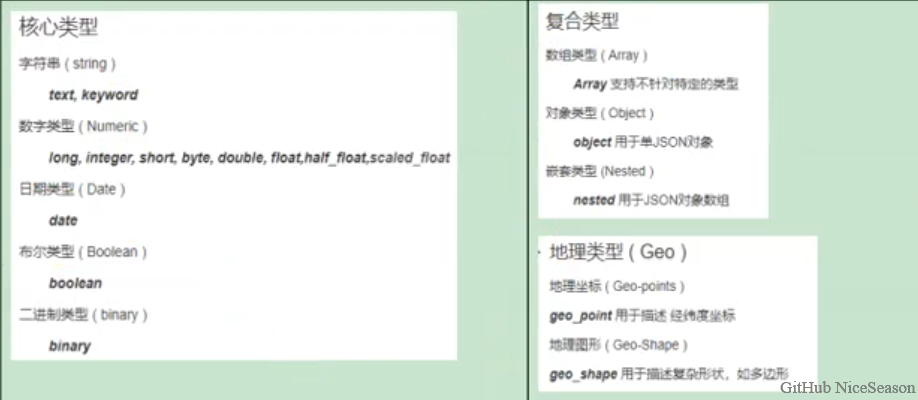


##### （2）映射

Mapping(映射)
Maping是用来定义一个文档（document），以及它所包含的属性（field）是如何存储和索引的。比如：使用maping来定义：

* 哪些字符串属性应该被看做全文本属性（full text fields）；
* 哪些属性包含数字，日期或地理位置；
* 文档中的所有属性是否都嫩被索引（all 配置）；
* 日期的格式；
* 自定义映射规则来执行动态添加属性；

* 查看mapping信息
  GET bank/_mapping

  

  ```json
  {
    "bank" : {
      "mappings" : {
        "properties" : {
          "account_number" : {
            "type" : "long"
          },
          "address" : {
            "type" : "text",
            "fields" : {
              "keyword" : {
                "type" : "keyword",
                "ignore_above" : 256
              }
            }
          },
          "age" : {
            "type" : "long"
          },
          "balance" : {
            "type" : "long"
          },
          "city" : {
            "type" : "text",
            "fields" : {
              "keyword" : {
                "type" : "keyword",
                "ignore_above" : 256
              }
            }
          },
          "email" : {
            "type" : "text",
            "fields" : {
              "keyword" : {
                "type" : "keyword",
                "ignore_above" : 256
              }
            }
          },
          "employer" : {
            "type" : "text",
            "fields" : {
              "keyword" : {
                "type" : "keyword",
                "ignore_above" : 256
              }
            }
          },
          "firstname" : {
            "type" : "text",
            "fields" : {
              "keyword" : {
                "type" : "keyword",
                "ignore_above" : 256
              }
            }
          },
          "gender" : {
            "type" : "text",
            "fields" : {
              "keyword" : {
                "type" : "keyword",
                "ignore_above" : 256
              }
            }
          },
          "lastname" : {
            "type" : "text",
            "fields" : {
              "keyword" : {
                "type" : "keyword",
                "ignore_above" : 256
              }
            }
          },
          "state" : {
            "type" : "text",
            "fields" : {
              "keyword" : {
                "type" : "keyword",
                "ignore_above" : 256
              }
            }
          }
        }
      }
    }
  }
  ```

  

* 修改mapping信息

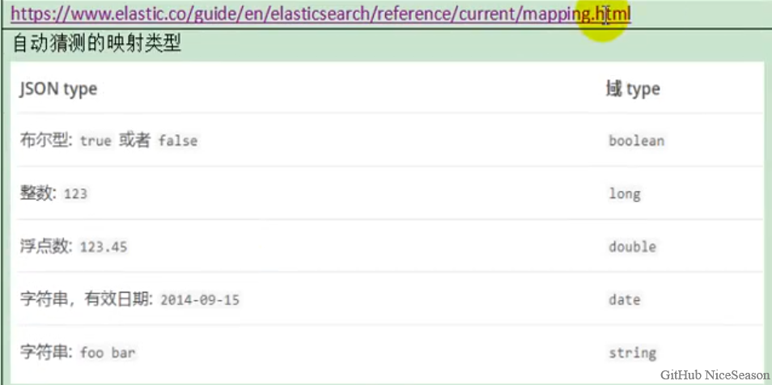


##### （3）新版本改变

ElasticSearch7-去掉type概念

1. 关系型数据库中两个数据表示是独立的，即使他们里面有相同名称的列也不影响使用，但ES中不是这样的。elasticsearch是基于Lucene开发的搜索引擎，而ES中不同type下名称相同的filed最终在Lucene中的处理方式是一样的。

   - 两个不同type下的两个user_name，在ES同一个索引下其实被认为是同一个filed，你必须在两个不同的type中定义相同的filed映射。否则，不同type中的相同字段名称就会在处理中出现冲突的情况，导致Lucene处理效率下降。
   - 去掉type就是为了提高ES处理数据的效率。

2. Elasticsearch 7.x URL中的type参数为可选。比如，索引一个文档不再要求提供文档类型。

3. Elasticsearch 8.x 不再支持URL中的type参数。

4. 解决：
   将索引从多类型迁移到单类型，每种类型文档一个独立索引

   将已存在的索引下的类型数据，全部迁移到指定位置即可。详见数据迁移


>
>
>**Elasticsearch 7.x**
>
>- Specifying types in requests is deprecated. For instance, indexing a document no longer requires a document `type`. The new index APIs are `PUT {index}/_doc/{id}` in case of explicit ids and `POST {index}/_doc` for auto-generated ids. Note that in 7.0, `_doc` is a permanent part of the path, and represents the endpoint name rather than the document type.
>- The `include_type_name` parameter in the index creation, index template, and mapping APIs will default to `false`. Setting the parameter at all will result in a deprecation warning.
>- The `_default_` mapping type is removed.
>
>**Elasticsearch 8.x**
>
>- Specifying types in requests is no longer supported.
>- The `include_type_name` parameter is removed.


###### 创建映射

创建索引并指定映射

```json
PUT /my_index
{
  "mappings": {
    "properties": {
      "age": {
        "type": "integer"
      },
      "email": {
        "type": "keyword"
      },
      "name": {
        "type": "text"
      }
    }
  }
}
```

 输出：

```json
{
  "acknowledged" : true,
  "shards_acknowledged" : true,
  "index" : "my_index"
}

```


###### 查看映射

```json
GET /my_index
```

输出结果：

```json
{
  "my_index" : {
    "aliases" : { },
    "mappings" : {
      "properties" : {
        "age" : {
          "type" : "integer"
        },
        "email" : {
          "type" : "keyword"
        },
        "employee-id" : {
          "type" : "keyword",
          "index" : false
        },
        "name" : {
          "type" : "text"
        }
      }
    },
    "settings" : {
      "index" : {
        "creation_date" : "1588410780774",
        "number_of_shards" : "1",
        "number_of_replicas" : "1",
        "uuid" : "ua0lXhtkQCOmn7Kh3iUu0w",
        "version" : {
          "created" : "7060299"
        },
        "provided_name" : "my_index"
      }
    }
  }
}
```


###### 添加新的字段映射

```json
PUT /my_index/_mapping
{
  "properties": {
    "employee-id": {
      "type": "keyword",
      "index": false
    }
  }
}
```

这里的 "index": false，表明新增的字段不能被检索，只是一个冗余字段。


###### 更新映射

对于已经存在的字段映射，我们不能更新。更新必须创建新的索引，进行数据迁移。

###### 数据迁移

先创建new_twitter的正确映射。然后使用如下方式进行数据迁移。

```json
POST _reindex [固定写法]
{
  "source":{
      "index":"twitter"
   },
  "dest":{
      "index":"new_twitters"
   }
}
```


将旧索引的type下的数据进行迁移

```json
POST _reindex [固定写法]
{
  "source":{
      "index":"twitter",
      "twitter":"twitter"
   },
  "dest":{
      "index":"new_twitters"
   }
}
```

更多详情见： https://www.elastic.co/guide/en/elasticsearch/reference/7.6/docs-reindex.html 


GET /bank/_search

```json
{
  "took" : 0,
  "timed_out" : false,
  "_shards" : {
    "total" : 1,
    "successful" : 1,
    "skipped" : 0,
    "failed" : 0
  },
  "hits" : {
    "total" : {
      "value" : 1000,
      "relation" : "eq"
    },
    "max_score" : 1.0,
    "hits" : [
      {
        "_index" : "bank",
        "_type" : "account",//类型为account
        "_id" : "1",
        "_score" : 1.0,
        "_source" : {
          "account_number" : 1,
          "balance" : 39225,
          "firstname" : "Amber",
          "lastname" : "Duke",
          "age" : 32,
          "gender" : "M",
          "address" : "880 Holmes Lane",
          "employer" : "Pyrami",
          "email" : "amberduke@pyrami.com",
          "city" : "Brogan",
          "state" : "IL"
        }
      },
      ...
```


```
GET /bank/_search
```

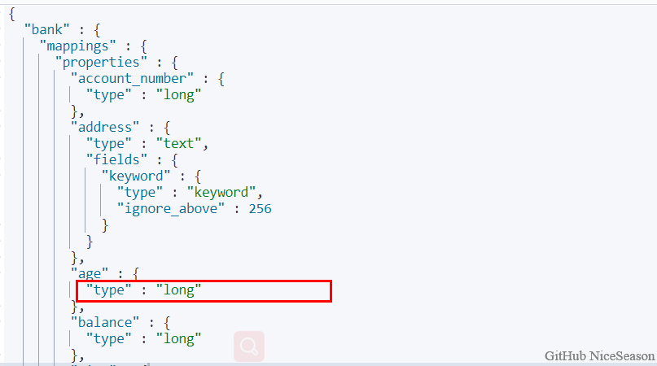

想要将年龄修改为integer

```json
PUT /newbank
{
  "mappings": {
    "properties": {
      "account_number": {
        "type": "long"
      },
      "address": {
        "type": "text"
      },
      "age": {
        "type": "integer"
      },
      "balance": {
        "type": "long"
      },
      "city": {
        "type": "keyword"
      },
      "email": {
        "type": "keyword"
      },
      "employer": {
        "type": "keyword"
      },
      "firstname": {
        "type": "text"
      },
      "gender": {
        "type": "keyword"
      },
      "lastname": {
        "type": "text",
        "fields": {
          "keyword": {
            "type": "keyword",
            "ignore_above": 256
          }
        }
      },
      "state": {
        "type": "keyword"
      }
    }
  }
}
```

查看“newbank”的映射：

GET /newbank/_mapping

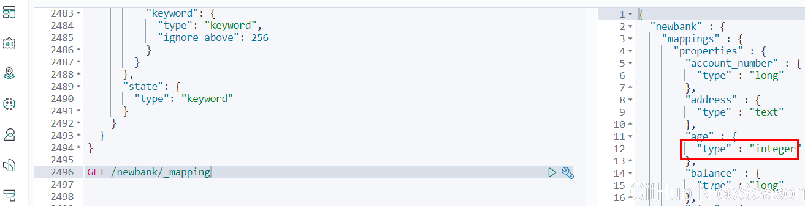

能够看到age的映射类型被修改为了integer.


将bank中的数据迁移到newbank中

```json
POST _reindex
{
  "source": {
    "index": "bank",
    "type": "account"
  },
  "dest": {
    "index": "newbank"
  }
}
```

运行输出：

```json
#! Deprecation: [types removal] Specifying types in reindex requests is deprecated.
{
  "took" : 768,
  "timed_out" : false,
  "total" : 1000,
  "updated" : 0,
  "created" : 1000,
  "deleted" : 0,
  "batches" : 1,
  "version_conflicts" : 0,
  "noops" : 0,
  "retries" : {
    "bulk" : 0,
    "search" : 0
  },
  "throttled_millis" : 0,
  "requests_per_second" : -1.0,
  "throttled_until_millis" : 0,
  "failures" : [ ]
}
```


查看newbank中的数据

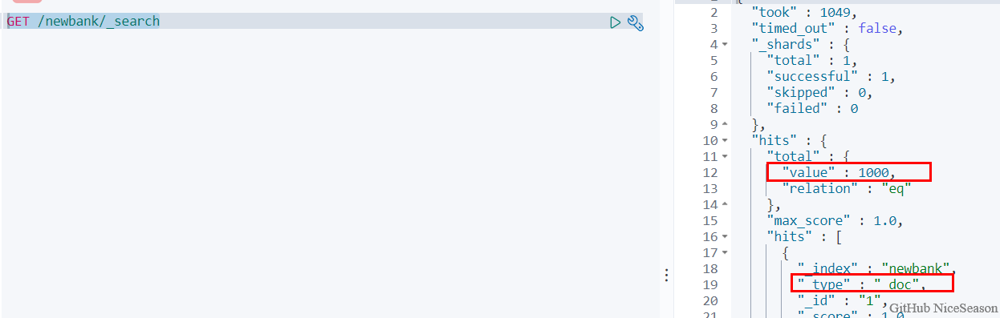


#### 4）分词

一个tokenizer（分词器）接收一个字符流，将之分割为独立的tokens（词元，通常是独立的单词），然后输出tokens流。

例如：whitespace tokenizer遇到空白字符时分割文本。它会将文本“Quick brown fox!”分割为[Quick,brown,fox!]。

该tokenizer（分词器）还负责记录各个terms(词条)的顺序或position位置（用于phrase短语和word proximity词近邻查询），以及term（词条）所代表的原始word（单词）的start（起始）和end（结束）的character offsets（字符串偏移量）（用于高亮显示搜索的内容）。

elasticsearch提供了很多内置的分词器，可以用来构建custom analyzers（自定义分词器）。

关于分词器： https://www.elastic.co/guide/en/elasticsearch/reference/7.6/analysis.html 


```json
POST _analyze
{
  "analyzer": "standard",
  "text": "The 2 QUICK Brown-Foxes jumped over the lazy dog's bone."
}
```

执行结果：

```json
{
  "tokens" : [
    {
      "token" : "the",
      "start_offset" : 0,
      "end_offset" : 3,
      "type" : "<ALPHANUM>",
      "position" : 0
    },
    {
      "token" : "2",
      "start_offset" : 4,
      "end_offset" : 5,
      "type" : "<NUM>",
      "position" : 1
    },
    {
      "token" : "quick",
      "start_offset" : 6,
      "end_offset" : 11,
      "type" : "<ALPHANUM>",
      "position" : 2
    },
    {
      "token" : "brown",
      "start_offset" : 12,
      "end_offset" : 17,
      "type" : "<ALPHANUM>",
      "position" : 3
    },
    {
      "token" : "foxes",
      "start_offset" : 18,
      "end_offset" : 23,
      "type" : "<ALPHANUM>",
      "position" : 4
    },
    {
      "token" : "jumped",
      "start_offset" : 24,
      "end_offset" : 30,
      "type" : "<ALPHANUM>",
      "position" : 5
    },
    {
      "token" : "over",
      "start_offset" : 31,
      "end_offset" : 35,
      "type" : "<ALPHANUM>",
      "position" : 6
    },
    {
      "token" : "the",
      "start_offset" : 36,
      "end_offset" : 39,
      "type" : "<ALPHANUM>",
      "position" : 7
    },
    {
      "token" : "lazy",
      "start_offset" : 40,
      "end_offset" : 44,
      "type" : "<ALPHANUM>",
      "position" : 8
    },
    {
      "token" : "dog's",
      "start_offset" : 45,
      "end_offset" : 50,
      "type" : "<ALPHANUM>",
      "position" : 9
    },
    {
      "token" : "bone",
      "start_offset" : 51,
      "end_offset" : 55,
      "type" : "<ALPHANUM>",
      "position" : 10
    }
  ]
}

```


##### （1）安装ik分词器

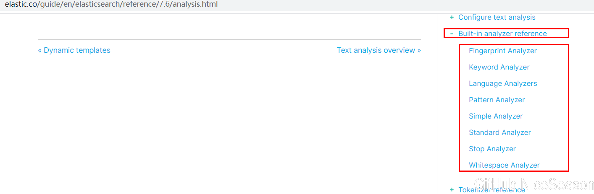

所有的语言分词，默认使用的都是“Standard Analyzer”，但是这些分词器针对于中文的分词，并不友好。为此需要安装中文的分词器。


注意：不能用默认elasticsearch-plugin install xxx.zip 进行自动安装
https://github.com/medcl/elasticsearch-analysis-ik/releases/download 对应es版本安装


在前面安装的elasticsearch时，我们已经将elasticsearch容器的“/usr/share/elasticsearch/plugins”目录，映射到宿主机的“ /mydata/elasticsearch/plugins”目录下，所以比较方便的做法就是下载“/elasticsearch-analysis-ik-7.6.2.zip”文件，然后解压到该文件夹下即可。安装完毕后，需要重启elasticsearch容器。

 

如果不嫌麻烦，还可以采用如下的方式。

###### （1）查看elasticsearch版本号：

```shell
[root@hadoop-104 ~]# curl http://localhost:9200
{
  "name" : "0adeb7852e00",
  "cluster_name" : "elasticsearch",
  "cluster_uuid" : "9gglpP0HTfyOTRAaSe2rIg",
  "version" : {
    "number" : "7.6.2",      #版本号为7.6.2
    "build_flavor" : "default",
    "build_type" : "docker",
    "build_hash" : "ef48eb35cf30adf4db14086e8aabd07ef6fb113f",
    "build_date" : "2020-03-26T06:34:37.794943Z",
    "build_snapshot" : false,
    "lucene_version" : "8.4.0",
    "minimum_wire_compatibility_version" : "6.8.0",
    "minimum_index_compatibility_version" : "6.0.0-beta1"
  },
  "tagline" : "You Know, for Search"
}
[root@hadoop-104 ~]# 
```


###### （2）进入es容器内部plugin目录

* docker exec -it 容器id /bin/bash

```shell
[root@hadoop-104 ~]# docker exec -it elasticsearch /bin/bash
[root@0adeb7852e00 elasticsearch]# 
```

* wget  https://github.com/medcl/elasticsearch-analysis-ik/releases/download/v7.6.2/elasticsearch-analysis-ik-7.6.2.zip

```shell
[root@0adeb7852e00 elasticsearch]# pwd
/usr/share/elasticsearch
#下载ik7.6.2
[root@0adeb7852e00 elasticsearch]# wget https://github.com/medcl/elasticsearch-analysis-ik/releases/download/v7.6.2/elasticsearch-analysis-ik-7.6.2.zip
```

* unzip 下载的文件

```shell
[root@0adeb7852e00 elasticsearch]# unzip elasticsearch-analysis-ik-7.6.2.zip -d ik
Archive:  elasticsearch-analysis-ik-7.6.2.zip
   creating: ik/config/
  inflating: ik/config/main.dic      
  inflating: ik/config/quantifier.dic  
  inflating: ik/config/extra_single_word_full.dic  
  inflating: ik/config/IKAnalyzer.cfg.xml  
  inflating: ik/config/surname.dic   
  inflating: ik/config/suffix.dic    
  inflating: ik/config/stopword.dic  
  inflating: ik/config/extra_main.dic  
  inflating: ik/config/extra_stopword.dic  
  inflating: ik/config/preposition.dic  
  inflating: ik/config/extra_single_word_low_freq.dic  
  inflating: ik/config/extra_single_word.dic  
  inflating: ik/elasticsearch-analysis-ik-7.6.2.jar  
  inflating: ik/httpclient-4.5.2.jar  
  inflating: ik/httpcore-4.4.4.jar   
  inflating: ik/commons-logging-1.2.jar  
  inflating: ik/commons-codec-1.9.jar  
  inflating: ik/plugin-descriptor.properties  
  inflating: ik/plugin-security.policy  
[root@0adeb7852e00 elasticsearch]#
#移动到plugins目录下
[root@0adeb7852e00 elasticsearch]# mv ik plugins/
```

* rm -rf *.zip

```
[root@0adeb7852e00 elasticsearch]# rm -rf elasticsearch-analysis-ik-7.6.2.zip 
```


确认是否安装好了分词器

##### （2）测试分词器

使用默认

```json
GET my_index/_analyze
{
   "text":"我是中国人"
}
```

请观察执行结果：

```json
{
  "tokens" : [
    {
      "token" : "我",
      "start_offset" : 0,
      "end_offset" : 1,
      "type" : "<IDEOGRAPHIC>",
      "position" : 0
    },
    {
      "token" : "是",
      "start_offset" : 1,
      "end_offset" : 2,
      "type" : "<IDEOGRAPHIC>",
      "position" : 1
    },
    {
      "token" : "中",
      "start_offset" : 2,
      "end_offset" : 3,
      "type" : "<IDEOGRAPHIC>",
      "position" : 2
    },
    {
      "token" : "国",
      "start_offset" : 3,
      "end_offset" : 4,
      "type" : "<IDEOGRAPHIC>",
      "position" : 3
    },
    {
      "token" : "人",
      "start_offset" : 4,
      "end_offset" : 5,
      "type" : "<IDEOGRAPHIC>",
      "position" : 4
    }
  ]
}
```


```json
GET my_index/_analyze
{
   "analyzer": "ik_smart", 
   "text":"我是中国人"
}
```

输出结果：

```json
{
  "tokens" : [
    {
      "token" : "我",
      "start_offset" : 0,
      "end_offset" : 1,
      "type" : "CN_CHAR",
      "position" : 0
    },
    {
      "token" : "是",
      "start_offset" : 1,
      "end_offset" : 2,
      "type" : "CN_CHAR",
      "position" : 1
    },
    {
      "token" : "中国人",
      "start_offset" : 2,
      "end_offset" : 5,
      "type" : "CN_WORD",
      "position" : 2
    }
  ]
}

```


```json
GET my_index/_analyze
{
   "analyzer": "ik_max_word", 
   "text":"我是中国人"
}
```


输出结果：

```json
{
  "tokens" : [
    {
      "token" : "我",
      "start_offset" : 0,
      "end_offset" : 1,
      "type" : "CN_CHAR",
      "position" : 0
    },
    {
      "token" : "是",
      "start_offset" : 1,
      "end_offset" : 2,
      "type" : "CN_CHAR",
      "position" : 1
    },
    {
      "token" : "中国人",
      "start_offset" : 2,
      "end_offset" : 5,
      "type" : "CN_WORD",
      "position" : 2
    },
    {
      "token" : "中国",
      "start_offset" : 2,
      "end_offset" : 4,
      "type" : "CN_WORD",
      "position" : 3
    },
    {
      "token" : "国人",
      "start_offset" : 3,
      "end_offset" : 5,
      "type" : "CN_WORD",
      "position" : 4
    }
  ]
}

```

 

##### （3）自定义词库

**安装Nginx**

![](images/Snipaste_2020-08-29_12-59-49.png


* 修改/usr/share/elasticsearch/plugins/ik/config中的IKAnalyzer.cfg.xml
  /usr/share/elasticsearch/plugins/ik/config

```xml
<?xml version="1.0" encoding="UTF-8"?>
<!DOCTYPE properties SYSTEM "http://java.sun.com/dtd/properties.dtd">
<properties>
	<comment>IK Analyzer 扩展配置</comment>
	<!--用户可以在这里配置自己的扩展字典 -->
	<entry key="ext_dict"></entry>
	 <!--用户可以在这里配置自己的扩展停止词字典-->
	<entry key="ext_stopwords"></entry>
	<!--用户可以在这里配置远程扩展字典 -->
	<entry key="remote_ext_dict">http://#/es/fenci.txt</entry> 
	<!--用户可以在这里配置远程扩展停止词字典-->
	<!-- <entry key="remote_ext_stopwords">words_location</entry> -->
</properties>
```

原来的xml

```xml
<?xml version="1.0" encoding="UTF-8"?>
<!DOCTYPE properties SYSTEM "http://java.sun.com/dtd/properties.dtd">
<properties>
	<comment>IK Analyzer 扩展配置</comment>
	<!--用户可以在这里配置自己的扩展字典 -->
	<entry key="ext_dict"></entry>
	 <!--用户可以在这里配置自己的扩展停止词字典-->
	<entry key="ext_stopwords"></entry>
	<!--用户可以在这里配置远程扩展字典 -->
	<!-- <entry key="remote_ext_dict">words_location</entry> -->
	<!--用户可以在这里配置远程扩展停止词字典-->
	<!-- <entry key="remote_ext_stopwords">words_location</entry> -->
</properties>

```

修改完成后，需要重启elasticsearch容器，否则修改不生效。

更新完成后，es只会对于新增的数据用更新分词。历史数据是不会重新分词的。如果想要历史数据重新分词，需要执行：

```shell
POST my_index/_update_by_query?conflicts=proceed
```


http://#/es/fenci.txt，这个是nginx上资源的访问路径

在运行下面实例之前，需要安装nginx（安装方法见安装nginx），然后创建“fenci.txt”文件，内容如下：

```shell
echo "樱桃萨其马，带你甜蜜入夏" > /mydata/nginx/html/fenci.txt 
```

测试效果：

```json
GET my_index/_analyze
{
   "analyzer": "ik_max_word", 
   "text":"樱桃萨其马，带你甜蜜入夏"
}
```

输出结果：

```json
{
  "tokens" : [
    {
      "token" : "樱桃",
      "start_offset" : 0,
      "end_offset" : 2,
      "type" : "CN_WORD",
      "position" : 0
    },
    {
      "token" : "萨其马",
      "start_offset" : 2,
      "end_offset" : 5,
      "type" : "CN_WORD",
      "position" : 1
    },
    {
      "token" : "带你",
      "start_offset" : 6,
      "end_offset" : 8,
      "type" : "CN_WORD",
      "position" : 2
    },
    {
      "token" : "甜蜜",
      "start_offset" : 8,
      "end_offset" : 10,
      "type" : "CN_WORD",
      "position" : 3
    },
    {
      "token" : "入夏",
      "start_offset" : 10,
      "end_offset" : 12,
      "type" : "CN_WORD",
      "position" : 4
    }
  ]
}

```


### 4、elasticsearch-Rest-Client
#### 1）9300: TCP
 * spring-data-elasticsearch:transport-api.jar;
   * springboot版本不同，ransport-api.jar不同，不能适配es版本
   * 7.x已经不建议使用，8以后就要废弃
#### 2）9200: HTTP
 * jestClient: 非官方，更新慢；
 * RestTemplate：模拟HTTP请求，ES很多操作需要自己封装，麻烦；
 * HttpClient：同上；

* Elasticsearch-Rest-Client：官方RestClient，封装了ES操作，API层次分明，上手简单；
  最终选择Elasticsearch-Rest-Client（elasticsearch-rest-high-level-client）；
   https://www.elastic.co/guide/en/elasticsearch/client/java-rest/current/java-rest-high.html 


### 5、附录：安装Nginx

* 随便启动一个nginx实例，只是为了复制出配置

  ```shell
  docker run -p80:80 --name nginx -d nginx:1.10   
  ```

* 将容器内的配置文件拷贝到/mydata/nginx/conf/ 下

  ```shell
  mkdir -p /mydata/nginx/html
  mkdir -p /mydata/nginx/logs
  mkdir -p /mydata/nginx/conf
  docker container cp nginx:/etc/nginx/*  /mydata/nginx/conf/ 
  #由于拷贝完成后会在config中存在一个nginx文件夹，所以需要将它的内容移动到conf中
  mv /mydata/nginx/conf/nginx/* /mydata/nginx/conf/
  rm -rf /mydata/nginx/conf/nginx
  ```

* 终止原容器：

  ```shell
  docker stop nginx
  ```

* 执行命令删除原容器：

  ```shell
  docker rm nginx
  ```

* 创建新的Nginx，执行以下命令

  ```shell
  docker run -p 80:80 --name nginx \
   -v /mydata/nginx/html:/usr/share/nginx/html \
   -v /mydata/nginx/logs:/var/log/nginx \
   -v /mydata/nginx/conf/:/etc/nginx \
   -d nginx:1.10
  ```

* 设置开机启动nginx

  ```
  docker update nginx --restart=always
  ```

  
  
* 创建“/mydata/nginx/html/index.html”文件，测试是否能够正常访问

  ```
  echo '<h2>hello nginx!</h2>' >index.html
  ```

  访问：http://ngix所在主机的IP:80/index.html


## SpringBoot整合ElasticSearch

### 1、导入依赖

这里的版本要和所按照的ELK版本匹配。

```xml
<dependency>
    <groupId>org.elasticsearch.client</groupId>
    <artifactId>elasticsearch-rest-high-level-client</artifactId>
    <version>7.6.2</version>
</dependency>
```


在spring-boot-dependencies中所依赖的ELK版本位6.8.7

```
    <elasticsearch.version>6.8.7</elasticsearch.version>
```

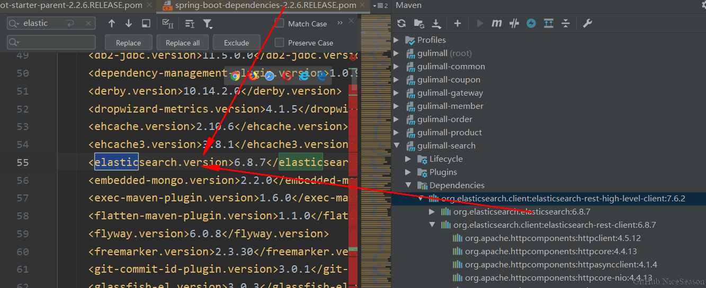


需要在项目中将它改为7.6.2

```xml
    <properties>
        ...
        <elasticsearch.version>7.6.2</elasticsearch.version>
    </properties>
```

 

### 2、编写测试类

#### 1）测试保存数据

 https://www.elastic.co/guide/en/elasticsearch/client/java-rest/current/java-rest-high-document-index.html 


```java
    @Test
    public void indexData() throws IOException {
        IndexRequest indexRequest = new IndexRequest ("users");

        User user = new User();
        user.setUserName("张三");
        user.setAge(20);
        user.setGender("男");
        String jsonString = JSON.toJSONString(user);
        //设置要保存的内容
        indexRequest.source(jsonString, XContentType.JSON);
        //执行创建索引和保存数据
        IndexResponse index = client.index(indexRequest, GulimallElasticSearchConfig.COMMON_OPTIONS);

        System.out.println(index);

    }
```


测试前：

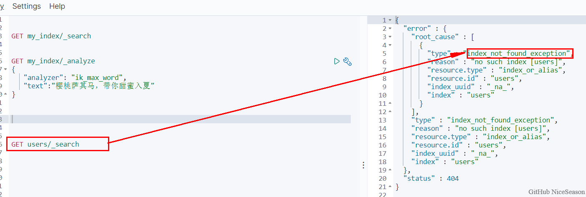

测试后：

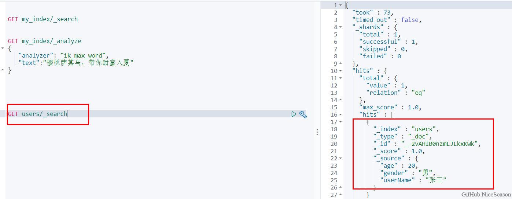


#### 2）测试获取数据

 https://www.elastic.co/guide/en/elasticsearch/client/java-rest/current/java-rest-high-search.html 

```java
    @Test
    public void searchData() throws IOException {
        GetRequest getRequest = new GetRequest(
                "users",
                "_-2vAHIB0nzmLJLkxKWk");

        GetResponse getResponse = client.get(getRequest, RequestOptions.DEFAULT);
        System.out.println(getResponse);
        String index = getResponse.getIndex();
        System.out.println(index);
        String id = getResponse.getId();
        System.out.println(id);
        if (getResponse.isExists()) {
            long version = getResponse.getVersion();
            System.out.println(version);
            String sourceAsString = getResponse.getSourceAsString();
            System.out.println(sourceAsString);
            Map<String, Object> sourceAsMap = getResponse.getSourceAsMap();
            System.out.println(sourceAsMap);
            byte[] sourceAsBytes = getResponse.getSourceAsBytes();
        } else {

        }
    }
```


查询state="AK"的文档：

```

```


```json
{
	"took": 1,
	"timed_out": false,
	"_shards": {
		"total": 1,
		"successful": 1,
		"skipped": 0,
		"failed": 0
	},
	"hits": {
		"total": {
			"value": 22,   //匹配到了22条
			"relation": "eq"
		},
		"max_score": 3.7952394,
		"hits": [{
			"_index": "bank",
			"_type": "account",
			"_id": "210",
			"_score": 3.7952394,
			"_source": {
				"account_number": 210,
				"balance": 33946,
				"firstname": "Cherry",
				"lastname": "Carey",
				"age": 24,
				"gender": "M",
				"address": "539 Tiffany Place",
				"employer": "Martgo",
				"email": "cherrycarey@martgo.com",
				"city": "Fairacres",
				"state": "AK"
			}
		},
           ....//省略其他
          ]
	}
}
```


**搜索address中包含mill的所有人的年龄分布以及平均年龄，平均薪资**


```json
GET bank/_search
{
  "query": {
    "match": {
      "address": "Mill"
    }
  },
  "aggs": {
    "ageAgg": {
      "terms": {
        "field": "age",
        "size": 10
      }
    },
    "ageAvg": {
      "avg": {
        "field": "age"
      }
    },
    "balanceAvg": {
      "avg": {
        "field": "balance"
      }
    }
  }
}
```


java实现

```java
    /**
     * 复杂检索:在bank中搜索address中包含mill的所有人的年龄分布以及平均年龄，平均薪资
     * @throws IOException
     */
    @Test
    public void searchData() throws IOException {
        //1. 创建检索请求
        SearchRequest searchRequest = new SearchRequest();

        //1.1）指定索引
        searchRequest.indices("bank");
        //1.2）构造检索条件
        SearchSourceBuilder sourceBuilder = new SearchSourceBuilder();
        sourceBuilder.query(QueryBuilders.matchQuery("address","Mill"));

        //1.2.1)按照年龄分布进行聚合
        TermsAggregationBuilder ageAgg=AggregationBuilders.terms("ageAgg").field("age").size(10);
        sourceBuilder.aggregation(ageAgg);

        //1.2.2)计算平均年龄
        AvgAggregationBuilder ageAvg = AggregationBuilders.avg("ageAvg").field("age");
        sourceBuilder.aggregation(ageAvg);
        //1.2.3)计算平均薪资
        AvgAggregationBuilder balanceAvg = AggregationBuilders.avg("balanceAvg").field("balance");
        sourceBuilder.aggregation(balanceAvg);

        System.out.println("检索条件："+sourceBuilder);
        searchRequest.source(sourceBuilder);
        //2. 执行检索
        SearchResponse searchResponse = client.search(searchRequest, RequestOptions.DEFAULT);
        System.out.println("检索结果："+searchResponse);

        //3. 将检索结果封装为Bean
        SearchHits hits = searchResponse.getHits();
        SearchHit[] searchHits = hits.getHits();
        for (SearchHit searchHit : searchHits) {
            String sourceAsString = searchHit.getSourceAsString();
            Account account = JSON.parseObject(sourceAsString, Account.class);
            System.out.println(account);

        }

        //4. 获取聚合信息
        Aggregations aggregations = searchResponse.getAggregations();

        Terms ageAgg1 = aggregations.get("ageAgg");

        for (Terms.Bucket bucket : ageAgg1.getBuckets()) {
            String keyAsString = bucket.getKeyAsString();
            System.out.println("年龄："+keyAsString+" ==> "+bucket.getDocCount());
        }
        Avg ageAvg1 = aggregations.get("ageAvg");
        System.out.println("平均年龄："+ageAvg1.getValue());

        Avg balanceAvg1 = aggregations.get("balanceAvg");
        System.out.println("平均薪资："+balanceAvg1.getValue());


    }  
```

可以尝试对比打印的条件和执行结果，和前面的ElasticSearch的检索语句和检索结果进行比较；


## 其他

### 1. kibana控制台命令

ctrl+home：回到文档首部；

ctril+end：回到文档尾部。


## 商品上架

### spu在es中的存储模型分析

如果每个sku都存储规格参数，会有冗余存储，因为每个spu对应的sku的规格参数都一样

但是如果将规格参数单独建立索引会出现检索时出现大量数据传输的问题，会阻塞网络

因此我们选用第一种存储模型，以空间换时间

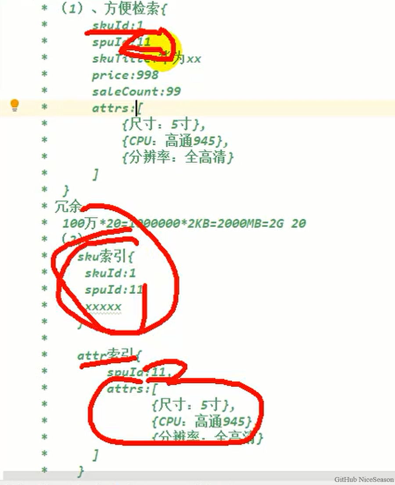

### 向ES添加商品属性映射

```json
PUT product
{
    "mappings":{
        "properties": {
            "skuId":{
                "type": "long"
            },
            "spuId":{
                "type": "keyword"
            },
            "skuTitle": {
                "type": "text",
                "analyzer": "ik_smart"
            },
            "skuPrice": {
                "type": "keyword"
            },
            "skuImg":{
                "type": "keyword",
                "index": false,
                "doc_values": false
            },
            "saleCount":{
                "type":"long"
            },
            "hasStock": {
                "type": "boolean"
            },
            "hotScore": {
                "type": "long"
            },
            "brandId": {
                "type": "long"
            },
            "catalogId": {
                "type": "long"
            },
            "brandName": {
                "type": "keyword",
                "index": false,
                "doc_values": false
            },
            "brandImg":{
                "type": "keyword",
                 "index": false,
                "doc_values": false
            },
            "catalogName": {
                "type": "keyword",
                "index": false,
                "doc_values": false
            },
            "attrs": {
                "type": "nested",
                "properties": {
                    "attrId": {
                        "type": "long"
                    },
                    "attrName": {
                        "type": "keyword",
                        "index": false,
                        "doc_values": false
                    },
                    "attrValue": {
                        "type": "keyword"
                    }
                }
            }
        }
    }
}
```

### 商品上架接口实现

商品上架需要在es中保存spu信息并更新spu的状态信息，由于`SpuInfoEntity`与索引的数据模型并不对应，所以我们要建立专门的vo进行数据传输

```java
@Data
public class SkuEsModel {
    private Long skuId;
    private Long spuId;
    private String skuTitle;
    private BigDecimal skuPrice;
    private String skuImg;
    private Long saleCount;
    private boolean hasStock;
    private Long hotScore;
    private Long brandId;
    private Long catalogId;
    private String brandName;
    private String brandImg;
    private String catalogName;
    private List<Attr> attrs;

    @Data
    public static class Attr{
        private Long attrId;
        private String attrName;
        private String attrValue;
    }
}
```

**编写商品上架的接口**

由于每个spu对应的各个sku的规格参数相同，因此我们要将查询规格参数提前，只查询一次

```java
 public void upSpuForSearch(Long spuId) {
        //1、查出当前spuId对应的所有sku信息,品牌的名字
        List<SkuInfoEntity> skuInfoEntities=skuInfoService.getSkusBySpuId(spuId);
        //TODO 4、查出当前sku的所有可以被用来检索的规格属性
        List<ProductAttrValueEntity> productAttrValueEntities = productAttrValueService.list(new QueryWrapper<ProductAttrValueEntity>().eq("spu_id", spuId));
        List<Long> attrIds = productAttrValueEntities.stream().map(attr -> {
            return attr.getAttrId();
        }).collect(Collectors.toList());
        List<Long> searchIds=attrService.selectSearchAttrIds(attrIds);
        Set<Long> ids = new HashSet<>(searchIds);
        List<SkuEsModel.Attr> searchAttrs = productAttrValueEntities.stream().filter(entity -> {
            return ids.contains(entity.getAttrId());
        }).map(entity -> {
            SkuEsModel.Attr attr = new SkuEsModel.Attr();
            BeanUtils.copyProperties(entity, attr);
            return attr;
        }).collect(Collectors.toList());


        //TODO 1、发送远程调用，库存系统查询是否有库存
        Map<Long, Boolean> stockMap = null;
        try {
            List<Long> longList = skuInfoEntities.stream().map(SkuInfoEntity::getSkuId).collect(Collectors.toList());
            List<SkuHasStockVo> skuHasStocks = wareFeignService.getSkuHasStocks(longList);
            stockMap = skuHasStocks.stream().collect(Collectors.toMap(SkuHasStockVo::getSkuId, SkuHasStockVo::getHasStock));
        }catch (Exception e){
            log.error("远程调用库存服务失败,原因{}",e);
        }

        //2、封装每个sku的信息
        Map<Long, Boolean> finalStockMap = stockMap;
        List<SkuEsModel> skuEsModels = skuInfoEntities.stream().map(sku -> {
            SkuEsModel skuEsModel = new SkuEsModel();
            BeanUtils.copyProperties(sku, skuEsModel);
            skuEsModel.setSkuPrice(sku.getPrice());
            skuEsModel.setSkuImg(sku.getSkuDefaultImg());
            //TODO 2、热度评分。0
            skuEsModel.setHotScore(0L);
            //TODO 3、查询品牌和分类的名字信息
            BrandEntity brandEntity = brandService.getById(sku.getBrandId());
            skuEsModel.setBrandName(brandEntity.getName());
            skuEsModel.setBrandImg(brandEntity.getLogo());
            CategoryEntity categoryEntity = categoryService.getById(sku.getCatalogId());
            skuEsModel.setCatalogName(categoryEntity.getName());
            //设置可搜索属性
            skuEsModel.setAttrs(searchAttrs);
            //设置是否有库存
            skuEsModel.setHasStock(finalStockMap==null?false:finalStockMap.get(sku.getSkuId()));
            return skuEsModel;
        }).collect(Collectors.toList());

        //TODO 5、将数据发给es进行保存：gulimall-search
        R r = searchFeignService.saveProductAsIndices(skuEsModels);
        if (r.getCode()==0){
            this.baseMapper.upSpuStatus(spuId, ProductConstant.ProductStatusEnum.SPU_UP.getCode());
        }else {
            log.error("商品远程es保存失败");
        }
    }
```

## 商城系统首页

### 导入依赖

前端使用了thymeleaf开发，因此要导入该依赖,并且为了改动页面实时生效导入devtools

```xml
<dependency>
    <groupId>org.springframework.boot</groupId>
    <artifactId>spring-boot-devtools</artifactId>
</dependency>

<dependency>
    <groupId>org.springframework.boot</groupId>
    <artifactId>spring-boot-starter-thymeleaf</artifactId>
</dependency>
```

### 渲染一级分类菜单

由于访问首页时就要加载一级目录,所以我们需要在加载首页时获取该数据

```java
    @GetMapping({"/", "index.html"})
    public String getIndex(Model model) {
        //获取所有的一级分类
        List<CategoryEntity> catagories = categoryService.getLevel1Catagories();
        model.addAttribute("catagories", catagories);
        return "index";
    }
```

页面遍历菜单数据

```html
<li th:each="catagory:${catagories}" >
    <a href="#" class="header_main_left_a" ctg-data="3" th:attr="ctg-data=${catagory.catId}"><b th:text="${catagory.name}"></b></a>
</li>
```


### 渲染三级分类菜单

```java
 	@GetMapping("index/json/catalog.json")
    @ResponseBody
    public Map<String, List<Catalog2Vo>> getCategoryMap() {
        return categoryService.getCategoryMap();
    }

    public Map<String, List<Catalog2Vo>> getCategoryMap() {
        List<CategoryEntity> categoryEntities = this.list(new QueryWrapper<CategoryEntity>().eq("cat_level", 2));

        List<Catalog2Vo> catalog2Vos = categoryEntities.stream().map(categoryEntity -> {
            List<CategoryEntity> level3 = this.list(new QueryWrapper<CategoryEntity>().eq("parent_cid", categoryEntity.getCatId()));
            List<Catalog2Vo.Catalog3Vo> catalog3Vos = level3.stream().map(cat -> {
                return new Catalog2Vo.Catalog3Vo(cat.getParentCid().toString(), cat.getCatId().toString(), cat.getName());
            }).collect(Collectors.toList());
            Catalog2Vo catalog2Vo = new Catalog2Vo(categoryEntity.getParentCid().toString(), categoryEntity.getCatId().toString(), categoryEntity.getName(), catalog3Vos);
            return catalog2Vo;
        }).collect(Collectors.toList());
        Map<String, List<Catalog2Vo>> catalogMap = new HashMap<>();
        for (Catalog2Vo catalog2Vo : catalog2Vos) {
            List<Catalog2Vo> list = catalogMap.getOrDefault(catalog2Vo.getCatalog1Id(), new LinkedList<>());
            list.add(catalog2Vo);
            catalogMap.put(catalog2Vo.getCatalog1Id(),list);
        }
        return catalogMap;
    }
```


## 搭建域名访问环境

### 1. 正向代理与反向代理

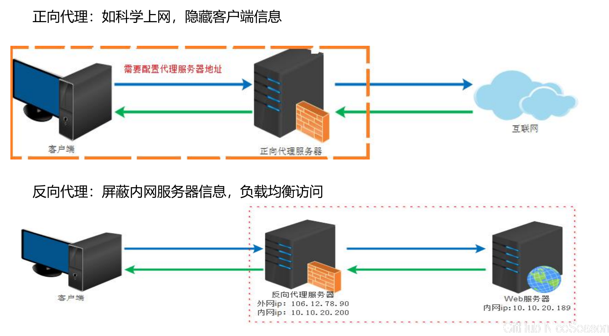

nginx就是通过反向代理实现负载均衡


### 2. Nginx配置文件

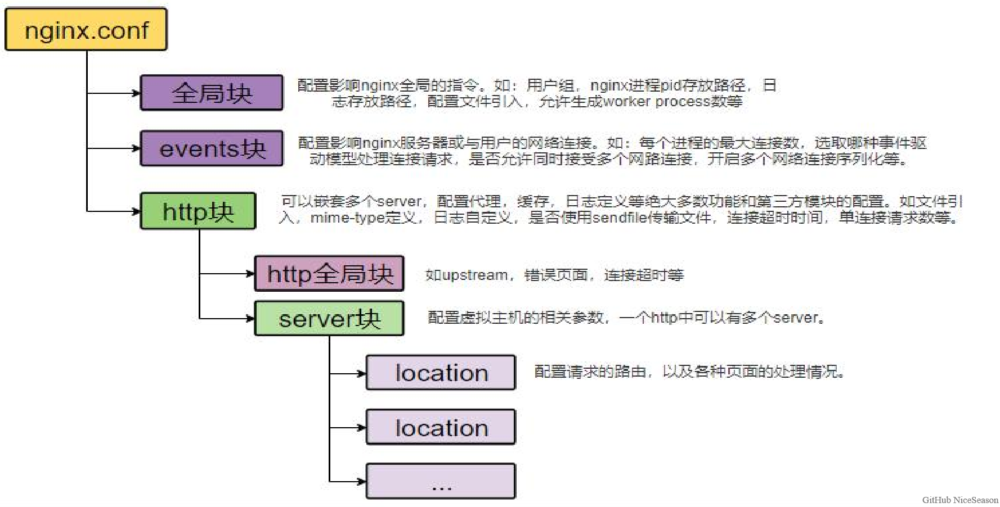

```shell
user  nginx;
worker_processes  1;

error_log  /var/log/nginx/error.log warn;
pid        /var/run/nginx.pid;

#event块
events {
    worker_connections  1024;
}

#http块
http {
    include       /etc/nginx/mime.types;
    default_type  application/octet-stream;

    log_format  main  '$remote_addr - $remote_user [$time_local] "$request" '
                      '$status $body_bytes_sent "$http_referer" '
                      '"$http_user_agent" "$http_x_forwarded_for"';

    access_log  /var/log/nginx/access.log  main;

    sendfile        on;
    #tcp_nopush     on;

    keepalive_timeout  65;

    #gzip  on;
    
    upstream gulimall{
	server 192.168.43.201:88;
    }    

    include /etc/nginx/conf.d/*.conf;
    ############################################################################
    #/etc/nginx/conf.d/default.conf 的server块
    server {
    listen       80;
    server_name  localhost;

    #charset koi8-r;
    #access_log  /var/log/nginx/log/host.access.log  main;

    location / {
        root   /usr/share/nginx/html;
        index  index.html index.htm;
    }

    #error_page  404              /404.html;

    # redirect server error pages to the static page /50x.html
    #
    error_page   500 502 503 504  /50x.html;
    location = /50x.html {
        root   /usr/share/nginx/html;
    }

    # proxy the PHP scripts to Apache listening on 127.0.0.1:80
    #
    #location ~ \.php$ {
    #    proxy_pass   http://127.0.0.1;
    #}

    # pass the PHP scripts to FastCGI server listening on 127.0.0.1:9000
    #
    #location ~ \.php$ {
    #    root           html;
    #    fastcgi_pass   127.0.0.1:9000;
    #    fastcgi_index  index.php;
    #    fastcgi_param  SCRIPT_FILENAME  /scripts$fastcgi_script_name;
    #    include        fastcgi_params;
    #}

    # deny access to .htaccess files, if Apache's document root
    # concurs with nginx's one
    #
    #location ~ /\.ht {
    #    deny  all;
    #}
}

}

```


### 3. Nginx+Windows搭建域名访问环境

1. 修改windows hosts文件改变本地域名映射，将`gulimall.com`映射到虚拟机ip

2. 修改nginx的根配置文件nginx.conf，将`upstream`映射到我们的网关服务

   ```shell
       upstream gulimall{
      	 	server 192.168.56.1:88;
       }
   ```

   

3. 修改nginx的server块配置文件`gulimall.conf`，将以`/`开头的请求转发至我们配好的`gulimall`的`upstream`,由于nginx的转发会丢失`host`头，所以我们添加头信息

   ```shell
     location / {
           proxy_pass http://gulimall;
           proxy_set_header Host $host;
       }
   ```

4. 配置网关服务，将域名为`**.gulimall.com`转发至商品服务

   ```yml
       - id: gulimall_host
             uri: lb://gulimall-product
             predicates:
               - Host=**.gulimall.com
   ```

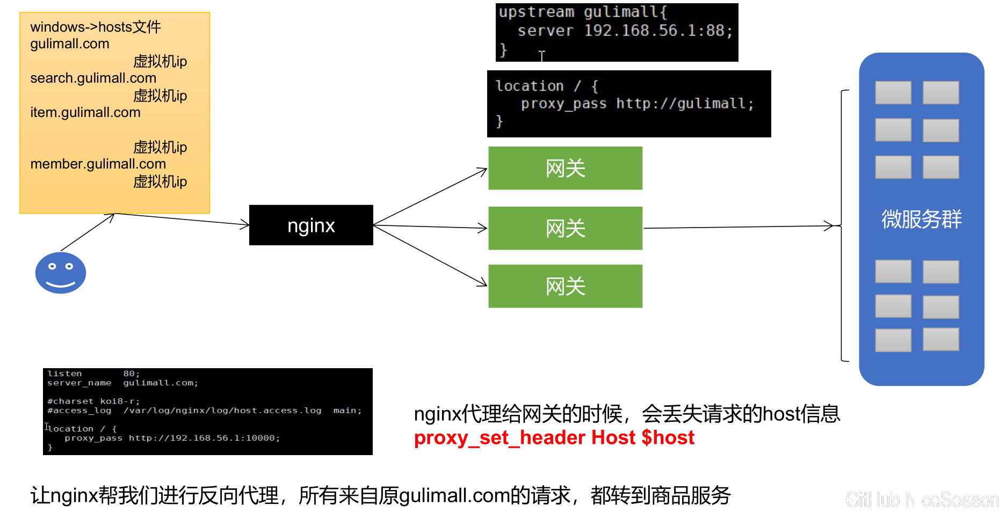


## 性能压测与优化

### 1. 压测工具与环境

* jvisualvm

  用于检测java应用资源占用和垃圾回收的情况，cmd输入jvisualvm即可打开

* Jmeter

  下载后bin目录`jmeter.bat`打开

* 测试环境

  系统win10，CPU I710710U，内存16G

视频教程中的测试结果

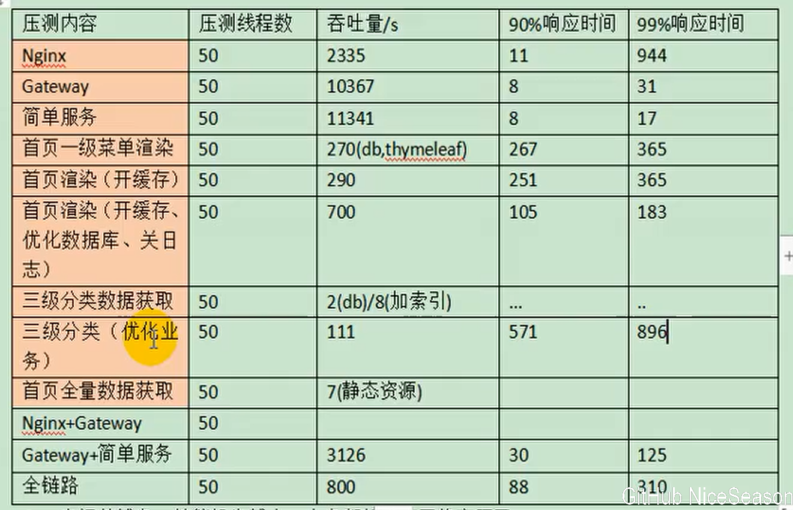

注：简单业务仅返回一个字符串

|                 压测内容                 | 压测线程数 | 吞吐量/s | 90%响应时间 | 99%响应时间 |
| :--------------------------------------: | :--------: | :------: | :---------: | :---------: |
|                  Nginx                   |     50     |   2120   |     10      |    1204     |
|                 Gateway                  |     50     |   9200   |      9      |     21      |
|                                          |     50     |   9850   |      8      |     48      |
|             首页一级菜单渲染             |     50     |   350    |     260     |     491     |
|           首页菜单渲染(开缓存)           |     50     |   465    |     119     |     306     |
| 首页菜单渲染(开缓存、优化数据库、关日志) |     50     |   465    |     127     |     304     |
|             三级分类数据获取             |     50     |    4     |    13275    |    13756    |
|            三级分类(优化业务)            |     50     |    15    |    4092     |    5891     |
|             首页全量数据获取             |     50     |   2.7    |    24014    |    26556    |
|        首页全量数据获取(动静分类)        |     50     |   4.9    |    14913    |    16421    |
|              Nginx+GateWay               |     50     |          |             |             |
|             Gateway+简单服务             |     50     |   3000   |     28      |     67      |
|      全链路(Nginx+GateWay+简单服务)      |     50     |   650    |     84      |     537     |

### 2. 首页菜单渲染优化数据库

优化数据库前

```java
 public List<CategoryEntity> getLevel1Catagories() {
        long start = System.currentTimeMillis();
        List<CategoryEntity> parent_cid = this.list(new QueryWrapper<CategoryEntity>().eq("parent_cid", 0));
        System.out.println("查询一级菜单时间:"+(System.currentTimeMillis()-start));
        return parent_cid;
    }
```

```
查询一级菜单时间:44
查询一级菜单时间:32
查询一级菜单时间:40
查询一级菜单时间:40
查询一级菜单时间:40
查询一级菜单时间:44
查询一级菜单时间:28
查询一级菜单时间:51
查询一级菜单时间:38
查询一级菜单时间:36
```

给`parent_cid`添加索引后

```
查询一级菜单时间:29
查询一级菜单时间:38
查询一级菜单时间:16
查询一级菜单时间:15
查询一级菜单时间:18
查询一级菜单时间:15
查询一级菜单时间:31
查询一级菜单时间:14
查询一级菜单时间:16
查询一级菜单时间:28
查询一级菜单时间:28
```

但是整体业务和吞吐量并没有优化，可能由于使用了远程数据库，通信时间较长？

### 3. 三级分类(优化业务)

**优化前**

对二级菜单的每次遍历都需要查询数据库，浪费大量资源

```java
 //查询数据库：二级菜单
List<CategoryEntity> categoryEntities = this.list(new QueryWrapper<CategoryEntity>().eq("cat_level", 2));

        List<Catalog2Vo> catalog2Vos = categoryEntities.stream().map(categoryEntity -> {
            //查询数据库：三级菜单
            List<CategoryEntity> level3 = this.list(new QueryWrapper<CategoryEntity>().eq("parent_cid", categoryEntity.getCatId()));
            List<Catalog2Vo.Catalog3Vo> catalog3Vos = level3.stream().map(cat -> {
                return new Catalog2Vo.Catalog3Vo(cat.getParentCid().toString(), cat.getCatId().toString(), cat.getName());
            }).collect(Collectors.toList());
            Catalog2Vo catalog2Vo = new Catalog2Vo(categoryEntity.getParentCid().toString(), categoryEntity.getCatId().toString(), categoryEntity.getName(), catalog3Vos);
            return catalog2Vo;
        }).collect(Collectors.toList());
        Map<String, List<Catalog2Vo>> catalogMap = new HashMap<>();
        for (Catalog2Vo catalog2Vo : catalog2Vos) {
            List<Catalog2Vo> list = catalogMap.getOrDefault(catalog2Vo.getCatalog1Id(), new LinkedList<>());
            list.add(catalog2Vo);
            catalogMap.put(catalog2Vo.getCatalog1Id(),list);
        }
        return catalogMap;
```

**优化后**

仅查询一次数据库，剩下的数据通过遍历得到并封装

```java
  //优化业务逻辑，仅查询一次数据库
        List<CategoryEntity> categoryEntities = this.list();
        //查出所有一级分类
        List<CategoryEntity> level1Categories = getCategoryByParentCid(categoryEntities, 0L);
        Map<String, List<Catalog2Vo>> listMap = level1Categories.stream().collect(Collectors.toMap(k->k.getCatId().toString(), v -> {
            //遍历查找出二级分类
            List<CategoryEntity> level2Categories = getCategoryByParentCid(categoryEntities, v.getCatId());
            List<Catalog2Vo> catalog2Vos=null;
            if (level2Categories!=null){
                //封装二级分类到vo并且查出其中的三级分类
                catalog2Vos = level2Categories.stream().map(cat -> {
                    //遍历查出三级分类并封装
                    List<CategoryEntity> level3Catagories = getCategoryByParentCid(categoryEntities, cat.getCatId());
                    List<Catalog2Vo.Catalog3Vo> catalog3Vos = null;
                    if (level3Catagories != null) {
                        catalog3Vos = level3Catagories.stream()
                                .map(level3 -> new Catalog2Vo.Catalog3Vo(level3.getParentCid().toString(), level3.getCatId().toString(), level3.getName()))
                                .collect(Collectors.toList());
                    }
                    Catalog2Vo catalog2Vo = new Catalog2Vo(v.getCatId().toString(), cat.getCatId().toString(), cat.getName(), catalog3Vos);
                    return catalog2Vo;
                }).collect(Collectors.toList());
            }
            return catalog2Vos;
        }));
        return listMap;
```

### 4. Nginx动静分类

由于动态资源和静态资源目前都处于服务端，所以为了减轻服务器压力，我们将js、css、img等静态资源放置在Nginx端，以减轻服务器压力

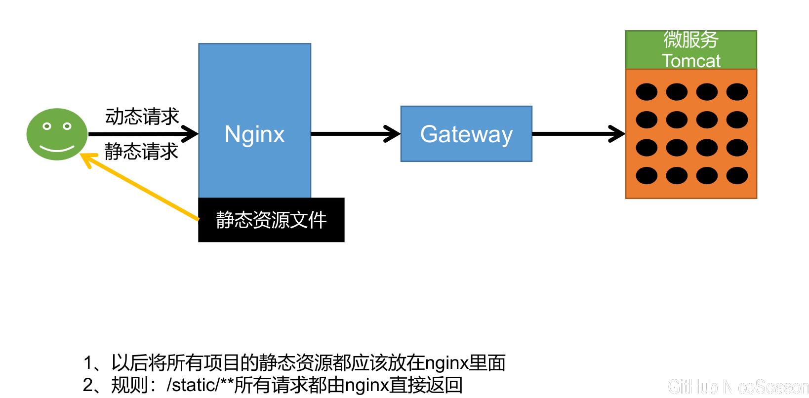

1. 在nginx的html文件夹创建staic文件夹，并将index/css等静态资源全部上传到该文件夹中

2. 修改index.html的静态资源路径，使其全部带有static前缀`src="/static/index/img/img_09.png"`

3. 修改nginx的配置文件`/mydata/nginx/conf/conf.d/gulimall.conf`

   如果遇到有`/static`为前缀的请求，转发至html文件夹

   ```shell
       location /static {
           root   /usr/share/nginx/html;
       }
   
   
       location / {
           proxy_pass http://gulimall;
   	proxy_set_header Host $host;
       }
   
   ```

   

## 缓存

### 1. 本地缓存

#### 

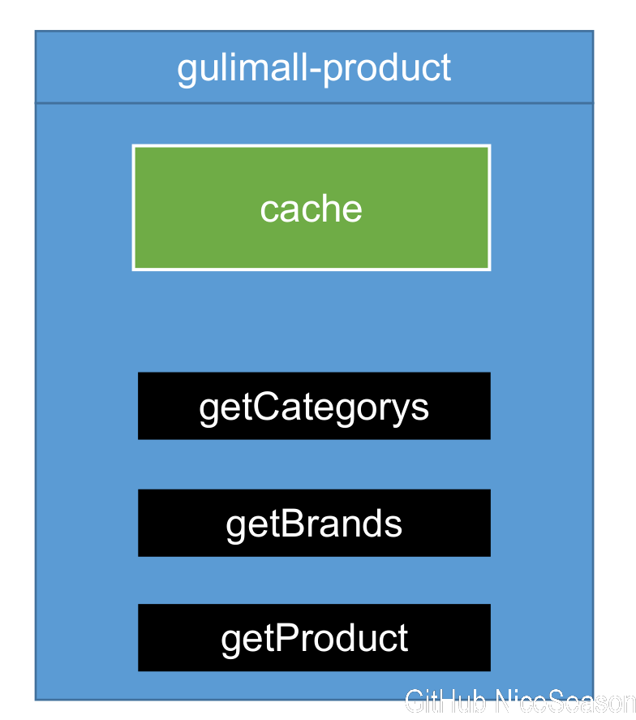

#### 1)  使用hashmap本地缓存

```java
    //测试本地缓存，通过hashmap
    private Map<String,Object> cache=new HashMap<>();

    public Map<String, List<Catalog2Vo>> getCategoryMap() {
          Map<String, List<Catalog2Vo>> catalogMap = (Map<String, List<Catalog2Vo>>) cache.get("catalogMap");
        //如果没有缓存，则从数据库中查询并放入缓存中
        if (catalogMap == null) {
            catalogMap = getCategoriesDb();
            cache.put("catalogMap",catalogMap);
        }
        return catalogMap;
    }
```

#### 2) 整合redis进行测试

导入依赖

```xml
       <dependency>
            <groupId>org.springframework.boot</groupId>
            <artifactId>spring-boot-starter-data-redis</artifactId>
        </dependency>
```

配置redis主机地址

```yaml
spring:
  redis:
    host: #
    port: 6379
```

使用springboot自动配置的RedisTemplate优化菜单获取业务

```java
   		ValueOperations<String, String> ops = stringRedisTemplate.opsForValue();
        String catalogJson = ops.get("catalogJson");
        if (catalogJson == null) {
            Map<String, List<Catalog2Vo>> categoriesDb = getCategoriesDb();
            String toJSONString = JSON.toJSONString(categoriesDb);
            ops.set("catalogJson",toJSONString);
            return categoriesDb;
        }
        Map<String, List<Catalog2Vo>> listMap = JSON.parseObject(catalogJson, new TypeReference<Map<String, List<Catalog2Vo>>>() {});
        return listMap;
```

**内存泄漏及解决办法**

当进行压力测试时后期后出现堆外内存溢出OutOfDirectMemoryError

产生原因：

1)、springboot2.0以后默认使用lettuce操作redis的客户端，它使用通信

2)、lettuce的bug导致netty堆外内存溢出

解决方案：由于是lettuce的bug造成，不能直接使用-Dio.netty.maxDirectMemory去调大虚拟机堆外内存

1)、升级lettuce客户端。   2）、切换使用jedis

```xml
    <dependency>
        <groupId>org.springframework.boot</groupId>
        <artifactId>spring-boot-starter-data-redis</artifactId>
        <exclusions>
            <exclusion>
                <groupId>io.lettuce</groupId>
                <artifactId>lettuce-core</artifactId>
            </exclusion>
        </exclusions>
    </dependency>
    <dependency>
        <groupId>redis.clients</groupId>
        <artifactId>jedis</artifactId>
    </dependency>
```

#### 3) 高并发下缓存失效问题

**缓存穿透**

指查询一个一定不存在的数据，由于缓存是不命中，将去查询数据库，但是数据库也无此记录，我们没有将这次查询的null写入缓存，这将导致这个不存在的数据每次请求都要到存储层去查询，失去了缓存的意义

风险：
利用不存在的数据进行攻击，数据库瞬时压力增大，最终导致崩溃

解决：
null结果缓存，并加入短暂过期时间

**缓存雪崩**

缓存雪崩是指在我们设置缓存时key采用了相同的过期时间，导致缓存在某一时刻同时失效，请求全部转发到DB，DB瞬时
压力过重雪崩。

解决：
原有的失效时间基础上增加一个随机值，比如1-5分钟随机，这样每一个缓存的过期时间的重复率就会降低，就很难引发集体失效的事件。

**缓存击穿**

* 对于一些设置了过期时间的key，如果这些key可能会在某些时间点被超高并发地访问，是一种非常“热点”的数据。

* 如果这个key在大量请求同时进来前正好失效，那么所有对这个key的数据查询都落到db，我们称为缓存击穿。

解决：
加锁。大量并发只让一个去查，其他人等待，查到以后释放锁，其他人获取到锁，先查缓存，就会有数据，不用去db

#### 4) 加锁解决缓存击穿问题

将查询db的方法加锁，这样在同一时间只有一个方法能查询数据库，就能解决缓存击穿的问题了

```java
public Map<String, List<Catalog2Vo>> getCategoryMap() {
        ValueOperations<String, String> ops = stringRedisTemplate.opsForValue();
        String catalogJson = ops.get("catalogJson");
        if (StringUtils.isEmpty(catalogJson)) {
            System.out.println("缓存不命中，准备查询数据库。。。");
            Map<String, List<Catalog2Vo>> categoriesDb = getCategoriesDb();
            String toJSONString = JSON.toJSONString(categoriesDb);
            ops.set("catalogJson",toJSONString);
            return categoriesDb;
        }
        System.out.println("缓存命中。。。。");
        Map<String, List<Catalog2Vo>> listMap = JSON.parseObject(catalogJson, new TypeReference<Map<String, List<Catalog2Vo>>>() {});
        return listMap;
    }

 private synchronized Map<String, List<Catalog2Vo>> getCategoriesDb() {
        String catalogJson = stringRedisTemplate.opsForValue().get("catalogJson");
        if (StringUtils.isEmpty(catalogJson)) {
            System.out.println("查询了数据库");
      		。。。。。
            return listMap;
        }else {
            Map<String, List<Catalog2Vo>> listMap = JSON.parseObject(catalogJson, new TypeReference<Map<String, List<Catalog2Vo>>>() {});
            return listMap;
        }
    }
```

#### 5)  锁时序问题

在上述方法中，我们将业务逻辑中的`确认缓存没有`和`查数据库`放到了锁里，但是最终控制台却打印了两次查询了数据库。这是因为在将结果放入缓存的这段时间里，有其他线程确认缓存没有，又再次查询了数据库，因此我们要将`结果放入缓存`也进行加锁

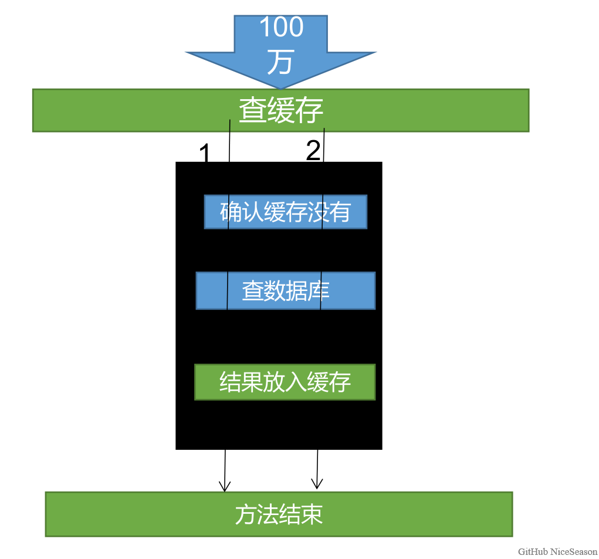

优化代码逻辑后

```java
public Map<String, List<Catalog2Vo>> getCategoryMap() {
    ValueOperations<String, String> ops = stringRedisTemplate.opsForValue();
        String catalogJson = ops.get("catalogJson");
        if (StringUtils.isEmpty(catalogJson)) {
            System.out.println("缓存不命中，准备查询数据库。。。");
            synchronized (this) {
                String synCatalogJson = stringRedisTemplate.opsForValue().get("catalogJson");
                if (StringUtils.isEmpty(synCatalogJson)) {
                    Map<String, List<Catalog2Vo>> categoriesDb= getCategoriesDb();
                    String toJSONString = JSON.toJSONString(categoriesDb);
                    ops.set("catalogJson", toJSONString);
                    return categoriesDb;
                }else {
                    Map<String, List<Catalog2Vo>> listMap = JSON.parseObject(synCatalogJson, new TypeReference<Map<String, List<Catalog2Vo>>>() {});
                    return listMap;
                }
            }
        }
        System.out.println("缓存命中。。。。");
        Map<String, List<Catalog2Vo>> listMap = JSON.parseObject(catalogJson, new TypeReference<Map<String, List<Catalog2Vo>>>() {});
        return listMap;
}
```

优化后多线程访问时仅查询一次数据库

### 2. 分布式缓存

#### 1) 本地缓存面临问题

当有多个服务存在时，每个服务的缓存仅能够为本服务使用，这样每个服务都要查询一次数据库，并且当数据更新时只会更新单个服务的缓存数据，就会造成数据不一致的问题

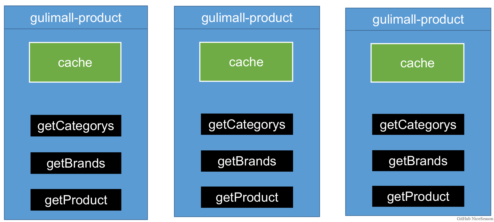

所有的服务都到同一个redis进行获取数据，就可以避免这个问题

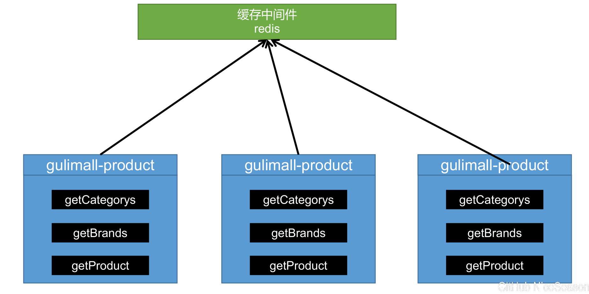

#### 2)  分布式锁

当分布式项目在高并发下也需要加锁，但本地锁只能锁住当前服务，这个时候就需要分布式锁


#### 3) 分布式锁的演进

**基本原理**

我们可以同时去一个地方“占坑”，如果占到，就执行逻辑。否则就必须等待，直到释放锁。“占坑”可以去redis，可以去数据库，可以去任何大家都能访问的地方。等待可以自旋的方式。

**阶段一**

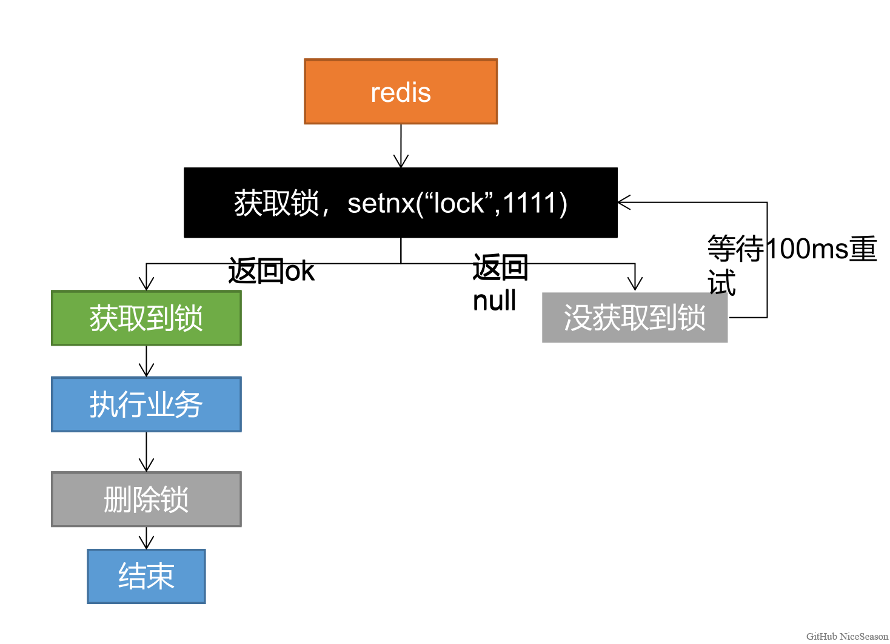

```java
	public Map<String, List<Catalog2Vo>> getCatalogJsonDbWithRedisLock() {
        //阶段一
        Boolean lock = stringRedisTemplate.opsForValue().setIfAbsent("lock", "111");
        //获取到锁，执行业务
        if (lock) {
            Map<String, List<Catalog2Vo>> categoriesDb = getCategoryMap();
            //删除锁，如果在此之前报错或宕机会造成死锁
            stringRedisTemplate.delete("lock");
            return categoriesDb;
        }else {
            //没获取到锁，等待100ms重试
            try {
                Thread.sleep(100);
            } catch (InterruptedException e) {
                e.printStackTrace();
            }
            return getCatalogJsonDbWithRedisLock();
        }
    }

public Map<String, List<Catalog2Vo>> getCategoryMap() {
        ValueOperations<String, String> ops = stringRedisTemplate.opsForValue();
        String catalogJson = ops.get("catalogJson");
        if (StringUtils.isEmpty(catalogJson)) {
            System.out.println("缓存不命中，准备查询数据库。。。");
            Map<String, List<Catalog2Vo>> categoriesDb= getCategoriesDb();
            String toJSONString = JSON.toJSONString(categoriesDb);
            ops.set("catalogJson", toJSONString);
            return categoriesDb;
        }
        System.out.println("缓存命中。。。。");
        Map<String, List<Catalog2Vo>> listMap = JSON.parseObject(catalogJson, new TypeReference<Map<String, List<Catalog2Vo>>>() {});
        return listMap;
    }
```

问题：
1、setnx占好了位，业务代码异常或者程序在页面过程中宕机。没有执行删除锁逻辑，这就造成了死锁

解决：设置锁的自动过期，即使没有删除，会自动删除


**阶段二**

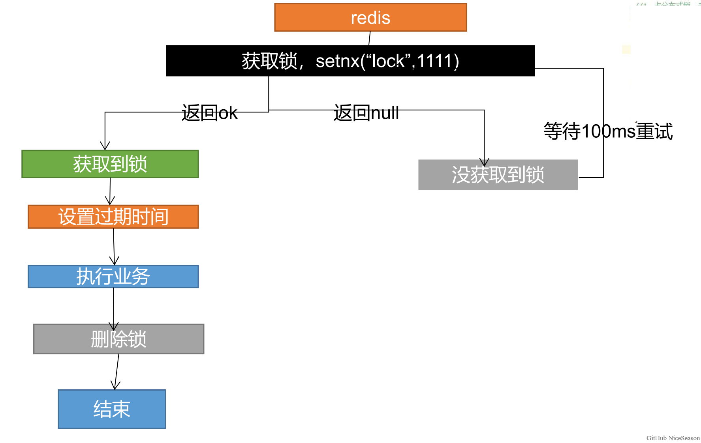

```java
   public Map<String, List<Catalog2Vo>> getCatalogJsonDbWithRedisLock() {
        Boolean lock = stringRedisTemplate.opsForValue().setIfAbsent("lock", "111");
        if (lock) {
            //设置过期时间
            stringRedisTemplate.expire("lock", 30, TimeUnit.SECONDS);
            Map<String, List<Catalog2Vo>> categoriesDb = getCategoryMap();
            stringRedisTemplate.delete("lock");
            return categoriesDb;
        }else {
            try {
                Thread.sleep(100);
            } catch (InterruptedException e) {
                e.printStackTrace();
            }
            return getCatalogJsonDbWithRedisLock();
        }
    }
```

问题：
1、setnx设置好，正要去设置过期时间，宕机。又死锁了。
解决：
设置过期时间和占位必须是原子的。redis支持使用setnx ex命令

**阶段三**

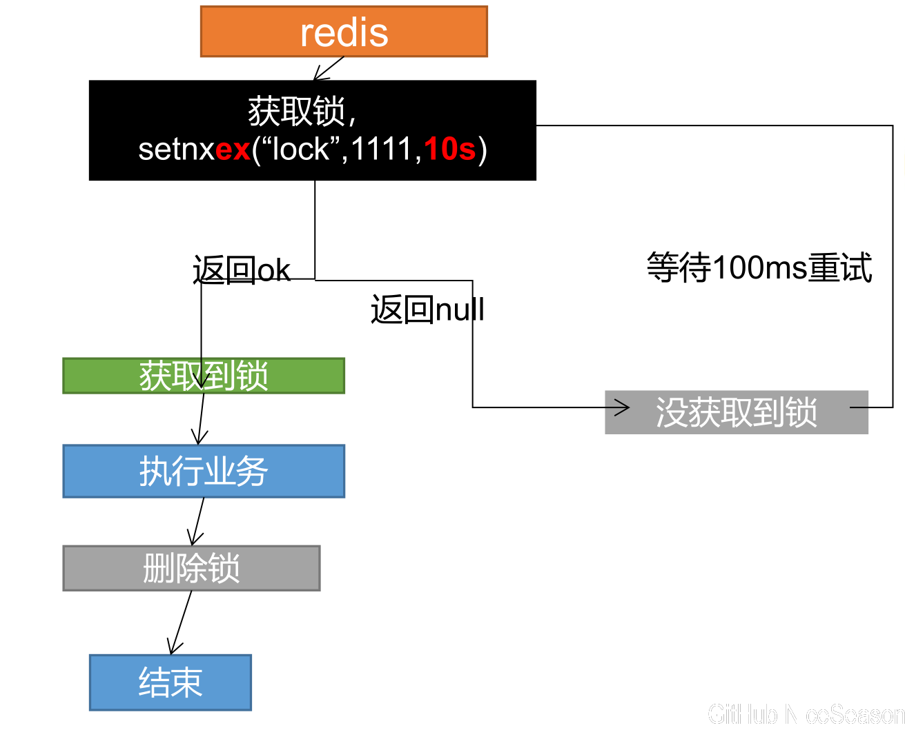

```java
public Map<String, List<Catalog2Vo>> getCatalogJsonDbWithRedisLock() {
    //加锁的同时设置过期时间，二者是原子性操作
    Boolean lock = stringRedisTemplate.opsForValue().setIfAbsent("lock", "1111",5, TimeUnit.SECONDS);
    if (lock) {
        Map<String, List<Catalog2Vo>> categoriesDb = getCategoryMap();
        //模拟超长的业务执行时间
        try {
            Thread.sleep(6000);
        } catch (InterruptedException e) {
            e.printStackTrace();
        }
        stringRedisTemplate.delete("lock");
        return categoriesDb;
    }else {
        try {
            Thread.sleep(100);
        } catch (InterruptedException e) {
            e.printStackTrace();
        }
        return getCatalogJsonDbWithRedisLock();
    }
}
```

问题：
1、删除锁直接删除？？？
如果由于业务时间很长，锁自己过期了，我们直接删除，有可能把别人正在持有的锁删除了。
解决：
占锁的时候，值指定为uuid，每个人匹配是自己的锁才删除。

**阶段四**

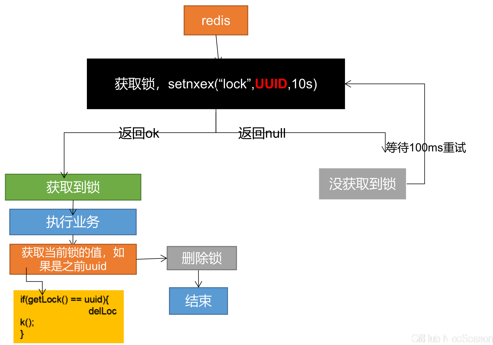

```java
 public Map<String, List<Catalog2Vo>> getCatalogJsonDbWithRedisLock() {
        String uuid = UUID.randomUUID().toString();
        ValueOperations<String, String> ops = stringRedisTemplate.opsForValue();
     	//为当前锁设置唯一的uuid，只有当uuid相同时才会进行删除锁的操作
        Boolean lock = ops.setIfAbsent("lock", uuid,5, TimeUnit.SECONDS);
        if (lock) {
            Map<String, List<Catalog2Vo>> categoriesDb = getCategoryMap();
            String lockValue = ops.get("lock");
            if (lockValue.equals(uuid)) {
                try {
                    Thread.sleep(6000);
                } catch (InterruptedException e) {
                    e.printStackTrace();
                }
                stringRedisTemplate.delete("lock");
            }
            return categoriesDb;
        }else {
            try {
                Thread.sleep(100);
            } catch (InterruptedException e) {
                e.printStackTrace();
            }
            return getCatalogJsonDbWithRedisLock();
        }
    }
```

问题：
1、如果正好判断是当前值，正要删除锁的时候，锁已经过期，别人已经设置到了新的值。那么我们删除的是别人的锁
解决：
删除锁必须保证原子性。使用redis+Lua脚本完成

**阶段五-最终形态**

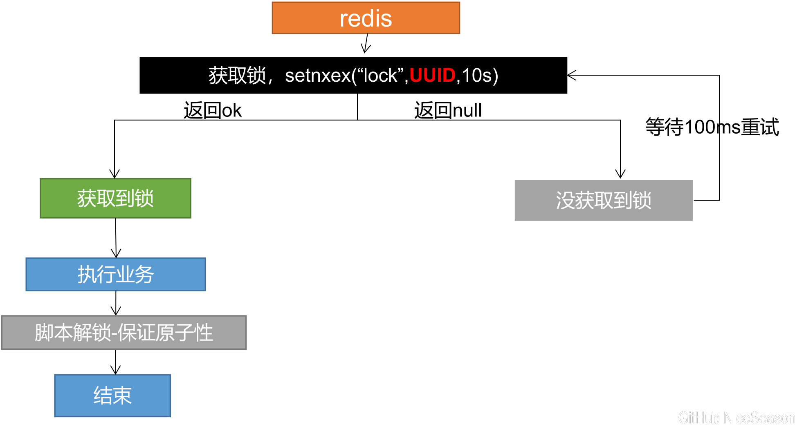

```java
 public Map<String, List<Catalog2Vo>> getCatalogJsonDbWithRedisLock() {
        String uuid = UUID.randomUUID().toString();
        ValueOperations<String, String> ops = stringRedisTemplate.opsForValue();
        Boolean lock = ops.setIfAbsent("lock", uuid,5, TimeUnit.SECONDS);
        if (lock) {
            Map<String, List<Catalog2Vo>> categoriesDb = getCategoryMap();
            String lockValue = ops.get("lock");
            String script = "if redis.call(\"get\",KEYS[1]) == ARGV[1] then\n" +
                    "    return redis.call(\"del\",KEYS[1])\n" +
                    "else\n" +
                    "    return 0\n" +
                    "end";
            stringRedisTemplate.execute(new DefaultRedisScript<Long>(script, Long.class), Arrays.asList("lock"), lockValue);
            return categoriesDb;
        }else {
            try {
                Thread.sleep(100);
            } catch (InterruptedException e) {
                e.printStackTrace();
            }
            return getCatalogJsonDbWithRedisLock();
        }
    }
```

保证加锁【占位+过期时间】和删除锁【判断+删除】的原子性。更难的事情，锁的自动续期

#### 4) Redisson

Redisson是一个在Redis的基础上实现的Java驻内存数据网格（In-Memory Data Grid）。它不仅提供了一系列的分布式的Java常用对象，还提供了许多分布式服务。其中包括(`BitSet`, `Set`, `Multimap`, `SortedSet`, `Map`, `List`, `Queue`, `BlockingQueue`, `Deque`, `BlockingDeque`, `Semaphore`, `Lock`, `AtomicLong`, `CountDownLatch`, `Publish / Subscribe`, `Bloom filter`, `Remote service`, `Spring cache`, `Executor service`, `Live Object service`, `Scheduler service`) Redisson提供了使用Redis的最简单和最便捷的方法。Redisson的宗旨是促进使用者对Redis的关注分离（Separation of Concern），从而让使用者能够将精力更集中地放在处理业务逻辑上。

本文我们仅关注分布式锁的实现，更多请参考[官方文档](https://github.com/redisson/redisson/wiki/8.-%E5%88%86%E5%B8%83%E5%BC%8F%E9%94%81%E5%92%8C%E5%90%8C%E6%AD%A5%E5%99%A8)

##### (1) 环境搭建

**导入依赖**

```xml
<dependency>
    <groupId>org.redisson</groupId>
    <artifactId>redisson</artifactId>
    <version>3.13.4</version>
</dependency>
```

开启配置

```java
@Configuration
public class RedissonConfig {
    @Bean
    public RedissonClient redissonClient(){
        Config config = new Config();
        config.useSingleServer().setAddress("redis://192.168.56.102:6379");
        RedissonClient redisson = Redisson.create(config);
        return redisson;
    }
}
```

##### (2)  可重入锁（Reentrant Lock）

```java
 public Map<String, List<Catalog2Vo>> getCatalogJsonDbWithRedisson() {
        Map<String, List<Catalog2Vo>> categoryMap=null;
        RLock lock = redissonClient.getLock("CatalogJson-Lock");
        lock.lock();
        try {
            Thread.sleep(30000);
            categoryMap = getCategoryMap();
        } catch (InterruptedException e) {
            e.printStackTrace();
        }finally {
            lock.unlock();
            return categoryMap;
        }
    }
```

如果负责储存这个分布式锁的Redisson节点宕机以后，而且这个锁正好处于锁住的状态时，这个锁会出现锁死的状态。为了避免这种情况的发生，所以就设置了过期时间，但是如果业务执行时间过长，业务还未执行完锁就已经过期，那么就会出现解锁时解了其他线程的锁的情况。

所以Redisson内部提供了一个监控锁的看门狗，它的作用是在Redisson实例被关闭前，不断的延长锁的有效期。默认情况下，看门狗的检查锁的超时时间是30秒钟，也可以通过修改[Config.lockWatchdogTimeout](https://github.com/redisson/redisson/wiki/2.-配置方法#lockwatchdogtimeout监控锁的看门狗超时单位毫秒)来另行指定。

在本次测试中`CatalogJson-Lock`的初始过期时间TTL为30s，但是每到20s就会自动续借成30s

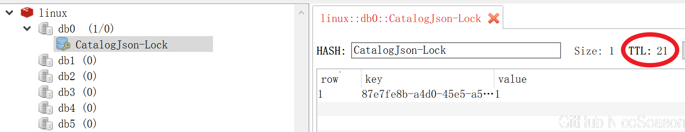

另外Redisson还通过加锁的方法提供了`leaseTime`的参数来指定加锁的时间。超过这个时间后锁便自动解开了。不会自动续期！

```java
// 加锁以后10秒钟自动解锁
// 无需调用unlock方法手动解锁,如果要手动解锁一定要确保业务执行时间小于锁的失效时间
lock.lock(10, TimeUnit.SECONDS);

// 尝试加锁，最多等待100秒，上锁以后10秒自动解锁
boolean res = lock.tryLock(100, 10, TimeUnit.SECONDS);
if (res) {
   try {
     ...
   } finally {
       lock.unlock();
   }
}
```

##### (3) 读写锁（ReadWriteLock）

```java
    @GetMapping("/read")
    @ResponseBody
    public String read() {
        RReadWriteLock lock = redissonClient.getReadWriteLock("ReadWrite-Lock");
        RLock rLock = lock.readLock();
        String s = "";
        try {
            rLock.lock();
            System.out.println("读锁加锁"+Thread.currentThread().getId());
            Thread.sleep(5000);
            s= redisTemplate.opsForValue().get("lock-value");
        }finally {
            rLock.unlock();
            return "读取完成:"+s;
        }
    }

    @GetMapping("/write")
    @ResponseBody
    public String write() {
        RReadWriteLock lock = redissonClient.getReadWriteLock("ReadWrite-Lock");
        RLock wLock = lock.writeLock();
        String s = UUID.randomUUID().toString();
        try {
            wLock.lock();
            System.out.println("写锁加锁"+Thread.currentThread().getId());
            Thread.sleep(10000);
            redisTemplate.opsForValue().set("lock-value",s);
        } catch (InterruptedException e) {
            e.printStackTrace();
        }finally {
            wLock.unlock();
            return "写入完成:"+s;
        }
    }
```

写锁会阻塞读锁，但是读锁不会阻塞读锁，但读锁会阻塞写锁

总之含有写的过程都会被阻塞，只有读读不会被阻塞

上锁时在redis的状态

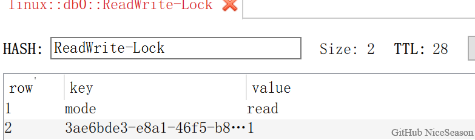


##### (4) 信号量（Semaphore）

信号量为存储在redis中的一个数字，当这个数字大于0时，即可以调用`acquire()`方法增加数量，也可以调用`release()`方法减少数量，但是当调用`release()`之后小于0的话方法就会阻塞，直到数字大于0

```java
@GetMapping("/park")
@ResponseBody
public String park() {
    RSemaphore park = redissonClient.getSemaphore("park");
    try {
        park.acquire(2);
    } catch (InterruptedException e) {
        e.printStackTrace();
    }
    return "停进2";
}

@GetMapping("/go")
@ResponseBody
public String go() {
    RSemaphore park = redissonClient.getSemaphore("park");
    park.release(2);
    return "开走2";
}
```

##### (5) 闭锁（CountDownLatch）

可以理解为门栓，使用若干个门栓将当前方法阻塞，只有当全部门栓都被放开时，当前方法才能继续执行。

以下代码只有`offLatch()`被调用5次后 `setLatch()`才能继续执行

```java
 	@GetMapping("/setLatch")
    @ResponseBody
    public String setLatch() {
        RCountDownLatch latch = redissonClient.getCountDownLatch("CountDownLatch");
        try {
            latch.trySetCount(5);
            latch.await();
        } catch (InterruptedException e) {
            e.printStackTrace();
        }
        return "门栓被放开";
    }

    @GetMapping("/offLatch")
    @ResponseBody
    public String offLatch() {
        RCountDownLatch latch = redissonClient.getCountDownLatch("CountDownLatch");
        latch.countDown();
        return "门栓被放开1";
    }
```

闭锁在redis的存储状态

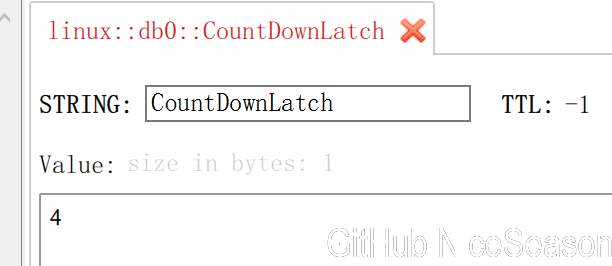


### 3. 缓存数据的一致性

#### 1)  双写模式

当数据更新时，更新数据库时同时更新缓存

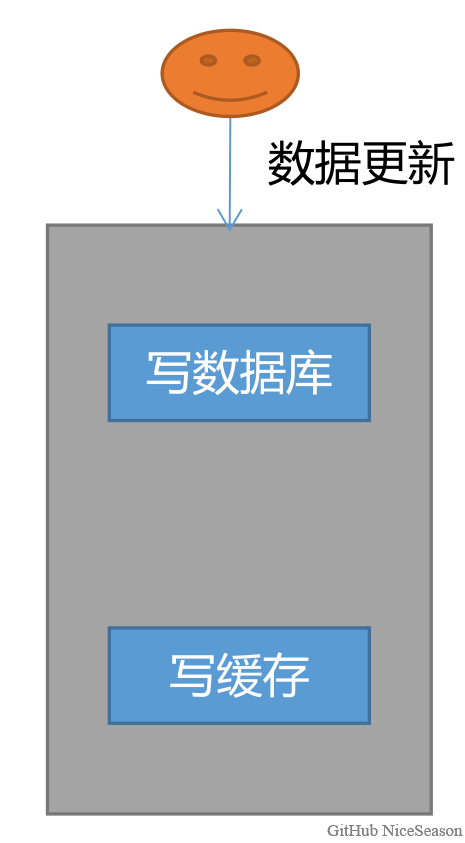

**存在问题**

由于卡顿等原因，导致写缓存2在最前，写缓存1在后面就出现了不一致

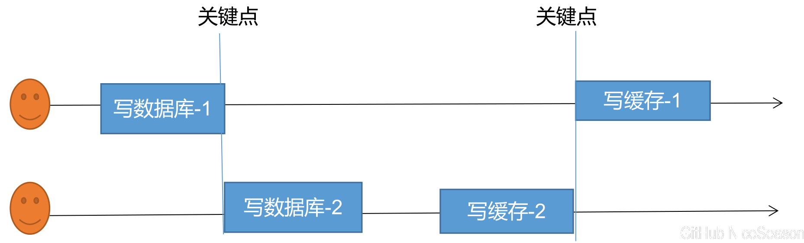

这是暂时性的脏数据问题，但是在数据稳定，缓存过期以后，又能得到最新的正确数据

#### 2) 失效模式

数据库更新时将缓存删除

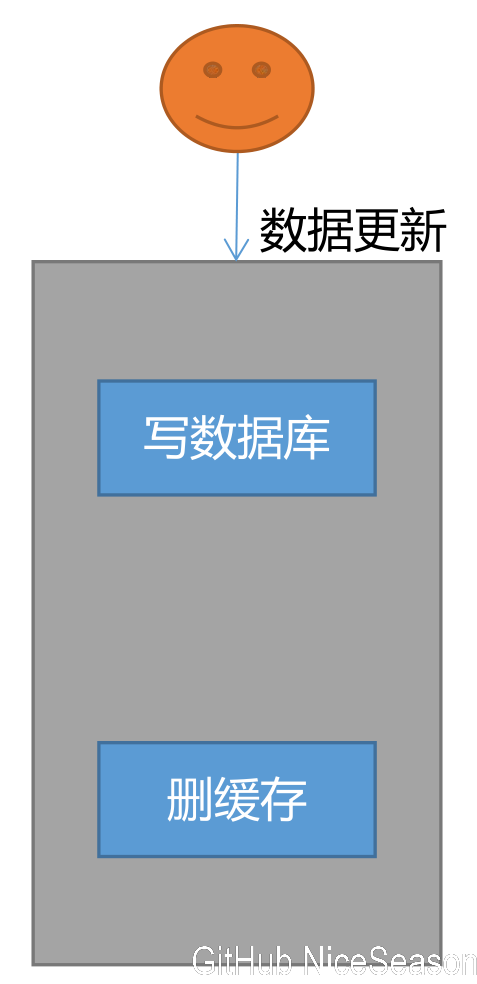

**存在问题**

当两个请求同时修改数据库，一个请求已经更新成功并删除缓存时又有读数据的请求进来，这时候发现缓存中无数据就去数据库中查询并放入缓存，在放入缓存前第二个更新数据库的请求成功，这时候留在缓存中的数据依然是第一次数据更新的数据

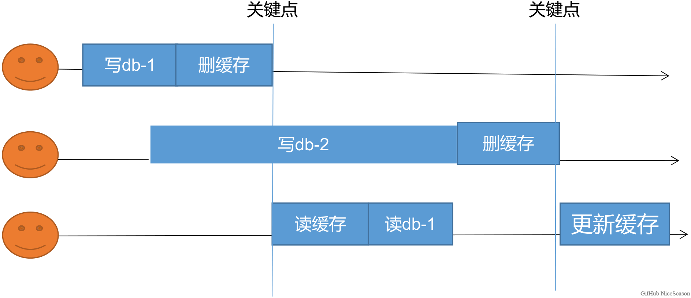

**解决方法**

1、缓存的所有数据都有过期时间，数据过期下一次查询触发主动更新
2、读写数据的时候(并且写的不频繁)，加上分布式的读写锁。


#### 3) 解决方案

无论是双写模式还是失效模式，都会导致缓存的不一致问题。即多个实例同时更新会出事。怎么办？

* 如果是用户纬度数据（订单数据、用户数据），这种并发几率非常小，不用考虑这个问题，缓存数据加上过期时间，每隔一段时间触发读的主动更新即可
* 如果是菜单，商品介绍等基础数据，也可以去使用canal订阅binlog的方式。
* 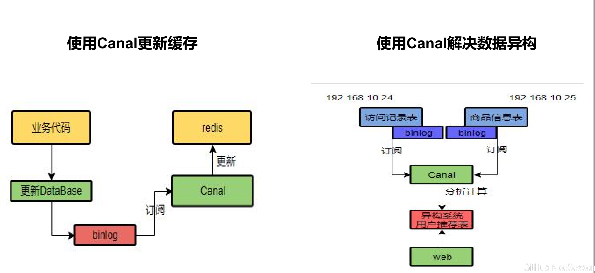
* 缓存数据+过期时间也足够解决大部分业务对于缓存的要求。
* 通过加锁保证并发读写，写写的时候按顺序排好队。读读无所谓。所以适合使用读写锁。（业务不关心
  脏数据，允许临时脏数据可忽略）；

总结：

* 我们能放入缓存的数据本就不应该是实时性、一致性要求超高的。所以缓存数据的时候加上过期时间，保
  证每天拿到当前最新数据即可。
*  我们不应该过度设计，增加系统的复杂性
*  遇到实时性、一致性要求高的数据，就应该查数据库，即使慢点。


### 4. SpringCache

==这部分的理论内容可以[参考我之前学习springboot记的笔记](https://github.com/NiceSeason/SpringBoot_demo/tree/master/docs)，也是雷丰阳老师的课程，更加详细深入，包含源码分析。==

#### 1)  导入依赖

```xml
<dependency>
    <groupId>org.springframework.boot</groupId>
    <artifactId>spring-boot-starter-cache</artifactId>
</dependency>
```

#### 2) 自定义配置

指定缓存类型并在主配置类上加上注解`@EnableCaching`

```yaml
spring:
  cache:
  	#指定缓存类型为redis
    type: redis
    redis:
      ///指定redis中的过期时间为1h
      time-to-live: 3600000
```

默认使用jdk进行序列化，自定义序列化方式需要编写配置类

```java
@Configuration
public class MyCacheConfig {
    @Bean
    public org.springframework.data.redis.cache.RedisCacheConfiguration redisCacheConfiguration(
            CacheProperties cacheProperties) {
        CacheProperties.Redis redisProperties = cacheProperties.getRedis();
        org.springframework.data.redis.cache.RedisCacheConfiguration config = org.springframework.data.redis.cache.RedisCacheConfiguration
                .defaultCacheConfig();
        //指定缓存序列化方式为json
        config = config.serializeValuesWith(
                RedisSerializationContext.SerializationPair.fromSerializer(new GenericJackson2JsonRedisSerializer()));
        //设置配置文件中的各项配置，如过期时间
        if (redisProperties.getTimeToLive() != null) {
            config = config.entryTtl(redisProperties.getTimeToLive());
        }
        if (redisProperties.getKeyPrefix() != null) {
            config = config.prefixKeysWith(redisProperties.getKeyPrefix());
        }
        if (!redisProperties.isCacheNullValues()) {
            config = config.disableCachingNullValues();
        }
        if (!redisProperties.isUseKeyPrefix()) {
            config = config.disableKeyPrefix();
        }
        return config;
    }
}
```

#### 3) 自定义序列化原理


缓存使用

```java
  	//调用该方法时会将结果缓存，缓存名为category，key为方法名
	//表示该方法的缓存被读取时会加锁
	@Cacheable(value = {"category"},key = "#root.methodName",sync = true)
    public Map<String, List<Catalog2Vo>> getCatalogJsonDbWithSpringCache() {
        return getCategoriesDb();
    }

	//调用该方法会删除缓存category下的所有cache
    @Override
    @CacheEvict(value = {"category"},allEntries = true)
    public void updateCascade(CategoryEntity category) {
        this.updateById(category);
        if (!StringUtils.isEmpty(category.getName())) {
            categoryBrandRelationService.updateCategory(category);
        }
    }
```

第一个方法缓存结果后

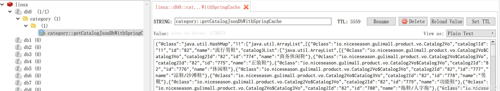

第二个方法调用清除缓存后

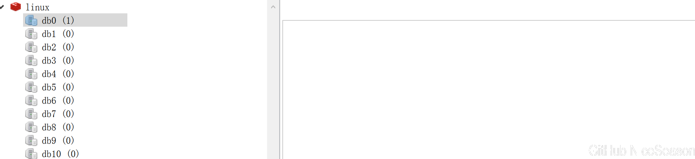

#### 4)  Spring-Cache的不足之处

1）、读模式

缓存穿透：查询一个null数据。解决方案：缓存空数据，可通过`spring.cache.redis.cache-null-values=true`

缓存击穿：大量并发进来同时查询一个正好过期的数据。解决方案：加锁 ? 默认是无加锁的;

使用sync = true来解决击穿问题

缓存雪崩：大量的key同时过期。解决：加随机时间。加上过期时间

2)、写模式：（缓存与数据库一致）

a、读写加锁。

b、引入Canal,感知到MySQL的更新去更新Redis

c 、读多写多，直接去数据库查询就行

3）、总结：

常规数据（读多写少，即时性，一致性要求不高的数据，完全可以使用Spring-Cache）：

写模式(只要缓存的数据有过期时间就足够了)

特殊数据：特殊设计

## 检索

### 1. 检索条件分析

* 全文检索：skuTitle-》keyword

* 排序：saleCount（销量）、hotScore（热度分）、skuPrice（价格）

* 过滤：hasStock、skuPrice区间、brandId、catalog3Id、attrs

* 聚合：attrs

  

完整查询参数
`keyword=小米&sort=saleCount_desc/asc&hasStock=0/1&skuPrice=400_1900&brandId=1&catalog3Id=1&at
trs=1_3G:4G:5G&attrs=2_骁龙845&attrs=4_高清屏`

### 2. DSL分析

```json
GET gulimall_product/_search
{
  "query": {
    "bool": {
      "must": [
        {
          "match": {
            "skuTitle": "华为"
          }
        }
      ],
      "filter": [
        {
            "term": {
              "catalogId": "225"
            }
        },
        {
            "terms": {
            "brandId": [
              "2"
            ]
          }
        },
        {
          "term": {
            "hasStock": "false"
          }
        },
        {
          "range": {
            "skuPrice": {
              "gte": 1000,
              "lte": 7000
            }
          }
        },
        {
          "nested": {
            "path": "attrs",
            "query": {
              "bool": {
                "must": [
                  {
                    "term": {
                      "attrs.attrId": {
                        "value": "6"
                      }
                    }
                  }
                ]
              }
            }
          }
        }
      ]
    }
  },
  "sort": [
    {
      "skuPrice": {
        "order": "desc"
      }
    }
  ],
  "from": 0,
  "size": 5,
  "highlight": {
    "fields": {"skuTitle": {}},
    "pre_tags": "<b style='color:red'>", 
    "post_tags": "</b>"
  },
  "aggs": {
    "brandAgg": {
      "terms": {
        "field": "brandId",
        "size": 10
      },
      "aggs": {
        "brandNameAgg": {
          "terms": {
            "field": "brandName",
            "size": 10
          }
        },
      
        "brandImgAgg": {
          "terms": {
            "field": "brandImg",
            "size": 10
          }
        }
        
      }
    },
    "catalogAgg":{
      "terms": {
        "field": "catalogId",
        "size": 10
      },
      "aggs": {
        "catalogNameAgg": {
          "terms": {
            "field": "catalogName",
            "size": 10
          }
        }
      }
    },
    "attrs":{
      "nested": {
        "path": "attrs"
      },
      "aggs": {
        "attrIdAgg": {
          "terms": {
            "field": "attrs.attrId",
            "size": 10
          },
          "aggs": {
            "attrNameAgg": {
              "terms": {
                "field": "attrs.attrName",
                "size": 10
              }
            }
          }
        }
      }
    }
  }
}
```

### 3. 检索代码编写

#### 1) 请求参数和返回结果

请求参数的封装

```java
@Data
public class SearchParam {
    //页面传递过来的全文匹配关键字
    private String keyword;

    //品牌id,可以多选
    private List<Long> brandId;

    //三级分类id
    private Long catalog3Id;

    //排序条件：sort=price/salecount/hotscore_desc/asc
    private String sort;

    //是否显示有货
    private Integer hasStock;

    //价格区间查询
    private String skuPrice;

    //按照属性进行筛选
    private List<String> attrs;

    //页码
    private Integer pageNum = 1;

    //原生的所有查询条件
    private String _queryString;

}
```

返回结果

```java
@Data
public class SearchResult {
    //查询到的所有商品信息
    private List<SkuEsModel> product;

    //当前页码
    private Integer pageNum;

    //总记录数
    private Long total;

    //总页码
    private Integer totalPages;
	//页码遍历结果集(分页)
    private List<Integer> pageNavs;

    //当前查询到的结果，所有涉及到的品牌
    private List<BrandVo> brands;

    //当前查询到的结果，所有涉及到的所有属性
    private List<AttrVo> attrs;

    //当前查询到的结果，所有涉及到的所有分类
    private List<CatalogVo> catalogs;


    //===========================以上是返回给页面的所有信息============================//


    /* 面包屑导航数据 */
    private List<NavVo> navs;

    @Data
    public static class NavVo {
        private String navName;
        private String navValue;
        private String link;
    }


    @Data
    @AllArgsConstructor
    public static class BrandVo {

        private Long brandId;

        private String brandName;

        private String brandImg;
    }


    @Data
    @AllArgsConstructor
    public static class AttrVo {

        private Long attrId;

        private String attrName;

        private List<String> attrValue;
    }


    @Data
    @AllArgsConstructor
    public static class CatalogVo {

        private Long catalogId;

        private String catalogName;
    }
}
```


#### 2)  主体逻辑

主要逻辑在service层进行，service层将封装好的`SearchParam`组建查询条件，再将返回后的结果封装成`SearchResult`

```java
 	@GetMapping(value = {"/search.html","/"})
    public String getSearchPage(SearchParam searchParam, Model model, HttpServletRequest request) {
        searchParam.set_queryString(request.getQueryString());
        SearchResult result=searchService.getSearchResult(searchParam);
        model.addAttribute("result", result);
        return "search";
    }


	public SearchResult getSearchResult(SearchParam searchParam) {
        SearchResult searchResult= null;
        //通过请求参数构建查询请求
        SearchRequest request = bulidSearchRequest(searchParam);
        try {
            SearchResponse searchResponse = restHighLevelClient.search(request, GulimallElasticSearchConfig.COMMON_OPTIONS);
            //将es响应数据封装成结果
            searchResult = bulidSearchResult(searchParam,searchResponse);
        } catch (IOException e) {
            e.printStackTrace();
        }
        return searchResult;
    }
```

#### 3)  构建查询条件

这一部分就是对着前面分析的DSL，将每个条件封装进请求中

```java
private SearchRequest bulidSearchRequest(SearchParam searchParam) {
        SearchSourceBuilder searchSourceBuilder = new SearchSourceBuilder();
        //1. 构建bool query
        BoolQueryBuilder boolQueryBuilder = new BoolQueryBuilder();
        //1.1 bool must
        if (!StringUtils.isEmpty(searchParam.getKeyword())) {
            boolQueryBuilder.must(QueryBuilders.matchQuery("skuTitle", searchParam.getKeyword()));
        }

        //1.2 bool filter
        //1.2.1 catalog
        if (searchParam.getCatalog3Id()!=null){
            boolQueryBuilder.filter(QueryBuilders.termQuery("catalogId", searchParam.getCatalog3Id()));
        }
        //1.2.2 brand
        if (searchParam.getBrandId()!=null&&searchParam.getBrandId().size()>0) {
            boolQueryBuilder.filter(QueryBuilders.termsQuery("brandId",searchParam.getBrandId()));
        }
        //1.2.3 hasStock
        if (searchParam.getHasStock() != null) {
            boolQueryBuilder.filter(QueryBuilders.termQuery("hasStock", searchParam.getHasStock() == 1));
        }
        //1.2.4 priceRange
        RangeQueryBuilder rangeQueryBuilder = QueryBuilders.rangeQuery("skuPrice");
        if (!StringUtils.isEmpty(searchParam.getSkuPrice())) {
            String[] prices = searchParam.getSkuPrice().split("_");
            if (prices.length == 1) {
                if (searchParam.getSkuPrice().startsWith("_")) {
                    rangeQueryBuilder.lte(Integer.parseInt(prices[0]));
                }else {
                    rangeQueryBuilder.gte(Integer.parseInt(prices[0]));
                }
            } else if (prices.length == 2) {
                //_6000会截取成["","6000"]
                if (!prices[0].isEmpty()) {
                    rangeQueryBuilder.gte(Integer.parseInt(prices[0]));
                }
                rangeQueryBuilder.lte(Integer.parseInt(prices[1]));
            }
            boolQueryBuilder.filter(rangeQueryBuilder);
        }
        //1.2.5 attrs-nested
        //attrs=1_5寸:8寸&2_16G:8G
        List<String> attrs = searchParam.getAttrs();
        BoolQueryBuilder queryBuilder = new BoolQueryBuilder();
        if (attrs!=null&&attrs.size() > 0) {
            attrs.forEach(attr->{
                String[] attrSplit = attr.split("_");
                queryBuilder.must(QueryBuilders.termQuery("attrs.attrId", attrSplit[0]));
                String[] attrValues = attrSplit[1].split(":");
                queryBuilder.must(QueryBuilders.termsQuery("attrs.attrValue", attrValues));
            });
        }
        NestedQueryBuilder nestedQueryBuilder = QueryBuilders.nestedQuery("attrs", queryBuilder, ScoreMode.None);
        boolQueryBuilder.filter(nestedQueryBuilder);
        //1. bool query构建完成
        searchSourceBuilder.query(boolQueryBuilder);

        //2. sort  eg:sort=saleCount_desc/asc
        if (!StringUtils.isEmpty(searchParam.getSort())) {
            String[] sortSplit = searchParam.getSort().split("_");
            searchSourceBuilder.sort(sortSplit[0], sortSplit[1].equalsIgnoreCase("asc") ? SortOrder.ASC : SortOrder.DESC);
        }

        //3. 分页
        searchSourceBuilder.from((searchParam.getPageNum() - 1) * EsConstant.PRODUCT_PAGESIZE);
        searchSourceBuilder.size(EsConstant.PRODUCT_PAGESIZE);

        //4. 高亮highlight
        if (!StringUtils.isEmpty(searchParam.getKeyword())) {
            HighlightBuilder highlightBuilder = new HighlightBuilder();
            highlightBuilder.field("skuTitle");
            highlightBuilder.preTags("<b style='color:red'>");
            highlightBuilder.postTags("</b>");
            searchSourceBuilder.highlighter(highlightBuilder);
        }

        //5. 聚合
        //5.1 按照brand聚合
        TermsAggregationBuilder brandAgg = AggregationBuilders.terms("brandAgg").field("brandId");
        TermsAggregationBuilder brandNameAgg = AggregationBuilders.terms("brandNameAgg").field("brandName");
        TermsAggregationBuilder brandImgAgg = AggregationBuilders.terms("brandImgAgg").field("brandImg");
        brandAgg.subAggregation(brandNameAgg);
        brandAgg.subAggregation(brandImgAgg);
        searchSourceBuilder.aggregation(brandAgg);

        //5.2 按照catalog聚合
        TermsAggregationBuilder catalogAgg = AggregationBuilders.terms("catalogAgg").field("catalogId");
        TermsAggregationBuilder catalogNameAgg = AggregationBuilders.terms("catalogNameAgg").field("catalogName");
        catalogAgg.subAggregation(catalogNameAgg);
        searchSourceBuilder.aggregation(catalogAgg);

        //5.3 按照attrs聚合
        NestedAggregationBuilder nestedAggregationBuilder = new NestedAggregationBuilder("attrs", "attrs");
        //按照attrId聚合
        TermsAggregationBuilder attrIdAgg = AggregationBuilders.terms("attrIdAgg").field("attrs.attrId");
        //按照attrId聚合之后再按照attrName和attrValue聚合
        TermsAggregationBuilder attrNameAgg = AggregationBuilders.terms("attrNameAgg").field("attrs.attrName");
        TermsAggregationBuilder attrValueAgg = AggregationBuilders.terms("attrValueAgg").field("attrs.attrValue");
        attrIdAgg.subAggregation(attrNameAgg);
        attrIdAgg.subAggregation(attrValueAgg);

        nestedAggregationBuilder.subAggregation(attrIdAgg);
        searchSourceBuilder.aggregation(nestedAggregationBuilder);

        log.debug("构建的DSL语句 {}",searchSourceBuilder.toString());

        SearchRequest request = new SearchRequest(new String[]{EsConstant.PRODUCT_INDEX}, searchSourceBuilder);
        return request;
    }
```

#### 4) 封装响应结果

```java
private SearchResult bulidSearchResult(SearchParam searchParam, SearchResponse searchResponse) {
    SearchResult result = new SearchResult();
    SearchHits hits = searchResponse.getHits();
    //1. 封装查询到的商品信息
    if (hits.getHits()!=null&&hits.getHits().length>0){
        List<SkuEsModel> skuEsModels = new ArrayList<>();
        for (SearchHit hit : hits) {
            String sourceAsString = hit.getSourceAsString();
            SkuEsModel skuEsModel = JSON.parseObject(sourceAsString, SkuEsModel.class);
            //设置高亮属性
            if (!StringUtils.isEmpty(searchParam.getKeyword())) {
                HighlightField skuTitle = hit.getHighlightFields().get("skuTitle");
                String highLight = skuTitle.getFragments()[0].string();
                skuEsModel.setSkuTitle(highLight);
            }
            skuEsModels.add(skuEsModel);
        }
        result.setProduct(skuEsModels);
    }

    //2. 封装分页信息
    //2.1 当前页码
    result.setPageNum(searchParam.getPageNum());
    //2.2 总记录数
    long total = hits.getTotalHits().value;
    result.setTotal(total);
    //2.3 总页码
    Integer totalPages = (int)total % EsConstant.PRODUCT_PAGESIZE == 0 ?
            (int)total / EsConstant.PRODUCT_PAGESIZE : (int)total / EsConstant.PRODUCT_PAGESIZE + 1;
    result.setTotalPages(totalPages);
    List<Integer> pageNavs = new ArrayList<>();
    for (int i = 1; i <= totalPages; i++) {
        pageNavs.add(i);
    }
    result.setPageNavs(pageNavs);

    //3. 查询结果涉及到的品牌
    List<SearchResult.BrandVo> brandVos = new ArrayList<>();
    Aggregations aggregations = searchResponse.getAggregations();
    //ParsedLongTerms用于接收terms聚合的结果，并且可以把key转化为Long类型的数据
    ParsedLongTerms brandAgg = aggregations.get("brandAgg");
    for (Terms.Bucket bucket : brandAgg.getBuckets()) {
        //3.1 得到品牌id
        Long brandId = bucket.getKeyAsNumber().longValue();

        Aggregations subBrandAggs = bucket.getAggregations();
        //3.2 得到品牌图片
        ParsedStringTerms brandImgAgg=subBrandAggs.get("brandImgAgg");
        String brandImg = brandImgAgg.getBuckets().get(0).getKeyAsString();
        //3.3 得到品牌名字
        Terms brandNameAgg=subBrandAggs.get("brandNameAgg");
        String brandName = brandNameAgg.getBuckets().get(0).getKeyAsString();
        SearchResult.BrandVo brandVo = new SearchResult.BrandVo(brandId, brandName, brandImg);
        brandVos.add(brandVo);
    }
    result.setBrands(brandVos);

    //4. 查询涉及到的所有分类
    List<SearchResult.CatalogVo> catalogVos = new ArrayList<>();
    ParsedLongTerms catalogAgg = aggregations.get("catalogAgg");
    for (Terms.Bucket bucket : catalogAgg.getBuckets()) {
        //4.1 获取分类id
        Long catalogId = bucket.getKeyAsNumber().longValue();
        Aggregations subcatalogAggs = bucket.getAggregations();
        //4.2 获取分类名
        ParsedStringTerms catalogNameAgg=subcatalogAggs.get("catalogNameAgg");
        String catalogName = catalogNameAgg.getBuckets().get(0).getKeyAsString();
        SearchResult.CatalogVo catalogVo = new SearchResult.CatalogVo(catalogId, catalogName);
        catalogVos.add(catalogVo);
    }
    result.setCatalogs(catalogVos);

    //5 查询涉及到的所有属性
    List<SearchResult.AttrVo> attrVos = new ArrayList<>();
    //ParsedNested用于接收内置属性的聚合
    ParsedNested parsedNested=aggregations.get("attrs");
    ParsedLongTerms attrIdAgg=parsedNested.getAggregations().get("attrIdAgg");
    for (Terms.Bucket bucket : attrIdAgg.getBuckets()) {
        //5.1 查询属性id
        Long attrId = bucket.getKeyAsNumber().longValue();

        Aggregations subAttrAgg = bucket.getAggregations();
        //5.2 查询属性名
        ParsedStringTerms attrNameAgg=subAttrAgg.get("attrNameAgg");
        String attrName = attrNameAgg.getBuckets().get(0).getKeyAsString();
        //5.3 查询属性值
        ParsedStringTerms attrValueAgg = subAttrAgg.get("attrValueAgg");
        List<String> attrValues = new ArrayList<>();
        for (Terms.Bucket attrValueAggBucket : attrValueAgg.getBuckets()) {
            String attrValue = attrValueAggBucket.getKeyAsString();
            attrValues.add(attrValue);
            List<SearchResult.NavVo> navVos = new ArrayList<>();
        }
        SearchResult.AttrVo attrVo = new SearchResult.AttrVo(attrId, attrName, attrValues);
        attrVos.add(attrVo);
    }
    result.setAttrs(attrVos);

    // 6. 构建面包屑导航
    List<String> attrs = searchParam.getAttrs();
    if (attrs != null && attrs.size() > 0) {
        List<SearchResult.NavVo> navVos = attrs.stream().map(attr -> {
            String[] split = attr.split("_");
            SearchResult.NavVo navVo = new SearchResult.NavVo();
            //6.1 设置属性值
            navVo.setNavValue(split[1]);
            //6.2 查询并设置属性名
            try {
                R r = productFeignService.info(Long.parseLong(split[0]));
                if (r.getCode() == 0) {
                    AttrResponseVo attrResponseVo = JSON.parseObject(JSON.toJSONString(r.get("attr")), new TypeReference<AttrResponseVo>() {
                    });
                    navVo.setNavName(attrResponseVo.getAttrName());
                }
            } catch (Exception e) {
                log.error("远程调用商品服务查询属性失败", e);
            }
            //6.3 设置面包屑跳转链接
            String queryString = searchParam.get_queryString();
            String replace = queryString.replace("&attrs=" + attr, "").replace("attrs=" + attr+"&", "").replace("attrs=" + attr, "");
            navVo.setLink("http://search.gulimall.com/search.html" + (replace.isEmpty()?"":"?"+replace));
            return navVo;
        }).collect(Collectors.toList());
        result.setNavs(navVos);
    }
    return result;
}
```

### 4. 页面效果

#### 1)  基本数据渲染

将商品的基本属性渲染出来

```html
<div class="rig_tab">
    <!-- 遍历各个商品-->
    <div th:each="product : ${result.getProduct()}">
        <div class="ico">
            <i class="iconfont icon-weiguanzhu"></i>
            <a href="/static/search/#">关注</a>
        </div>
        <p class="da">
            <a th:href="|http://item.gulimall.com/${product.skuId}.html|" >
                <!--图片 -->
                
            </a>
        </p>
        <ul class="tab_im">
            <li><a href="/static/search/#" title="黑色">
                </a></li>
        </ul>
        <p class="tab_R">
              <!-- 价格 -->
            <span th:text="'￥' + ${product.skuPrice}">¥5199.00</span>
        </p>
        <p class="tab_JE">
            <!-- 标题 -->
            <!-- 使用utext标签,使检索时高亮不会被转义-->
            <a href="/static/search/#" th:utext="${product.skuTitle}">
                Apple iPhone 7 Plus (A1661) 32G 黑色 移动联通电信4G手机
            </a>
        </p>
        <p class="tab_PI">已有<span>11万+</span>热门评价
            <a href="/static/search/#">二手有售</a>
        </p>
        <p class="tab_CP"><a href="/static/search/#" title="谷粒商城Apple产品专营店">谷粒商城Apple产品...</a>
            <a href='#' title="联系供应商进行咨询">
                
            </a>
        </p>
        <div class="tab_FO">
            <div class="FO_one">
                <p>自营
                    <span>谷粒商城自营,品质保证</span>
                </p>
                <p>满赠
                    <span>该商品参加满赠活动</span>
                </p>
            </div>
        </div>
    </div>
</div>
```

#### 2) 筛选条件渲染

将结果的品牌、分类、商品属性进行遍历显示，并且点击某个属性值时可以通过拼接url进行跳转

```html
<div class="JD_nav_logo">
    <!--品牌-->
    <div class="JD_nav_wrap">
        <div class="sl_key">
            <span>品牌：</span>
        </div>
        <div class="sl_value">
            <div class="sl_value_logo">
                <ul>
                    <li th:each="brand: ${result.getBrands()}">
                        <!--替换url-->
                        <a href="#"  th:href="${'javascript:searchProducts(&quot;brandId&quot;,'+brand.brandId+')'}">
                            
                            <div th:text="${brand.brandName}">
                                华为(HUAWEI)
                            </div>
                        </a>
                    </li>
                </ul>
            </div>
        </div>
        <div class="sl_ext">
            <a href="#">
                更多
                <i style='background: url("image/search.ele.png")no-repeat 3px 7px'></i>
                <b style='background: url("image/search.ele.png")no-repeat 3px -44px'></b>
            </a>
            <a href="#">
                多选
                <i>+</i>
                <span>+</span>
            </a>
        </div>
    </div>
    <!--分类-->
    <div class="JD_pre" th:each="catalog: ${result.getCatalogs()}">
        <div class="sl_key">
            <span>分类：</span>
        </div>
        <div class="sl_value">
            <ul>
                <li><a href="#" th:text="${catalog.getCatalogName()}" th:href="${'javascript:searchProducts(&quot;catalogId&quot;,'+catalog.catalogId+')'}">0-安卓（Android）</a></li>
            </ul>
        </div>
    </div>
    <!--价格-->
    <div class="JD_pre">
        <div class="sl_key">
            <span>价格：</span>
        </div>
        <div class="sl_value">
            <ul>
                <li><a href="#">0-499</a></li>
                <li><a href="#">500-999</a></li>
                <li><a href="#">1000-1699</a></li>
                <li><a href="#">1700-2799</a></li>
                <li><a href="#">2800-4499</a></li>
                <li><a href="#">4500-11999</a></li>
                <li><a href="#">12000以上</a></li>
                <li class="sl_value_li">
                    <input type="text">
                    <p>-</p>
                    <input type="text">
                    <a href="#">确定</a>
                </li>
            </ul>
        </div>
    </div>
    <!--商品属性-->
    <div class="JD_pre" th:each="attr: ${result.getAttrs()}" >
        <div class="sl_key">
            <span th:text="${attr.getAttrName()}">系统：</span>
        </div>
        <div class="sl_value">
            <ul>
                <li th:each="val: ${attr.getAttrValue()}">
                    <a href="#"
                       th:text="${val}"
                       th:href="${'javascript:searchProducts(&quot;attrs&quot;,&quot;'+attr.attrId+'_'+val+'&quot;)'}">0-安卓（Android）</a></li>
            </ul>
        </div>
    </div>
</div>
```

```javascript
function searchProducts(name, value) {
    //原來的页面
    location.href = replaceParamVal(location.href,name,value,true)
};

   /**
     * @param url 目前的url
     * @param paramName 需要替换的参数属性名
     * @param replaceVal 需要替换的参数的新属性值
     * @param forceAdd 该参数是否可以重复查询(attrs=1_3G:4G:5G&attrs=2_骁龙845&attrs=4_高清屏)
     * @returns {string} 替换或添加后的url
     */
function replaceParamVal(url, paramName, replaceVal,forceAdd) {
    var oUrl = url.toString();
    var nUrl;
    if (oUrl.indexOf(paramName) != -1) {
        if( forceAdd && oUrl.indexOf(paramName+"="+replaceVal)==-1) {
            if (oUrl.indexOf("?") != -1) {
                nUrl = oUrl + "&" + paramName + "=" + replaceVal;
            } else {
                nUrl = oUrl + "?" + paramName + "=" + replaceVal;
            }
        } else {
            var re = eval('/(' + paramName + '=)([^&]*)/gi');
            nUrl = oUrl.replace(re, paramName + '=' + replaceVal);
        }
    } else {
        if (oUrl.indexOf("?") != -1) {
            nUrl = oUrl + "&" + paramName + "=" + replaceVal;
        } else {
            nUrl = oUrl + "?" + paramName + "=" + replaceVal;
        }
    }
    return nUrl;
};
```

#### 3) 分页数据渲染

将页码绑定至属性pn，当点击某页码时，通过获取pn值进行url拼接跳转页面

```html
<div class="filter_page">
    <div class="page_wrap">
        <span class="page_span1">
               <!-- 不是第一页时显示上一页 -->
            <a class="page_a" href="#" th:if="${result.pageNum>1}" th:attr="pn=${result.getPageNum()-1}">
                < 上一页
            </a>
             <!-- 将各个页码遍历显示，并将当前页码绑定至属性pn -->
            <a href="#" class="page_a"
               th:each="page: ${result.pageNavs}"
               th:text="${page}"
               th:style="${page==result.pageNum?'border: 0;color:#ee2222;background: #fff':''}"
               th:attr="pn=${page}"
            >1</a>
              <!-- 不是最后一页时显示下一页 -->
            <a href="#" class="page_a" th:if="${result.pageNum<result.totalPages}" th:attr="pn=${result.getPageNum()+1}">
                下一页 >
            </a>
        </span>
        <span class="page_span2">
            <em>共<b th:text="${result.totalPages}">169</b>页&nbsp;&nbsp;到第</em>
            <input type="number" value="1" class="page_input">
            <em>页</em>
            <a href="#">确定</a>
        </span>
    </div>
</div>
```

```javascript
$(".page_a").click(function () {
    var pn=$(this).attr("pn");
    location.href=replaceParamVal(location.href,"pageNum",pn,false);
    console.log(replaceParamVal(location.href,"pageNum",pn,false))
})
```

#### 4) 页面排序和价格区间

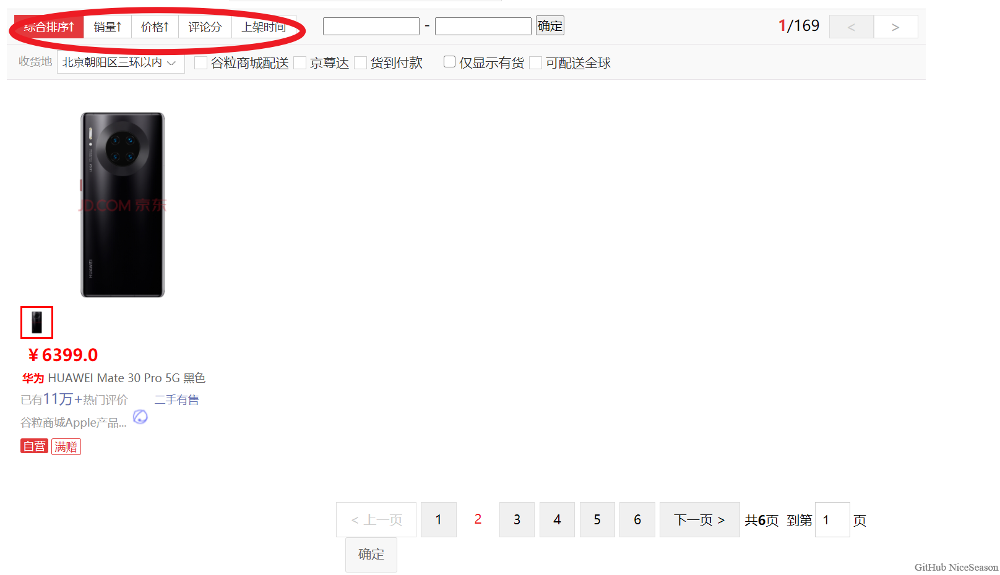

页面排序功能需要保证，点击某个按钮时，样式会变红，并且其他的样式保持最初的样子；

点击某个排序时首先按升序显示，再次点击再变为降序，并且还会显示上升或下降箭头

页面排序跳转的思路是通过点击某个按钮时会向其`class`属性添加/去除`desc`，并根据属性值进行url拼接

```html
<div class="filter_top">
    <div class="filter_top_left" th:with="p = ${param.sort}, priceRange = ${param.skuPrice}">
        <!-- 通过判断当前class是否有desc来进行样式的渲染和箭头的显示-->
        <a sort="hotScore"
           th:class="${(!#strings.isEmpty(p) && #strings.startsWith(p,'hotScore') && #strings.endsWith(p,'desc')) ? 'sort_a desc' : 'sort_a'}"
           th:attr="style=${(#strings.isEmpty(p) || #strings.startsWith(p,'hotScore')) ?
               'color: #fff; border-color: #e4393c; background: #e4393c;':'color: #333; border-color: #ccc; background: #fff;' }">
            综合排序[[${(!#strings.isEmpty(p) && #strings.startsWith(p,'hotScore') &&
            #strings.endsWith(p,'desc')) ?'↓':'↑' }]]</a>
        <a sort="saleCount"
           th:class="${(!#strings.isEmpty(p) && #strings.startsWith(p,'saleCount') && #strings.endsWith(p,'desc')) ? 'sort_a desc' : 'sort_a'}"
           th:attr="style=${(!#strings.isEmpty(p) && #strings.startsWith(p,'saleCount')) ?
               'color: #fff; border-color: #e4393c; background: #e4393c;':'color: #333; border-color: #ccc; background: #fff;' }">
            销量[[${(!#strings.isEmpty(p) && #strings.startsWith(p,'saleCount') &&
            #strings.endsWith(p,'desc'))?'↓':'↑'  }]]</a>
        <a sort="skuPrice"
           th:class="${(!#strings.isEmpty(p) && #strings.startsWith(p,'skuPrice') && #strings.endsWith(p,'desc')) ? 'sort_a desc' : 'sort_a'}"
           th:attr="style=${(!#strings.isEmpty(p) && #strings.startsWith(p,'skuPrice')) ?
               'color: #fff; border-color: #e4393c; background: #e4393c;':'color: #333; border-color: #ccc; background: #fff;' }">
            价格[[${(!#strings.isEmpty(p) && #strings.startsWith(p,'skuPrice') &&
            #strings.endsWith(p,'desc'))?'↓':'↑'  }]]</a>
        <a sort="hotScore" class="sort_a">评论分</a>
        <a sort="hotScore" class="sort_a">上架时间</a>
        <!--价格区间搜索-->
        <input id="skuPriceFrom" type="number"
               th:value="${#strings.isEmpty(priceRange)?'':#strings.substringBefore(priceRange,'_')}"
               style="width: 100px; margin-left: 30px">
        -
        <input id="skuPriceTo" type="number"
               th:value="${#strings.isEmpty(priceRange)?'':#strings.substringAfter(priceRange,'_')}"
               style="width: 100px">
        <button id="skuPriceSearchBtn">确定</button>
    </div>
    <div class="filter_top_right">
        <span class="fp-text">
           <b>1</b><em>/</em><i>169</i>
       </span>
        <a href="#" class="prev"><</a>
        <a href="#" class="next"> > </a>
    </div>
</div>
```

```javascript
$(".sort_a").click(function () {
    	//添加、剔除desc
        $(this).toggleClass("desc");
    	//获取sort属性值并进行url跳转
        let sort = $(this).attr("sort");
        sort = $(this).hasClass("desc") ? sort + "_desc" : sort + "_asc";
        location.href = replaceParamVal(location.href, "sort", sort,false);
        return false;
    });
```

价格区间搜索函数

```javascript
$("#skuPriceSearchBtn").click(function () {
    var skuPriceFrom = $("#skuPriceFrom").val();
    var skuPriceTo = $("#skuPriceTo").val();
    location.href = replaceParamVal(location.href, "skuPrice", skuPriceFrom + "_" + skuPriceTo, false);
})
```

#### 5) 面包屑导航

在封装结果时，将查询的属性值进行封装

```java
   // 6. 构建面包屑导航
        List<String> attrs = searchParam.getAttrs();
        if (attrs != null && attrs.size() > 0) {
            List<SearchResult.NavVo> navVos = attrs.stream().map(attr -> {
                String[] split = attr.split("_");
                SearchResult.NavVo navVo = new SearchResult.NavVo();
                //6.1 设置属性值
                navVo.setNavValue(split[1]);
                //6.2 查询并设置属性名
                try {
                    R r = productFeignService.info(Long.parseLong(split[0]));
                    if (r.getCode() == 0) {
                        AttrResponseVo attrResponseVo = JSON.parseObject(JSON.toJSONString(r.get("attr")), new TypeReference<AttrResponseVo>() {
                        });
                        navVo.setNavName(attrResponseVo.getAttrName());
                    }
                } catch (Exception e) {
                    log.error("远程调用商品服务查询属性失败", e);
                }
                //6.3 设置面包屑跳转链接(当点击该链接时剔除点击属性)
                String queryString = searchParam.get_queryString();
                String replace = queryString.replace("&attrs=" + attr, "").replace("attrs=" + attr+"&", "").replace("attrs=" + attr, "");
                navVo.setLink("http://search.gulimall.com/search.html" + (replace.isEmpty()?"":"?"+replace));
                return navVo;
            }).collect(Collectors.toList());
            result.setNavs(navVos);
        }
```

页面渲染

```html
<div class="JD_ipone_one c">
    <!-- 遍历面包屑功能 -->
    <a th:href="${nav.link}" th:each="nav:${result.navs}"><span th:text="${nav.navName}"></span>：<span th:text="${nav.navValue}"></span> x</a>
</div>
```


#### 6) 条件筛选联动

就是将品牌和分类也封装进面包屑数据中，并且在页面进行th:if的判断，当url有该属性的查询条件时就不进行显示了


## 异步

这部分的基础知识可以参考《实战java高并发程序设计》和《java8 实战》，如果需要电子书可以邮件我`mohs@mail.ustc.edu.cn`

### 1. 线程池

#### 1) 线程池创建

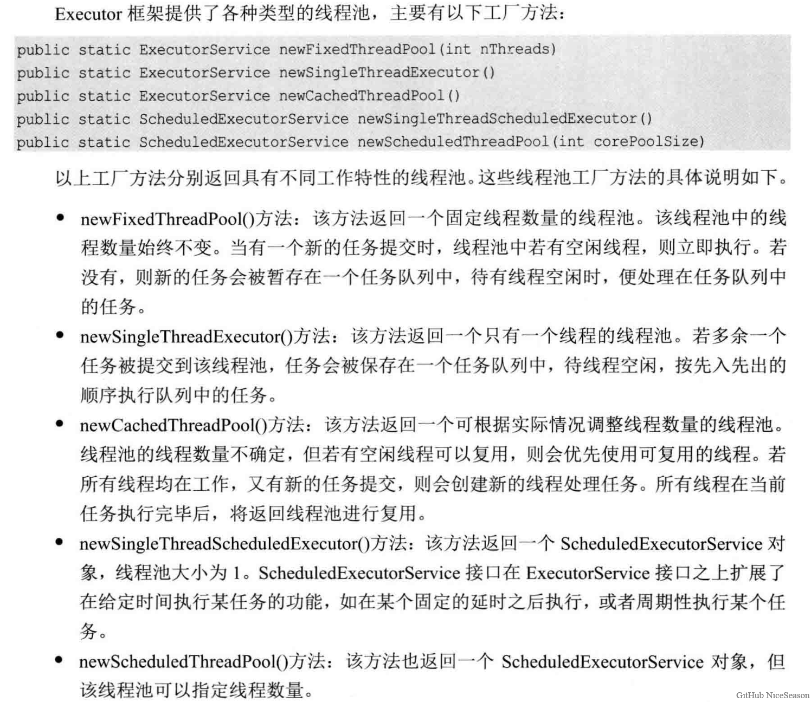

#### 2) 核心线程池的内部实现

##### (1) 内部实现

```java
public static ExecutorService newFixedThreadPool(int nThreads) {
    return new ThreadPoolExecutor(nThreads, nThreads,
                                  0L, TimeUnit.MILLISECONDS,
                                  new LinkedBlockingQueue<Runnable>());
}

public static ExecutorService newSingleThreadExecutor() {
        return new FinalizableDelegatedExecutorService
            (new ThreadPoolExecutor(1, 1,
                                    0L, TimeUnit.MILLISECONDS,
                                    new LinkedBlockingQueue<Runnable>()));
    }

 public static ExecutorService newCachedThreadPool() {
        return new ThreadPoolExecutor(0, Integer.MAX_VALUE,
                                      60L, TimeUnit.SECONDS,
                                      new SynchronousQueue<Runnable>());
    }
```

核心线程池只是`ThreadPoolExecutor`的封装

```java
 /**
     * Creates a new {@code ThreadPoolExecutor} with the given initial
     * parameters.
     *
     * @param corePoolSize the number of threads to keep in the pool, even
     *        if they are idle, unless {@code allowCoreThreadTimeOut} is set
     * @param maximumPoolSize the maximum number of threads to allow in the
     *        pool
     * @param keepAliveTime when the number of threads is greater than
     *        the core, this is the maximum time that excess idle threads
     *        will wait for new tasks before terminating.
     * @param unit the time unit for the {@code keepAliveTime} argument
     * @param workQueue the queue to use for holding tasks before they are
     *        executed.  This queue will hold only the {@code Runnable}
     *        tasks submitted by the {@code execute} method.
     * @param threadFactory the factory to use when the executor
     *        creates a new thread
     * @param handler the handler to use when execution is blocked
     *        because the thread bounds and queue capacities are reached
     * @throws IllegalArgumentException if one of the following holds:<br>
     *         {@code corePoolSize < 0}<br>
     *         {@code keepAliveTime < 0}<br>
     *         {@code maximumPoolSize <= 0}<br>
     *         {@code maximumPoolSize < corePoolSize}
     * @throws NullPointerException if {@code workQueue}
     *         or {@code threadFactory} or {@code handler} is null
     */
    public ThreadPoolExecutor(int corePoolSize,
                              int maximumPoolSize,
                              long keepAliveTime,
                              TimeUnit unit,
                              BlockingQueue<Runnable> workQueue,
                              ThreadFactory threadFactory,
                              RejectedExecutionHandler handler) {
        if (corePoolSize < 0 ||
            maximumPoolSize <= 0 ||
            maximumPoolSize < corePoolSize ||
            keepAliveTime < 0)
            throw new IllegalArgumentException();
        if (workQueue == null || threadFactory == null || handler == null)
            throw new NullPointerException();
        this.corePoolSize = corePoolSize;
        this.maximumPoolSize = maximumPoolSize;
        this.workQueue = workQueue;
        this.keepAliveTime = unit.toNanos(keepAliveTime);
        this.threadFactory = threadFactory;
        this.handler = handler;
    }
```

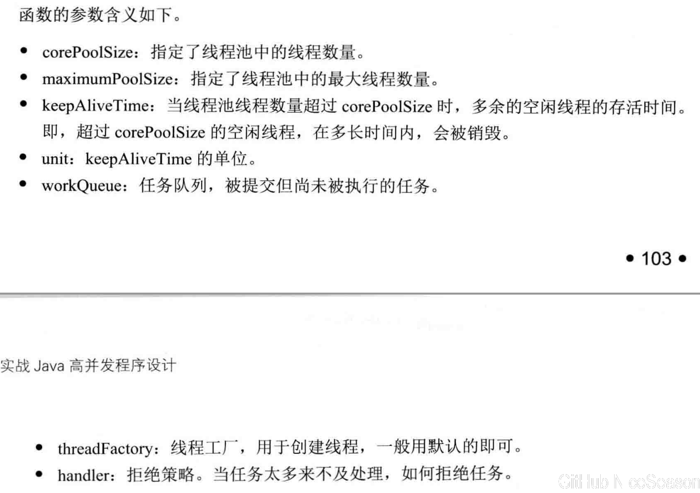

##### (2) 任务队列的说明

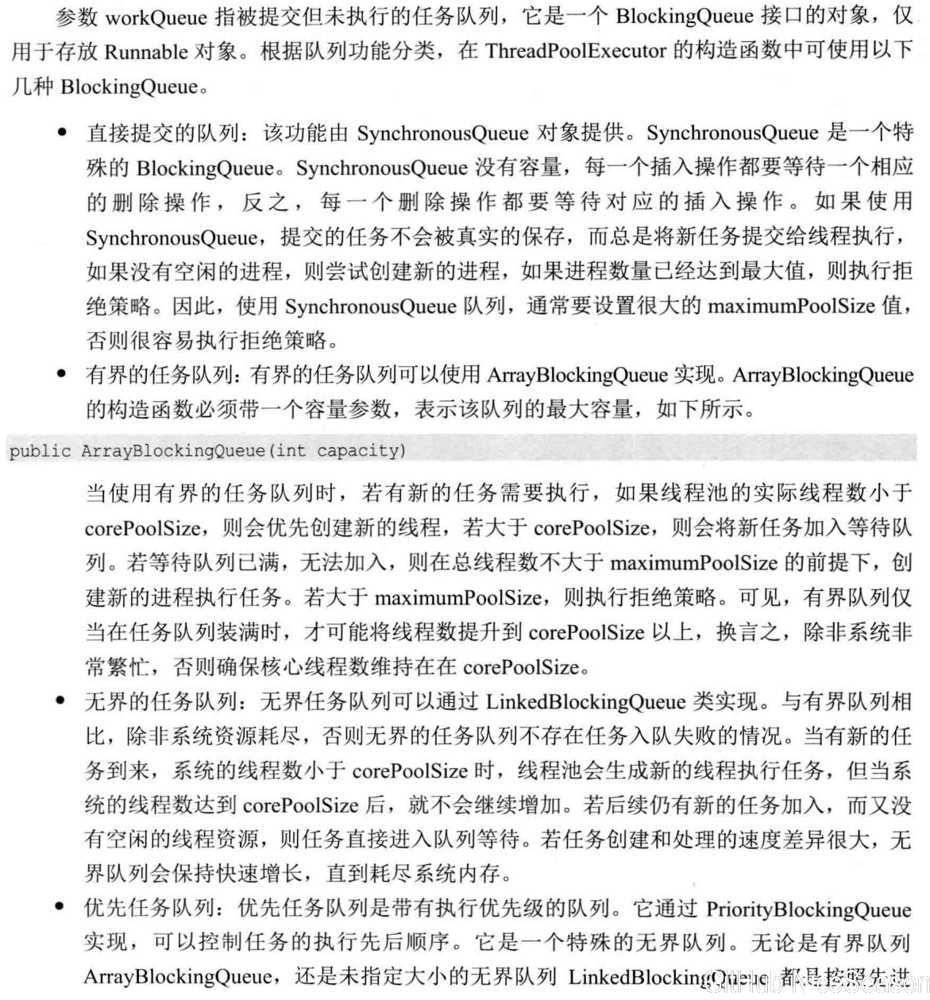

##### (3) 线程池的的调度逻辑

```java
public void execute(Runnable command) {
    if (command == null)
        throw new NullPointerException();
  
    int c = ctl.get();
    //5 
    if (workerCountOf(c) < corePoolSize) {
        if (addWorker(command, true))
            return;
        c = ctl.get();
    }
    //10
    if (isRunning(c) && workQueue.offer(command)) {
        int recheck = ctl.get();
        if (! isRunning(recheck) && remove(command))
            reject(command);
        else if (workerCountOf(recheck) == 0)
            addWorker(null, false);
    }
    //17
    else if (!addWorker(command, false))
        reject(command);
}
```

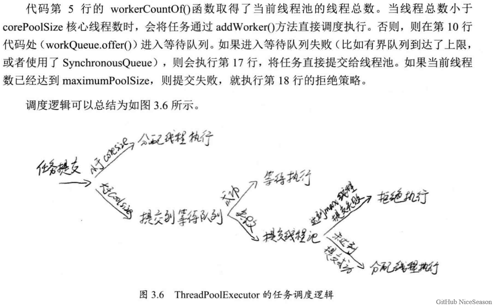

##### (4) 拒绝策略

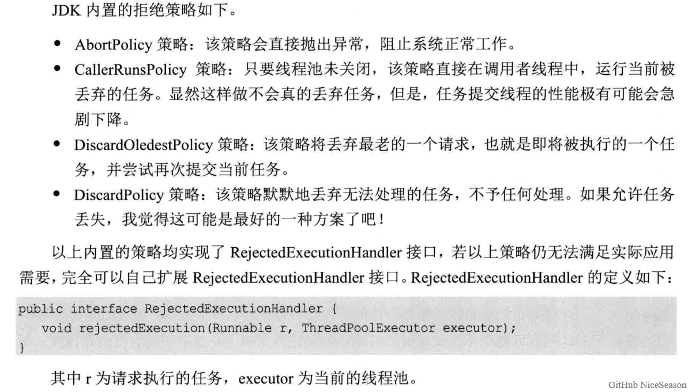

### 2.CompletableFuture组合式异步编程

#### (1)  runAsync 和 supplyAsync方法

CompletableFuture 提供了四个静态方法来创建一个异步操作。

```java
public static CompletableFuture<Void> runAsync(Runnable runnable)
public static CompletableFuture<Void> runAsync(Runnable runnable, Executor executor)
public static <U> CompletableFuture<U> supplyAsync(Supplier<U> supplier)
public static <U> CompletableFuture<U> supplyAsync(Supplier<U> supplier, Executor executor)
```

没有指定Executor的方法会使用ForkJoinPool.commonPool() 作为它的线程池执行异步代码。如果指定线程池，则使用指定的线程池运行。以下所有的方法都类同。

- runAsync方法不支持返回值。
- supplyAsync可以支持返回值。

#### (2)  线程串行化

* thenRun：不能获取上一步的执行结果
* thenAcceptAsync：能接受上一步结果，但是无返回值
* thenApplyAsync：能接受上一步结果，有返回值

#### (4) 计算结果完成时的回调方法

当CompletableFuture的计算结果完成，或者抛出异常的时候，可以执行特定的Action。主要是下面的方法：

```java
//可以处理异常，无返回值
public CompletableFuture<T> whenComplete(BiConsumer<? super T,? super Throwable> action)
public CompletableFuture<T> whenCompleteAsync(BiConsumer<? super T,? super Throwable> action)
public CompletableFuture<T> whenCompleteAsync(BiConsumer<? super T,? super Throwable> action, Executor executor)
//可以处理异常，有返回值
public CompletableFuture<T> exceptionally(Function<Throwable,? extends T> fn)
```

可以看到Action的类型是BiConsumer<? super T,? super Throwable>它可以处理正常的计算结果，或者异常情况。

#### (4) handle 方法

handle 是执行任务完成时对结果的处理。
 handle 方法和 thenApply 方法处理方式基本一样。不同的是 handle 是在任务完成后再执行，还可以处理异常的任务。thenApply 只可以执行正常的任务，任务出现异常则不执行 thenApply 方法。

```java
public <U> CompletionStage<U> handle(BiFunction<? super T, Throwable, ? extends U> fn);
public <U> CompletionStage<U> handleAsync(BiFunction<? super T, Throwable, ? extends U> fn);
public <U> CompletionStage<U> handleAsync(BiFunction<? super T, Throwable, ? extends U> fn,Execut
```

#### (5) thenCombine 合并任务

thenCombine 会把 两个 CompletionStage 的任务都执行完成后，把两个任务的结果一块交给 thenCombine 来处理。

#### (6) 组合任务

* thenCombine 会把 两个 CompletionStage 的任务都执行完成后，把两个任务的结果一块交给 thenCombine 来处理。

```java
public <U,V> CompletionStage<V> thenCombine(CompletionStage<? extends U> other,BiFunction<? super T,? super U,? extends V> fn);
public <U,V> CompletionStage<V> thenCombineAsync(CompletionStage<? extends U> other,BiFunction<? super T,? super U,? extends V> fn);
public <U,V> CompletionStage<V> thenCombineAsync(CompletionStage<? extends U> other,BiFunction<? super T,? super U,? extends V> fn,Executor executor);
```

* thenAcceptBoth

当两个CompletionStage都执行完成后，把结果一块交给thenAcceptBoth来进行消耗

```java
public <U> CompletionStage<Void> thenAcceptBoth(CompletionStage<? extends U> other,BiConsumer<? super T, ? super U> action);
public <U> CompletionStage<Void> thenAcceptBothAsync(CompletionStage<? extends U> other,BiConsumer<? super T, ? super U> action);
public <U> CompletionStage<Void> thenAcceptBothAsync(CompletionStage<? extends U> other,BiConsumer<? super T, ? super U> action,     Executor executor);
```

* applyToEither 方法

两个CompletionStage，谁执行返回的结果快，我就用那个CompletionStage的结果进行下一步的转化操作。

```java
public <U> CompletionStage<U> applyToEither(CompletionStage<? extends T> other,Function<? super T, U> fn);
public <U> CompletionStage<U> applyToEitherAsync(CompletionStage<? extends T> other,Function<? super T, U> fn);
public <U> CompletionStage<U> applyToEitherAsync(CompletionStage<? extends T> other,Function<? sup
```

* acceptEither 方法

两个CompletionStage，谁执行返回的结果快，我就用那个CompletionStage的结果进行下一步的消耗操作。

```java
public CompletionStage<Void> acceptEither(CompletionStage<? extends T> other,Consumer<? super T> action);
public CompletionStage<Void> acceptEitherAsync(CompletionStage<? extends T> other,Consumer<? super T> action);
public CompletionStage<Void> acceptEitherAsync(CompletionStage<? extends T> other,Consumer<? supe
```

* runAfterEither 方法

两个CompletionStage，任何一个完成了都会执行下一步的操作（Runnable）

```java
public CompletionStage<Void> runAfterEither(CompletionStage<?> other,Runnable action);
public CompletionStage<Void> runAfterEitherAsync(CompletionStage<?> other,Runnable action);
public CompletionStage<Void> runAfterEitherAsync(CompletionStage<?> other,Runnable action,Executor executor);
```

* runAfterBoth

两个CompletionStage，都完成了计算才会执行下一步的操作（Runnable）

```java
public CompletionStage<Void> runAfterBoth(CompletionStage<?> other,Runnable action);
public CompletionStage<Void> runAfterBothAsync(CompletionStage<?> other,Runnable action);
public CompletionStage<Void> runAfterBothAsync(CompletionStage<?> other,Runnable action,Executor 
```

* thenCompose 方法

thenCompose 方法允许你对两个 CompletionStage 进行流水线操作，第一个操作完成时，将其结果作为参数传递给第二个操作。

```java
public <U> CompletableFuture<U> thenCompose(Function<? super T, ? extends CompletionStage<U>> fn);
public <U> CompletableFuture<U> thenComposeAsync(Function<? super T, ? extends CompletionStage<U>> fn) ;
public <U> CompletableFuture<U> thenComposeAsync(Function<? super T, ? extends CompletionStage
```

## 商品详情

### 1. 模型抽取

模仿京东商品详情页，如下图所示，包括sku基本信息，图片信息，销售属性，图片介绍和规格参数

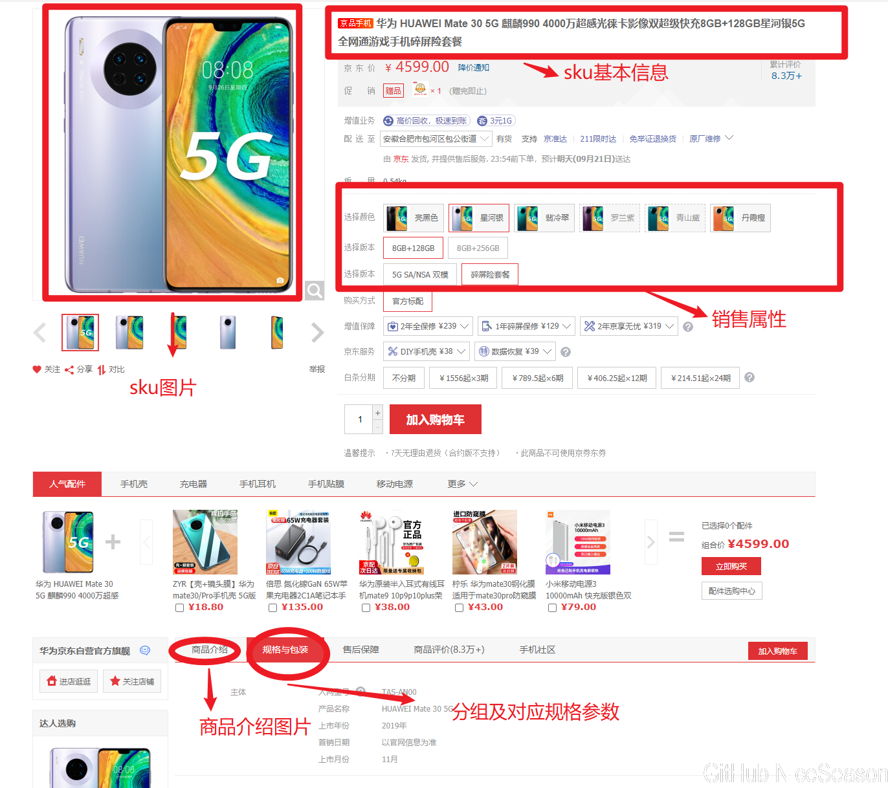

因此建立以下vo

```java
@ToString
@Data
public class SkuItemVo {

    //1、sku基本信息的获取  pms_sku_info
    private SkuInfoEntity info;

    private boolean hasStock = true;

    //2、sku的图片信息    pms_sku_images
    private List<SkuImagesEntity> images;

    //3、获取spu的销售属性组合
    private List<SkuItemSaleAttrVo> saleAttr;

    //4、获取spu的介绍
    private SpuInfoDescEntity desc;

    //5、获取spu的规格参数信息
    private List<SpuItemAttrGroupVo> groupAttrs;
}

@Data
@ToString
public class SkuItemSaleAttrVo {

    private Long attrId;

    private String attrName;

    private List<AttrValueWithSkuIdVo> attrValues;
	//private String attrValue 属性值
    //private String skuIds 该属性值对应的skuId的集合
    
}

@Data
@ToString
public class SpuItemAttrGroupVo {

    private String groupName;

    //attrId,attrName,attrValue
    private List<Attr> attrs;

}
```

### 2. 封装商品属性

#### (1) 总体思路

```java
@GetMapping("/{skuId}.html")
public String skuItem(@PathVariable("skuId") Long skuId, Model model) {
    SkuItemVo skuItemVo=skuInfoService.item(skuId);
    model.addAttribute("item", skuItemVo);
    return "item";
}

 	@Override
    public SkuItemVo item(Long skuId) {
        SkuItemVo skuItemVo = new SkuItemVo();
        //1、sku基本信息的获取  pms_sku_info
        SkuInfoEntity skuInfoEntity = this.getById(skuId);
        skuItemVo.setInfo(skuInfoEntity);
        Long spuId = skuInfoEntity.getSpuId();
        Long catalogId = skuInfoEntity.getCatalogId();


        //2、sku的图片信息    pms_sku_images
        List<SkuImagesEntity> skuImagesEntities = skuImagesService.list(new QueryWrapper<SkuImagesEntity>().eq("sku_id", skuId));
        skuItemVo.setImages(skuImagesEntities);

        //3、获取spu的销售属性组合-> 依赖1 获取spuId
        List<SkuItemSaleAttrVo> saleAttrVos=skuSaleAttrValueService.listSaleAttrs(spuId);
        skuItemVo.setSaleAttr(saleAttrVos);

        //4、获取spu的介绍-> 依赖1 获取spuId
        SpuInfoDescEntity byId = spuInfoDescService.getById(spuId);
        skuItemVo.setDesc(byId);

        //5、获取spu的规格参数信息-> 依赖1 获取spuId catalogId
        List<SpuItemAttrGroupVo> spuItemAttrGroupVos=productAttrValueService.getProductGroupAttrsBySpuId(spuId, catalogId);
        skuItemVo.setGroupAttrs(spuItemAttrGroupVos);
        //TODO 6、秒杀商品的优惠信息

        return skuItemVo;
    }
```

#### (2) 获取spu的销售属性

由于我们需要获取该spu下所有sku的销售属性，因此我们需要先从`pms_sku_info`查出该`spuId`对应的`skuId`，

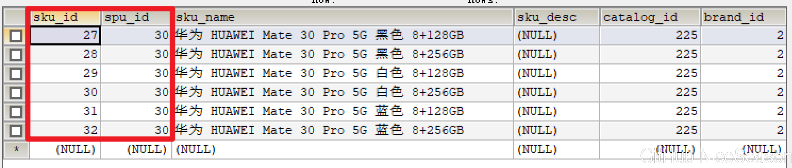

再在`pms_sku_sale_attr_value`表中查出上述`skuId`对应的属性

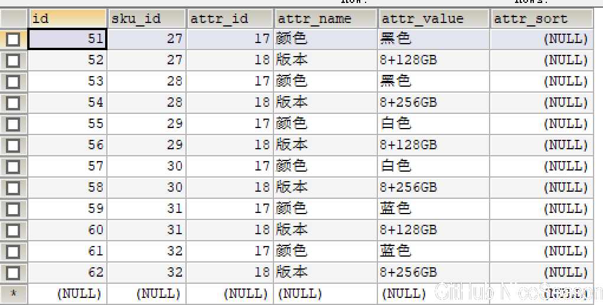

因此我们需要使用连表查询，并且通过分组将单个属性值对应的多个`spuId`组成集合，效果如下

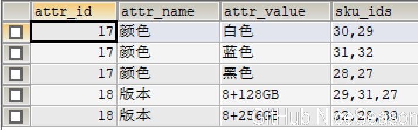

==为什么要设计成这种模式呢？==

因为这样可以在页面显示切换属性时，快速得到对应skuId的值，比如白色对应的`sku_ids`为30,29，8+128GB对应的`sku_ids`为29,31,27，那么销售属性为`白色、8+128GB`的商品的`skuId`则为二者的交集29

```xml
<resultMap id="SkuItemSaleAttrMap" type="io.niceseason.gulimall.product.vo.SkuItemSaleAttrVo">
        <result property="attrId" column="attr_id"/>
        <result property="attrName" column="attr_name"/>
        <collection property="attrValues" ofType="io.niceseason.gulimall.product.vo.AttrValueWithSkuIdVo">
            <result property="attrValue" column="attr_value"/>
            <result property="skuIds" column="sku_ids"/>
        </collection>
    </resultMap>

    <select id="listSaleAttrs" resultMap="SkuItemSaleAttrMap">
        SELECT attr_id,attr_name,attr_value,GROUP_CONCAT(info.sku_id) sku_ids FROM pms_sku_info info
        LEFT JOIN pms_sku_sale_attr_value ssav ON info.sku_id=ssav.sku_id
        WHERE info.spu_id=#{spuId}
        GROUP BY ssav.attr_id,ssav.attr_name,ssav.attr_value
    </select>
```

#### (3) 获取spu的规格参数信息

由于需要通过`spuId`和`catalogId`查询对应规格参数，所以我们需要通过`pms_attr_group表`获得`catalogId`和`attrGroupName`


然后通过` pms_attr_attrgroup_relation`获取分组对应属性id

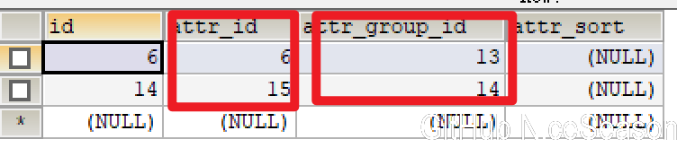

再到`   pms_product_attr_value`查询spuId对应的属性

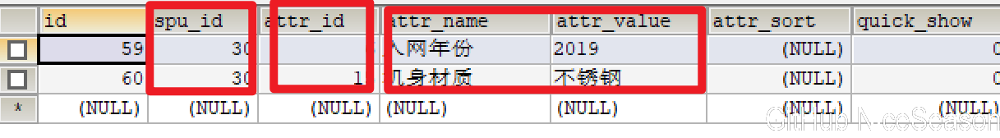

最终sql效果,联表含有需要的所有属性

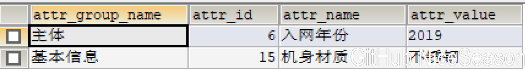

```java
@Mapper
public interface ProductAttrValueDao extends BaseMapper<ProductAttrValueEntity> {

    List<SpuItemAttrGroupVo> getProductGroupAttrsBySpuId(@Param("spuId") Long spuId, @Param("catalogId") Long catalogId);
}
```

```xml
<resultMap id="ProductGroupAttrsMap" type="io.niceseason.gulimall.product.vo.SpuItemAttrGroupVo">
    <result property="groupName" column="attr_group_name"/>
    <collection property="attrs" ofType="io.niceseason.gulimall.product.vo.Attr">
        <result property="attrId" column="attr_id"/>
        <result property="attrName" column="attr_name"/>
        <result property="attrValue" column="attr_value"/>
    </collection>
</resultMap>

<select id="getProductGroupAttrsBySpuId" resultMap="ProductGroupAttrsMap">
    SELECT ag.attr_group_name,attr.attr_id,attr.attr_name,attr.attr_value
    FROM pms_attr_attrgroup_relation aar 
    LEFT JOIN pms_attr_group ag ON aar.attr_group_id=ag.attr_group_id
    LEFT JOIN pms_product_attr_value attr ON aar.attr_id=attr.attr_id
    WHERE attr.spu_id = #{spuId} AND ag.catelog_id = #{catalogId}
</select>
```

### 3. 使用异步编排

为了使我们的任务进行的更快，我们可以让查询的各个子任务多线程执行，但是由于各个任务之间可能有相互依赖的关系，因此就涉及到了异步编排。

在这次查询中spu的销售属性、介绍、规格参数信息都需要`spuId`,因此依赖sku基本信息的获取,所以我们要让这些任务在1之后运行。因为我们需要1运行的结果，因此调用`thenAcceptAsync()`可以接受上一步的结果且没有返回值。

最后时，我们需要调用`get()`方法使得所有方法都已经执行完成

```java
public SkuItemVo item(Long skuId) {
    SkuItemVo skuItemVo = new SkuItemVo();
    CompletableFuture<SkuInfoEntity> infoFuture = CompletableFuture.supplyAsync(() -> {
        //1、sku基本信息的获取  pms_sku_info
        SkuInfoEntity skuInfoEntity = this.getById(skuId);
        skuItemVo.setInfo(skuInfoEntity);
        return skuInfoEntity;
    }, executor);

    //2、sku的图片信息    pms_sku_images
    CompletableFuture<Void> imageFuture = CompletableFuture.runAsync(() -> {
        List<SkuImagesEntity> skuImagesEntities = skuImagesService.list(new QueryWrapper<SkuImagesEntity>().eq("sku_id", skuId));
        skuItemVo.setImages(skuImagesEntities);
    }, executor);


    //3、获取spu的销售属性组合-> 依赖1 获取spuId
    CompletableFuture<Void> saleFuture = infoFuture.thenAcceptAsync((info) -> {
        List<SkuItemSaleAttrVo> saleAttrVos = skuSaleAttrValueService.listSaleAttrs(info.getSpuId());
        skuItemVo.setSaleAttr(saleAttrVos);
    }, executor);


    //4、获取spu的介绍-> 依赖1 获取spuId
    CompletableFuture<Void> descFuture = infoFuture.thenAcceptAsync((info) -> {
        SpuInfoDescEntity byId = spuInfoDescService.getById(info.getSpuId());
        skuItemVo.setDesc(byId);
    }, executor);


    //5、获取spu的规格参数信息-> 依赖1 获取spuId catalogId
    CompletableFuture<Void> attrFuture = infoFuture.thenAcceptAsync((info) -> {
        List<SpuItemAttrGroupVo> spuItemAttrGroupVos=productAttrValueService.getProductGroupAttrsBySpuId(info.getSpuId(), info.getCatalogId());
        skuItemVo.setGroupAttrs(spuItemAttrGroupVos);
    }, executor);

    //TODO 6、秒杀商品的优惠信息

    //等待所有任务执行完成
    try {
        CompletableFuture.allOf(imageFuture, saleFuture, descFuture, attrFuture).get();
    } catch (InterruptedException e) {
        e.printStackTrace();
    } catch (ExecutionException e) {
        e.printStackTrace();
    }

    return skuItemVo;
}
```

### 4. 页面的sku切换

通过控制class中是否包换`checked`属性来控制显示样式，因此要根据`skuId`判断

```html
<dd th:each="val : ${attr.attrValues}">
    <!--当前属性值的skuIds集合中是否含有当前商品的skuId,如果有说明是选中状态，加上checked-->
   <a th:attr=" class=${#lists.contains(#strings.listSplit(val.skuIds,','),item.info.skuId.toString())
                            ? 'sku_attr_value checked': 'sku_attr_value'}, skus=${val.skuIds} "
   >
      [[${val.attrValue}]]
   </a>
</dd>
```


```javascript
$(".sku_attr_value").click(function () {
    //1、改变样式
    let curr = $(this).attr("skus").split(",");
    //1.1 给点击元素的兄弟节点去除checked
    $(this).parent().parent().find(".sku_attr_value").removeClass("checked");
    //1.2 给点击元素加上checked
    $(this).addClass("checked");
    //1.3 为sku_attr_value设置未选中样式，为sku_attr_value checked设置选中的样式
    changeCheckedStyle();

    //2. 切换spuId
    let skus = new Array();
    //2.1 将每个skuIds变成数组放入skus这个数组集合中
    $("a[class='sku_attr_value checked']").each(function () {
        skus.push($(this).attr("skus").split(","));
    });

    let filterEle = skus[0];
    for (let i = 1; i < skus.length; i++) {
        //2.2 遍历每个属性的skuIds获取交集
        //比如sku[0]={1,3,5},sku[1]={4,5,6} 那么 $(sku[0]).filter(sku[1])=5
        filterEle = $(filterEle).filter(skus[i])[0];
    }

    //2.3 url 拼串
    location.href = "http://item.gulimall.com/" + filterEle + ".html";

    return false;
});


function changeCheckedStyle() {
    $(".sku_attr_value").parent().css({"border": "solid 1px #ccc"});
    $("a[class='sku_attr_value checked']").parent().css({"border": "solid 1px red"});
};
```


## 认证服务

### 1. 环境搭建

创建`gulimall-auth-server`模块，导依赖，引入`login.html`和`reg.html`，并把静态资源放到nginx的static目录下

### 2.  注册功能

#### (1) 验证码倒计时


```javascript
//点击发送验证码按钮触发下面函数
$("#sendCode").click(function () {
		//如果有disabled，说明最近已经点过，则什么都不做
		if($(this).hasClass("disabled")){

		}else {
            //调用函数使得当前的文本进行倒计时功能
			timeOutChangeStyle();
			//发送验证码
			var phone=$("#phoneNum").val();
			$.get("/sms/sendCode?phone="+phone,function (data){
				if (data.code!=0){
					alert(data.msg);
				}
			})
		}
	})

	let time = 60;
	function timeOutChangeStyle() {
		//开启倒计时后设置标志属性disable，使得该按钮不能再次被点击
		$("#sendCode").attr("class", "disabled");
        //当时间为0时，说明倒计时完成，则重置
		if(time==0){
			$("#sendCode").text("点击发送验证码");
			time=60;
			$("#sendCode").attr("class", "");
		}else {
            //每秒调用一次当前函数，使得time--
			$("#sendCode").text(time+"s后再次发送");
			time--;
			setTimeout("timeOutChangeStyle()", 1000);
		}
	}
```

#### (2) 整合短信服务

在阿里云网页购买试用的短信服务

在`gulimall-third-party`中编写发送短信组件,其中`host`、`path`、`appcode`可以在配置文件中使用前缀`spring.cloud.alicloud.sms`进行配置

```java
@Data
@ConfigurationProperties(prefix = "spring.cloud.alicloud.sms")
@Controller
public class SmsComponent {

    private String host;
    private String path;
    private String appcode;

    public void sendCode(String phone,String code) {
//        String host = "http://dingxin.market.alicloudapi.com";
//        String path = "/dx/sendSms";
        String method = "POST";
//        String appcode = "你自己的AppCode";
        Map<String, String> headers = new HashMap<String, String>();
        //最后在header中的格式(中间是英文空格)为Authorization:APPCODE 83359fd73fe94948385f570e3c139105
        headers.put("Authorization", "APPCODE " + appcode);
        Map<String, String> querys = new HashMap<String, String>();
        querys.put("mobile",phone);
        querys.put("param", "code:"+code);
        querys.put("tpl_id", "TP1711063");
        Map<String, String> bodys = new HashMap<String, String>();


        try {
            /**
             * 重要提示如下:
             * HttpUtils请从
             * https://github.com/aliyun/api-gateway-demo-sign-java/blob/master/src/main/java/com/aliyun/api/gateway/demo/util/HttpUtils.java
             * 下载
             *
             * 相应的依赖请参照
             * https://github.com/aliyun/api-gateway-demo-sign-java/blob/master/pom.xml
             */
            HttpResponse response = HttpUtils.doPost(host, path, method, headers, querys, bodys);
            System.out.println(response.toString());
            //获取response的body
            //System.out.println(EntityUtils.toString(response.getEntity()));
        } catch (Exception e) {
            e.printStackTrace();
        }
    }
}
```

编写controller，给别的服务提供远程调用发送验证码的接口

```java
@Controller
@RequestMapping(value = "/sms")
public class SmsSendController {

    @Resource
    private SmsComponent smsComponent;

    /**
     * 提供给别的服务进行调用
     * @param phone 电话号码
     * @param code 验证码
     * @return
     */
    @ResponseBody
    @GetMapping(value = "/sendCode")
    public R sendCode(@RequestParam("phone") String phone, @RequestParam("code") String code) {

        //发送验证码
        smsComponent.sendCode(phone,code);
        System.out.println(phone+code);
        return R.ok();
    }
}
```

#### (3) 接口防刷

由于发送验证码的接口暴露，为了防止恶意攻击，我们不能随意让接口被调用。

* 在redis中以`phone-code`将电话号码和验证码进行存储并将当前时间与code一起存储
  * 如果调用时以当前`phone`取出的v不为空且当前时间在存储时间的60s以内，说明60s内该号码已经调用过，返回错误信息
  * 60s以后再次调用，需要删除之前存储的`phone-code`
  * code存在一个过期时间，我们设置为10min，10min内验证该验证码有效

```java
@GetMapping("/sms/sendCode")
@ResponseBody
public R sendCode(@RequestParam("phone")String phone) {
   //接口防刷,在redis中缓存phone-code
    ValueOperations<String, String> ops = redisTemplate.opsForValue();
    String prePhone = AuthServerConstant.SMS_CODE_CACHE_PREFIX + phone;
    String v = ops.get(prePhone);
    if (!StringUtils.isEmpty(v)) {
        long pre = Long.parseLong(v.split("_")[1]);
        //如果存储的时间小于60s，说明60s内发送过验证码
        if (System.currentTimeMillis() - pre < 60000) {
            return R.error(BizCodeEnum.SMS_CODE_EXCEPTION.getCode(), BizCodeEnum.SMS_CODE_EXCEPTION.getMsg());
        }
    }
    //如果存在的话，删除之前的验证码
    redisTemplate.delete(prePhone);
    //获取到6位数字的验证码
    String code = String.valueOf((int)((Math.random() + 1) * 100000));
    //在redis中进行存储并设置过期时间
    ops.set(prePhone,code+"_"+System.currentTimeMillis(),10, TimeUnit.MINUTES);
    thirdPartFeignService.sendCode(phone, code);
    return R.ok();
}
```

#### (4) 注册接口编写

在`gulimall-auth-server`服务中编写注册的主体逻辑

* 若JSR303校验未通过，则通过`BindingResult`封装错误信息，并重定向至注册页面
* 若通过JSR303校验，则需要从`redis`中取值判断验证码是否正确，正确的话通过会员服务注册
* 会员服务调用成功则重定向至登录页，否则封装远程服务返回的错误信息返回至注册页面

注： `RedirectAttributes`可以通过session保存信息并在重定向的时候携带过去

```java
 @PostMapping("/register")
    public String register(@Valid UserRegisterVo registerVo, BindingResult result, RedirectAttributes attributes) {
        //1.判断校验是否通过
        Map<String, String> errors = new HashMap<>();
        if (result.hasErrors()){
            //1.1 如果校验不通过，则封装校验结果
            result.getFieldErrors().forEach(item->{
                errors.put(item.getField(), item.getDefaultMessage());
                //1.2 将错误信息封装到session中
                attributes.addFlashAttribute("errors", errors);
            });
            //1.2 重定向到注册页
            return "redirect:http://auth.gulimall.com/reg.html";
        }else {
            //2.若JSR303校验通过
            //判断验证码是否正确
            String code = redisTemplate.opsForValue().get(AuthServerConstant.SMS_CODE_CACHE_PREFIX + registerVo.getPhone());
            //2.1 如果对应手机的验证码不为空且与提交上的相等-》验证码正确
            if (!StringUtils.isEmpty(code) && registerVo.getCode().equals(code.split("_")[0])) {
                //2.1.1 使得验证后的验证码失效
                redisTemplate.delete(AuthServerConstant.SMS_CODE_CACHE_PREFIX + registerVo.getPhone());

                //2.1.2 远程调用会员服务注册
                R r = memberFeignService.register(registerVo);
                if (r.getCode() == 0) {
                    //调用成功，重定向登录页
                    return "redirect:http://auth.gulimall.com/login.html";
                }else {
                    //调用失败，返回注册页并显示错误信息
                    String msg = (String) r.get("msg");
                    errors.put("msg", msg);
                    attributes.addFlashAttribute("errors", errors);
                    return "redirect:http://auth.gulimall.com/reg.html";
                }
            }else {
                //2.2 验证码错误
                errors.put("code", "验证码错误");
                attributes.addFlashAttribute("errors", errors);
                return "redirect:http://auth.gulimall.com/reg.html";
            }
        }
    }
```

通过`gulimall-member`会员服务注册逻辑

* 通过异常机制判断当前注册会员名和电话号码是否已经注册，如果已经注册，则抛出对应的自定义异常，并在返回时封装对应的错误信息
* 如果没有注册，则封装传递过来的会员信息，并设置默认的会员等级、创建时间

```java
 @RequestMapping("/register")
    public R register(@RequestBody MemberRegisterVo registerVo) {
        try {
            memberService.register(registerVo);
            //异常机制：通过捕获对应的自定义异常判断出现何种错误并封装错误信息
        } catch (UserExistException userException) {
            return R.error(BizCodeEnum.USER_EXIST_EXCEPTION.getCode(), BizCodeEnum.USER_EXIST_EXCEPTION.getMsg());
        } catch (PhoneNumExistException phoneException) {
            return R.error(BizCodeEnum.PHONE_EXIST_EXCEPTION.getCode(), BizCodeEnum.PHONE_EXIST_EXCEPTION.getMsg());
        }
        return R.ok();
    }

```

```java
public void register(MemberRegisterVo registerVo) {
    //1 检查电话号是否唯一
    checkPhoneUnique(registerVo.getPhone());
    //2 检查用户名是否唯一
    checkUserNameUnique(registerVo.getUserName());
    //3 该用户信息唯一，进行插入
    MemberEntity entity = new MemberEntity();
    //3.1 保存基本信息
    entity.setUsername(registerVo.getUserName());
    entity.setMobile(registerVo.getPhone());
    entity.setCreateTime(new Date());
    //3.2 使用加密保存密码
    BCryptPasswordEncoder passwordEncoder = new BCryptPasswordEncoder();
    String encodePassword = passwordEncoder.encode(registerVo.getPassword());
    entity.setPassword(encodePassword);
    //3.3 设置会员默认等级
    //3.3.1 找到会员默认登记
    MemberLevelEntity defaultLevel = memberLevelService.getOne(new QueryWrapper<MemberLevelEntity>().eq("default_status", 1));
    //3.3.2 设置会员等级为默认
    entity.setLevelId(defaultLevel.getId());

    // 4 保存用户信息
    this.save(entity);
}

private void checkUserNameUnique(String userName) {
    Integer count = baseMapper.selectCount(new QueryWrapper<MemberEntity>().eq("username", userName));
    if (count > 0) {
        throw new UserExistException();
    }
}

private void checkPhoneUnique(String phone) {
    Integer count = baseMapper.selectCount(new QueryWrapper<MemberEntity>().eq("mobile", phone));
    if (count > 0) {
        throw new PhoneNumExistException();
    }
}
```

### 3. 用户名密码登录

在`gulimall-auth-server`模块中的主体逻辑

* 通过会员服务远程调用登录接口
  * 如果调用成功，重定向至首页
  * 如果调用失败，则封装错误信息并携带错误信息重定向至登录页

```java
@RequestMapping("/login")
public String login(UserLoginVo vo,RedirectAttributes attributes){
    R r = memberFeignService.login(vo);
    if (r.getCode() == 0) {
        return "redirect:http://gulimall.com/";
    }else {
        String msg = (String) r.get("msg");
        Map<String, String> errors = new HashMap<>();
        errors.put("msg", msg);
        attributes.addFlashAttribute("errors", errors);
        return "redirect:http://auth.gulimall.com/login.html";
    }
}
```

在`gulimall-member`模块中完成登录

* 当数据库中含有以当前登录名为用户名或电话号且密码匹配时，验证通过，返回查询到的实体
* 否则返回null，并在controller返回`用户名或密码错误`

```java
@RequestMapping("/login")
public R login(@RequestBody MemberLoginVo loginVo) {
    MemberEntity entity=memberService.login(loginVo);
    if (entity!=null){
        return R.ok();
    }else {
        return R.error(BizCodeEnum.LOGINACCT_PASSWORD_EXCEPTION.getCode(), BizCodeEnum.LOGINACCT_PASSWORD_EXCEPTION.getMsg());
    }
}

	@Override
    public MemberEntity login(MemberLoginVo loginVo) {
        String loginAccount = loginVo.getLoginAccount();
        //以用户名或电话号登录的进行查询
        MemberEntity entity = this.getOne(new QueryWrapper<MemberEntity>().eq("username", loginAccount).or().eq("mobile", loginAccount));
        if (entity!=null){
            BCryptPasswordEncoder bCryptPasswordEncoder = new BCryptPasswordEncoder();
            boolean matches = bCryptPasswordEncoder.matches(loginVo.getPassword(), entity.getPassword());
            if (matches){
                entity.setPassword("");
                return entity;
            }
        }
        return null;
    }
```

### 4. 社交登录

#### (1) oauth2.0

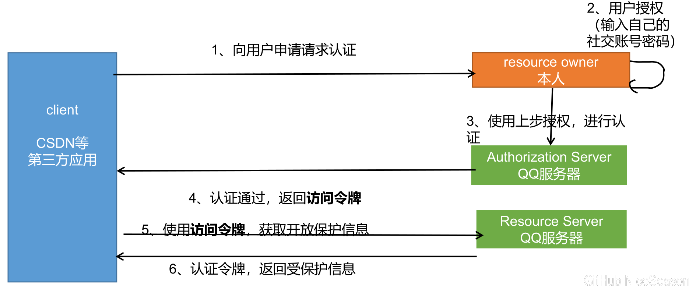

#### (2) 在微博开放平台创建应用

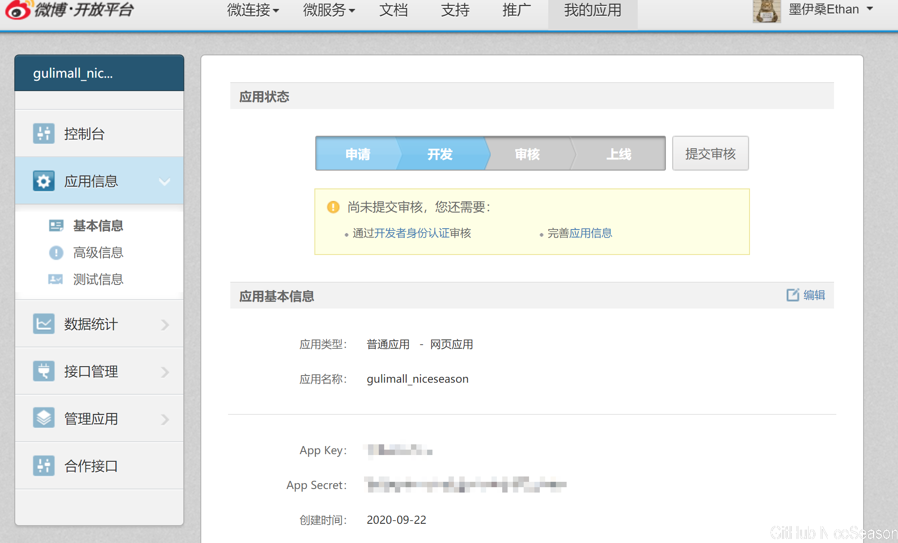

#### (3) 在登录页引导用户至授权页

```
GET
https://api.weibo.com/oauth2/authorize?client_id=YOUR_CLIENT_ID&response_type=code&redirect_uri=YOUR_REGISTERED_REDIRECT_URI
```

* `client_id`: 创建网站应用时的`app key` 
* `YOUR_REGISTERED_REDIRECT_URI`: 认证完成后的跳转链接(需要和平台高级设置一致)


如果用户同意授权，页面跳转至 YOUR_REGISTERED_REDIRECT_URI/?code=CODE

code是我们用来换取令牌的参数

#### (4) 换取token

```
POST
https://api.weibo.com/oauth2/access_token?client_id=YOUR_CLIENT_ID&client_secret=YOUR_CLIENT_SECRET&grant_type=authorization_code&redirect_uri=YOUR_REGISTERED_REDIRECT_URI&code=CODE
```

* `client_id`: 创建网站应用时的`app key` 
* `client_secret`: 创建网站应用时的`app secret` 
* `YOUR_REGISTERED_REDIRECT_URI`: 认证完成后的跳转链接(需要和平台高级设置一致)
* `code`：换取令牌的认证码

返回数据如下

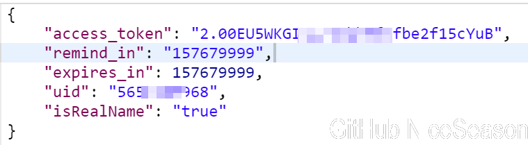

#### (5) 获取用户信息

https://open.weibo.com/wiki/2/users/show

结果返回json

#### (6) 代码编写

**认证接口**

* 通过`HttpUtils`发送请求获取`token`,并将`token`等信息交给`member`服务进行社交登录
* 若获取`token`失败或远程调用服务失败，则封装错误信息重新转回登录页

```java
@Controller
public class OauthController {

    @Autowired
    private MemberFeignService memberFeignService;

    @RequestMapping("/oauth2.0/weibo/success")
    public String authorize(String code, RedirectAttributes attributes) throws Exception {
        //1. 使用code换取token，换取成功则继续2，否则重定向至登录页
        Map<String, String> query = new HashMap<>();
        query.put("client_id", "2144***074");
        query.put("client_secret", "ff63a0d8d5*****29a19492817316ab");
        query.put("grant_type", "authorization_code");
        query.put("redirect_uri", "http://auth.gulimall.com/oauth2.0/weibo/success");
        query.put("code", code);
        //发送post请求换取token
        HttpResponse response = HttpUtils.doPost("https://api.weibo.com", "/oauth2/access_token", "post", new HashMap<String, String>(), query, new HashMap<String, String>());
        Map<String, String> errors = new HashMap<>();
        if (response.getStatusLine().getStatusCode() == 200) {
            //2. 调用member远程接口进行oauth登录，登录成功则转发至首页并携带返回用户信息，否则转发至登录页
            String json = EntityUtils.toString(response.getEntity());
            SocialUser socialUser = JSON.parseObject(json, new TypeReference<SocialUser>() {
            });
            R login = memberFeignService.login(socialUser);
            //2.1 远程调用成功，返回首页并携带用户信息
            if (login.getCode() == 0) {
                String jsonString = JSON.toJSONString(login.get("memberEntity"));
                MemberResponseVo memberResponseVo = JSON.parseObject(jsonString, new TypeReference<MemberResponseVo>() {
                });
                attributes.addFlashAttribute("user", memberResponseVo);
                return "redirect:http://gulimall.com";
            }else {
                //2.2 否则返回登录页
                errors.put("msg", "登录失败，请重试");
                attributes.addFlashAttribute("errors", errors);
                return "redirect:http://auth.gulimall.com/login.html";
            }
        }else {
            errors.put("msg", "获得第三方授权失败，请重试");
            attributes.addFlashAttribute("errors", errors);
            return "redirect:http://auth.gulimall.com/login.html";
        }
    }
```

**登录接口**

* 登录包含两种流程，实际上包括了注册和登录
* 如果之前未使用该社交账号登录，则使用`token`调用开放api获取社交账号相关信息，注册并将结果返回
* 如果之前已经使用该社交账号登录，则更新`token`并将结果返回

```java
@RequestMapping("/oauth2/login")
public R login(@RequestBody SocialUser socialUser) {
    MemberEntity entity=memberService.login(socialUser);
    if (entity!=null){
        return R.ok().put("memberEntity",entity);
    }else {
        return R.error();
    }
}

 @Override
    public MemberEntity login(SocialUser socialUser){
        MemberEntity uid = this.getOne(new QueryWrapper<MemberEntity>().eq("uid", socialUser.getUid()));
        //1 如果之前未登陆过，则查询其社交信息进行注册
        if (uid == null) {
            Map<String, String> query = new HashMap<>();
            query.put("access_token",socialUser.getAccess_token());
            query.put("uid", socialUser.getUid());
            //调用微博api接口获取用户信息
            String json = null;
            try {
                HttpResponse response = HttpUtils.doGet("https://api.weibo.com", "/2/users/show.json", "get", new HashMap<>(), query);
                json = EntityUtils.toString(response.getEntity());
            } catch (Exception e) {
                e.printStackTrace();
            }
            JSONObject jsonObject = JSON.parseObject(json);
            //获得昵称，性别，头像
            String name = jsonObject.getString("name");
            String gender = jsonObject.getString("gender");
            String profile_image_url = jsonObject.getString("profile_image_url");
            //封装用户信息并保存
            uid = new MemberEntity();
            MemberLevelEntity defaultLevel = memberLevelService.getOne(new QueryWrapper<MemberLevelEntity>().eq("default_status", 1));
            uid.setLevelId(defaultLevel.getId());
            uid.setNickname(name);
            uid.setGender("m".equals(gender)?0:1);
            uid.setHeader(profile_image_url);
            uid.setAccessToken(socialUser.getAccess_token());
            uid.setUid(socialUser.getUid());
            uid.setExpiresIn(socialUser.getExpires_in());
            this.save(uid);
        }else {
            //2 否则更新令牌等信息并返回
            uid.setAccessToken(socialUser.getAccess_token());
            uid.setUid(socialUser.getUid());
            uid.setExpiresIn(socialUser.getExpires_in());
            this.updateById(uid);
        }
        return uid;
    }
```

### 5. SpringSession

#### (1) session 原理

`jsessionid`相当于银行卡，存在服务器的`session`相当于存储的现金，每次通过`jsessionid`取出保存的数据

问题：但是正常情况下`session`不可跨域，它有自己的作用范围

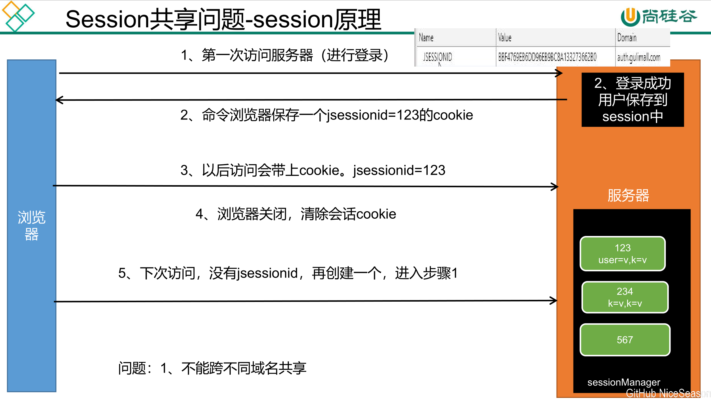

#### (2) 分布式下session共享问题

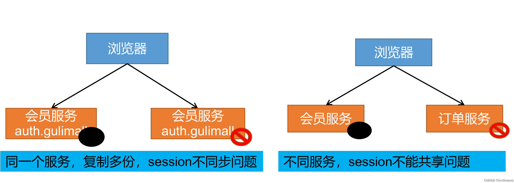

#### (3) 解决方案

##### 1) session复制


##### 2) 客户端存储


##### 3) hash一致性

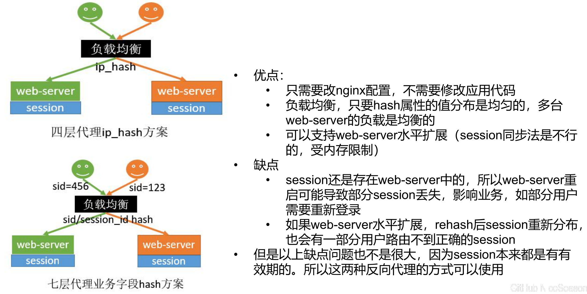

##### 4) 统一存储

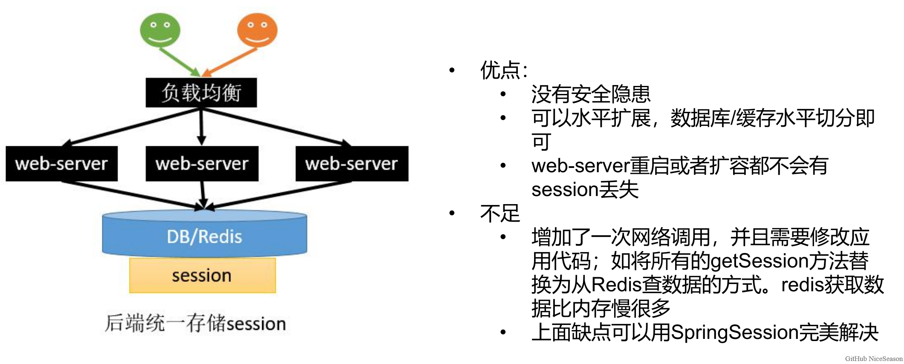

#### (4) SpringSession整合redis

通过`SpringSession`修改`session`的作用域

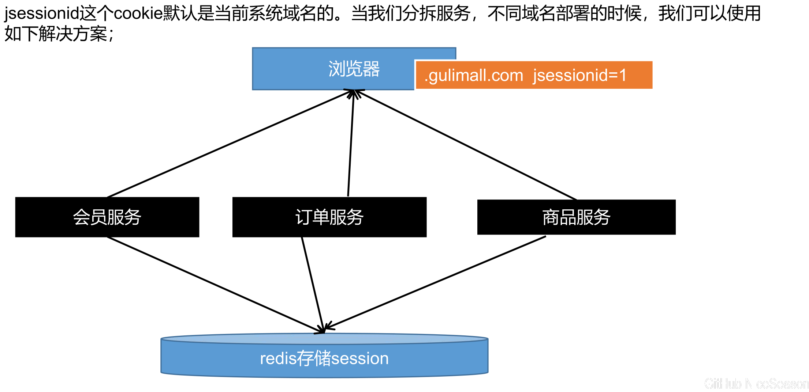

##### 1) 环境搭建

导入依赖

```xml
    <dependency>
        <groupId>org.springframework.session</groupId>
        <artifactId>spring-session-data-redis</artifactId>
    </dependency>
    <dependency>
        <groupId>org.springframework.boot</groupId>
        <artifactId>spring-boot-starter-data-redis</artifactId>
    </dependency>
```

修改配置

```yaml
spring:
  redis:
    host: 192.168.56.102
  session:
    store-type: redis
```

添加注解

```java
@EnableRedisHttpSession
public class GulimallAuthServerApplication {
```

##### 2) 自定义配置

* 由于默认使用jdk进行序列化，通过导入`RedisSerializer`修改为json序列化

* 并且通过修改`CookieSerializer`扩大`session`的作用域至`**.gulimall.com`

```java
@Configuration
public class GulimallSessionConfig {

    @Bean
    public RedisSerializer<Object> springSessionDefaultRedisSerializer() {
        return new GenericJackson2JsonRedisSerializer();
    }

    @Bean
    public CookieSerializer cookieSerializer() {
        DefaultCookieSerializer serializer = new DefaultCookieSerializer();
        serializer.setCookieName("GULISESSIONID");
        serializer.setDomainName("gulimall.com");
        return serializer;
    }
}
```

#### (5) SpringSession核心原理 - 装饰者模式

* 原生的获取`session`时是通过`HttpServletRequest`获取的
* 这里对request进行包装，并且重写了包装request的`getSession()`方法

```java
@Override
protected void doFilterInternal(HttpServletRequest request,
      HttpServletResponse response, FilterChain filterChain)
      throws ServletException, IOException {
   request.setAttribute(SESSION_REPOSITORY_ATTR, this.sessionRepository);

    //对原生的request、response进行包装
   SessionRepositoryRequestWrapper wrappedRequest = new SessionRepositoryRequestWrapper(
         request, response, this.servletContext);
   SessionRepositoryResponseWrapper wrappedResponse = new SessionRepositoryResponseWrapper(
         wrappedRequest, response);

   try {
      filterChain.doFilter(wrappedRequest, wrappedResponse);
   }
   finally {
      wrappedRequest.commitSession();
   }
}
```


## 购物车

### 1. 数据模型分析

#### (1) 数据存储

购物车是一个读多写多的场景，因此放入数据库并不合适，但购物车又是需要持久化，因此这里我们选用redis存储购物车数据。

#### (2) 数据结构

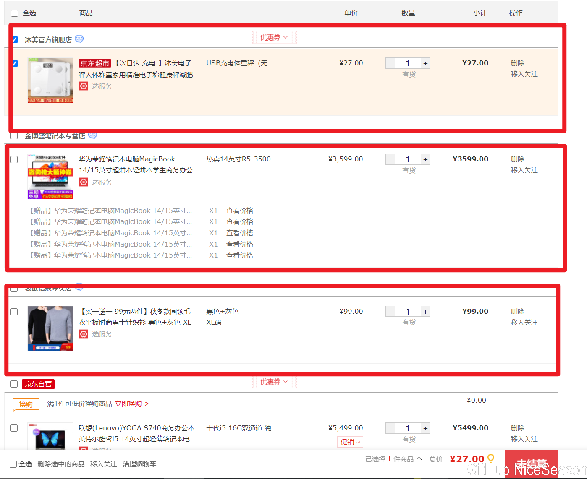

一个购物车是由各个购物项组成的，但是我们用`List`进行存储并不合适，因为使用`List`查找某个购物项时需要挨个遍历每个购物项，会造成大量时间损耗，为保证查找速度，我们使用`hash`进行存储

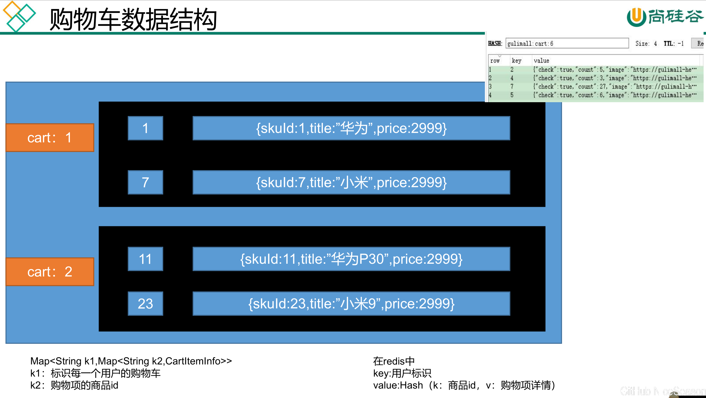

#### (3) VO编写

购物项vo

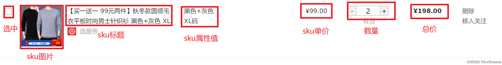

```java
public class CartItemVo {

    private Long skuId;
	
    //是否选中
    private Boolean check = true;

    //标题
    private String title;
	
    //图片
    private String image;

    //商品套餐属性
    private List<String> skuAttrValues;

    //价格
    private BigDecimal price;

    //数量
    private Integer count;

    //总价
    private BigDecimal totalPrice;
    
      /**
     * 当前购物车项总价等于单价x数量
     * @return
     */
    public BigDecimal getTotalPrice() {
        return price.multiply(new BigDecimal(count));
    }

    public void setTotalPrice(BigDecimal totalPrice) {
        this.totalPrice = totalPrice;
    }
```

购物车vo

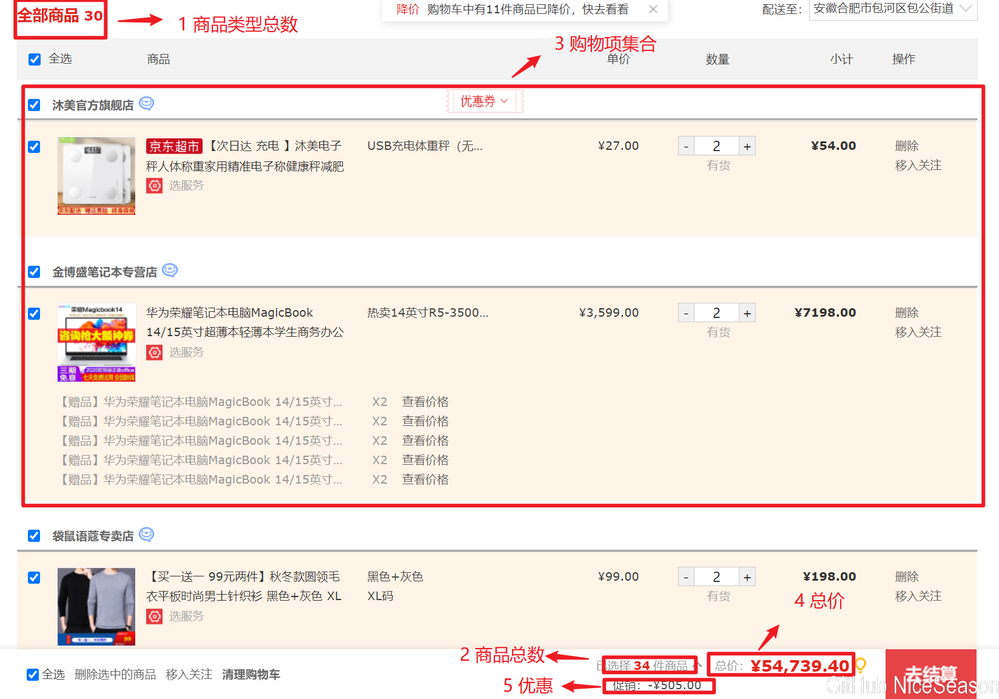

```java
public class CartVo {

    /**
     * 购物车子项信息
     */
    List<CartItemVo> items;

    /**
     * 商品数量
     */
    private Integer countNum;

    /**
     * 商品类型数量
     */
    private Integer countType;

    /**
     * 商品总价
     */
    private BigDecimal totalAmount;

    /**
     * 减免价格
     */
    private BigDecimal reduce = new BigDecimal("0.00");

    public List<CartItemVo> getItems() {
        return items;
    }

    public void setItems(List<CartItemVo> items) {
        this.items = items;
    }

    //总数量=遍历每个购物项总和
    public Integer getCountNum() {
        int count=0;
        if (items != null && items.size() > 0) {
            for (CartItemVo item : items) {
                count += item.getCount();
            }
        }
        return count;
    }

    public void setCountNum(Integer countNum) {
        this.countNum = countNum;
    }
	
    //商品类型数量=遍历所有商品类型和
    public Integer getCountType() {
        int count=0;
        if (items != null && items.size() > 0) {
            for (CartItemVo item : items) {
                count += 1;
            }
        }
        return count;
    }

    public void setCountType(Integer countType) {
        this.countType = countType;
    }

    //总价为单个购物项总价-优惠
    public BigDecimal getTotalAmount() {
        BigDecimal total = new BigDecimal(0);
        if (items != null && items.size() > 0) {
            for (CartItemVo item : items) {
                total.add(item.getTotalPrice());
            }
        }
        total.subtract(reduce);
        return total;
    }

    public void setTotalAmount(BigDecimal totalAmount) {
        this.totalAmount = totalAmount;
    }

    public BigDecimal getReduce() {
        return reduce;
    }

    public void setReduce(BigDecimal reduce) {
        this.reduce = reduce;
    }
}
```

### 2. ThreadLocal用户身份鉴别

#### (1) 用户身份鉴别方式

参考京东，在点击购物车时，会为临时用户生成一个`name`为`user-key`的`cookie`临时标识，过期时间为一个月，如果手动清除`user-key`，那么临时购物车的购物项也被清除，所以`user-key`是用来标识和存储临时购物车数据的

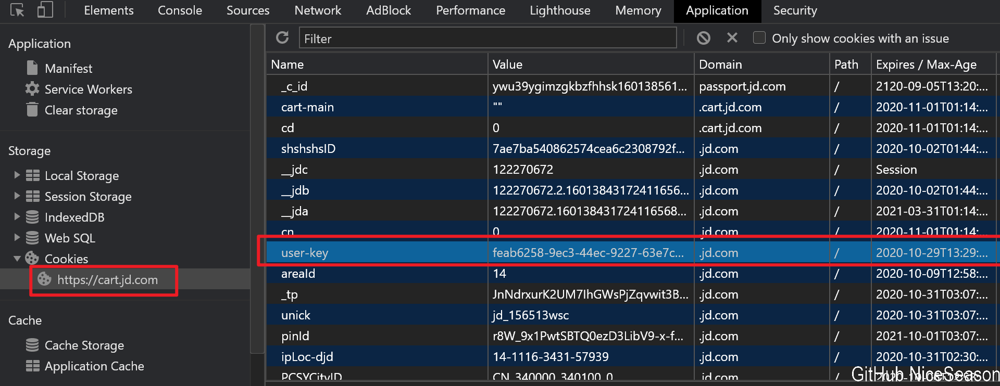

#### (2) 使用ThreadLocal进行用户身份鉴别信息传递

* 在调用购物车的接口前，先通过session信息判断是否登录，并分别进行用户身份信息的封装，并把`user-key`放在cookie中
* 这个功能使用拦截器进行完成

```java
@Configuration
public class GulimallWebConfig implements WebMvcConfigurer {
    //拦截所有请求
    @Override
    public void addInterceptors(InterceptorRegistry registry) {
        registry.addInterceptor(new CartInterceptor()).addPathPatterns("/**");
    }
}

public class CartInterceptor implements HandlerInterceptor {

    public static ThreadLocal<UserInfoTo> threadLocal=new ThreadLocal<>();

    @Override
    public boolean preHandle(HttpServletRequest request, HttpServletResponse response, Object handler) throws Exception {
        HttpSession session = request.getSession();
        MemberResponseVo memberResponseVo = (MemberResponseVo) session.getAttribute(AuthServerConstant.LOGIN_USER);
        UserInfoTo userInfoTo = new UserInfoTo();
        //1 用户已经登录，设置userId
        if (memberResponseVo!=null){
            userInfoTo.setUserId(memberResponseVo.getId());
        }

        Cookie[] cookies = request.getCookies();
        for (Cookie cookie : cookies) {
            //2 如果cookie中已经有user-Key，则直接设置
            if (cookie.getName().equals(CartConstant.TEMP_USER_COOKIE_NAME)) {
                userInfoTo.setUserKey(cookie.getValue());
                userInfoTo.setTempUser(true);
            }
        }

        //3 如果cookie没有user-key，我们通过uuid生成user-key
        if (StringUtils.isEmpty(userInfoTo.getUserKey())) {
            String uuid = UUID.randomUUID().toString();
            userInfoTo.setUserKey(uuid);
        }

        //4 将用户身份认证信息放入threadlocal进行传递
        threadLocal.set(userInfoTo);
        return true;
    }

    @Override
    public void postHandle(HttpServletRequest request, HttpServletResponse response, Object handler, ModelAndView modelAndView) throws Exception {
        UserInfoTo userInfoTo = threadLocal.get();
        //如果cookie中没有user-key，我们为其生成
        if (!userInfoTo.getTempUser()) {
            Cookie cookie = new Cookie(CartConstant.TEMP_USER_COOKIE_NAME, userInfoTo.getUserKey());
            cookie.setDomain("gulimall.com");
            cookie.setMaxAge(CartConstant.TEMP_USER_COOKIE_TIMEOUT);
            response.addCookie(cookie);
        }
    }
}
```

### 3. 添加商品到购物车

```java
/**
 * 添加商品到购物车
 * RedirectAttributes.addFlashAttribute():将数据放在session中，可以在页面中取出，但是只能取一次
 * RedirectAttributes.addAttribute():将数据拼接在url后面，?skuId=xxx
 * @return
 */
@RequestMapping("/addCartItem")
public String addCartItem(@RequestParam("skuId") Long skuId, @RequestParam("num") Integer num, RedirectAttributes attributes) {
    cartService.addCartItem(skuId, num);
    attributes.addAttribute("skuId", skuId);
    //为了防止成功页刷新可以重复提交添加商品，我们不直接转到成功页
    return "redirect:http://cart.gulimall.com/addCartItemSuccess";
}

 @RequestMapping("/addCartItemSuccess")
    public String addCartItemSuccess(@RequestParam("skuId") Long skuId,Model model) {
        CartItemVo cartItemVo = cartService.getCartItem(skuId);
        model.addAttribute("cartItem", cartItemVo);
        return "success";
    }
```

* 若当前商品已经存在购物车，只需增添数量
* 否则需要查询商品购物项所需信息，并添加新商品至购物车

```java
public CartItemVo addCartItem(Long skuId, Integer num) {
    //获取当前以当前用户标识为key的hash的操作
    BoundHashOperations<String, Object, Object> ops = getCartItemOps();
    // 判断当前商品是否已经存在购物车
    String cartJson = (String) ops.get(skuId.toString());
    // 1 已经存在购物车，将数据取出并添加商品数量
    if (!StringUtils.isEmpty(cartJson)) {
        //1.1 将json转为对象并将count+
        CartItemVo cartItemVo = JSON.parseObject(cartJson, CartItemVo.class);
        cartItemVo.setCount(cartItemVo.getCount() + num);
        //1.2 将更新后的对象转为json并存入redis
        String jsonString = JSON.toJSONString(cartItemVo);
        ops.put(skuId.toString(), jsonString);
        return cartItemVo;
    } else {
        CartItemVo cartItemVo = new CartItemVo();
        // 2 未存在购物车，则添加新商品
        CompletableFuture<Void> future1 = CompletableFuture.runAsync(() -> {
            //2.1 远程查询sku基本信息
            R info = productFeignService.info(skuId);
            SkuInfoVo skuInfo = info.getData("skuInfo", new TypeReference<SkuInfoVo>() {
            });
            cartItemVo.setCheck(true);
            cartItemVo.setCount(num);
            cartItemVo.setImage(skuInfo.getSkuDefaultImg());
            cartItemVo.setPrice(skuInfo.getPrice());
            cartItemVo.setSkuId(skuId);
            cartItemVo.setTitle(skuInfo.getSkuTitle());
        }, executor);

        //2.2 远程查询sku属性组合信息
        CompletableFuture<Void> future2 = CompletableFuture.runAsync(() -> {
            List<String> attrValuesAsString = productFeignService.getSkuSaleAttrValuesAsString(skuId);
            cartItemVo.setSkuAttrValues(attrValuesAsString);
        }, executor);

        try {
            CompletableFuture.allOf(future1, future2).get();
        } catch (InterruptedException e) {
            e.printStackTrace();
        } catch (ExecutionException e) {
            e.printStackTrace();
        }
        //2.3 将该属性封装并存入redis,登录用户使用userId为key,否则使用user-key
        String toJSONString = JSON.toJSONString(cartItemVo);
        ops.put(skuId.toString(), toJSONString);
        return cartItemVo;
    }
}
```

### 4. 获取购物车

* 若用户未登录，则直接使用`user-key`获取购物车数据
* 否则使用`userId`获取购物车数据，并将`user-key`对应临时购物车数据与用户购物车数据合并，并删除临时购物车

```java
@RequestMapping("/cart.html")
public String getCartList(Model model) {
    CartVo cartVo=cartService.getCart();
    model.addAttribute("cart", cartVo);
    return "cartList";
}

 @Override
    public CartVo getCart() {
        CartVo cartVo = new CartVo();
        UserInfoTo userInfoTo = CartInterceptor.threadLocal.get();
        //1 用户未登录，直接通过user-key获取临时购物车
        List<CartItemVo> tempCart = getCartByKey(CartConstant.CART_PREFIX + userInfoTo.getUserKey());
        if (StringUtils.isEmpty(userInfoTo.getUserId())) {
            List<CartItemVo> cartItemVos = tempCart;
            cartVo.setItems(cartItemVos);
        }else {
            //2 用户登录
            //2.1 查询userId对应的购物车
            List<CartItemVo> userCart = getCartByKey(CartConstant.CART_PREFIX + userInfoTo.getUserId());
            //2.2 查询user-key对应的临时购物车，并和用户购物车合并
            if (tempCart!=null&&tempCart.size()>0){
                BoundHashOperations<String, Object, Object> ops = redisTemplate.boundHashOps(CartConstant.CART_PREFIX + userInfoTo.getUserId());
                for (CartItemVo cartItemVo : tempCart) {
                    userCart.add(cartItemVo);
                    //2.3 在redis中更新数据
                    addCartItem(cartItemVo.getSkuId(), cartItemVo.getCount());
                }
            }
            cartVo.setItems(userCart);
            //2.4 删除临时购物车数据
            redisTemplate.delete(CartConstant.CART_PREFIX + userInfoTo.getUserKey());
        }

        return cartVo;
    }
```

### 5. 选中购物车项

```java
@RequestMapping("/checkCart")
public String checkCart(@RequestParam("isChecked") Integer isChecked,@RequestParam("skuId")Long skuId) {
    cartService.checkCart(skuId, isChecked);
    return "redirect:http://cart.gulimall.com/cart.html";
}

//修改skuId对应购物车项的选中状态
@Override
public void checkCart(Long skuId, Integer isChecked) {
    BoundHashOperations<String, Object, Object> ops = getCartItemOps();
    String cartJson = (String) ops.get(skuId.toString());
    CartItemVo cartItemVo = JSON.parseObject(cartJson, CartItemVo.class);
    cartItemVo.setCheck(isChecked==1);
    ops.put(skuId.toString(),JSON.toJSONString(cartItemVo));
}
```

### 6. 修改购物项数量

```java
@RequestMapping("/countItem")
public String changeItemCount(@RequestParam("skuId") Long skuId, @RequestParam("num") Integer num) {
    cartService.changeItemCount(skuId, num);
    return "redirect:http://cart.gulimall.com/cart.html";
}

@Override
public void changeItemCount(Long skuId, Integer num) {
    BoundHashOperations<String, Object, Object> ops = getCartItemOps();
    String cartJson = (String) ops.get(skuId.toString());
    CartItemVo cartItemVo = JSON.parseObject(cartJson, CartItemVo.class);
    cartItemVo.setCount(num);
    ops.put(skuId.toString(),JSON.toJSONString(cartItemVo));
}
```

### 7. 删除购物车项

```java
@RequestMapping("/deleteItem")
public String deleteItem(@RequestParam("skuId") Long skuId) {
    cartService.deleteItem(skuId);
    return "redirect:http://cart.gulimall.com/cart.html";
}

@Override
public void deleteItem(Long skuId) {
    BoundHashOperations<String, Object, Object> ops = getCartItemOps();
    ops.delete(skuId.toString());
}
```

## 消息队列

见本人[springboot笔记](https://github.com/NiceSeason/SpringBoot_demo)高级篇消息队列

## 订单服务

### 1. 订单流程

订单生成 -> 支付订单 -> 卖家发货 -> 确认收货 -> 交易成功

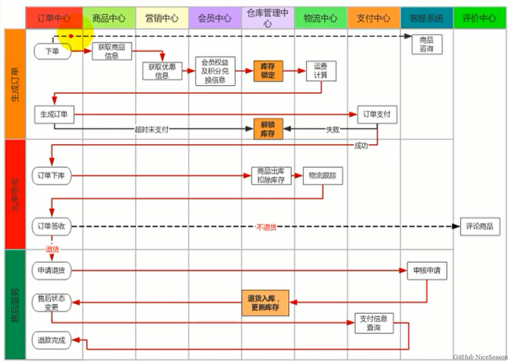


### 2. 订单登录拦截

因为订单系统必然涉及到用户信息，因此进入订单系统的请求必须是已经登录的，所以我们需要通过拦截器对未登录订单请求进行拦截

```java
public class LoginInterceptor implements HandlerInterceptor {
    public static ThreadLocal<MemberResponseVo> loginUser = new ThreadLocal<>();

    @Override
    public boolean preHandle(HttpServletRequest request, HttpServletResponse response, Object handler) throws Exception {
        HttpSession session = request.getSession();
        MemberResponseVo memberResponseVo = (MemberResponseVo) session.getAttribute(AuthServerConstant.LOGIN_USER);
        if (memberResponseVo != null) {
            loginUser.set(memberResponseVo);
            return true;
        }else {
            session.setAttribute("msg","请先登录");
            response.sendRedirect("http://auth.gulimall.com/login.html");
            return false;
        }
    }
}

@Configuration
public class GulimallWebConfig implements WebMvcConfigurer {
    @Override
    public void addInterceptors(InterceptorRegistry registry) {
        registry.addInterceptor(new LoginInterceptor()).addPathPatterns("/**");
    }
}
```

### 3. 订单确认页

#### （1）模型抽取

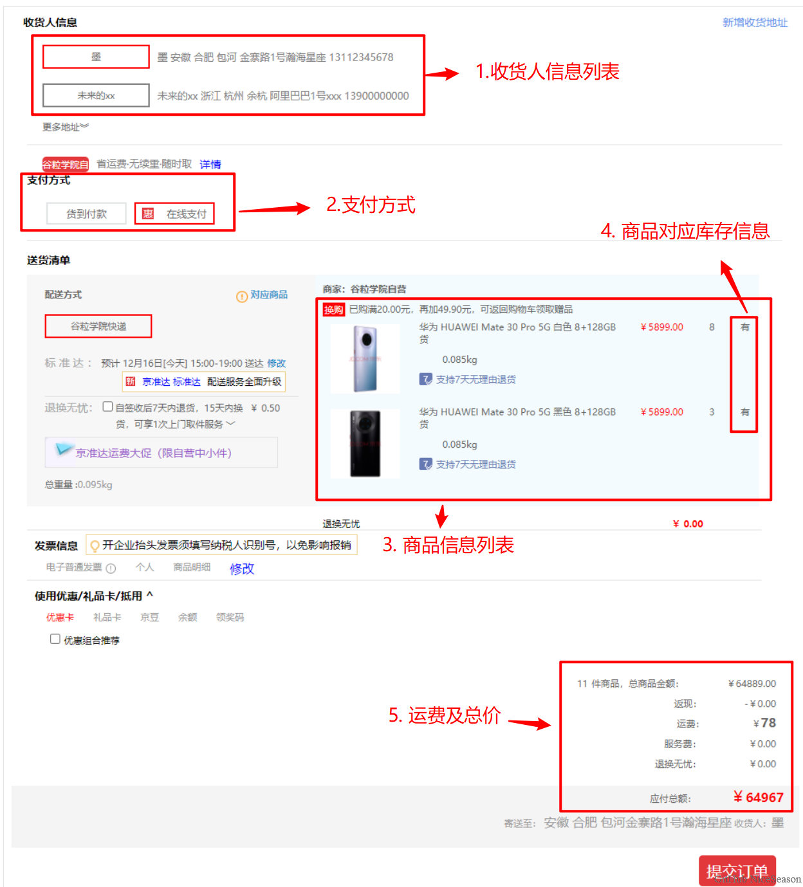

跳转到确认页时需要携带的数据模型

```java
public class OrderConfirmVo {

    @Getter
    @Setter
    /** 会员收获地址列表 **/
    private List<MemberAddressVo> memberAddressVos;

    @Getter @Setter
    /** 所有选中的购物项 **/
    private List<OrderItemVo> items;

    /** 发票记录 **/
    @Getter @Setter
    /** 优惠券（会员积分） **/
    private Integer integration;

    /** 防止重复提交的令牌 **/
    @Getter @Setter
    private String orderToken;

    @Getter @Setter
    Map<Long,Boolean> stocks;

    public Integer getCount() {
        Integer count = 0;
        if (items != null && items.size() > 0) {
            for (OrderItemVo item : items) {
                count += item.getCount();
            }
        }
        return count;
    }


    /** 订单总额 **/
    //BigDecimal total;
    //计算订单总额
    public BigDecimal getTotal() {
        BigDecimal totalNum = BigDecimal.ZERO;
        if (items != null && items.size() > 0) {
            for (OrderItemVo item : items) {
                //计算当前商品的总价格
                BigDecimal itemPrice = item.getPrice().multiply(new BigDecimal(item.getCount().toString()));
                //再计算全部商品的总价格
                totalNum = totalNum.add(itemPrice);
            }
        }
        return totalNum;
    }


    /** 应付价格 **/
    //BigDecimal payPrice;
    public BigDecimal getPayPrice() {
        return getTotal();
    }
}
```

#### （2）数据获取

* 查询购物项、库存和收货地址都要调用远程服务，串行会浪费大量时间，因此我们使用`CompletableFuture`进行异步编排
* 可能由于延迟，订单提交按钮可能被点击多次，为了防止重复提交的问题，我们在返回订单确认页时，在`redis`中生成一个随机的令牌，过期时间为30min，提交的订单会携带这个令牌，我们将会在订单提交的处理页面核验此令牌

```java
@RequestMapping("/toTrade")
public String toTrade(Model model) {
    OrderConfirmVo confirmVo = orderService.confirmOrder();
    model.addAttribute("confirmOrder", confirmVo);
    return "confirm";
}

 @Override
    public OrderConfirmVo confirmOrder() {
        MemberResponseVo memberResponseVo = LoginInterceptor.loginUser.get();
        OrderConfirmVo confirmVo = new OrderConfirmVo();
        RequestAttributes requestAttributes = RequestContextHolder.getRequestAttributes();
        CompletableFuture<Void> itemAndStockFuture = CompletableFuture.supplyAsync(() -> {
            RequestContextHolder.setRequestAttributes(requestAttributes);
            //1. 查出所有选中购物项
            List<OrderItemVo> checkedItems = cartFeignService.getCheckedItems();
            confirmVo.setItems(checkedItems);
            return checkedItems;
        }, executor).thenAcceptAsync((items) -> {
            //4. 库存
            List<Long> skuIds = items.stream().map(OrderItemVo::getSkuId).collect(Collectors.toList());
            //skuId为key,是否有库存为value
            Map<Long, Boolean> hasStockMap = wareFeignService.getSkuHasStocks(skuIds).stream().collect(Collectors.toMap(SkuHasStockVo::getSkuId, SkuHasStockVo::getHasStock));
            confirmVo.setStocks(hasStockMap);
        }, executor);

        //2. 查出所有收货地址
        CompletableFuture<Void> addressFuture = CompletableFuture.runAsync(() -> {
            List<MemberAddressVo> addressByUserId = memberFeignService.getAddressByUserId(memberResponseVo.getId());
            confirmVo.setMemberAddressVos(addressByUserId);
        }, executor);

        //3. 积分
        confirmVo.setIntegration(memberResponseVo.getIntegration());

        //5. 总价自动计算
        //6. 防重令牌
        String token = UUID.randomUUID().toString().replace("-", "");
        redisTemplate.opsForValue().set(OrderConstant.USER_ORDER_TOKEN_PREFIX + memberResponseVo.getId(), token, 30, TimeUnit.MINUTES);
        confirmVo.setOrderToken(token);
        try {
            CompletableFuture.allOf(itemAndStockFuture, addressFuture).get();
        } catch (InterruptedException e) {
            e.printStackTrace();
        } catch (ExecutionException e) {
            e.printStackTrace();
        }
        return confirmVo;
    }
```

#### （3）Feign远程调用丢失请求头问题

`feign`远程调用的请求头中没有含有`JSESSIONID`的`cookie`，所以也就不能得到服务端的`session`数据，cart认为没登录，获取不了用户信息

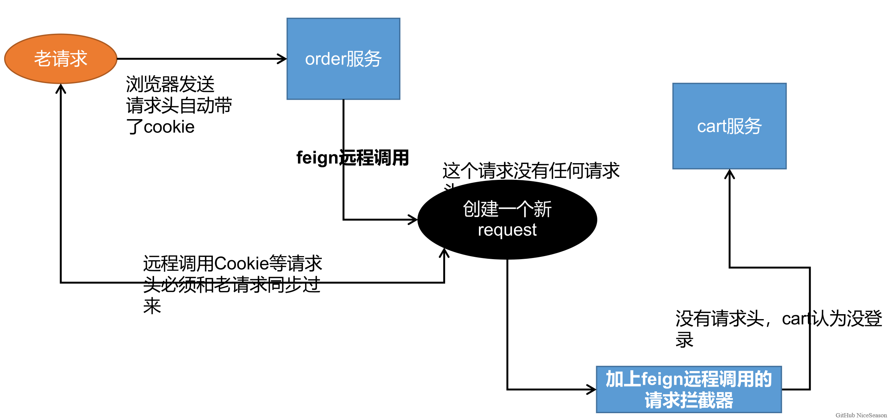

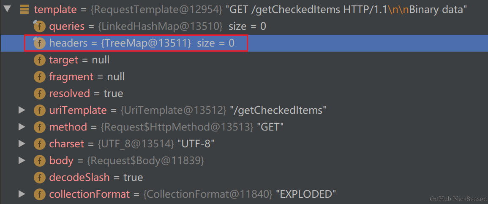

```java
Request targetRequest(RequestTemplate template) {
  for (RequestInterceptor interceptor : requestInterceptors) {
    interceptor.apply(template);
  }
  return target.apply(template);
}
```

但是在`feign`的调用过程中，会使用容器中的`RequestInterceptor`对`RequestTemplate`进行处理，因此我们可以通过向容器中导入定制的`RequestInterceptor`为请求加上`cookie`。

```java
public class GuliFeignConfig {
    @Bean
    public RequestInterceptor requestInterceptor() {
        return new RequestInterceptor() {
            @Override
            public void apply(RequestTemplate template) {
                //1. 使用RequestContextHolder拿到老请求的请求数据
                ServletRequestAttributes requestAttributes = (ServletRequestAttributes) RequestContextHolder.getRequestAttributes();
                if (requestAttributes != null) {
                    HttpServletRequest request = requestAttributes.getRequest();
                    if (request != null) {
                        //2. 将老请求得到cookie信息放到feign请求上
                        String cookie = request.getHeader("Cookie");
                        template.header("Cookie", cookie);
                    }
                }
            }
        };
    }
}
```

* `RequestContextHolder`为SpingMVC中共享`request`数据的上下文，底层由`ThreadLocal`实现

经过`RequestInterceptor`处理后的请求如下，已经加上了请求头的`Cookie`信息

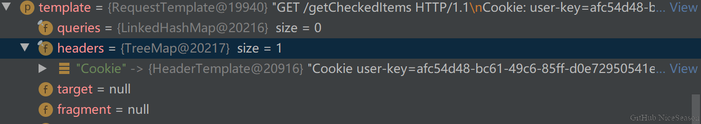

#### （4）Feign异步情况丢失上下文问题

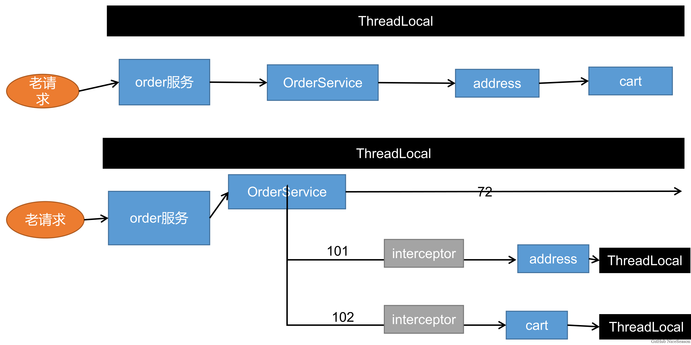

* 由于`RequestContextHolder`使用`ThreadLocal`共享数据，所以在开启异步时获取不到老请求的信息，自然也就无法共享`cookie`了

在这种情况下，我们需要在开启异步的时候将老请求的`RequestContextHolder`的数据设置进去

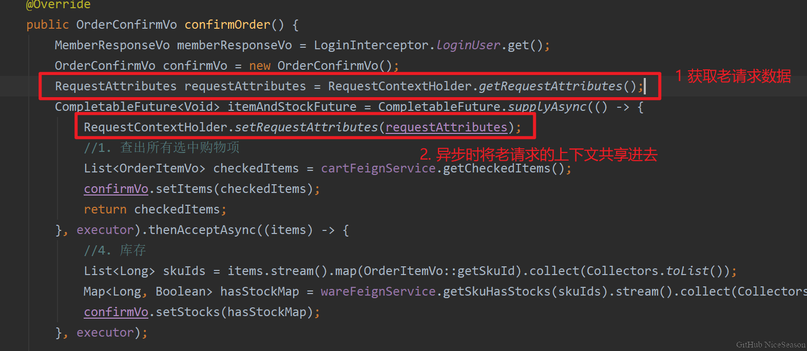

#### （5）运费收件信息获取

数据封装

```java
@Data
public class FareVo {
    private MemberAddressVo address;
    private BigDecimal fare;
}
```

在页面将选中地址的id传给请求

```java
@RequestMapping("/fare/{addrId}")
public FareVo getFare(@PathVariable("addrId") Long addrId) {
    return wareInfoService.getFare(addrId);
}

@Override
public FareVo getFare(Long addrId) {
    FareVo fareVo = new FareVo();
    R info = memberFeignService.info(addrId);
    if (info.getCode() == 0) {
        MemberAddressVo address = info.getData("memberReceiveAddress", new TypeReference<MemberAddressVo>() {
        });
        fareVo.setAddress(address);
        String phone = address.getPhone();
        //取电话号的最后两位作为邮费
        String fare = phone.substring(phone.length() - 2, phone.length());
        fareVo.setFare(new BigDecimal(fare));
    }
    return fareVo;
}
```

### 4. 订单提交

#### （1）模型抽取

页面提交数据

```java
@Data
public class OrderSubmitVo {

    /** 收获地址的id **/
    private Long addrId;

    /** 支付方式 **/
    private Integer payType;
    //无需提交要购买的商品，去购物车再获取一遍
    //优惠、发票

    /** 防重令牌 **/
    private String orderToken;

    /** 应付价格 **/
    private BigDecimal payPrice;

    /** 订单备注 **/
    private String remarks;

    //用户相关的信息，直接去session中取出即可
}
```

成功后转发至支付页面携带数据

```java
@Data
public class SubmitOrderResponseVo {

    private OrderEntity order;

    /** 错误状态码 **/
    private Integer code;
}
```

#### （2）提交订单

* 提交订单成功，则携带返回数据转发至支付页面
* 提交订单失败，则携带错误信息重定向至确认页

```java
@RequestMapping("/submitOrder")
public String submitOrder(OrderSubmitVo submitVo, Model model, RedirectAttributes attributes) {
    try{
        SubmitOrderResponseVo responseVo=orderService.submitOrder(submitVo);
        Integer code = responseVo.getCode();
        if (code==0){
            model.addAttribute("order", responseVo.getOrder());
            return "pay";
        }else {
            String msg = "下单失败;";
            switch (code) {
                case 1:
                    msg += "防重令牌校验失败";
                    break;
                case 2:
                    msg += "商品价格发生变化";
                    break;
            }
            attributes.addFlashAttribute("msg", msg);
            return "redirect:http://order.gulimall.com/toTrade";
        }
    }catch (Exception e){
        if (e instanceof NoStockException){
            String msg = "下单失败，商品无库存";
            attributes.addFlashAttribute("msg", msg);
        }
        return "redirect:http://order.gulimall.com/toTrade";
    }
}
```

```java
    @Transactional
    @Override
    public SubmitOrderResponseVo submitOrder(OrderSubmitVo submitVo) {
        SubmitOrderResponseVo responseVo = new SubmitOrderResponseVo();
        responseVo.setCode(0);
        //1. 验证防重令牌
        MemberResponseVo memberResponseVo = LoginInterceptor.loginUser.get();
        String script= "if redis.call('get', KEYS[1]) == ARGV[1] then return redis.call('del', KEYS[1]) else return 0 end";
        Long execute = redisTemplate.execute(new DefaultRedisScript<>(script,Long.class), Arrays.asList(OrderConstant.USER_ORDER_TOKEN_PREFIX + memberResponseVo.getId()), submitVo.getOrderToken());
        if (execute == 0L) {
            //1.1 防重令牌验证失败
            responseVo.setCode(1);
            return responseVo;
        }else {
            //2. 创建订单、订单项
            OrderCreateTo order =createOrderTo(memberResponseVo,submitVo);

            //3. 验价
            BigDecimal payAmount = order.getOrder().getPayAmount();
            BigDecimal payPrice = submitVo.getPayPrice();
            if (Math.abs(payAmount.subtract(payPrice).doubleValue()) < 0.01) {
                //4. 保存订单
                saveOrder(order);
                //5. 锁定库存
                List<OrderItemVo> orderItemVos = order.getOrderItems().stream().map((item) -> {
                    OrderItemVo orderItemVo = new OrderItemVo();
                    orderItemVo.setSkuId(item.getSkuId());
                    orderItemVo.setCount(item.getSkuQuantity());
                    return orderItemVo;
                }).collect(Collectors.toList());
                R r = wareFeignService.orderLockStock(orderItemVos);
                //5.1 锁定库存成功
                if (r.getCode()==0){
//                    int i = 10 / 0;
                    responseVo.setOrder(order.getOrder());
                    responseVo.setCode(0);
                    return responseVo;
                }else {
                    //5.1 锁定库存失败
                    String msg = (String) r.get("msg");
                    throw new NoStockException(msg);
                }

            }else {
                //验价失败
                responseVo.setCode(2);
                return responseVo;
            }
        }
    }
```

##### 1) 验证防重令牌

为防止在获取令牌、对比值和删除令牌之间发生错误导入令牌校验出错，我们必须使用脚本保证原子性操作

```java
MemberResponseVo memberResponseVo = LoginInterceptor.loginUser.get();
String script= "if redis.call('get', KEYS[1]) == ARGV[1] then return redis.call('del', KEYS[1]) else return 0 end";
Long execute = redisTemplate.execute(new DefaultRedisScript<>(script,Long.class), Arrays.asList(OrderConstant.USER_ORDER_TOKEN_PREFIX + memberResponseVo.getId()), submitVo.getOrderToken());
if (execute == 0L) {
    //1.1 防重令牌验证失败
    responseVo.setCode(1);
    return responseVo;
```

##### 2) 创建订单、订单项

抽取模型

```java
@Data
public class OrderCreateTo {

    private OrderEntity order;

    private List<OrderItemEntity> orderItems;

    /** 订单计算的应付价格 **/
    private BigDecimal payPrice;

    /** 运费 **/
    private BigDecimal fare;

}
```

创建订单、订单项

```java
//2. 创建订单、订单项
OrderCreateTo order =createOrderTo(memberResponseVo,submitVo);

private OrderCreateTo createOrderTo(MemberResponseVo memberResponseVo, OrderSubmitVo submitVo) {
    //2.1 用IdWorker生成订单号
    String orderSn = IdWorker.getTimeId();
    //2.2 构建订单
    OrderEntity entity = buildOrder(memberResponseVo, submitVo,orderSn);
    //2.3 构建订单项
    List<OrderItemEntity> orderItemEntities = buildOrderItems(orderSn);
    //2.4 计算价格
    compute(entity, orderItemEntities);
    OrderCreateTo createTo = new OrderCreateTo();
    createTo.setOrder(entity);
    createTo.setOrderItems(orderItemEntities);
    return createTo;
}
```

构建订单

```java
private OrderEntity buildOrder(MemberResponseVo memberResponseVo, OrderSubmitVo submitVo, String orderSn) {

        OrderEntity orderEntity =new OrderEntity();

        orderEntity.setOrderSn(orderSn);

        //1) 设置用户信息
        orderEntity.setMemberId(memberResponseVo.getId());
        orderEntity.setMemberUsername(memberResponseVo.getUsername());

        //2) 获取邮费和收件人信息并设置
        FareVo fareVo = wareFeignService.getFare(submitVo.getAddrId());
        BigDecimal fare = fareVo.getFare();
        orderEntity.setFreightAmount(fare);
        MemberAddressVo address = fareVo.getAddress();
        orderEntity.setReceiverName(address.getName());
        orderEntity.setReceiverPhone(address.getPhone());
        orderEntity.setReceiverPostCode(address.getPostCode());
        orderEntity.setReceiverProvince(address.getProvince());
        orderEntity.setReceiverCity(address.getCity());
        orderEntity.setReceiverRegion(address.getRegion());
        orderEntity.setReceiverDetailAddress(address.getDetailAddress());

        //3) 设置订单相关的状态信息
        orderEntity.setStatus(OrderStatusEnum.CREATE_NEW.getCode());
        orderEntity.setConfirmStatus(0);
        orderEntity.setAutoConfirmDay(7);

        return orderEntity;
    }
```

构建订单项

```java
private OrderItemEntity buildOrderItem(OrderItemVo item) {
        OrderItemEntity orderItemEntity = new OrderItemEntity();
        Long skuId = item.getSkuId();
        //1) 设置sku相关属性
        orderItemEntity.setSkuId(skuId);
        orderItemEntity.setSkuName(item.getTitle());
        orderItemEntity.setSkuAttrsVals(StringUtils.collectionToDelimitedString(item.getSkuAttrValues(), ";"));
        orderItemEntity.setSkuPic(item.getImage());
        orderItemEntity.setSkuPrice(item.getPrice());
        orderItemEntity.setSkuQuantity(item.getCount());
        //2) 通过skuId查询spu相关属性并设置
        R r = productFeignService.getSpuBySkuId(skuId);
        if (r.getCode() == 0) {
            SpuInfoTo spuInfo = r.getData(new TypeReference<SpuInfoTo>() {
            });
            orderItemEntity.setSpuId(spuInfo.getId());
            orderItemEntity.setSpuName(spuInfo.getSpuName());
            orderItemEntity.setSpuBrand(spuInfo.getBrandName());
            orderItemEntity.setCategoryId(spuInfo.getCatalogId());
        }
        //3) 商品的优惠信息(不做)

        //4) 商品的积分成长，为价格x数量
        orderItemEntity.setGiftGrowth(item.getPrice().multiply(new BigDecimal(item.getCount())).intValue());
        orderItemEntity.setGiftIntegration(item.getPrice().multiply(new BigDecimal(item.getCount())).intValue());

        //5) 订单项订单价格信息
        orderItemEntity.setPromotionAmount(BigDecimal.ZERO);
        orderItemEntity.setCouponAmount(BigDecimal.ZERO);
        orderItemEntity.setIntegrationAmount(BigDecimal.ZERO);

        //6) 实际价格
        BigDecimal origin = orderItemEntity.getSkuPrice().multiply(new BigDecimal(orderItemEntity.getSkuQuantity()));
        BigDecimal realPrice = origin.subtract(orderItemEntity.getPromotionAmount())
                .subtract(orderItemEntity.getCouponAmount())
                .subtract(orderItemEntity.getIntegrationAmount());
        orderItemEntity.setRealAmount(realPrice);

        return orderItemEntity;
    }
```

计算订单价格

```java
private void compute(OrderEntity entity, List<OrderItemEntity> orderItemEntities) {
        //总价
        BigDecimal total = BigDecimal.ZERO;
        //优惠价格
        BigDecimal promotion=new BigDecimal("0.0");
        BigDecimal integration=new BigDecimal("0.0");
        BigDecimal coupon=new BigDecimal("0.0");
        //积分
        Integer integrationTotal = 0;
        Integer growthTotal = 0;

        for (OrderItemEntity orderItemEntity : orderItemEntities) {
            total=total.add(orderItemEntity.getRealAmount());
            promotion=promotion.add(orderItemEntity.getPromotionAmount());
            integration=integration.add(orderItemEntity.getIntegrationAmount());
            coupon=coupon.add(orderItemEntity.getCouponAmount());
            integrationTotal += orderItemEntity.getGiftIntegration();
            growthTotal += orderItemEntity.getGiftGrowth();
        }

        entity.setTotalAmount(total);
        entity.setPromotionAmount(promotion);
        entity.setIntegrationAmount(integration);
        entity.setCouponAmount(coupon);
        entity.setIntegration(integrationTotal);
        entity.setGrowth(growthTotal);

        //付款价格=商品价格+运费
        entity.setPayAmount(entity.getFreightAmount().add(total));

        //设置删除状态(0-未删除，1-已删除)
        entity.setDeleteStatus(0);
    }
```

##### 3) 验价

将页面提交的价格和后台计算的价格进行对比，若不同则提示用户`商品价格发生变化`

```java
BigDecimal payAmount = order.getOrder().getPayAmount();
BigDecimal payPrice = submitVo.getPayPrice();
if (Math.abs(payAmount.subtract(payPrice).doubleValue()) < 0.01) {
			/****************/
}else {
    //验价失败
    responseVo.setCode(2);
    return responseVo;
}
```

##### 4) 保存订单

```java
private void saveOrder(OrderCreateTo orderCreateTo) {
    OrderEntity order = orderCreateTo.getOrder();
    order.setCreateTime(new Date());
    order.setModifyTime(new Date());
    this.save(order);
    orderItemService.saveBatch(orderCreateTo.getOrderItems());
}
```

##### 5) 锁定库存

```java
 List<OrderItemVo> orderItemVos = order.getOrderItems().stream().map((item) -> {
                    OrderItemVo orderItemVo = new OrderItemVo();
                    orderItemVo.setSkuId(item.getSkuId());
                    orderItemVo.setCount(item.getSkuQuantity());
                    return orderItemVo;
                }).collect(Collectors.toList());
                R r = wareFeignService.orderLockStock(orderItemVos);
                //5.1 锁定库存成功
                if (r.getCode()==0){
                    responseVo.setOrder(order.getOrder());
                    responseVo.setCode(0);
                    return responseVo;
                }else {
                    //5.2 锁定库存失败
                    String msg = (String) r.get("msg");
                    throw new NoStockException(msg);
                }
```

* 找出所有库存大于商品数的仓库
* 遍历所有满足条件的仓库，逐个尝试锁库存，若锁库存成功则退出遍历

```java
@RequestMapping("/lock/order")
public R orderLockStock(@RequestBody List<OrderItemVo> itemVos) {
    try {
        Boolean lock = wareSkuService.orderLockStock(itemVos);
        return R.ok();
    } catch (NoStockException e) {
        return R.error(BizCodeEnum.NO_STOCK_EXCEPTION.getCode(), BizCodeEnum.NO_STOCK_EXCEPTION.getMsg());
    }
}

@Transactional
@Override
public Boolean orderLockStock(List<OrderItemVo> itemVos) {
    List<SkuLockVo> lockVos = itemVos.stream().map((item) -> {
        SkuLockVo skuLockVo = new SkuLockVo();
        skuLockVo.setSkuId(item.getSkuId());
        skuLockVo.setNum(item.getCount());
        //找出所有库存大于商品数的仓库
        List<Long> wareIds = baseMapper.listWareIdsHasStock(item.getSkuId(), item.getCount());
        skuLockVo.setWareIds(wareIds);
        return skuLockVo;
    }).collect(Collectors.toList());

    for (SkuLockVo lockVo : lockVos) {
        boolean lock = true;
        Long skuId = lockVo.getSkuId();
        List<Long> wareIds = lockVo.getWareIds();
        //如果没有满足条件的仓库，抛出异常
        if (wareIds == null || wareIds.size() == 0) {
            throw new NoStockException(skuId);
        }else {
            for (Long wareId : wareIds) {
                Long count=baseMapper.lockWareSku(skuId, lockVo.getNum(), wareId);
                if (count==0){
                    lock=false;
                }else {
                    lock = true;
                    break;
                }
            }
        }
        if (!lock) throw new NoStockException(skuId);
    }
    return true;
}
```

这里通过异常机制控制事务回滚，如果在锁定库存失败则抛出`NoStockException`s,订单服务和库存服务都会回滚。

#### （3） 分布式事务

分布式情况下，可能出现一些服务事务不一致的情况

* 远程服务假失败
* 远程服务执行完成后，下面其他方法出现异常

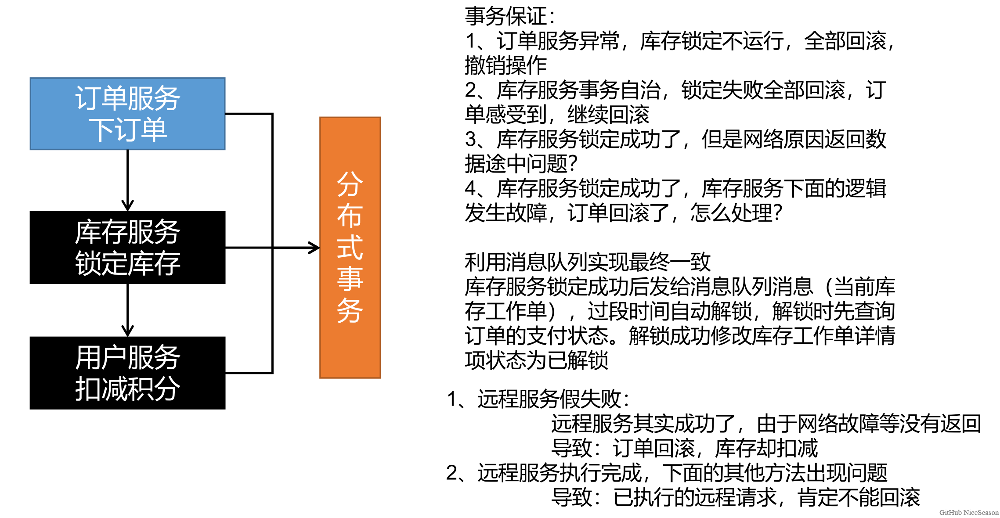

#### （4）使用seata解决分布式事务问题

导入依赖

```xml
<dependency>
    <groupId>com.alibaba.cloud</groupId>
    <artifactId>spring-cloud-starter-alibaba-seata</artifactId>
</dependency>
```

环境搭建

下载senta-server-0.7.1并修改`register.conf`,使用nacos作为注册中心

```shell
registry {
  # file 、nacos 、eureka、redis、zk、consul、etcd3、sofa
  type = "nacos"

  nacos {
    serverAddr = "#:8848"
    namespace = "public"
    cluster = "default"
  }
```

将`register.conf`和`file.conf`复制到需要开启分布式事务的根目录，并修改`file.conf`

 `vgroup_mapping.${application.name}-fescar-service-group = "default"`

```shell
service {
  #vgroup->rgroup
  vgroup_mapping.gulimall-ware-fescar-service-group = "default"
  #only support single node
  default.grouplist = "127.0.0.1:8091"
  #degrade current not support
  enableDegrade = false
  #disable
  disable = false
  #unit ms,s,m,h,d represents milliseconds, seconds, minutes, hours, days, default permanent
  max.commit.retry.timeout = "-1"
  max.rollback.retry.timeout = "-1"
}
```

使用seata包装数据源

```java
@Configuration
public class MySeataConfig {
    @Autowired
    DataSourceProperties dataSourceProperties;

    @Bean
    public DataSource dataSource(DataSourceProperties dataSourceProperties) {

        HikariDataSource dataSource = dataSourceProperties.initializeDataSourceBuilder().type(HikariDataSource.class).build();
        if (StringUtils.hasText(dataSourceProperties.getName())) {
            dataSource.setPoolName(dataSourceProperties.getName());
        }
        return new DataSourceProxy(dataSource);
    }
}
```

在大事务的入口标记注解`@GlobalTransactional`开启全局事务，并且每个小事务标记注解`@Transactional`

```java
@GlobalTransactional
@Transactional
@Override
public SubmitOrderResponseVo submitOrder(OrderSubmitVo submitVo) {
}
```

### 5. 使用消息队列实现最终一致性

#### (1) 延迟队列的定义与实现

* 定义：

  延迟队列存储的对象肯定是对应的延时消息，所谓"延时消息"是指当消息被发送以后，并不想让消费者立即拿到消息，而是等待指定时间后，消费者才拿到这个消息进行消费。

* 实现：

  rabbitmq可以通过设置队列的`TTL`和死信路由实现延迟队列

  * TTL：

  >RabbitMQ可以针对Queue设置x-expires 或者 针对Message设置 x-message-ttl，来控制消息的生存时间，如果超时(两者同时设置以最先到期的时间为准)，则消息变为dead letter(死信)

  

  * 死信路由DLX

  >RabbitMQ的Queue可以配置x-dead-letter-exchange 和x-dead-letter-routing-key（可选）两个参数，如果队列内出现了dead letter，则按照这两个参数重新路由转发到指定的队列。

  >- x-dead-letter-exchange：出现dead letter之后将dead letter重新发送到指定exchange
  >- x-dead-letter-routing-key：出现dead letter之后将dead letter重新按照指定的routing-key发送

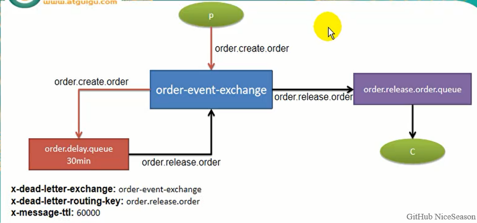

针对订单模块创建以上消息队列，创建订单时消息会被发送至队列`order.delay.queue`，经过`TTL`的时间后消息会变成死信以`order.release.order`的路由键经交换机转发至队列`order.release.order.queue`，再通过监听该队列的消息来实现过期订单的处理

#### (2) 延迟队列使用场景

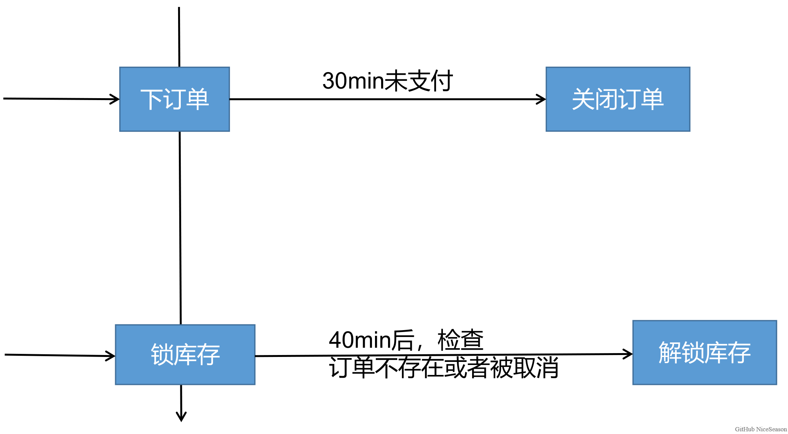

**为什么不能用定时任务完成？**

如果恰好在一次扫描后完成业务逻辑，那么就会等待两个扫描周期才能扫到过期的订单，不能保证时效性

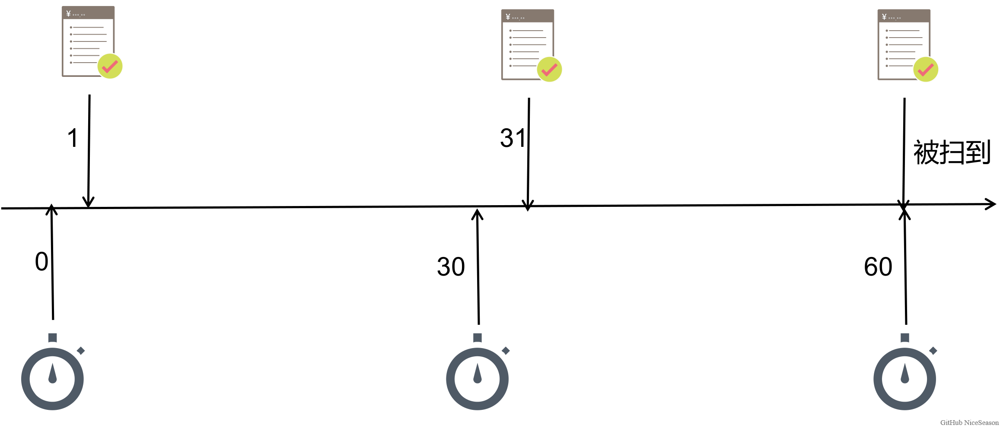


#### (3) 定时关单与库存解锁主体逻辑

* 订单超时未支付触发订单过期状态修改与库存解锁

> 创建订单时消息会被发送至队列`order.delay.queue`，经过`TTL`的时间后消息会变成死信以`order.release.order`的路由键经交换机转发至队列`order.release.order.queue`，再通过监听该队列的消息来实现过期订单的处理
>
> * 如果该订单已支付，则无需处理
> * 否则说明该订单已过期，修改该订单的状态并通过路由键`order.release.other`发送消息至队列`stock.release.stock.queue`进行库存解锁

* 库存锁定后延迟检查是否需要解锁库存

> 在库存锁定后通过`路由键stock.locked`发送至`延迟队列stock.delay.queue`，延迟时间到，死信通过`路由键stock.release`转发至`stock.release.stock.queue`,通过监听该队列进行判断当前订单状态，来确定库存是否需要解锁

* 由于`关闭订单`和`库存解锁`都有可能被执行多次，因此要保证业务逻辑的幂等性，在执行业务是重新查询当前的状态进行判断
* 订单关闭和库存解锁都会进行库存解锁的操作，来确保业务异常或者订单过期时库存会被可靠解锁

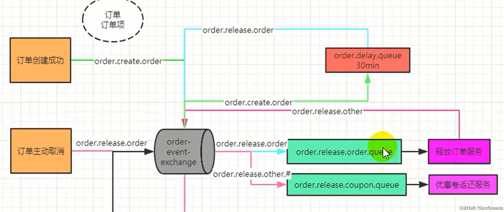

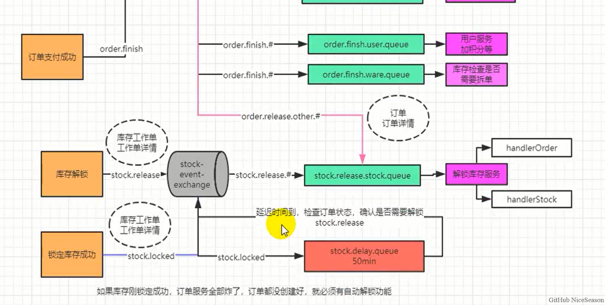

#### (4) 创建业务交换机和队列

* 订单模块

```java
@Configuration
public class MyRabbitmqConfig {
    @Bean
    public Exchange orderEventExchange() {
        /**
         *   String name,
         *   boolean durable,
         *   boolean autoDelete,
         *   Map<String, Object> arguments
         */
        return new TopicExchange("order-event-exchange", true, false);
    }

    /**
     * 延迟队列
     * @return
     */
    @Bean
    public Queue orderDelayQueue() {
       /**
            Queue(String name,  队列名字
            boolean durable,  是否持久化
            boolean exclusive,  是否排他
            boolean autoDelete, 是否自动删除
            Map<String, Object> arguments) 属性
         */
        HashMap<String, Object> arguments = new HashMap<>();
        //死信交换机
        arguments.put("x-dead-letter-exchange", "order-event-exchange");
        //死信路由键
        arguments.put("x-dead-letter-routing-key", "order.release.order");
        arguments.put("x-message-ttl", 60000); // 消息过期时间 1分钟
        return new Queue("order.delay.queue",true,false,false,arguments);
    }

    /**
     * 普通队列
     *
     * @return
     */
    @Bean
    public Queue orderReleaseQueue() {

        Queue queue = new Queue("order.release.order.queue", true, false, false);

        return queue;
    }

    /**
     * 创建订单的binding
     * @return
     */
    @Bean
    public Binding orderCreateBinding() {
        /**
         * String destination, 目的地（队列名或者交换机名字）
         * DestinationType destinationType, 目的地类型（Queue、Exhcange）
         * String exchange,
         * String routingKey,
         * Map<String, Object> arguments
         * */
        return new Binding("order.delay.queue", Binding.DestinationType.QUEUE, "order-event-exchange", "order.create.order", null);
    }

    @Bean
    public Binding orderReleaseBinding() {
        return new Binding("order.release.order.queue",
                Binding.DestinationType.QUEUE,
                "order-event-exchange",
                "order.release.order",
                null);
    }

    @Bean
    public Binding orderReleaseOrderBinding() {
        return new Binding("stock.release.stock.queue",
                Binding.DestinationType.QUEUE,
                "order-event-exchange",
                "order.release.other.#",
                null);
    }
}
```

* 库存模块

```java
@Configuration
public class MyRabbitmqConfig {

    @Bean
    public Exchange stockEventExchange() {
        return new TopicExchange("stock-event-exchange", true, false);
    }

    /**
     * 延迟队列
     * @return
     */
    @Bean
    public Queue stockDelayQueue() {
        HashMap<String, Object> arguments = new HashMap<>();
        arguments.put("x-dead-letter-exchange", "stock-event-exchange");
        arguments.put("x-dead-letter-routing-key", "stock.release");
        // 消息过期时间 2分钟
        arguments.put("x-message-ttl", 120000);
        return new Queue("stock.delay.queue", true, false, false, arguments);
    }

    /**
     * 普通队列，用于解锁库存
     * @return
     */
    @Bean
    public Queue stockReleaseStockQueue() {
        return new Queue("stock.release.stock.queue", true, false, false, null);
    }


    /**
     * 交换机和延迟队列绑定
     * @return
     */
    @Bean
    public Binding stockLockedBinding() {
        return new Binding("stock.delay.queue",
                Binding.DestinationType.QUEUE,
                "stock-event-exchange",
                "stock.locked",
                null);
    }

    /**
     * 交换机和普通队列绑定
     * @return
     */
    @Bean
    public Binding stockReleaseBinding() {
        return new Binding("stock.release.stock.queue",
                Binding.DestinationType.QUEUE,
                "stock-event-exchange",
                "stock.release.#",
                null);
    }
}
```

#### (5) 库存自动解锁

##### 1）库存锁定

在库存锁定是添加以下逻辑

* 由于可能订单回滚的情况，所以为了能够得到库存锁定的信息，在锁定时需要记录库存工作单，其中包括订单信息和锁定库存时的信息(仓库id，商品id，锁了几件...)
* 在锁定成功后，向延迟队列发消息，带上库存锁定的相关信息

```java
@Transactional
@Override
public Boolean orderLockStock(WareSkuLockVo wareSkuLockVo) {
    //因为可能出现订单回滚后，库存锁定不回滚的情况，但订单已经回滚，得不到库存锁定信息，因此要有库存工作单
    WareOrderTaskEntity taskEntity = new WareOrderTaskEntity();
    taskEntity.setOrderSn(wareSkuLockVo.getOrderSn());
    taskEntity.setCreateTime(new Date());
    wareOrderTaskService.save(taskEntity);

    List<OrderItemVo> itemVos = wareSkuLockVo.getLocks();
    List<SkuLockVo> lockVos = itemVos.stream().map((item) -> {
        SkuLockVo skuLockVo = new SkuLockVo();
        skuLockVo.setSkuId(item.getSkuId());
        skuLockVo.setNum(item.getCount());
        List<Long> wareIds = baseMapper.listWareIdsHasStock(item.getSkuId(), item.getCount());
        skuLockVo.setWareIds(wareIds);
        return skuLockVo;
    }).collect(Collectors.toList());

    for (SkuLockVo lockVo : lockVos) {
        boolean lock = true;
        Long skuId = lockVo.getSkuId();
        List<Long> wareIds = lockVo.getWareIds();
        if (wareIds == null || wareIds.size() == 0) {
            throw new NoStockException(skuId);
        }else {
            for (Long wareId : wareIds) {
                Long count=baseMapper.lockWareSku(skuId, lockVo.getNum(), wareId);
                if (count==0){
                    lock=false;
                }else {
                    //锁定成功，保存工作单详情
                    WareOrderTaskDetailEntity detailEntity = WareOrderTaskDetailEntity.builder()
                            .skuId(skuId)
                            .skuName("")
                            .skuNum(lockVo.getNum())
                            .taskId(taskEntity.getId())
                            .wareId(wareId)
                            .lockStatus(1).build();
                    wareOrderTaskDetailService.save(detailEntity);
                    //发送库存锁定消息至延迟队列
                    StockLockedTo lockedTo = new StockLockedTo();
                    lockedTo.setId(taskEntity.getId());
                    StockDetailTo detailTo = new StockDetailTo();
                    BeanUtils.copyProperties(detailEntity,detailTo);
                    lockedTo.setDetailTo(detailTo);
                    rabbitTemplate.convertAndSend("stock-event-exchange","stock.locked",lockedTo);

                    lock = true;
                    break;
                }
            }
        }
        if (!lock) throw new NoStockException(skuId);
    }
    return true;
}
```

##### 2）监听队列

* 延迟队列会将过期的消息路由至`"stock.release.stock.queue"`,通过监听该队列实现库存的解锁
* 为保证消息的可靠到达，我们使用手动确认消息的模式，在解锁成功后确认消息，若出现异常则重新归队

```java
@Component
@RabbitListener(queues = {"stock.release.stock.queue"})
public class StockReleaseListener {

    @Autowired
    private WareSkuService wareSkuService;

    @RabbitHandler
    public void handleStockLockedRelease(StockLockedTo stockLockedTo, Message message, Channel channel) throws IOException {
        log.info("************************收到库存解锁的消息********************************");
        try {
            wareSkuService.unlock(stockLockedTo);
            channel.basicAck(message.getMessageProperties().getDeliveryTag(), false);
        } catch (Exception e) {
            channel.basicReject(message.getMessageProperties().getDeliveryTag(),true);
        }
    }
}
```

##### 3）库存解锁

* 如果工作单详情不为空，说明该库存锁定成功
  * 查询最新的订单状态，如果订单不存在，说明订单提交出现异常回滚，或者订单处于已取消的状态，我们都对已锁定的库存进行解锁
* 如果工作单详情为空，说明库存未锁定，自然无需解锁
* 为保证幂等性，我们分别对订单的状态和工作单的状态都进行了判断，只有当订单过期且工作单显示当前库存处于锁定的状态时，才进行库存的解锁

```java
 @Override
    public void unlock(StockLockedTo stockLockedTo) {
        StockDetailTo detailTo = stockLockedTo.getDetailTo();
        WareOrderTaskDetailEntity detailEntity = wareOrderTaskDetailService.getById(detailTo.getId());
        //1.如果工作单详情不为空，说明该库存锁定成功
        if (detailEntity != null) {
            WareOrderTaskEntity taskEntity = wareOrderTaskService.getById(stockLockedTo.getId());
            R r = orderFeignService.infoByOrderSn(taskEntity.getOrderSn());
            if (r.getCode() == 0) {
                OrderTo order = r.getData("order", new TypeReference<OrderTo>() {
                });
                //没有这个订单||订单状态已经取消 解锁库存
                if (order == null||order.getStatus()== OrderStatusEnum.CANCLED.getCode()) {
                    //为保证幂等性，只有当工作单详情处于被锁定的情况下才进行解锁
                    if (detailEntity.getLockStatus()== WareTaskStatusEnum.Locked.getCode()){
                        unlockStock(detailTo.getSkuId(), detailTo.getSkuNum(), detailTo.getWareId(), detailEntity.getId());
                    }
                }
            }else {
                throw new RuntimeException("远程调用订单服务失败");
            }
        }else {
            //无需解锁
        }
    }
```

#### (6) 定时关单

##### 1) 提交订单

```java
@Transactional
@Override
public SubmitOrderResponseVo submitOrder(OrderSubmitVo submitVo) {

    //提交订单的业务处理。。。
    
    //发送消息到订单延迟队列，判断过期订单
    rabbitTemplate.convertAndSend("order-event-exchange","order.create.order",order.getOrder());

               
}
```

##### 2) 监听队列

创建订单的消息会进入延迟队列，最终发送至队列`order.release.order.queue`，因此我们对该队列进行监听，进行订单的关闭

```java
@Component
@RabbitListener(queues = {"order.release.order.queue"})
public class OrderCloseListener {

    @Autowired
    private OrderService orderService;

    @RabbitHandler
    public void listener(OrderEntity orderEntity, Message message, Channel channel) throws IOException {
        System.out.println("收到过期的订单信息，准备关闭订单" + orderEntity.getOrderSn());
        long deliveryTag = message.getMessageProperties().getDeliveryTag();
        try {
            orderService.closeOrder(orderEntity);
            channel.basicAck(deliveryTag,false);
        } catch (Exception e){
            channel.basicReject(deliveryTag,true);
        }

    }
}
```

##### 3) 关闭订单

* 由于要保证幂等性，因此要查询最新的订单状态判断是否需要关单
* 关闭订单后也需要解锁库存，因此发送消息进行库存、会员服务对应的解锁

```java
@Override
public void closeOrder(OrderEntity orderEntity) {
    //因为消息发送过来的订单已经是很久前的了，中间可能被改动，因此要查询最新的订单
    OrderEntity newOrderEntity = this.getById(orderEntity.getId());
    //如果订单还处于新创建的状态，说明超时未支付，进行关单
    if (newOrderEntity.getStatus() == OrderStatusEnum.CREATE_NEW.getCode()) {
        OrderEntity updateOrder = new OrderEntity();
        updateOrder.setId(newOrderEntity.getId());
        updateOrder.setStatus(OrderStatusEnum.CANCLED.getCode());
        this.updateById(updateOrder);

        //关单后发送消息通知其他服务进行关单相关的操作，如解锁库存
        OrderTo orderTo = new OrderTo();
        BeanUtils.copyProperties(newOrderEntity,orderTo);
        rabbitTemplate.convertAndSend("order-event-exchange", "order.release.other",orderTo);
    }
}
```

##### 4) 解锁库存

```java
@Slf4j
@Component
@RabbitListener(queues = {"stock.release.stock.queue"})
public class StockReleaseListener {

    @Autowired
    private WareSkuService wareSkuService;

    @RabbitHandler
    public void handleStockLockedRelease(StockLockedTo stockLockedTo, Message message, Channel channel) throws IOException {
        log.info("************************收到库存解锁的消息********************************");
        try {
            wareSkuService.unlock(stockLockedTo);
            channel.basicAck(message.getMessageProperties().getDeliveryTag(), false);
        } catch (Exception e) {
            channel.basicReject(message.getMessageProperties().getDeliveryTag(),true);
        }
    }

    @RabbitHandler
    public void handleStockLockedRelease(OrderTo orderTo, Message message, Channel channel) throws IOException {
        log.info("************************从订单模块收到库存解锁的消息********************************");
        try {
            wareSkuService.unlock(orderTo);
            channel.basicAck(message.getMessageProperties().getDeliveryTag(), false);
        } catch (Exception e) {
            channel.basicReject(message.getMessageProperties().getDeliveryTag(),true);
        }
    }
}
```

```java
@Override
public void unlock(OrderTo orderTo) {
    //为防止重复解锁，需要重新查询工作单
    String orderSn = orderTo.getOrderSn();
    WareOrderTaskEntity taskEntity = wareOrderTaskService.getBaseMapper().selectOne((new QueryWrapper<WareOrderTaskEntity>().eq("order_sn", orderSn)));
    //查询出当前订单相关的且处于锁定状态的工作单详情
    List<WareOrderTaskDetailEntity> lockDetails = wareOrderTaskDetailService.list(new QueryWrapper<WareOrderTaskDetailEntity>().eq("task_id", taskEntity.getId()).eq("lock_status", WareTaskStatusEnum.Locked.getCode()));
    for (WareOrderTaskDetailEntity lockDetail : lockDetails) {
        unlockStock(lockDetail.getSkuId(),lockDetail.getSkuNum(),lockDetail.getWareId(),lockDetail.getId());
    }
}
```

### 6. 支付

#### (1) 支付宝加密原理

* 支付宝加密采用RSA非对称加密，分别在商户端和支付宝端有两对公钥和私钥
* 在发送订单数据时，直接使用明文，但会使用`商户私钥`加一个对应的签名，支付宝端会使用`商户公钥`对签名进行验签，只有数据明文和签名对应的时候才能说明传输正确
* 支付成功后，支付宝发送支付成功数据之外，还会使用`支付宝私钥`加一个对应的签名，商户端收到支付成功数据之后也会使用`支付宝公钥`延签，成功后才能确认

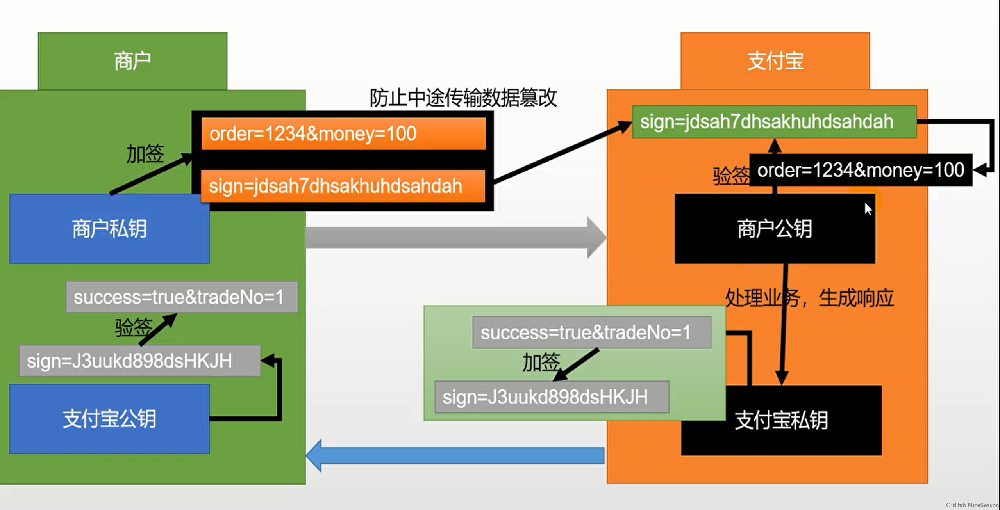

#### (2) 配置支付宝沙箱环境

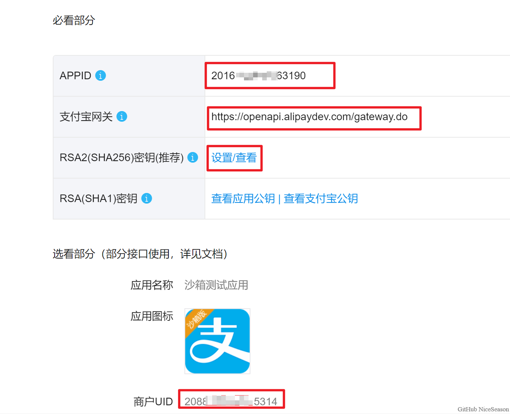

#### (3) 环境搭建

导入支付宝sdk

```xml
<dependency>
    <groupId>com.alipay.sdk</groupId>
    <artifactId>alipay-sdk-java</artifactId>
    <version>4.9.28.ALL</version>
</dependency>
```

抽取支付工具类并进行配置

成功调用该接口后，返回的数据就是支付页面的html，因此后续会使用`@ResponseBody`

```java
@ConfigurationProperties(prefix = "alipay")
@Component
@Data
public class AlipayTemplate {

    //在支付宝创建的应用的id
    private   String app_id = "2016102600763190";

    // 商户私钥，您的PKCS8格式RSA2私钥
    private String merchant_private_key = "MjXN6Hnj8k2GAriRFt0BS9gjihbl9Rt38VMNbBi3Vt3Cy6TOwANLLJ/DfnYjRqwCG81fkyKlDqdsamdfCiTysCa0gQKBgQDYQ45LSRxAOTyM5NliBmtev0lbpDa7FqXL0UFgBel5VgA1Ysp0+6ex2n73NBHbaVPEXgNMnTdzU3WF9uHF4Gj0mfUzbVMbj/YkkHDOZHBggAjEHCB87IKowq/uAH/++Qes2GipHHCTJlG6yejdxhOsMZXdCRnidNx5yv9+2JI37QKBgQCw0xn7ZeRBIOXxW7xFJw1WecUV7yaL9OWqKRHat3lFtf1Qo/87cLl+KeObvQjjXuUe07UkrS05h6ijWyCFlBo2V7Cdb3qjq4atUwScKfTJONnrF+fwTX0L5QgyQeDX5a4yYp4pLmt6HKh34sI5S/RSWxDm7kpj+/MjCZgp6Xc51g==";

    // 支付宝公钥,查看地址：https://openhome.alipay.com/platform/keyManage.htm 对应APPID下的支付宝公钥。
    private String alipay_public_key = "MIIBIjA74UKxt2F8VMIRKrRAAAuIMuawIsl4Ye+G12LK8P1ZLYy7ZJpgZ+Wv5nOs3DdoEazgCERj/ON8lM1KBHZOAV+TkrIcyi7cD1gfv4a1usikrUqm8/qhFvoiUfyHJFv1ymT7C4BI6aHzQ2zcUlSQPGoPl4C11tgnSkm3DlH2JZKgaIMcCOnNH+qctjNh9yIV9zat2qUiXbxmrCTtxAmiI3I+eVsUNwvwIDAQAB";

    // 服务器[异步通知]页面路径  需http://格式的完整路径，不能加?id=123这类自定义参数，必须外网可以正常访问
    // 支付宝会悄悄的给我们发送一个请求，告诉我们支付成功的信息
    private  String notify_url="http://**.natappfree.cc/payed/notify";

    // 页面跳转同步通知页面路径 需http://格式的完整路径，不能加?id=123这类自定义参数，必须外网可以正常访问
    //同步通知，支付成功，一般跳转到成功页
    private  String return_url="http://order.gulimall.com/memberOrder.html";

    // 签名方式
    private  String sign_type = "RSA2";

    // 字符编码格式
    private  String charset = "utf-8";

    // 支付宝网关； https://openapi.alipaydev.com/gateway.do
    private  String gatewayUrl = "https://openapi.alipaydev.com/gateway.do";

    public  String pay(PayVo vo) throws AlipayApiException {

        //AlipayClient alipayClient = new DefaultAlipayClient(AlipayTemplate.gatewayUrl, AlipayTemplate.app_id, AlipayTemplate.merchant_private_key, "json", AlipayTemplate.charset, AlipayTemplate.alipay_public_key, AlipayTemplate.sign_type);
        //1、根据支付宝的配置生成一个支付客户端
        AlipayClient alipayClient = new DefaultAlipayClient(gatewayUrl,
                app_id, merchant_private_key, "json",
                charset, alipay_public_key, sign_type);

        //2、创建一个支付请求 //设置请求参数
        AlipayTradePagePayRequest alipayRequest = new AlipayTradePagePayRequest();
        alipayRequest.setReturnUrl(return_url);
        alipayRequest.setNotifyUrl(notify_url);

        //商户订单号，商户网站订单系统中唯一订单号，必填
        String out_trade_no = vo.getOut_trade_no();
        //付款金额，必填
        String total_amount = vo.getTotal_amount();
        //订单名称，必填
        String subject = vo.getSubject();
        //商品描述，可空
        String body = vo.getBody();

        alipayRequest.setBizContent("{\"out_trade_no\":\""+ out_trade_no +"\","
                + "\"total_amount\":\""+ total_amount +"\","
                + "\"subject\":\""+ subject +"\","
                + "\"body\":\""+ body +"\","
                + "\"product_code\":\"FAST_INSTANT_TRADE_PAY\"}");

        String result = alipayClient.pageExecute(alipayRequest).getBody();

        //会收到支付宝的响应，响应的是一个页面，只要浏览器显示这个页面，就会自动来到支付宝的收银台页面
        System.out.println("支付宝的响应："+result);

        return result;

    }
```

#### (4) 订单支付与同步通知

点击支付跳转到支付接口

```java
@ResponseBody
@GetMapping(value = "/aliPayOrder",produces = "text/html")
public String aliPayOrder(@RequestParam("orderSn") String orderSn) throws AlipayApiException {
    System.out.println("接收到订单信息orderSn："+orderSn);
    //获取当前订单并设置支付订单相关信息
    PayVo payVo = orderService.getOrderPay(orderSn);
    String pay = alipayTemplate.pay(payVo);
    return pay;
}

@Override
public PayVo getOrderPay(String orderSn) {
    OrderEntity orderEntity = this.getOne(new QueryWrapper<OrderEntity>().eq("order_sn", orderSn));
    PayVo payVo = new PayVo();
    //交易号
    payVo.setOut_trade_no(orderSn);
    //支付金额设置为两位小数，否则会报错
    BigDecimal payAmount = orderEntity.getPayAmount().setScale(2, BigDecimal.ROUND_UP);
    payVo.setTotal_amount(payAmount.toString());

    List<OrderItemEntity> orderItemEntities = orderItemService.list(new QueryWrapper<OrderItemEntity>().eq("order_sn", orderSn));
    OrderItemEntity orderItemEntity = orderItemEntities.get(0);
    //订单名称
    payVo.setSubject(orderItemEntity.getSkuName());
    //商品描述
    payVo.setBody(orderItemEntity.getSkuAttrsVals());
    return payVo;
}
```

设置成功回调地址为订单详情页

```java
  	// 页面跳转同步通知页面路径 需http://格式的完整路径，不能加?id=123这类自定义参数，必须外网可以正常访问
    //同步通知，支付成功，一般跳转到成功页
    private  String return_url="http://order.gulimall.com/memberOrder.html";

	  /**
     * 获取当前用户的所有订单
     * @return
     */
    @RequestMapping("/memberOrder.html")
    public String memberOrder(@RequestParam(value = "pageNum",required = false,defaultValue = "0") Integer pageNum,Model model){
        Map<String, Object> params = new HashMap<>();
        params.put("page", pageNum.toString());
        //分页查询当前用户的所有订单及对应订单项
        PageUtils page = orderService.getMemberOrderPage(params);
        model.addAttribute("pageUtil", page);
        //返回至订单详情页
        return "list";
    }

```

#### (5) 异步通知

* 订单支付成功后支付宝会回调商户接口，这个时候需要修改订单状态
* 由于同步跳转可能由于网络问题失败，所以使用异步通知
* 支付宝使用的是最大努力通知方案，保障数据一致性，隔一段时间会通知商户支付成功，直到返回`success`

##### 1）内网穿透设置异步通知地址

* 将外网映射到本地的`order.gulimall.com:80`

* 由于回调的请求头不是`order.gulimall.com`，因此nginx转发到网关后找不到对应的服务，所以需要对nginx进行设置

  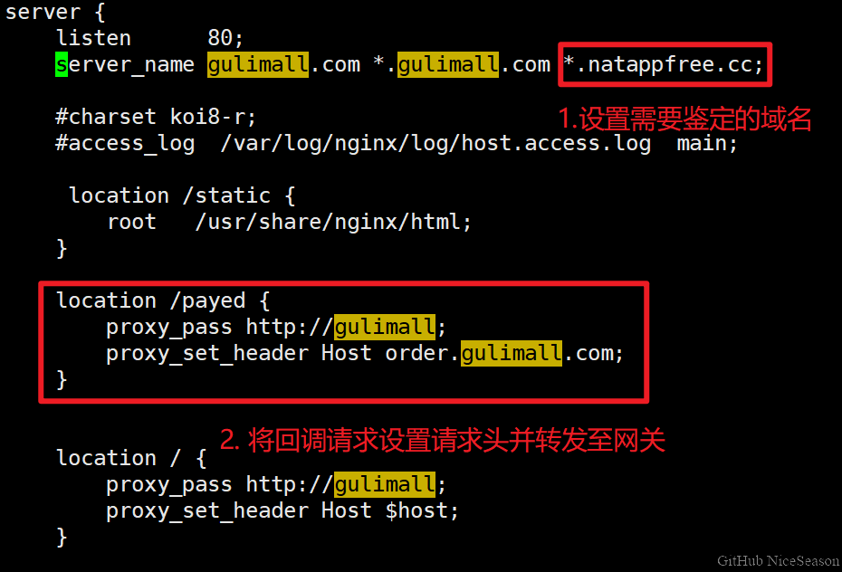

  将`/payed/notify`异步通知转发至订单服务

设置异步通知的地址

```java
// 服务器[异步通知]页面路径  需http://格式的完整路径，不能加?id=123这类自定义参数，必须外网可以正常访问
// 支付宝会悄悄的给我们发送一个请求，告诉我们支付成功的信息
private  String notify_url="http://****.natappfree.cc/payed/notify";
```

##### 2）验证签名

```java
@PostMapping("/payed/notify")
public String handlerAlipay(HttpServletRequest request, PayAsyncVo payAsyncVo) throws AlipayApiException {
    System.out.println("收到支付宝异步通知******************");
    // 只要收到支付宝的异步通知，返回 success 支付宝便不再通知
    // 获取支付宝POST过来反馈信息
    //TODO 需要验签
    Map<String, String> params = new HashMap<>();
    Map<String, String[]> requestParams = request.getParameterMap();
    for (String name : requestParams.keySet()) {
        String[] values = requestParams.get(name);
        String valueStr = "";
        for (int i = 0; i < values.length; i++) {
            valueStr = (i == values.length - 1) ? valueStr + values[i]
                    : valueStr + values[i] + ",";
        }
        //乱码解决，这段代码在出现乱码时使用
        // valueStr = new String(valueStr.getBytes("ISO-8859-1"), "utf-8");
        params.put(name, valueStr);
    }

    boolean signVerified = AlipaySignature.rsaCheckV1(params, alipayTemplate.getAlipay_public_key(),
            alipayTemplate.getCharset(), alipayTemplate.getSign_type()); //调用SDK验证签名

    if (signVerified){
        System.out.println("支付宝异步通知验签成功");
        //修改订单状态
        orderService.handlerPayResult(payAsyncVo);
        return "success";
    }else {
        System.out.println("支付宝异步通知验签失败");
        return "error";
    }
}
```

##### 3）修改订单状态与保存交易流水

```java
@Override
public void handlerPayResult(PayAsyncVo payAsyncVo) {
    //保存交易流水
    PaymentInfoEntity infoEntity = new PaymentInfoEntity();
    String orderSn = payAsyncVo.getOut_trade_no();
    infoEntity.setOrderSn(orderSn);
    infoEntity.setAlipayTradeNo(payAsyncVo.getTrade_no());
    infoEntity.setSubject(payAsyncVo.getSubject());
    String trade_status = payAsyncVo.getTrade_status();
    infoEntity.setPaymentStatus(trade_status);
    infoEntity.setCreateTime(new Date());
    infoEntity.setCallbackTime(payAsyncVo.getNotify_time());
    paymentInfoService.save(infoEntity);

    //判断交易状态是否成功
    if (trade_status.equals("TRADE_SUCCESS") || trade_status.equals("TRADE_FINISHED")) {
        baseMapper.updateOrderStatus(orderSn, OrderStatusEnum.PAYED.getCode(), PayConstant.ALIPAY);
    }
```

##### 4) 异步通知的参数

```java
@PostMapping("/payed/notify")
public String handlerAlipay(HttpServletRequest request) {
    System.out.println("收到支付宝异步通知******************");
    Map<String, String[]> parameterMap = request.getParameterMap();
    for (String key : parameterMap.keySet()) {
        String value = request.getParameter(key);
        System.out.println("key:"+key+"===========>value:"+value);
    }
    return "success";
}
```

```shell
收到支付宝异步通知******************
key:gmt_create===========>value:2020-10-18 09:13:26
key:charset===========>value:utf-8
key:gmt_payment===========>value:2020-10-18 09:13:34
key:notify_time===========>value:2020-10-18 09:13:35
key:subject===========>value:华为
key:sign===========>value:aqhKWzgzTLE84Scy5d8i3f+t9f7t7IE5tK/s5iHf3SdFQXPnTt6MEVtbr15ZXmITEo015nCbSXaUFJvLiAhWpvkNEd6ysraa+2dMgotuHPIHnIUFwvdk+U4Ez+2A4DBTJgmwtc5Ay8mYLpHLNR9ASuEmkxxK2F3Ov6MO0d+1DOjw9c/CCRRBWR8NHSJePAy/UxMzULLtpMELQ1KUVHLgZC5yym5TYSuRmltYpLHOuoJhJw8vGkh2+4FngvjtS7SBhEhR1GvJCYm1iXRFTNgP9Fmflw+EjxrDafCIA+r69ZqoJJ2Sk1hb4cBsXgNrFXR2Uj4+rQ1Ec74bIjT98f1KpA==
key:buyer_id===========>value:2088622954825223
key:body===========>value:上市年份：2020；内存：64G
key:invoice_amount===========>value:6300.00
key:version===========>value:1.0
key:notify_id===========>value:2020101800222091334025220507700182
key:fund_bill_list===========>value:[{"amount":"6300.00","fundChannel":"ALIPAYACCOUNT"}]
key:notify_type===========>value:trade_status_sync
key:out_trade_no===========>value:12345523123
key:total_amount===========>value:6300.00
key:trade_status===========>value:TRADE_SUCCESS
key:trade_no===========>value:2020101822001425220501264292
key:auth_app_id===========>value:2016102600763190
key:receipt_amount===========>value:6300.00
key:point_amount===========>value:0.00
key:app_id===========>value:2016102600763190
key:buyer_pay_amount===========>value:6300.00
key:sign_type===========>value:RSA2
key:seller_id===========>value:2088102181115314
```

各参数详细意义见[支付宝开放平台异步通知](https://opendocs.alipay.com/open/194/103296)

#### (6) 收单

由于可能出现订单已经过期后，库存已经解锁，但支付成功后再修改订单状态的情况，需要设置支付有效时间，只有在有效期内才能进行支付

```java
alipayRequest.setBizContent("{\"out_trade_no\":\""+ out_trade_no +"\","
        + "\"total_amount\":\""+ total_amount +"\","
        + "\"subject\":\""+ subject +"\","
        + "\"body\":\""+ body +"\","
        //设置过期时间为1m
        +"\"timeout_express\":\"1m\","
        + "\"product_code\":\"FAST_INSTANT_TRADE_PAY\"}");
```

超时后订单显示

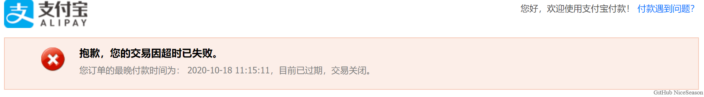

## 秒杀服务

### 1. 秒杀（高并发）系统关注的问题

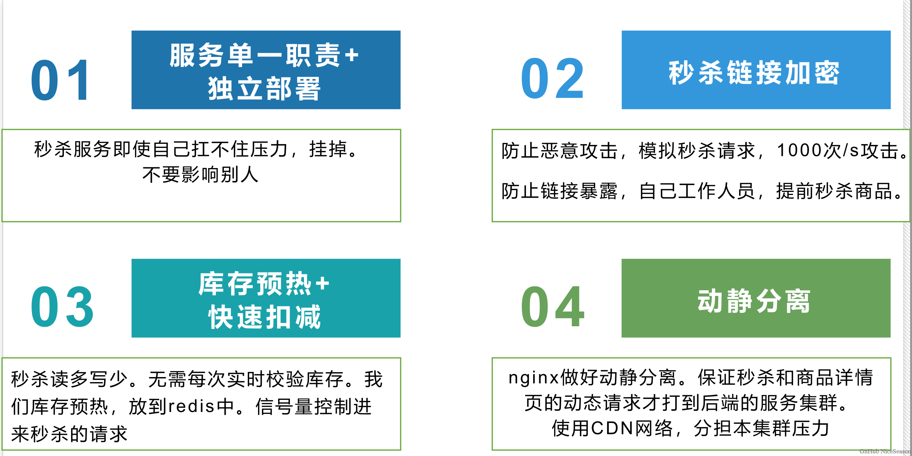

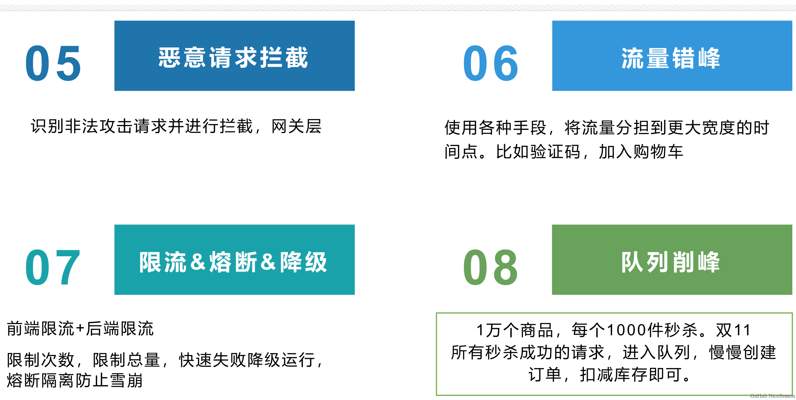

### 2. 秒杀架构设计

#### (1) 秒杀架构图

* 项目独立部署，独立秒杀模块`gulimall-seckill`
* 使用定时任务每天三点上架最新秒杀商品，削减高峰期压力
* 秒杀链接加密，为秒杀商品添加唯一商品随机码，在开始秒杀时才暴露接口
* 库存预热，先从数据库中扣除一部分库存以`redisson 信号量`的形式存储在redis中
* 队列削峰，秒杀成功后立即返回，然后以发送消息的形式创建订单

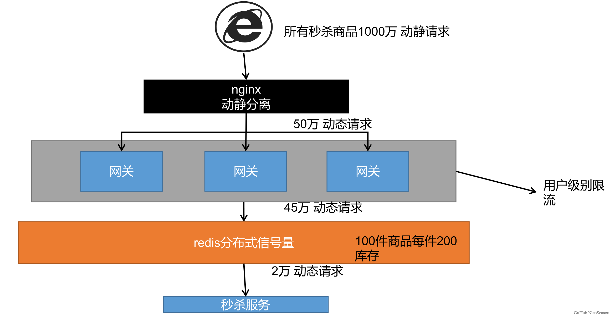

#### (2) 存储模型设计

* 秒杀场次存储的`List`可以当做`hash key`在`SECKILL_CHARE_PREFIX `中获得对应的商品数据

```java
//存储的秒杀场次对应数据
//K: SESSION_CACHE_PREFIX + startTime + "_" + endTime
//V: sessionId+"-"+skuId的List
private final String SESSION_CACHE_PREFIX = "seckill:sessions:";

//存储的秒杀商品数据
//K: 固定值SECKILL_CHARE_PREFIX
//V: hash，k为sessionId+"-"+skuId，v为对应的商品信息SeckillSkuRedisTo
private final String SECKILL_CHARE_PREFIX = "seckill:skus";

//K: SKU_STOCK_SEMAPHORE+商品随机码
//V: 秒杀的库存件数
private final String SKU_STOCK_SEMAPHORE = "seckill:stock:";    //+商品随机码
```

* 存储后的效果

  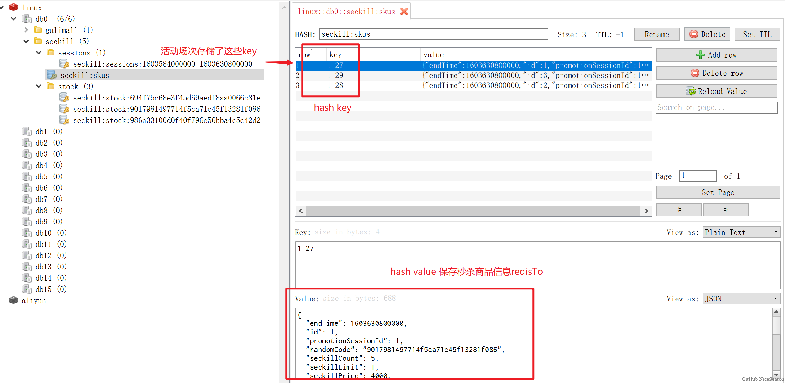

* 用来存储的to

  ```java
  @Data
  public class SeckillSkuRedisTo {
      private Long id;
      /**
       * 活动id
       */
      private Long promotionId;
      /**
       * 活动场次id
       */
      private Long promotionSessionId;
      /**
       * 商品id
       */
      private Long skuId;
      /**
       * 秒杀价格
       */
      private BigDecimal seckillPrice;
      /**
       * 秒杀总量
       */
      private Integer seckillCount;
      /**
       * 每人限购数量
       */
      private Integer seckillLimit;
      /**
       * 排序
       */
      private Integer seckillSort;
      //以上都为SeckillSkuRelationEntity的属性
  
      //skuInfo
      private SkuInfoVo skuInfoVo;
  
      //当前商品秒杀的开始时间
      private Long startTime;
  
      //当前商品秒杀的结束时间
      private Long endTime;
  
      //当前商品秒杀的随机码
      private String randomCode;
  }
  ```

### 3. 商品上架

#### (1) 定时上架

* 开启对定时任务的支持

  ```java
  @EnableAsync //开启对异步的支持，防止定时任务之间相互阻塞
  @EnableScheduling //开启对定时任务的支持
  @Configuration
  public class ScheduledConfig {
  }
  ```

* 每天凌晨三点远程调用`coupon`服务上架最近三天的秒杀商品

* 由于在分布式情况下该方法可能同时被调用多次，因此加入分布式锁，同时只有一个服务可以调用该方法

```java
  	//秒杀商品上架功能的锁
    private final String upload_lock = "seckill:upload:lock";

    /**
     * 定时任务
     * 每天三点上架最近三天的秒杀商品
     */
    @Async
    @Scheduled(cron = "0 0 3 * * ?")
    public void uploadSeckillSkuLatest3Days() {
        //为避免分布式情况下多服务同时上架的情况，使用分布式锁
        RLock lock = redissonClient.getLock(upload_lock);
        try {
            lock.lock(10, TimeUnit.SECONDS);
            secKillService.uploadSeckillSkuLatest3Days();
        }catch (Exception e){
            e.printStackTrace();
        }finally {
            lock.unlock();
        }
    }

 	@Override
    public void uploadSeckillSkuLatest3Days() {
        R r = couponFeignService.getSeckillSessionsIn3Days();
        if (r.getCode() == 0) {
            List<SeckillSessionWithSkusVo> sessions = r.getData(new TypeReference<List<SeckillSessionWithSkusVo>>() {
            });
            //在redis中分别保存秒杀场次信息和场次对应的秒杀商品信息
            saveSecKillSession(sessions);
            saveSecKillSku(sessions);
        }
    }
```

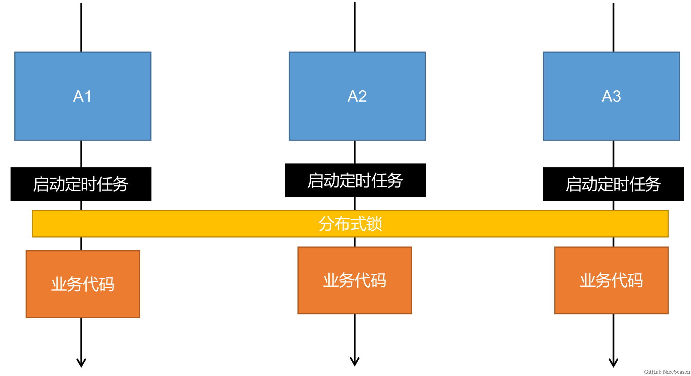

#### (2) 获取最近三天的秒杀信息

* 获取最近三天的秒杀场次信息，再通过秒杀场次id查询对应的商品信息

```java
@Override
public List<SeckillSessionEntity> getSeckillSessionsIn3Days() {
    QueryWrapper<SeckillSessionEntity> queryWrapper = new QueryWrapper<SeckillSessionEntity>()
            .between("start_time", getStartTime(), getEndTime());
    List<SeckillSessionEntity> seckillSessionEntities = this.list(queryWrapper);
    List<SeckillSessionEntity> list = seckillSessionEntities.stream().map(session -> {
        List<SeckillSkuRelationEntity> skuRelationEntities = seckillSkuRelationService.list(new QueryWrapper<SeckillSkuRelationEntity>().eq("promotion_session_id", session.getId()));
        session.setRelations(skuRelationEntities);
        return session;
    }).collect(Collectors.toList());

    return list;
}

//当前天数的 00:00:00
private String getStartTime() {
    LocalDate now = LocalDate.now();
    LocalDateTime time = now.atTime(LocalTime.MIN);
    String format = time.format(DateTimeFormatter.ofPattern("yyyy-MM-dd HH:mm:ss"));
    return format;
}

//当前天数+2 23:59:59..
private String getEndTime() {
    LocalDate now = LocalDate.now();
    LocalDateTime time = now.plusDays(2).atTime(LocalTime.MAX);
    String format = time.format(DateTimeFormatter.ofPattern("yyyy-MM-dd HH:mm:ss"));
    return format;
}
```

#### (3) 在redis中保存秒杀场次信息

```java
private void saveSecKillSession(List<SeckillSessionWithSkusVo> sessions) {
    sessions.stream().forEach(session->{
        String key = SESSION_CACHE_PREFIX + session.getStartTime().getTime() + "_" + session.getEndTime().getTime();
        //当前活动信息未保存过
        if (!redisTemplate.hasKey(key)){
            List<String> values = session.getRelations().stream()
                    .map(sku -> sku.getPromotionSessionId() +"-"+ sku.getSkuId())
                    .collect(Collectors.toList());
            redisTemplate.opsForList().leftPushAll(key,values);
        }
    });
}
```

#### (4) 在redis中保存秒杀商品信息

```java
private void saveSecKillSku(List<SeckillSessionWithSkusVo> sessions) {
    BoundHashOperations<String, Object, Object> ops = redisTemplate.boundHashOps(SECKILL_CHARE_PREFIX);
    sessions.stream().forEach(session->{
        session.getRelations().stream().forEach(sku->{
            String key = sku.getPromotionSessionId() +"-"+ sku.getSkuId();
            if (!ops.hasKey(key)){
                SeckillSkuRedisTo redisTo = new SeckillSkuRedisTo();
                //1. 保存SeckillSkuVo信息
                BeanUtils.copyProperties(sku,redisTo);
                //2. 保存开始结束时间
                redisTo.setStartTime(session.getStartTime().getTime());
                redisTo.setEndTime(session.getEndTime().getTime());
                //3. 远程查询sku信息并保存
                R r = productFeignService.info(sku.getSkuId());
                if (r.getCode() == 0) {
                    SkuInfoVo skuInfo = r.getData("skuInfo", new TypeReference<SkuInfoVo>() {
                    });
                    redisTo.setSkuInfoVo(skuInfo);
                }
                //4. 生成商品随机码，防止恶意攻击
                String token = UUID.randomUUID().toString().replace("-", "");
                redisTo.setRandomCode(token);
                //5. 序列化为json并保存
                String jsonString = JSON.toJSONString(redisTo);
                ops.put(key,jsonString);
                //6. 使用库存作为Redisson信号量限制库存
                RSemaphore semaphore = redissonClient.getSemaphore(SKU_STOCK_SEMAPHORE + token);
                semaphore.trySetPermits(sku.getSeckillCount());
            }
        });
    });
}
```

### 4. 获取当前秒杀商品

```java
@GetMapping(value = "/getCurrentSeckillSkus")
@ResponseBody
public R getCurrentSeckillSkus() {
    //获取到当前可以参加秒杀商品的信息
    List<SeckillSkuRedisTo> vos = secKillService.getCurrentSeckillSkus();

    return R.ok().setData(vos);
}

    @Override
    public List<SeckillSkuRedisTo> getCurrentSeckillSkus() {
        Set<String> keys = redisTemplate.keys(SESSION_CACHE_PREFIX + "*");
        long currentTime = System.currentTimeMillis();
        for (String key : keys) {
            String replace = key.replace(SESSION_CACHE_PREFIX, "");
            String[] split = replace.split("_");
            long startTime = Long.parseLong(split[0]);
            long endTime = Long.parseLong(split[1]);
            //当前秒杀活动处于有效期内
            if (currentTime > startTime && currentTime < endTime) {
                //取出当前秒杀活动对应商品存储的hash key
                List<String> range = redisTemplate.opsForList().range(key, -100, 100);
                BoundHashOperations<String, Object, Object> ops = redisTemplate.boundHashOps(SECKILL_CHARE_PREFIX);
                //取出存储的商品信息并返回
                List<SeckillSkuRedisTo> collect = range.stream().map(s -> {
                    String json = (String) ops.get(s);
                    SeckillSkuRedisTo redisTo = JSON.parseObject(json, SeckillSkuRedisTo.class);
                    return redisTo;
                }).collect(Collectors.toList());
                return collect;
            }
        }
        return null;
    }
```

首页获取并拼装数据

```html
<div class="swiper-slide">
  <!-- 动态拼装秒杀商品信息 -->
  <ul id="seckillSkuContent"></ul>
</div>

<script type="text/javascript">
  $.get("http://seckill.gulimall.com/getCurrentSeckillSkus", function (res) {
    if (res.data.length > 0) {
      res.data.forEach(function (item) {
        $("<li onclick='toDetail(" + item.skuId + ")'></li>").append($(""))
                .append($("<p>"+item.skuInfoVo.skuTitle+"</p>"))
                .append($("<span>" + item.seckillPrice + "</span>"))
                .append($("<s>" + item.skuInfoVo.price + "</s>"))
                .appendTo("#seckillSkuContent");
      })
    }
  })

  function toDetail(skuId) {
    location.href = "http://item.gulimall.com/" + skuId + ".html";
  }

</script>
```

首页展示效果


### 5. 获取当前商品的秒杀信息

```java
@ResponseBody
@GetMapping(value = "/getSeckillSkuInfo/{skuId}")
public R getSeckillSkuInfo(@PathVariable("skuId") Long skuId) {
    SeckillSkuRedisTo to = secKillService.getSeckillSkuInfo(skuId);
    return R.ok().setData(to);
}

 @Override
    public SeckillSkuRedisTo getSeckillSkuInfo(Long skuId) {
        BoundHashOperations<String, String, String> ops = redisTemplate.boundHashOps(SECKILL_CHARE_PREFIX);
        //获取所有商品的hash key
        Set<String> keys = ops.keys();
        for (String key : keys) {
            //通过正则表达式匹配 数字-当前skuid的商品
            if (Pattern.matches("\\d-" + skuId,key)) {
                String v = ops.get(key);
                SeckillSkuRedisTo redisTo = JSON.parseObject(v, SeckillSkuRedisTo.class);
                //当前商品参与秒杀活动
                if (redisTo!=null){
                    long current = System.currentTimeMillis();
                    //当前活动在有效期，暴露商品随机码返回
                    if (redisTo.getStartTime() < current && redisTo.getEndTime() > current) {
                        return redisTo;
                    }
                    //当前商品不再秒杀有效期，则隐藏秒杀所需的商品随机码
                    redisTo.setRandomCode(null);
                    return redisTo;
                }
            }
        }
        return null;
    }
```

在查询商品详情页的接口中查询秒杀对应信息

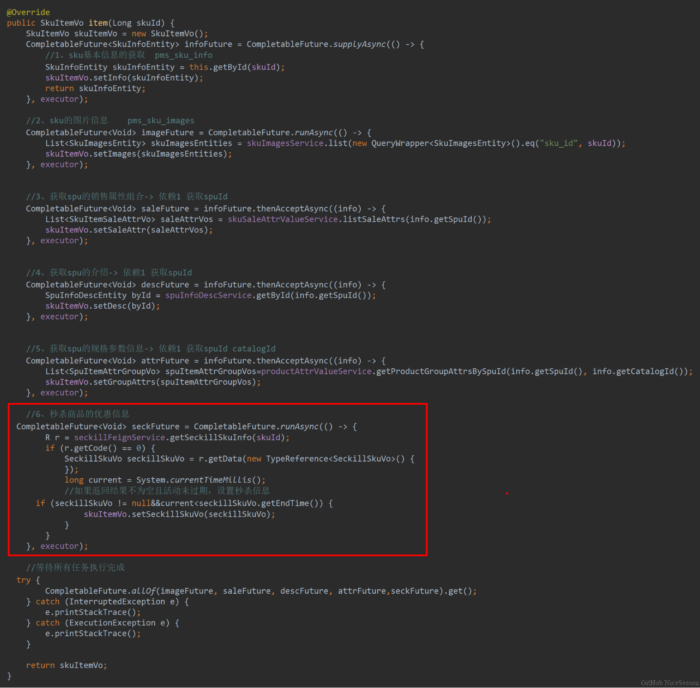

更改商品详情页的显示效果

```html
<li style="color: red" th:if="${item.seckillSkuVo != null}">

    <span th:if="${#dates.createNow().getTime() < item.seckillSkuVo.startTime}">
        商品将会在[[${#dates.format(new java.util.Date(item.seckillSkuVo.startTime),"yyyy-MM-dd HH:mm:ss")}]]进行秒杀
    </span>

    <span th:if="${#dates.createNow().getTime() >= item.seckillSkuVo.startTime && #dates.createNow().getTime() <= item.seckillSkuVo.endTime}">
        秒杀价  [[${#numbers.formatDecimal(item.seckillSkuVo.seckillPrice,1,2)}]]
    </span>

</li>

<div class="box-btns-two"
     th:if="${item.seckillSkuVo == null }">
    <a class="addToCart" href="http://cart.gulimall.com/addToCart" th:attr="skuId=${item.info.skuId}">
        加入购物车
    </a>
</div>

<div class="box-btns-two"
     th:if="${item.seckillSkuVo != null && (#dates.createNow().getTime() >= item.seckillSkuVo.startTime && #dates.createNow().getTime() <= item.seckillSkuVo.endTime)}">
    <a class="seckill" href="#"
       th:attr="skuId=${item.info.skuId},sessionId=${item.seckillSkuVo.promotionSessionId},code=${item.seckillSkuVo.randomCode}">
        立即抢购
    </a>
</div>
```

页面显示效果

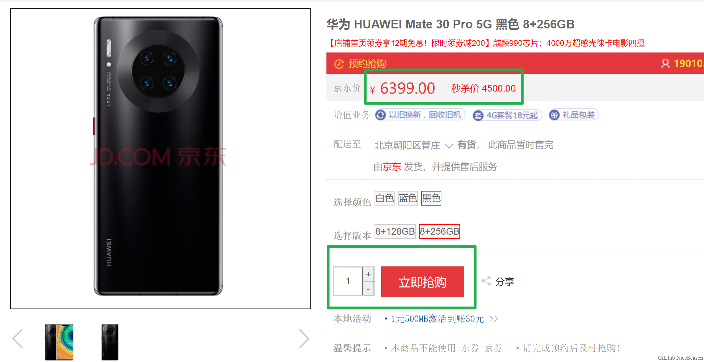

### 6. 秒杀

#### (1) 秒杀接口

* 点击立即抢购时，会发送请求

* 秒杀请求会对请求校验`时效、商品随机码、当前用户是否已经抢购过当前商品、库存和购买量`，通过校验的则秒杀成功，发送消息创建订单

  ```java
  @GetMapping("/kill")
  public String kill(@RequestParam("killId") String killId,
                     @RequestParam("key")String key,
                     @RequestParam("num")Integer num,
                     Model model) {
      String orderSn= null;
      try {
          orderSn = secKillService.kill(killId, key, num);
          model.addAttribute("orderSn", orderSn);
      } catch (InterruptedException e) {
          e.printStackTrace();
      }
      return "success";
  }
  
   @Override
      public String kill(String killId, String key, Integer num) throws InterruptedException {
          BoundHashOperations<String, String, String> ops = redisTemplate.boundHashOps(SECKILL_CHARE_PREFIX);
          String json = ops.get(killId);
          String orderSn = null;
          if (!StringUtils.isEmpty(json)){
              SeckillSkuRedisTo redisTo = JSON.parseObject(json, SeckillSkuRedisTo.class);
              //1. 验证时效
              long current = System.currentTimeMillis();
              if (current >= redisTo.getStartTime() && current <= redisTo.getEndTime()) {
                  //2. 验证商品和商品随机码是否对应
                  String redisKey = redisTo.getPromotionSessionId() + "-" + redisTo.getSkuId();
                  if (redisKey.equals(killId) && redisTo.getRandomCode().equals(key)) {
                      //3. 验证当前用户是否购买过
                      MemberResponseVo memberResponseVo = LoginInterceptor.loginUser.get();
                      long ttl = redisTo.getEndTime() - System.currentTimeMillis();
                      //3.1 通过在redis中使用 用户id-skuId 来占位看是否买过
                      Boolean occupy = redisTemplate.opsForValue().setIfAbsent(memberResponseVo.getId()+"-"+redisTo.getSkuId(), num.toString(), ttl, TimeUnit.MILLISECONDS);
                      //3.2 占位成功，说明该用户未秒杀过该商品，则继续
                      if (occupy){
                          //4. 校验库存和购买量是否符合要求
                          if (num <= redisTo.getSeckillLimit()) {
                              //4.1 尝试获取库存信号量
                              RSemaphore semaphore = redissonClient.getSemaphore(SKU_STOCK_SEMAPHORE + redisTo.getRandomCode());
                              boolean acquire = semaphore.tryAcquire(num,100,TimeUnit.MILLISECONDS);
                              //4.2 获取库存成功
                              if (acquire) {
                                  //5. 发送消息创建订单
                                  //5.1 创建订单号
                                  orderSn = IdWorker.getTimeId();
                                  //5.2 创建秒杀订单to
                                  SeckillOrderTo orderTo = new SeckillOrderTo();
                                  orderTo.setMemberId(memberResponseVo.getId());
                                  orderTo.setNum(num);
                                  orderTo.setOrderSn(orderSn);
                                  orderTo.setPromotionSessionId(redisTo.getPromotionSessionId());
                                  orderTo.setSeckillPrice(redisTo.getSeckillPrice());
                                  orderTo.setSkuId(redisTo.getSkuId());
                                  //5.3 发送创建订单的消息
                                  rabbitTemplate.convertAndSend("order-event-exchange", "order.seckill.order", orderTo);
                              }
                          }
                      }
                  }
              }
              return orderSn;
          }
  ```

  #### (2) 创建订单

  发送消息

  ```java
  //发送创建订单的消息
  rabbitTemplate.convertAndSend("order-event-exchange", "order.seckill.order", orderTo);
  
  ```

  创建秒杀所需队列

  

  ```java
   /**
       * 商品秒杀队列
       * @return
       */
  @Bean
  public Queue orderSecKillOrrderQueue() {
      Queue queue = new Queue("order.seckill.order.queue", true, false, false);
      return queue;
  }
  
  @Bean
  public Binding orderSecKillOrrderQueueBinding() {
      //String destination, DestinationType destinationType, String exchange, String routingKey,
      // 			Map<String, Object> arguments
      Binding binding = new Binding(
              "order.seckill.order.queue",
              Binding.DestinationType.QUEUE,
              "order-event-exchange",
              "order.seckill.order",
              null);
  
      return binding;
  }
  ```
  监听队列

  ```java
  @Component
  @RabbitListener(queues = "order.seckill.order.queue")
  public class SeckillOrderListener {
      @Autowired
      private OrderService orderService;
  
      @RabbitHandler
      public void createOrder(SeckillOrderTo orderTo, Message message, Channel channel) throws IOException {
          System.out.println("***********接收到秒杀消息");
          long deliveryTag = message.getMessageProperties().getDeliveryTag();
          try {
              orderService.createSeckillOrder(orderTo);
              channel.basicAck(deliveryTag, false);
          } catch (Exception e) {
              channel.basicReject(deliveryTag,true);
          }
      }
  }
  ```

  创建订单

  ```java
  @Transactional
  @Override
  public void createSeckillOrder(SeckillOrderTo orderTo) {
      MemberResponseVo memberResponseVo = LoginInterceptor.loginUser.get();
      //1. 创建订单
      OrderEntity orderEntity = new OrderEntity();
      orderEntity.setOrderSn(orderTo.getOrderSn());
      orderEntity.setMemberId(orderTo.getMemberId());
      orderEntity.setMemberUsername(memberResponseVo.getUsername());
      orderEntity.setStatus(OrderStatusEnum.CREATE_NEW.getCode());
      orderEntity.setCreateTime(new Date());
      orderEntity.setPayAmount(orderTo.getSeckillPrice().multiply(new BigDecimal(orderTo.getNum())));
      this.save(orderEntity);
      //2. 创建订单项
      R r = productFeignService.info(orderTo.getSkuId());
      if (r.getCode() == 0) {
          SeckillSkuInfoVo skuInfo = r.getData("skuInfo", new TypeReference<SeckillSkuInfoVo>() {
          });
          OrderItemEntity orderItemEntity = new OrderItemEntity();
          orderItemEntity.setOrderSn(orderTo.getOrderSn());
          orderItemEntity.setSpuId(skuInfo.getSpuId());
          orderItemEntity.setCategoryId(skuInfo.getCatalogId());
          orderItemEntity.setSkuId(skuInfo.getSkuId());
          orderItemEntity.setSkuName(skuInfo.getSkuName());
          orderItemEntity.setSkuPic(skuInfo.getSkuDefaultImg());
          orderItemEntity.setSkuPrice(skuInfo.getPrice());
          orderItemEntity.setSkuQuantity(orderTo.getNum());
          orderItemService.save(orderItemEntity);
      }
  }
  ```

页面跳转效果

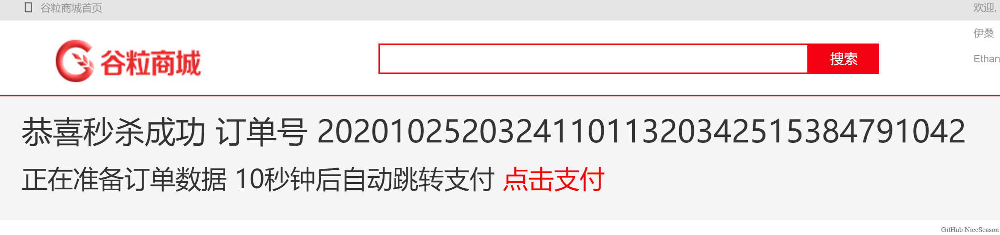


## Sentinel服务流控、熔断和降级

sentinel的基础知识参考[官方文档](https://github.com/alibaba/Sentinel/wiki/)和[本人SpringCloud学习项目](https://github.com/NiceSeason/SpringCloud/tree/master/docs)

### 1. 环境搭建

导入依赖

```xml
<dependency>
    <groupId>org.springframework.boot</groupId>
    <artifactId>spring-boot-starter-actuator</artifactId>
    <version>2.1.8.RELEASE</version>
</dependency>
<!-- sentinel熔断降级限流-->
<dependency>
    <groupId>com.alibaba.cloud</groupId>
    <artifactId>spring-cloud-starter-alibaba-sentinel</artifactId>
</dependency>
```

基本配置

```yml
# sentinel控制台地址
spring:  
  cloud:
    sentinel:
      transport:
        dashboard: localhost:8080
# 暴露所有监控端点，使得sentinel可以实时监控
management:
  endpoints:
    web:
      exposure:
        include: '*'
```

流控规则设置

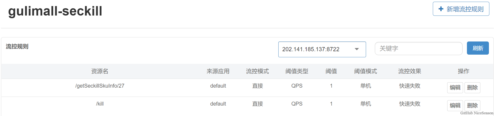

触发流控的效果


### 2. 自定义流控响应

```java
@Component
public class GulimallSentinelConfig implements UrlBlockHandler{
    @Override
    public void blocked(HttpServletRequest request, HttpServletResponse response, BlockException ex) throws IOException {
        R r = R.error(BizCodeEnum.SECKILL_EXCEPTION.getCode(),BizCodeEnum.SECKILL_EXCEPTION.getMsg());
        response.setContentType("application/json;charset=utf-8");
        response.getWriter().write(JSON.toJSONString(r));
    }
}
```

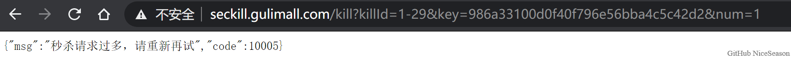

### 3. 网关流控

如果能在网关层就进行流控，可以避免请求流入业务，减小服务压力

```xml
<!-- 引入sentinel网关限流 -->
<dependency>
    <groupId>com.alibaba.cloud</groupId>
    <artifactId>spring-cloud-alibaba-sentinel-gateway</artifactId>
    <version>2.1.0.RELEASE</version>
</dependency>
```

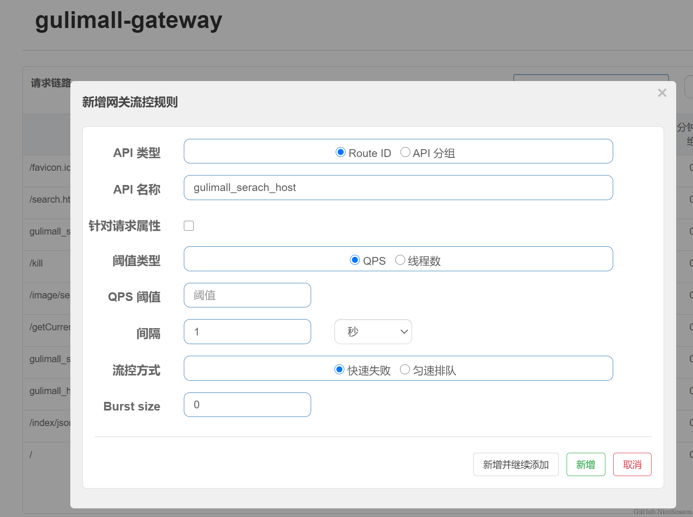

### 4. feign的流控和降级

默认情况下，sentinel是不会对feign进行监控的，需要开启配置

```yaml
feign:
  sentinel:
    enabled: true
```

开启后的效果

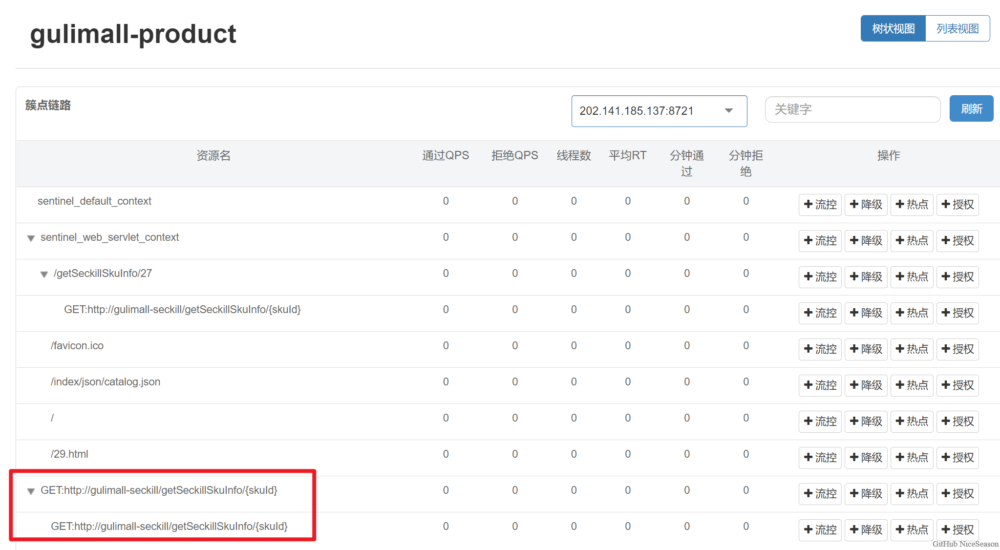

feign的降级

在`@FeignClient`设置`fallback`属性

```java
@FeignClient(value = "gulimall-seckill",fallback = SeckillFallbackService.class)
public interface SeckillFeignService {
    @ResponseBody
    @GetMapping(value = "/getSeckillSkuInfo/{skuId}")
    R getSeckillSkuInfo(@PathVariable("skuId") Long skuId);
}
```

在降级类中实现对应的`feign接口`,并重写降级方法

```java
@Component
public class SeckillFallbackService implements SeckillFeignService {
    @Override
    public R getSeckillSkuInfo(Long skuId) {
        return R.error(BizCodeEnum.READ_TIME_OUT_EXCEPTION.getCode(), BizCodeEnum.READ_TIME_OUT_EXCEPTION.getMsg());
    }
}
```

降级效果

当远程服务被限流或者不可用时，会触发降级效果，如下所示


## Zipkin链路追踪

由于微服务项目模块众多，相互之间的调用关系十分复杂，因此为了分析工作过程中的调用关系，需要使用zipkin来进行链路追踪

### 1. 环境搭建

下载jar包并运行

https://dl.bintray.com/openzipkin/maven/io/zipkin/java/zipkin-server/

导入依赖

```xml
<!--链路追踪-->
<dependency>
    <groupId>org.springframework.cloud</groupId>
    <artifactId>spring-cloud-starter-zipkin</artifactId>
</dependency>
```

配置

```yaml
spring:
    zipkin:
      base-url: http://localhost:9411
      sender:
        type: web
      # 取消nacos对zipkin的服务发现
      discovery-client-enabled: false
    #采样取值介于 0到1之间，1则表示全部收集
    sleuth:
      sampler:
        probability: 1
```

### 2. 查询调用链路

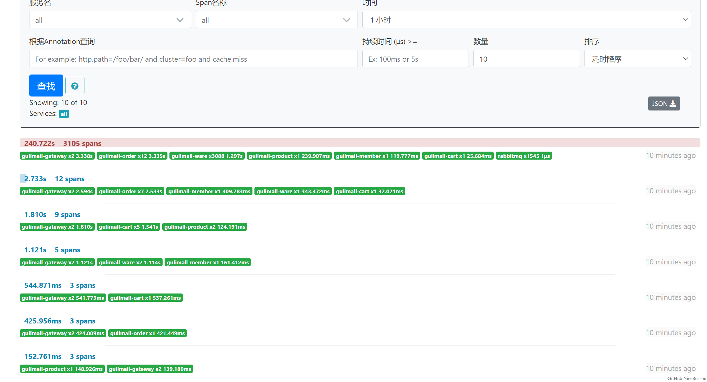

其中可以看到请求的方式，请求时间，异步等信息

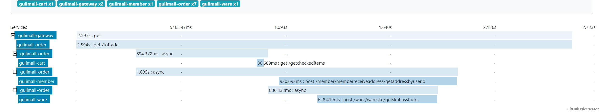

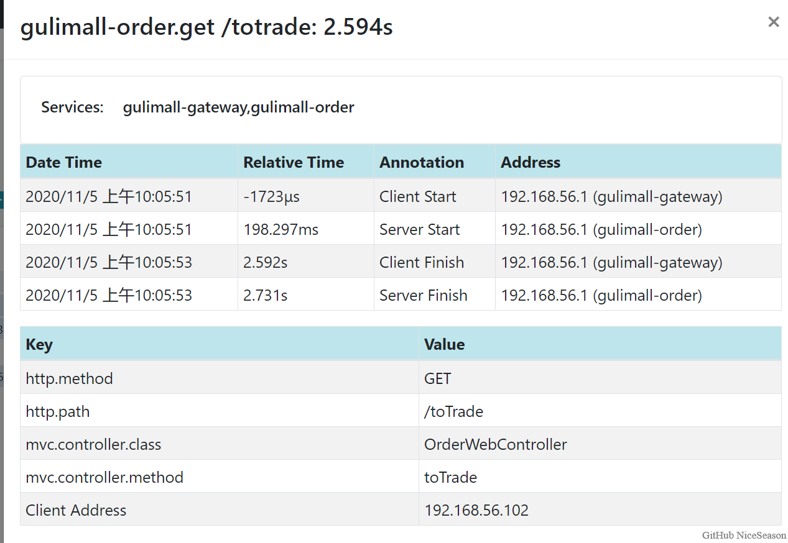

### 3. 查询依赖

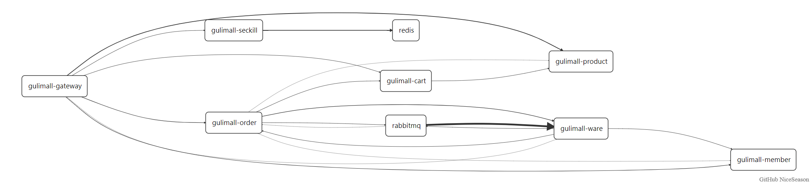

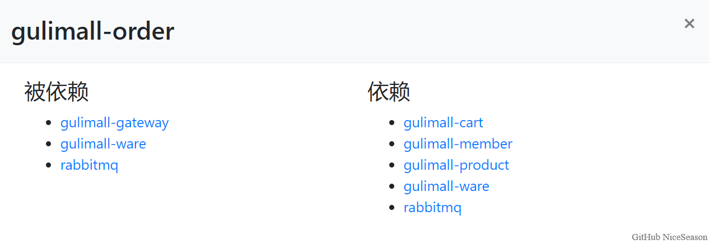

